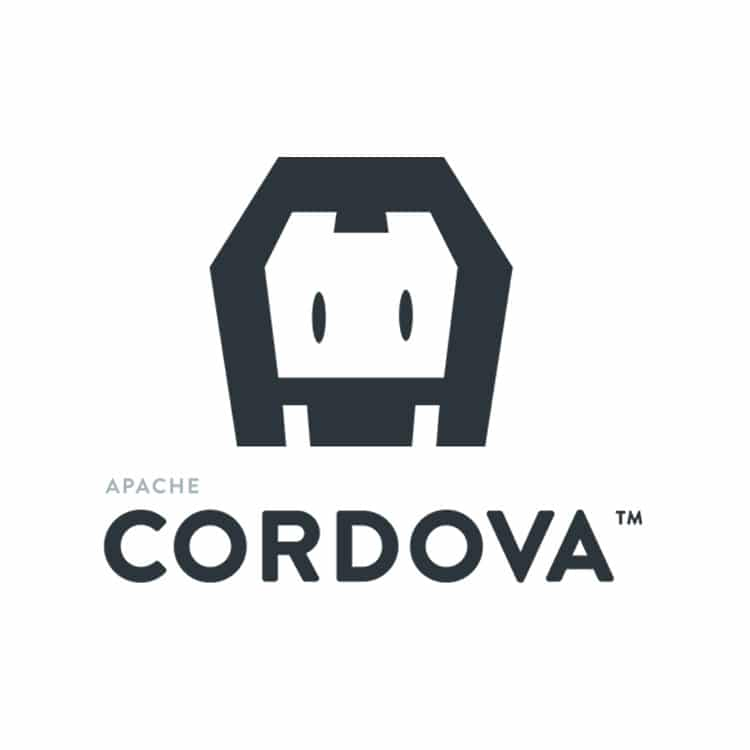

# Unidad 1 <br> Introducción al Desarrollo de Aplicaciones Multiplataforma

## Desarrollo de Aplicaciones Móviles Multiplataforma

---

# Docente


Nombre
: MSC. Jaime Jesús Delgado Meraz

Correo
: <jesus.delgado@tecvalles.mx>

---

# Asignatura

:::: flex
::: col 1/2 px-2
Nombre
: Desarrollo de Aplicaciones Móviles Multiplataforma

Carrera
: Ingeniería en Sistemas Computacionales
:::
::: col 1/2
Clave
: DFB - 2204

SATCA
: 1 - 4 - 5
:::
::::

---
<!-- _class: toc -->
# Contenidos

1. [Desarrollo de aplicaciones móviles multiplataforma](#desarrollo-de-aplicaciones-móviles-multiplataforma)
2. [Tecnologías actuales para DAMM](#tecnologías-actuales)
3. [Arquitecturas](#arquitecturas)
4. [Lenguajes multiplataforma](#lenguajes-multiplataforma)
5. [Frameworks multiplataforma](#frameworks-multiplataforma)

---

# Introducción

- El desarrollo de aplicaciones móviles multiplataforma (DAMM) es una de las áreas de desarrollo de software que ha tenido un crecimiento exponencial en los últimos años.
- Se estima que para finales del 2024, el mercado de aplicaciones móviles multiplataforma alcance un valor de 80 mil millones de dólares, especialmente con el impulso del Internet de las Cosas (IoT) y la Inteligencia Artificial (IA).
- En consecuencia, la demanda de desarrolladores con conocimientos y habilidades en DAMM es cada vez mayor.

---
<!-- _class: lead -->
# Desarrollo de aplicaciones móviles multiplataforma

---

# Desarrollo móvil

- El desarrollo móvil se refiere al proceso de creación de aplicaciones para dispositivos móviles, como teléfonos inteligentes y tabletas.
- Se caracteriza por utilizar tecnologías y herramientas específicas para cada plataforma, e incluso para cada tipo de dispositivo.
- Al igual que el desarrollo de software para computadoras de escritorio, el desarrollo móvil se puede realizar utilizando diferentes lenguajes de programación y frameworks.
- Los lenguajes de programación más utilizados para el desarrollo móvil son Java, Kotlin, Swift, Objective-C, C# y Dart.

---

# Desarrollo móvil

- El desarrollo móvil se puede clasificar en 3 categorías:
  - Desarrollo móvil nativo
  - Desarrollo móvil híbrido
  - Desarrollo móvil multiplataforma
- Cada una de estas categorías tiene sus propias características, ventajas y desventajas, y se utiliza para crear aplicaciones móviles con diferentes propósitos y complejidades.

---

# Desarrollo móvil nativo

- El desarrollo móvil nativo permite crear aplicaciones que se ejecutan en una plataforma específica mediante el uso de un lenguaje de programación y un conjunto de herramientas específicas para dicha plataforma.
  - _P.e._ para crear aplicaciones nativas para Android se utiliza el lenguaje de programación Java o Kotlin, y el IDE Android Studio.
- La principal ventaja del desarrollo nativo es el **rendimiento**, ya que las aplicaciones se ejecutan directamente en el sistema operativo del dispositivo y por lo tanto, tienen acceso directo a los recursos del dispositivo como la cámara, el GPS, el acelerómetro, etc.
- Es muy utilizado para crear aplicaciones que requieren de un alto rendimiento, como los juegos y las aplicaciones de realidad aumentada.

---

# Desarrollo móvil nativo

- La principal desventaja del desarrollo nativo es justamente su estrecha relación con la plataforma, ya que para crear aplicaciones nativas para diferentes plataformas se requiere de un código base diferente para cada una de ellas.
- De hecho, por mucho tiempo, la desventaja anterior ni siquiera se refería a diferentes plataformas (Android e iOS), sino a diferentes dispositivos (teléfonos inteligentes y tabletas), fabricantes (Samsung, LG, Motorola, etc.) y modelos (Galaxy S10, Galaxy S20, etc.), lo que generaba un fenómeno conocido como **fragmentación** y que afectó al ecosistema Android durante muchos años.
- En consecuencia, el desarrollo nativo resultaba muy costoso y requería de mayores conocimientos y habilidades.

---


<!--
Fragmentación de Android (2022), https://www.xataka.com/moviles/fragmentacion-android-sigue-siendo-problema-apenas-uno-cada-diez-moviles-tienen-android-12

Fragmentación de Android (2023), https://www.xatakandroid.com/sistema-operativo/guerra-a-fragmentacion-google-traslada-funciones-android-13-a-versiones-anteriores
-->

---

# Desarrollo móvil nativo

- Por otro lado, plataformas como iOS y Windows Phone, que tenían un ecosistema más controlado, no tenían el problema de la fragmentación, pero sí requerían de mayores conocimientos y habilidades para crear aplicaciones nativas.
- En el caso de iOS, se requería de un equipo Mac para poder desarrollar aplicaciones nativas, lo que incrementaba los costos de desarrollo, pero brindaba algunos "beneficios" como el _pixel perfect_.
- En el caso del extinto Windows Phone, se requería de conocimientos en lenguajes de programación como C# y Visual Basic, que no eran tan populares como Java y C++ en la decada de los 2000.

---

# Desarrollo móvil nativo

- Por mucho tiempo, el desarrollo móvil nativo fue la única opción para crear aplicaciones móviles, aunque resultaba muy costoso y requería de mayores conocimientos y habilidades.
- Conforme se incrementó la demanda de aplicaciones móviles, se crearon nuevas tecnologías y herramientas que permitieron crear aplicaciones móviles de forma más rápida y sencilla.
- Si bien el desarrollo móvil nativo sigue siendo una opción muy viable para crear aplicaciones móviles de alto rendimiento, actualmente existen alternativas que permiten crear aplicaciones móviles con un menor costo y con un menor tiempo de desarrollo.

---



# Desarrollo móvil híbrido

- El desarrollo móvil híbrido permite crear aplicaciones móviles utilizando tecnologías web como HTML, CSS y JavaScript.
- Una de las primeras tecnologías para el desarrollo móvil híbrido fue Apache Cordova (2009), que utiliza HTML, CSS y JS, y cuyas aplicaciones se ejecutan en un contenedor nativo.
- Posteriormente, se crearon frameworks como Ionic y React Native que simplificaron el desarrollo móvil híbrido al utilizar componentes nativos y permitir el acceso a los recursos del dispositivo.

---

# Desarrollo móvil híbrido

- La principal ventaja del desarrollo móvil híbrido es la **reutilización de código**, ya que se puede utilizar el mismo código base para crear aplicaciones para diferentes plataformas, como por ejemplo el CSS.
- Sin embargo, lo anterior provocaba que el aspecto de las aplicaciones desarrolladas no necesariamente cumpliera con las guías de diseño de cada plataforma, ya que en muchos casos se utilizaba un diseño web.
- Si bien aparecieron tecnologías como JQuery Mobile y Kendo UI que ofrecían un diseño más homogéneo, no lograban capturar la esencia visual, lo que provocaba que las aplicaciones se vieran "extrañas" en cada plataforma.
  - De hecho, este efecto se agravó cuando estos frameworks se utilizaron para crear aplicaciones web.

---

# Desarrollo móvil híbrido

- Con la llegada de frameworks como Ionic y React Native, se pudo utilizar el mismo código base para crear aplicaciones con un aspecto nativo para cada plataforma y con un mejor rendimiento.
- Actualmente, el desarrollo móvil híbrido sigue siendo una alternativa viable para crear aplicaciones móviles, especialmente aquellas que no requieren de un alto rendimiento o el acceso a los recursos del dispositivo.
- Con la llegada de las _Progressive Web Apps_ (PWA), el desarrollo móvil híbrido ha tomado un nuevo impulso, ya que permite crear aplicaciones web que se comportan como aplicaciones móviles.

---

# Desarrollo móvil multiplataforma

> **Multiplataforma** _adj._
> Dicho de una aplicación o de un producto informático que puede ser utilizado por distintos sistemas o entornos.

- Es una técnica de desarrollo de software que permite crear aplicaciones que se ejecutan en múltiples plataformas.
- Las aplicaciones desarrolladas bajo esta metodología se caracterizan por tener un código base que puede ser reutilizado en diferentes sistemas operativos móviles, como Android 🤖 e iOS 🍎.
- Permite reducir los costos de desarrollo y mantenimiento de las aplicaciones, ya que se puede utilizar el mismo código base para crear aplicaciones para diferentes plataformas.

---

# Desarrollo móvil multiplataforma

- Este tipo de desarrollo combina las ventajas del desarrollo nativo y del desarrollo híbrido, ya que permite crear aplicaciones con un alto rendimiento y con un aspecto nativo para cada plataforma.
- Automáticamente, se obtiene una mayor cobertura de mercado, ya que se puede llegar a más usuarios con una sola aplicación.
- Se basa en un lenguaje estándar que al ser compilado genera código nativo para cada plataforma, de manera similar a lo que sucede con Java y el bytecode, pero sin la necesidad de una máquina virtual.

---

# Desarrollo móvil multiplataforma

- Durante la década de los 2000, con el apogeo de Java como lenguaje de programación, se crearon diferentes tecnologías para el desarrollo móvil multiplataforma, como J2ME, J2SE y J2EE, las cuales permitían crear aplicaciones para diferentes dispositivos móviles.
- Empresas como Nokia, Motorola, Sony Ericsson, Samsung, LG, entre otras, se aliaron para crear un sistema operativo móvil que permitiera ejecutar aplicaciones multiplataforma, lo que dio origen a Symbian OS.
- Sin embargo, la llegada del iPhone en 2007 y de Android en 2008, provocó que las empresas antes mencionadas abandonaran Symbian OS y se enfocaran en sus propias plataformas, lo que provocó que el desarrollo móvil nativo fuera la única opción viable para crear aplicaciones móviles.

---

# Desarrollo móvil multiplataforma

- Actualmente, existen diferentes tecnologías y herramientas para el desarrollo móvil multiplataforma, cada una con sus propias características, ventajas y desventajas.
- A diferencia de esfuerzos anteriores, las tecnologías actuales han logrado un mayor éxito, ya que en lugar establecer un sistema operativo estándar, se basan en un lenguaje estándar que al ser compilado genera código nativo para cada plataforma y que puede ser utilizado en diferentes IDEs.
- Aún así, su rendimiento no es tan bueno como el de las aplicaciones nativas, pero es mejor por mucho, que el de las aplicaciones híbridas.

---
<!-- _class: lead -->
# Tecnologías actuales

---

# Tecnologías actuales

- Cada técnica de desarrollo móvil tiene su propio conjunto de tecnologías y herramientas, que permiten crear aplicaciones móviles con diferentes propósitos y complejidades.
- En general, se tienen las siguientes tecnologías:
  - Desarrollo móvil nativo: Java, Kotlin, Swift, Objective-C, C#.
  - Desarrollo móvil híbrido: Apache Cordova, Ionic y React Native.
  - Desarrollo móvil multiplataforma: Flutter, Xamarin, React Native y Kotlin Multiplatform.

::: info
👨🏻‍🏫 Se revisarán las diferentes tecnologías, pero el enfoque será en el desarrollo móvil multiplataforma.
:::

---

# Tecnologías actuales

## Desarrollo móvil nativo

- El desarrollo móvil nativo permite crear aplicaciones que se ejecutan en una plataforma específica mediante el uso de un lenguaje de programación y un conjunto de herramientas específicas para dicha plataforma.
- Las tecnologías más utilizadas para el desarrollo móvil nativo son Java, Kotlin, Swift, Objective-C y C#.
- Cada una de estas tecnologías tiene sus propios ámbitos de aplicación y en la mayoría de los casos, su uso no se limita al desarrollo móvil.

---

# Tecnologías actuales

## Desarrollo móvil nativo

| Tecnología | IDE | Android | iOS |
| :--- | :--- | :---: | :---: |
| Java | Android Studio | ✅ | ❌ |
| Kotlin | Android Studio | ✅ | ❌ |
| Swift | Xcode | ❌ | ✅ |
| Objective-C | Xcode | ❌ | ✅ |
| C# | Visual Studio | ✅ | ❌ |

---

# Tecnologías actuales

## Desarrollo móvil híbrido

- El desarrollo móvil híbrido permite crear aplicaciones móviles utilizando tecnologías web como HTML, CSS y JavaScript.
- Entre las tecnologías más utilizadas para el desarrollo móvil híbrido se encuentran Apache Cordova, Ionic y React Native.
- Por lo general, se utilizan frameworks como Angular, React y Vue para crear aplicaciones móviles híbridas.

---

# Tecnologías actuales

## Desarrollo móvil híbrido

| Tecnología | IDE | Android | iOS | Framework |
| :--- | :--- | :---: | :---: | :--- |
| Apache Cordova | Visual Studio Code | ✅ | ✅ | Ionic, React Native |
| Ionic | Visual Studio Code | ✅ | ✅ | Angular |
| React Native | Visual Studio Code | ✅ | ✅ | React |

- Adicionalmente, dentro de la categoría de desarrollo móvil híbrido, podemos encontrar las _Progressive Web Apps_ (PWA) y sus tecnologías asociadas, que si bien son aplicaciones web, se comportan como aplicaciones móviles.

---

# Tecnologías actuales

## Desarrollo móvil multiplataforma

- El desarrollo móvil multiplataforma permite crear aplicaciones que se ejecutan en múltiples plataformas mediante el uso de un lenguaje estándar que al ser compilado genera código nativo para cada plataforma.
- Las tecnologías más utilizadas para el desarrollo móvil multiplataforma son Flutter, Xamarin, React Native y Kotlin Multiplatform.
- Estas tecnologías se caracterizan por tener un alto rendimiento y por permitir crear aplicaciones con un aspecto nativo para cada plataforma.

---

# Tecnologías actuales

## Desarrollo móvil multiplataforma

| Tecnología | IDE | Android | iOS | Web | Desktop |
| :--- | :--- | :---: | :---: | :---: | :---: |
| Flutter | Android Studio | ✅ | ✅ | ✅ | ✅ |
| Xamarin | Visual Studio | ✅ | ✅ | ✅ | ✅ |
| React Native | Visual Studio Code | ✅ | ✅ | ✅ | ❌ |
| Kotlin Multiplatform | Android Studio | ✅ | ✅ | ✅ | ✅ |
| Flet | Visual Studio Code | ✅ | ✅ | ✅ | ✅ |

- Una mención interesante es Flet, que permite crear aplicaciones móviles multiplataforma utilizando Flutter y Python, un lenguaje no tan popular en el desarrollo móvil.

---
<!-- _class: inverted -->

# Homónimos no sinónimos

- Es importante mencionar que existen tecnologías con el mismo nombre o similar, pero que no son lo mismo.
- _P.e._
  - React Native y React, ambos son tecnologías de Facebook, pero el primero es para el desarrollo móvil y el segundo para desarrollo web.
  - Kotlin y Kotlin Multiplatform, son tecnologías de JetBrains, en el primer caso para el desarrollo móvil nativo y en el segundo para el desarrollo multiplataforma, incluyendo escritorio y web.

---


# Tecnologías actuales

## Desarrollo móvil multiplataforma

- Flutter es una tecnología de Google que permite crear aplicaciones móviles multiplataforma utilizando el lenguaje Dart.
- Se caracteriza por integrar un framework, un motor de renderizado y un conjunto de widgets, que permiten crear aplicaciones con un alto rendimiento.
- Integra el framework Material Design para Android y el framework Cupertino para iOS, lo que permite crear aplicaciones con un aspecto nativo para cada plataforma.

---
<!-- _class: lead -->
# Arquitecturas

---

# Arquitecturas

> Se refiere a la estructura de un sistema y a la manera en que los componentes de software se relacionan entre sí.

- Es posible crear aplicaciones móviles multiplataforma utilizando diferentes arquitecturas, como por ejemplo MVC, MVVM, MVP, etc.
- Cada tecnología tiene su propia arquitectura, pero en general, se pueden agrupar en 2 categorías:
  - Arquitecturas basadas en componentes
  - Arquitecturas basadas en estados

---

# Arquitecturas

## Arquitecturas basadas en componentes

- Las arquitecturas basadas en componentes se caracterizan por tener un conjunto de componentes que se comunican entre sí mediante eventos.
- Se utilizan principalmente en el desarrollo móvil híbrido, ya que permiten crear aplicaciones con un aspecto nativo para cada plataforma.
- Las tecnologías que utilizan este tipo de arquitecturas son Apache Cordova, Ionic y React Native.

---

# Arquitecturas

## Arquitecturas basadas en componentes

> Un componente es una unidad de software independiente que se puede reutilizar en diferentes sistemas.

- En estas arquitecturas, los componentes suelen ser widgets que se comunican entre sí mediante eventos.
- _P.e._ en Ionic, los componentes son los elementos de la interfaz de usuario, como botones, campos de texto, listas, etc.
- Un componente puede tener un estado interno, pero no se comunica con otros componentes, sino que se comunica con un estado global.

---

# Arquitecturas

## Arquitecturas basadas en componentes

- La principal ventaja de las arquitecturas basadas en componentes es que resultan muy sencillas de implementar, ya que se basan en patrones de diseño muy conocidos.
- Sin embargo, la principal desventaja es que no son muy escalables, ya que al tener un conjunto de componentes que se comunican entre sí mediante eventos, es muy fácil perder el control de la aplicación.
- Este tipo de arquitecturas se utilizan generalmente para crear aplicaciones móviles con un bajo rendimiento, como las aplicaciones de tipo CRUD.

---

# Arquitecturas

## Arquitecturas basadas en estados

> Un estado es una representación de un conjunto de datos en un momento específico.

- Las arquitecturas basadas en estados se caracterizan por tener un conjunto de estados que se comunican entre sí mediante eventos.
- Se utilizan principalmente en el desarrollo móvil multiplataforma, ya que permiten crear aplicaciones con un alto rendimiento.
- También hacen uso de componentes, pero estos no se comunican entre sí, sino que se comunican con los estados.

---

# Arquitecturas

## Arquitecturas basadas en estados

- Los estados permiten tener un mayor control de la aplicación, ya que se puede saber en todo momento el estado de la aplicación.
- Son independientes de los patrones de diseño, ya que no dependen de la comunicación entre componentes.
- Lo anterior permite que se puedan crear aplicaciones con un alto rendimiento, ya que no se tiene que esperar a que un componente se comunique con otro componente para actualizar la interfaz de usuario.

---

# Arquitecturas

## ¿Qué arquitectura es mejor?

- Como siempre, no hay una respuesta final, ya que no existe una arquitectura mejor que otra, ya que cada una tiene sus propias características, ventajas y desventajas.
- Sin embargo, las arquitecturas basadas en estados son más escalables y permiten crear aplicaciones con un alto rendimiento, por lo que son más utilizadas en el desarrollo móvil multiplataforma.
- Por otro lado, las arquitecturas basadas en componentes son más sencillas de implementar, por lo que son más utilizadas en el desarrollo móvil híbrido.

---

# Arquitecturas

## ¿Qué arquitectura utiliza Flutter?

- Flutter utiliza una arquitectura basada en estados, que se denomina **BLoC** (Business Logic Component), que fue creada por Google para el desarrollo de aplicaciones móviles multiplataforma.
- Flutter no es la única tecnología que utiliza esta arquitectura, ya que también la utilizan tecnologías como Xamarin y Kotlin Multiplatform.
- La arquitectura BLoC se basa en el patrón de diseño **Observer**, que permite notificar a los componentes cuando un estado cambia.

---

<!-- _class: inverted -->

# _Observer 🧐, Watcher 👀 y Listener 👂🏻_

- Los términos _Observer_, _Watcher_ y _Listener_ se suelen utilizar indistintamente para referirse a un objeto que se suscribe a un evento, pero son ligeramente diferentes.
  - Un **_observer_** es un objeto que se suscribe a un evento. Cuando ocurre el evento, el _observer_ se ejecuta, sin embargo, no tiene ninguna capacidad para detectar cambios en el objeto que genera el evento.
  - Un **_watcher_** es un tipo de _observer_ que tiene la capacidad de detectar cambios en el estado del objeto que genera el evento.
  - Un **_listener_** es un tipo de _watcher_ que tiene la capacidad de detectar cambios en el objeto que genera el evento y también de ejecutar una acción cuando ocurre un cambio.

---
<!-- _class: lead -->
# Lenguajes multiplataforma

---

# Lenguajes multiplataforma

- Los lenguajes de programación multiplataforma son aquellos que permiten crear aplicaciones que se ejecutan en múltiples plataformas.
- Particularmente, en el desarrollo móvil multiplataforma, se utilizan lenguajes de programación multiplataforma para crear aplicaciones que se ejecutan en Android y iOS.
- Los lenguajes de programación más utilizados para el desarrollo móvil multiplataforma son Dart, C# y Kotlin.
- Para fines didácticos, se revisaran las características de cada uno de estos lenguajes, pero el enfoque será en Dart.

---


# Lenguajes multiplataforma

## C\# (C Sharp)

- C# es un lenguaje de programación multiplataforma creado por Microsoft en el 2000.
- Se caracteriza por ser un lenguaje de programación orientado a objetos, que integra características de lenguajes como C++, Java y Visual Basic.
- Originalmente, se utilizaba para crear aplicaciones de escritorio, pero actualmente se utiliza para crear aplicaciones web, aplicaciones móviles y videojuegos.
- Soporta programación orientada a objetos, programación funcional, programación concurrente y programación orientada a eventos.

---

# Lenguajes multiplataforma

## C\# (C Sharp)

- Utiliza el IDE Visual Studio y se complementa con el framework .NET, que permite crear aplicaciones multiplataforma para Android, iOS y Windows.
- Para el desarrollo móvil multiplataforma, se utiliza el framework Xamarin, que permite crear aplicaciones móviles multiplataforma utilizando C#.
- Algunas de las aplicaciones móviles más populares desarrolladas con Xamarin son Alaska Airlines, BBC Good Food, Olo, Storyo, etc.

---


# Lenguajes multiplataforma

## Kotlin

- Kotlin es un lenguaje de programación multiplataforma creado por JetBrains en el 2011.
- Se caracteriza por ser un lenguaje de programación orientado a objetos, que integra características de lenguajes como Java, C# y Scala.
- Fue creado desde cero para ser un lenguaje de programación multiplataforma, por lo que no tiene las limitaciones de Java.

---

# Lenguajes multiplataforma

## Kotlin

- Su soporte multiplataforma se basa en el framework Kotlin Multiplatform, que permite crear aplicaciones multiplataforma para Android, iOS, Windows, Linux y macOS.
- Aunque puede programarse en cualquier IDE, se recomienda utilizar Android Studio, ya que es el IDE oficial para el desarrollo de aplicaciones móviles con Kotlin, y se complementa con el framework Android.
- Desde el 2019, Google lo adoptó como lenguaje oficial para el desarrollo de aplicaciones móviles nativas para Android, reemplazando a Java.
- Algunas de las aplicaciones móviles más populares desarrolladas con Kotlin son Pinterest, Uber, Trello, Evernote, etc.

---


# Lenguajes multiplataforma

## Dart

- Dart es un lenguaje de programación multiplataforma creado por Google en el 2011.
- Se caracteriza por ser un lenguaje de programación orientado a objetos, que integra características de lenguajes como Java, C# y JavaScript.
- Surgió como una alternativa a JavaScript, pero actualmente se utiliza para crear aplicaciones web, aplicaciones móviles y videojuegos.

---

# Lenguajes multiplataforma

## Dart

- Utiliza principalmente el IDE Android Studio y se complementa con el framework Flutter, que permite crear aplicaciones multiplataforma para Android, iOS, Windows, Linux, macOS y web.
- Es el lenguaje de programación oficial para el desarrollo de aplicaciones móviles multiplataforma con Flutter.
- Algunas de las aplicaciones móviles más populares desarrolladas con Flutter son Google Ads, Alibaba, Tencent, eBay, etc.

---

<!-- _class: lead primary -->

# &lt;Dart&gt;

<https://dartpad.dev/>

---

# Dart

## Variables y tipos

- Dart es un lenguaje de programación fuertemente tipado, por lo que todas las variables deben tener un tipo de dato, se pueden declarar utilizando la palabra reservada `var` o el tipo de dato.

```dart
var nombre = 'Jaime';
String apellido = 'Delgado';
int edad = 30;
double estatura = 1.70;
bool esProgramador = true;
var color = 0x60a5fa;
```

- Las constantes se declaran utilizando la palabra reservada `const` o `final`.

```dart
const pi = 3.1416;
final url = 'https://www.google.com';
```

---

# Dart

## Conversión de tipos

- Se puede utilizar el operador `as` o el método `toString()`.

```dart
var edad = 30;
String edadString = edad.toString();
int edadInt = edadString as int;
```

- También se tiene disponible el método `parse()`.

```dart
var edadString = '30';
int edadInt = int.parse(edadString);
double edadDouble = double.parse(edadString);
```

---

# Dart

## Operadores

- Dart soporta los siguientes operadores:
  - Aritméticos: `+`, `-`, `*`, `/`, `%`, `++`, `--`
  - Relacionales: `==`, `!=`, `>`, `<`, `>=`, `<=`
  - Lógicos: `&&`, `||`, `!`
  - Asignación: `=`, `+=`, `-=`, `*=`, `/=`, `%=`
  - Ternario: `?`, `:`
  - Bitwise: `&`, `|`, `^`, `~`, `<<`, `>>`
- El operador `+` también sirve para concatenar cadenas.

```dart
var nombreCompleto = "Jaime" + ' ' + "Delgado";
```

---

# Dart

## Operadores

```dart
var a = 10;
int b = 20;
double c = 30.0;
var d = a + b; // 30
var e = a - b; // -10
var f = a * b; // 200
var g = a / b; // 0.5
var h = a % 2; // 0
var i = a > c ? a : b; // 20
```

---

# Dart

## Arreglos

- Los arreglos se declaran utilizando la palabra reservada `var` o `List<>`, seguido de `[]`, se recomienda utilizar `List<>` para especificar el tipo de dato de los elementos del arreglo.

```dart
var numeros = [1, 2, 3, 4, 5];
List<String> nombres = ['Jaime', 'Jesús', 'Delgado', 'Meraz'];
List<String> colores = []; // Arreglo vacío
List<dynamic> elementos = [1, 'Jaime', 3.1416, true]; // No recomendado
```

- Para acceder a un elemento del arreglo, se utiliza el operador `[]`.

```dart
print(numeros[0]); // 1
```

---

# Dart

## Arreglos

- Algunas operaciones con arreglos son:
  - `length`: longitud del arreglo
  - `add()`: agregar un elemento al final del arreglo
  - `insert()`: insertar un elemento en una posición específica
  - `remove()`: eliminar la primera aparición del elemento especificado
  - `removeAt()`: eliminar un elemento en una posición específica
  - `removeLast()`: eliminar el último elemento del arreglo
  - `removeRange()`: eliminar un rango de elementos
  - `clear()`: eliminar todos los elementos del arreglo
  - `sort()`: ordenar los elementos del arreglo

---

# Dart

## Arreglos

```dart
var numeros = [1, 2, 3, 4, 5];
print(numeros.length); // 5
numeros.add(6);
print(numeros); // [1, 2, 3, 4, 5, 6]
numeros.insert(3, 0);
print(numeros); // [1, 2, 3, 0, 4, 5, 6]
numeros.remove(3);
print(numeros); // [1, 2, 0, 4, 5, 6]
numeros.removeAt(0);
print(numeros); // [2, 0, 4, 5, 6]
numeros.removeLast();
print(numeros); // [2, 0, 4, 5]
numeros.removeRange(0, 2);
print(numeros); // [4, 5]
numeros.clear();
print(numeros); // []
```

---

# Dart

## Entrada y salida

- Para mostrar un mensaje en la consola, se utiliza la función `print()`.

```dart
print('Hola mundo');
```

- Para leer un dato de la consola, se utiliza la función `stdin.readLineSync()`.

```dart
var nombre = stdin.readLineSync();
print('Hola $nombre');
```

---

# Dart

## Estructuras de control y ciclos

:::: flex
::: col 1/2 px-2

### If-else

```dart
var edad = 30;

if (edad >= 18) {
  print('Eres mayor de edad');
} else {
  print('Eres menor de edad');
}
```

:::
::: col 1/2 px-2

### If-else if-else

```dart
var calificacion = 10;

if (calificacion >= 9) {
  print('Excelente');
} else if (calificacion >= 8) {
  print('Bueno');
} else if (calificacion >= 7) {
  print('Regular');
} else {
  print('Reprobado');
}
```

:::
::::

---

# Dart

## Estructuras de control y ciclos

### Switch

```dart
var dia = 1;
switch (dia) {
  case 1:
  case 2:
  case 3:
  case 4:
  case 5:
    print('Día laboral');
    break;
  case 6:
  case 7:
    print('Fin de semana');
    break;
  default:
    print('Día inválido');
}
```

---

# Dart

## Estructuras de control y ciclos

:::: flex
::: col 1/2 px-2

### For

```dart
for (var i = 0; i < 10; i++) {
  print(i);
}
```

:::
::: col 1/2 px-2

### For-in

```dart
var numeros = [1, 2, 3, 4, 5];

for (var numero in numeros) {
  print(numero);
}
```

:::
::::

:::: flex
::: col 1/2 px-2

### While

```dart
var i = 0;

while (i < 10) {
  print(i);
  i++;
}
```

:::
::: col 1/2 px-2

### Do-while

```dart
var i = 0;

do {
  print(i);
  i++;
} while (i < 10);
```

:::
::::

---

# Dart

## Estructura básica de una aplicación

```dart
void main() {
  print('Hola mundo');
}
```

- Si la aplicación tiene una sola línea de código, se puede utilizar la sintaxis de flecha.

```dart
void main() => print('Hola mundo');
```

---

<!-- _class: lead primary -->

# &lt;/Dart&gt;

---
<!-- _class: lead -->
# Frameworks multiplataforma

---

# Frameworks multiplataforma

---

<!-- _class: inverted -->


<div class="text-center text-middle font-bold font-coding text-8xl mt-10">
  &lt;/Fin&gt;
</div>
