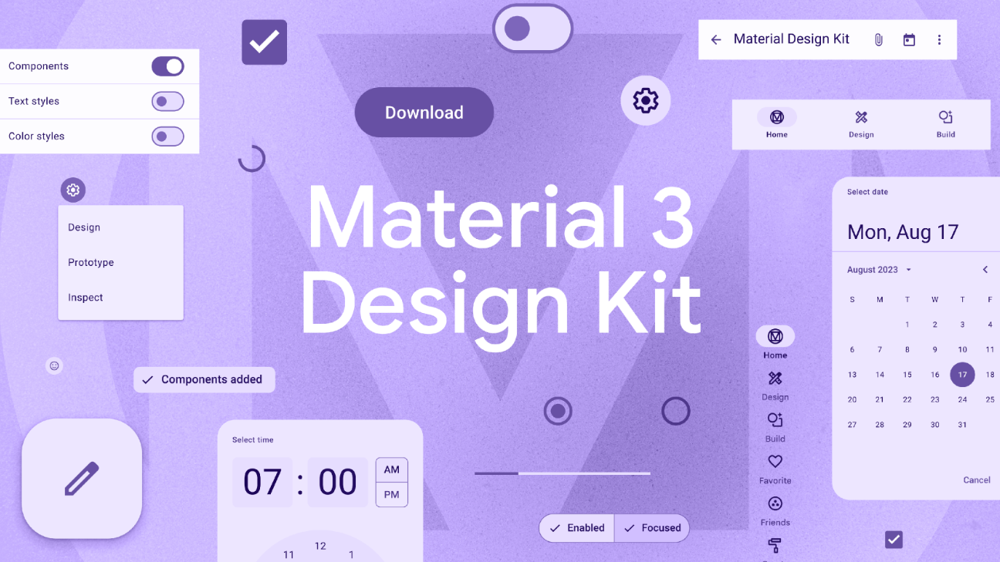
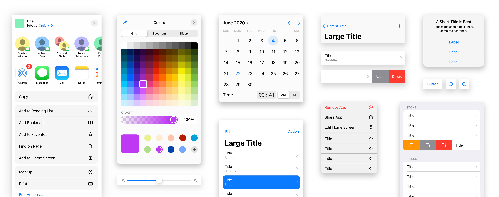
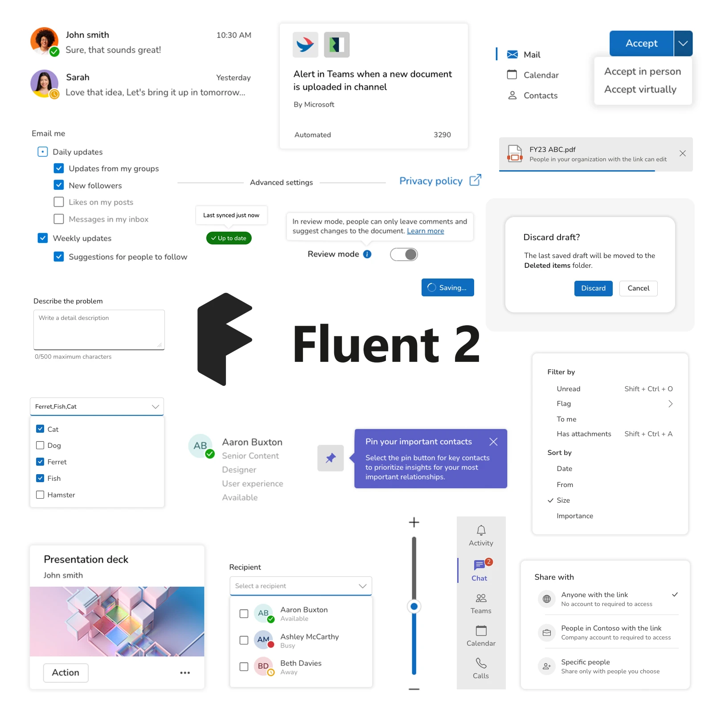
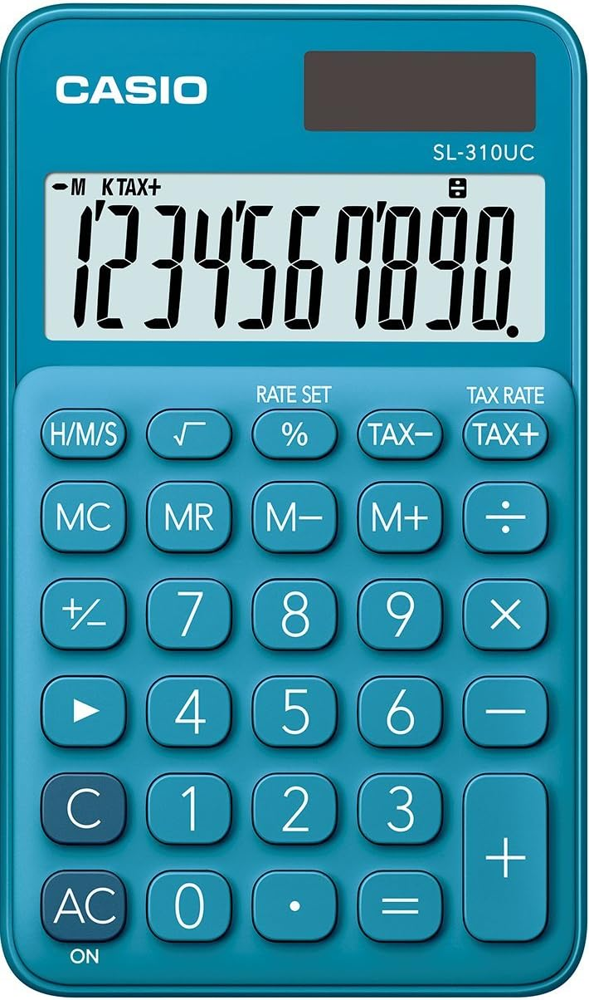
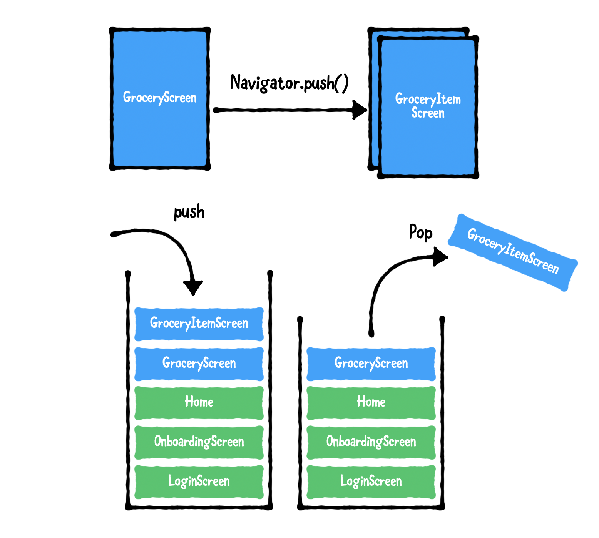

# Unidad 2 <br> Desarrollo Multiplataforma

## Desarrollo de Aplicaciones Móviles Multiplataforma

---

# Docente


Nombre
: MSC. Jaime Jesús Delgado Meraz

Correo
: <jesus.delgado@tecvalles.mx>

---

# Asignatura

:::: flex
::: col 1/2 px-2
Nombre
: Desarrollo de Aplicaciones Móviles Multiplataforma

Carrera
: Ingeniería en Sistemas Computacionales
:::
::: col 1/2
Clave
: DFB - 2204

SATCA
: 1 - 4 - 5
:::
::::

---
<!-- _class: toc -->
# Contenidos

1. [Diseño de la interfaz de usuario (UI)](#diseño-de-la-interfaz-de-usuario-ui)
2. [Componentes de la interfaz de usuario](#componentes-de-la-interfaz-de-usuario)
3. [Interacción con el usuario (UX)](#interacción-con-el-usuario-ux)
4. [Navegación](#navegación)

---

# Introducción

- Una vez que se han revisado los conceptos básicos de la programación multiplataforma, como las herramientas, lenguajes de programación y entornos que se pueden utilizar para desarrollar aplicaciones móviles multiplataforma es necesario abordar el diseño de la interfaz de usuario.
- La interfaz de usuario (UI) es el punto de contacto entre el usuario y la aplicación, por lo que debe ser intuitiva, fácil de usar y atractiva.
- El diseño de la interfaz de usuario es una de las tareas más importantes en el desarrollo de aplicaciones móviles, ya que una interfaz de usuario bien diseñada puede hacer que una aplicación sea más fácil de usar y más atractiva para los usuarios.

---

# Introducción

- Las interfaces de usuario bien diseñadas son esenciales para el éxito de una aplicación, ya que los usuarios tienden a abandonar las aplicaciones que no son fáciles de usar.
- Adicional al diseño de la interfaz de usuario, es necesario abordar la interacción con el usuario (UX) y la navegación, con el fin de proporcionar una experiencia de usuario óptima.
- La combinación de una interfaz de usuario bien diseñada, una interacción con el usuario intuitiva y una navegación eficiente puede hacer que una aplicación sea más atractiva para los usuarios y aumentar su tasa de retención.

---
<!-- _class: lead -->
# Diseño de la interfaz de usuario (UI)

---

# Diseño de la interfaz de usuario (UI)

> La interfaz de usuario (UI) se define como el medio a través del cual un usuario interactúa con una aplicación o un sitio web.

- La interfaz de usuario es también el punto de contacto entre el usuario y la aplicación.
- Desde las interfaces de consola hasta las interfaces gráficas de usuario (GUI), todas han evolucionado a lo largo de los años para proporcionar una experiencia de usuario más intuitiva y atractiva.
- Actualmente, con la incorporación de las interfaces táctiles y la realidad aumentada, el diseño de la interfaz de usuario se ha convertido en un aspecto crítico del desarrollo de aplicaciones.

---

# Diseño de la interfaz de usuario (UI)

- En el contexto de las aplicaciones móviles, la interfaz de usuario se ha vuelto fundamental para incrementar las tasas de retención, ya que los usuarios tienden a abandonar las aplicaciones que no son fáciles de usar o que no son atractivas visualmente.
- Lo que hace que una interfaz de usuario sea buena o mala es subjetivo, ya que depende de las preferencias de cada usuario, sin embargo, hay ciertos principios de diseño que se pueden seguir para crear una interfaz de usuario que sea considerada buena por la mayoría de los usuarios.
- Estos principios suelen establecerse en los patrones y guías de diseño de las distintas plataformas.

---

# Diseño de la interfaz de usuario (UI)

## Patrones de diseño visual

> Los patrones de diseño visual son un conjunto de reglas y guías que se utilizan para crear una interfaz de usuario atractiva y fácil de usar.

- Se utilizan para establecer la estructura visual de una aplicación, como la disposición de los elementos en la pantalla, el uso de colores, tipografías, iconos, etc.
- Son fundamentales para la creación de interfaces de usuario, ya que proporcionan una estructura visual coherente y predecible que los usuarios pueden entender y utilizar de manera eficiente.

---

# Diseño de la interfaz de usuario (UI)

## Patrones de diseño visual

- Los patrones o guías de diseño visual suelen establecerse por las plataformas de desarrollo, como Android, iOS, Windows, etc.
- Por ejemplo, Android utiliza Material Design, iOS utiliza Human Interface Guidelines y Windows utiliza Fluent Design System.
- Cada uno de estos patrones de diseño visual logra el mismo objetivo, proporcionar una estructura visual coherente.
- Sin embargo, cada uno de ellos tiene sus señas de identidad y características propias.

---

# Diseño de la interfaz de usuario (UI)

## Material Design

- Fue desarrollado por Google en 2014, con el objetivo de proporcionar una estructura visual coherente para las aplicaciones de Android.
- Actualmente, Material Design se utiliza en todas las plataformas de Google (<https://m3.material.io/>).
- Se basa en los conceptos de simplicidad, capas y uso de la metáfora de los materiales y se caracteriza por el uso de colores vibrantes, tipografías grandes, tarjetas y sombras.
- Material Design es uno de los patrones de diseño visual más populares y se utiliza en una gran cantidad de aplicaciones de Android y la web.

---



---

# Diseño de la interfaz de usuario (UI)

## Human Interface Guidelines

- Fue desarrollado por Apple en 1984, con el objetivo de proporcionar una estructura visual coherente para las primeras aplicaciones de Mac OS.
- Con la llegada del iPhone en 2007, se adaptaron para las aplicaciones de iOS, pasando por conceptos como el _skeumorfismo_ y el _flat design_ y se han convertido en un estándar para el diseño de interfaces de usuario en todas las plataformas de Apple (<https://developer.apple.com/design/>).
- Se basa en una jerarquía visual clara, el uso del espacio en blanco, una tipografía legible y colores claros.

---



---

# Diseño de la interfaz de usuario (UI)

## Fluent Design System

- De origen más reciente, fue propuesto por Microsoft en 2017, con el objetivo de proporcionar una estructura visual coherente para las aplicaciones de Windows 10 (<https://fluent2.microsoft.design/>).
- Se basa en el uso de materiales acrílicos, profundidad y transiciones animadas.
- Busca que sus interfaces evoquen una sensación de movimiento y fluidez.
- Su paleta de colores es un tanto más vibrante que la de Human Interface Guidelines, pero no tanto como la de Material Design.

---



---

# Diseño de la interfaz de usuario (UI)

## Comparación de patrones de diseño visual

| Característica | Material Design | Human Interface Guidelines | Fluent Design System |
|----------------|-----------------|----------------------------|----------------------|
| Enfoque | Simplicidad, capas, materiales | Claridad, consistencia, facilidad de uso | Adaptabilidad, fluidez, movimiento |
| Elementos clave | Colores vibrantes, tipografía robusta, tarjetas, sombras |  Jerarquía visual, espacio en blanco, tipografía legible | Material acrílico, profundidad, transiciones animadas |
| Ejemplos | Aplicaciones de Google | iOS y aplicaciones nativas | Windows 11 y Office 365 |

---

# Diseño de la interfaz de usuario (UI)

## Comparación de patrones de diseño visual

| Característica | Material Design | Human Interface Guidelines | Fluent Design System |
|----------------|-----------------|----------------------------|----------------------|
| Tipografía | Roboto, Noto | San Francisco (SF) | Segoe UI |
| Colores | Paleta de colores vibrantes | Paleta de colores claros | Paleta de colores vibrantes |
| Iconos | Material Icons | SF Symbols | Segoe MDL2 Assets |

---

# Diseño de la interfaz de usuario (UI)

## Otras consideraciones

- En general, no se recomienda mezclar patrones de diseño visual, ya que puede resultar en una interfaz de usuario incoherente y confusa.
- Cada patrón de diseño ofrece su propio conjunto de elementos visuales, como colores, tipografías, iconos, etc., que se deben utilizar de manera coherente en toda la aplicación.
- De hecho, durante algunos años, las tiendas de aplicaciones llegaron a rechazar aplicaciones que no seguían los patrones de diseño visual de sus plataformas; actualmente dejan más libertad a los desarrolladores, pero siguen recomendando seguirlos.

---

<!-- _class: inverted -->

# Nota

- Considerando que para fines didácticos se tomará como base el framework de desarrollo Flutter, es importante mencionar que este se basa en _Material Design_, por lo que los conceptos y principios de diseño de interfaz de usuario que se revisarán a continuación tomarán como base este patrón de diseño visual.
- Es importante mencionar que los conceptos y principios de diseño de interfaz de usuario son aplicables a cualquier patrón de diseño visual.
- Adicionalmente, Flutter también soporta otros patrones de diseño como el _Human Interface Guidelines_.

---
<!-- _class: lead -->
# Componentes de la interfaz de usuario

---

# Componentes de la interfaz de usuario

- En Flutter, la interfaz de usuario se construye utilizando **widgets**.
  > Un widget es un componente visual o funcional que se utiliza para construir la interfaz de usuario de una aplicación.
- Se utilizan principalmente para construir la interfaz de usuario de una aplicación, como botones, campos de texto, listas, tarjetas, etc.
- Es importante entender que en Flutter, todo es un widget, por lo que los mismos, no se limitan a los componentes visuales, sino que también incluyen elementos como el diseño, el espaciado, la alineación, etc.

---

# Componentes de la interfaz de usuario

Los widgets en Flutter se dividen en dos categorías principales:

Widgets de diseño
: Se utilizan para construir la estructura visual de la aplicación, como el diseño, el espaciado, la alineación, etc.
  
Widgets funcionales
: Se utilizan para construir los componentes visuales de la aplicación, como botones, campos de texto, listas, tarjetas, etc.

---

# Componentes de la interfaz de usuario

- La estructura básica de una aplicación en Flutter está compuesta por un árbol de widgets.

```dart
class MyApp extends StatelessWidget {
  @override
  Widget build(BuildContext context) {
    return MaterialApp(
      home: Scaffold(
        appBar: AppBar(
          title: Text('Hello App'),
        ),
        body: Center(
          child: Text('Hola Mundo!'),
        ),
      ),
    );
  }
}
```

---

# Componentes de la interfaz de usuario

## Widgets de diseño

- Los widgets de diseño se utilizan para construir la estructura visual de la aplicación, pero no tienen una representación visual en la pantalla.
  - Column
  - Row
  - Container
  - Padding
  - Center
  - Align
  - Stack
  - Scaffold

---

## Widgets de diseño

:::: flex
::: col 1/2 px-2

### Column

- Se utiliza para organizar los widgets en una columna vertical.

```dart
Column(
  children: [
    Text('Item 1'),
    Text('Item 2'),
    Text('Item 3'),
  ],
)
```

:::

::: col 1/2 px-2

### Row

- Se utiliza para organizar los widgets en una fila horizontal.

```dart
Row(
  children: [
    Text('Item 1'),
    Text('Item 2'),
    Text('Item 3'),
  ],
)
```

:::
::::

---

## Widgets de diseño

:::: flex
::: col 1/2 px-2

### Container

- Se utiliza para _contener_ otros widgets y aplicar estilos.

```dart
Container(
  color: Colors.blue,
  child: Text('Hola Mundo!'),
)
```

:::

::: col 1/2 px-2

### Padding

- Se utiliza para agregar relleno a un widget.

```dart
Padding(
  padding: EdgeInsets.all(16.0),
  child: Text('Hola Mundo!'),
)
```

:::
::::

---

## Widgets de diseño

:::: flex
::: col 1/2 px-2

### Center

- Se utiliza para centrar un widget en la pantalla, el centrado es tanto vertical como horizontal.

```dart
Center(
  child: Text('Hola Mundo!'),
)
```

:::

::: col 1/2 px-2

### Align

- Se utiliza para alinear un widget en la pantalla.

```dart
Align(
  alignment: Alignment.center,
  child: Text('Hola Mundo!'),
)
```

- La propiedad `alignment` puede tomar valores como `Alignment.topLeft`, `Alignment.bottomRight`, etc.

:::
::::

---

## Widgets de diseño

:::: flex

::: col 1/2 px-2

### Stack

- Se utiliza para apilar widgets uno encima del otro.

```dart
Stack(
  children: [
    Container(
      color: Colors.blue,
      height: 100,
      width: 100,
    ),
    Container(
      color: Colors.red,
      height: 50,
      width: 50,
    ),
  ],
)
```

:::

::: col 1/2 px-2

### Scaffold

- Se utiliza para crear la estructura básica de una aplicación, como la barra de aplicación, la barra de navegación, etc.

```dart
Scaffold(
  appBar: AppBar(
    title: Text('Hello App'),
  ),
  body: Center(
    child: Text('Hola Mundo!'),
  ),
)
```

:::
::::

---

## Widgets de diseño

### Ejemplo 1: Un cara del cubo Rubik

- Se inicia con una estructura básica utilizando el widget `Scaffold`.

```dart
class MyApp extends StatelessWidget {
  @override
  Widget build(BuildContext context) {
    return MaterialApp(
      home: Scaffold(
        appBar: AppBar(
          title: Text('Cubo Rubik'),
        ),
        body: Center(
          child: Text('Cara 1'),
        ),
      ),
    );
  }
}
```

---

## Widgets de diseño

### Ejemplo 1: Un cara del cubo Rubik


- Para poder crear una cara del cubo, se combinarán los widgets `Column` y `Row`, para poder organizar la estructura en una columna vertical y 3 filas horizontales, que a su vez contengan 3 contenedores cada una.
- Igualmente se pueden combinar otros widgets como `Container` y `Center` para agregar tamaño, color y alineación a los elementos.

---

## Widgets de diseño

### Ejemplo 1: Un cara del cubo Rubik

```dart
Column(
  children: [
    Row(
      children: [
        Container(color: Colors.green, height: 100, width: 100),
        Container(color: Colors.blue, height: 100, width: 100),
        Container(color: Colors.white, height: 100, width: 100),
      ],
    ),
    // ... (2 filas más)
  ],
)
```

---

## Widgets de diseño

### Ejemplo 1: Un cara del cubo Rubik

```dart
// Filas 2 y 3
Column(
  children: [
    // ... (fila 2)
    Row(
      children: [
        Container(color: Colors.blue, height: 100, width: 100),
        Container(color: Colors.orange, height: 100, width: 100),
        Container(color: Colors.red, height: 100, width: 100),
      ],
    ),
    Row(
      children: [
        Container(color: Colors.yellow, height: 100, width: 100),
        Container(color: Colors.white, height: 100, width: 100),
        Container(color: Colors.blue, height: 100, width: 100),
      ],
    ),
  ],
)
```

---

## Widgets de diseño

### Ejemplo 1: Un cara del cubo Rubik

- Adicionalmente, se puede entre otras opciones, agregar un estilo a los contenedores, como bordes redondeados, sombras, etc.

```dart
Container(
  decoration: BoxDecoration(
    color: Colors.green,
    borderRadius: BorderRadius.circular(10),
    border: Border.all(
      color: Colors.black.opacity(0.8),
      width: 2,
    ),
  ),
  height: 100,
  width: 100,
)
```

---

## Widgets de diseño

### Ejemplo 2: Una calculadora

- Nuevamente se inicia creando una estructura básica de una aplicación, utilizando el widget `Scaffold`.

```dart
class MyApp extends StatelessWidget {
  @override
  Widget build(BuildContext context) {
    return MaterialApp(
      home: Scaffold(
        appBar: AppBar(
          title: Text('Calculadora'),
        ),
        body: Center(
          child: Text('0'),
        ),
      ),
    );
  }
}
```

---

## Widgets de diseño

### Ejemplo 2: Una calculadora

- Para este ejemplo también se combinarán los widgets `Column` y `Row`.

```dart
Column(
  children: [
    Row(
      mainAxisAlignment: MainAxisAlignment.center,
      children: [
        Text(
          '1234567890',
          style: TextStyle(
            fontSize: 25,
            fontWeight: FontWeight.bold,
          ),
        ),
      ],
    ),
    // ... 
  ],
)
```



---

## Widgets de diseño

### Ejemplo 2: Una calculadora

- En este caso, se utilizará el widget `ElevatedButton` para crear los botones de la calculadora.
  
```dart
ElevatedButton(child: Text('7'), onPressed: () { /* ... */ }),
```

- El atributo `onPressed` es un _callback_ que se ejecuta cuando el botón es presionado, por el momento no se implementará ninguna acción, sin embargo, es necesario agregarlo para que el botón funcione.

---

## Widgets de diseño

### Ejemplo 2: Una calculadora

:::: flex
::: col 1/2 px-2

```dart
// Teclado numérico
Column(
  children: [
    // Fila del display
    Row(
      children: [
        //.. ElevatedButton 7, 8, 9, /
      ],
    ),
    Row(
      children: [
        //.. ElevatedButton 4, 5, 6, x
      ],
    ),
    Row(
      children: [
        //.. ElevatedButton 1, 2, 3, -
      ],
    ),
  ],
),
```

:::
::: col 1/2 px-2

- Se utiliza el atributo `mainAxisAlignment.center` para alinear los botones en el centro de la fila.
- Igualmente, se añade una fila para los símbolos: `.`, `0`, `=` y `+`.

:::
::::

---

## Widgets de diseño

### Ejemplo 2: Una calculadora

- Para diferenciar los botones de las operaciones, se puede utilizar el atributo `style` para cambiar los colores de los botones.

```dart
ElevatedButton(
  child: Text('/'),
  style: ElevatedButton.styleFrom(
    foregroundColor: Theme.of(context).colorScheme.onPrimary,
    backgroundColor: Theme.of(context).colorScheme.primary,
  ),
  onPressed: () { /* ... */ },
),
```

- La propiedad `styleFrom` toma como referencia el tema de la aplicación, por lo que se puede utilizar para cambiar los colores de los botones de acuerdo al tema.

---

# Componentes de la interfaz de usuario

## Widgets de diseño

- Los widgets de diseño también se utilizan para aplicar estilos a los componentes visuales de la aplicación, como colores, tipografías, bordes, sombras, etc.
- _P.e._
  - TextStyle, FontWeight, FontStyle
  - BoxDecoration, Color, Gradient, BoxShadow
  - Border, BorderRadius, BorderSide
- Igualmente incluyen widgets como `ListView`, `GridView`, `SingleChildScrollView`, `Expanded`, `Spacer`, etc.

---

# Componentes de la interfaz de usuario

## Widgets funcionales

- Los widgets funcionales se utilizan para construir los componentes visuales de la aplicación, como botones, campos de texto, listas, tarjetas, etc.

:::: flex
::: col 1/2 px-2

- Text
- Icon
- Image
- Button
- TextField
- Checkbox
- Radio
:::
::: col 1/2 px-2

- Switch
- Slider
- DatePicker
- TimePicker
- Snackbar
- Dialog
- BottomSheet
:::
::::

---

## Widgets funcionales

:::: flex
::: col 1/2 px-2

### Text

- Se utiliza para mostrar texto en la pantalla.

```dart
Text('Hola Mundo!')

// Puede aplicarse estilo
Text(
  'Hola Mundo!',
  style: TextStyle(
    fontSize: 25,
    fontWeight: FontWeight.bold,
  ),
)
```

:::
::: col 1/2 px-2

### Icon

- Se utiliza para mostrar iconos en la pantalla.

```dart
Icon(Icons.star)

// Puede aplicarse estilo
Icon(
  Icons.star,
  color: Colors.yellow,
  size: 50,
)
```

- Los iconos default son de [Material Design](https://fonts.google.com/icons), pero se pueden utilizar otros conjuntos de iconos.
:::
::::

---

## Widgets funcionales

:::: flex
::: col 1/2 px-2

### Image

- Se utiliza para mostrar imágenes locales y remotas en la pantalla.

```dart
Image.asset('assets/logo.png')

Image.network('https://example.com/logo.png')
```

- Las imágenes pueden ser de cualquier formato soportado por Flutter, como `PNG`, `JPEG`, `GIF`, etc.

:::
::: col 1/2 px-2

- Las imágenes locales deben estar dentro de la carpeta `assets` y deben declararse en el archivo `pubspec.yaml`.

```bash
Proyecto
├──📂 android
├──📂 ios
├──📂 lib
├──📂 assets # Se debe crear
│   └── logo.png
└── pubspec.yaml
```

```yaml
flutter:
  assets:
    - assets/logo.png
```

:::
::::

---

## Widgets funcionales

### Button

- Flutter proporciona varios tipos de botones, como `ElevatedButton`, `TextButton`, `OutlinedButton`, `IconButton`, etc., cada uno con su propio estilo y comportamiento.

:::: flex
::: col 1/2 px-2

```dart
ElevatedButton(
  child: Text('Aceptar'),
  onPressed: () { /* ... */ },
)
```

```dart
TextButton(
  child: Text('Cancelar'),
  onPressed: () { /* ... */ },
)
```

:::
::: col 1/2 px-2

```dart
OutlinedButton(
  child: Text('Cancelar'),
  onPressed: () { /* ... */ },
)
```

```dart
IconButton(
  icon: Icon(Icons.star),
  onPressed: () { /* ... */ },
)
```

:::
::::

---

## Widgets funcionales

### Button

- Los botones también pueden aplicar estilos, como colores, bordes, sombras, etc.

```dart
ElevatedButton(
  child: Text('Aceptar'),
  style: ElevatedButton.styleFrom(
    foregroundColor: Colors.blue,
    backgroundColor: Colors.white,
  ),
  onPressed: () { /* ... */ },
)
```

- Flutter también incluye otros widgets de botones como `FloatingActionButton`, `PopupMenuButton`, `DropdownButton`, etc.

---

## Widgets funcionales

:::: flex
::: col 1/2 px-2

### TextField

- Se utiliza para obtener texto del usuario.

```dart
TextField(
  decoration: InputDecoration(
    labelText: 'Nombre',
    hintText: 'Escribe tu nombre',
  ),
)

TextField(
  decoration: InputDecoration(
    labelText: 'Contraseña',
    hintText: 'Escribe tu contraseña',
  ),
  obscureText: true,
)
```

:::
::: col 1/2 px-2

- También es común utilizar `TextFormField` para obtener texto del usuario y validar la entrada.

```dart
TextFormField(
  decoration: InputDecoration(
    labelText: 'Correo',
    hintText: 'Escribe tu correo',
  ),
  validator: (value) {
    if (value.isEmpty) {
      return 'El correo es requerido';
    }
    return null;
  },
)
```

:::
::::

---

## Widgets funcionales

:::: flex
::: col 1/2 px-2

### Checkbox

- Se utiliza para activar o desactivar una opción.

```dart
Checkbox(
  value: true,
  checkColor: Colors.white,
  onChanged: (value) { /* ... */ },
)
```

- Si se requiere una etiqueta, se puede utilizar `CheckboxListTile`.

```dart
CheckboxListTile(
  title: Text('Acepto los términos y condiciones'),
  value: true,
  onChanged: (value) { /* ... */ },
)
```

:::
::: col 1/2 px-2

- Para grupos de opciones, se puede utilizar una lista de `CheckboxListTile`.

```dart
List<CheckboxListTile> opciones = [
  CheckboxListTile(
    title: Text('Opción 1'),
    value: true,
    onChanged: (value) { /* ... */ },
  ),
  CheckboxListTile(
    title: Text('Opción 2'),
    value: false,
    onChanged: (value) { /* ... */ },
  ),
];
```

:::
::::

---

## Widgets funcionales

### Radio

- Se utiliza para seleccionar una opción de un grupo.
- Al igual que con `Checkbox`, `Radio` también se puede utilizar como `RadioListTile` para mostrar una etiqueta.

:::: flex
::: col 1/2 px-2

```dart
List<Map<String, dynamic> _tamanios = [
  {'value': 'Chico', 'oz': 10},
  {'value': 'Mediano', 'oz': 20},
  {'value': 'Grande', 'oz': 30},
];

String _seleccionado = "";
```

:::
::: col 1/2 px-2

```dart
for (var tamanio in _tamanios)
  RadioListTile(
    value: tamanio["value"],
    groupValue: _seleccionado,
    title: Text(tamanio["value"]),
    subtitle:
      Text("${tamanio["oz"]} oz"),
    onChanged: (value) {
      setState(() {
        _seleccionado = value as String;
      });
    },
  )
```

:::
::::

---

## Widgets funcionales

:::: flex
::: col 1/2 px-2

### Switch

- Se utiliza para activar o desactivar una opción.

```dart
Switch(
  value: true,
  onChanged: (value) { /* ... */ },
)
```

- Si se requiere una etiqueta, se puede utilizar `SwitchListTile`.

```dart
SwitchListTile(
  title: Text('Activar notificaciones'),
  value: true,
  onChanged: (value) { /* ... */ },
)
```

:::
::: col 1/2 px-2

### Slider

- Se utiliza para seleccionar un valor de un rango.

```dart
Slider(
  value: 50,
  min: 0,
  max: 100,
  divisions: 10,
  onChanged: (value) { /* ... */ },
)
```

:::
::::

---
<!-- _class: inverted -->

# WidgetListTile

- Los widgets `CheckboxListTile`, `RadioListTile` y `SwitchListTile` son ejemplos de `ListTile`.
- `ListTile` es un widget que se utiliza para mostrar información en una lista, como un título, un subtítulo, un icono, etc.
- Además de proporcionar una estructura visual coherente, incrementa el área de interacción del usuario con el respectivo widget.
- Se sugiere utilizar la versión `ListTile` de los widgets `Checkbox`, `Radio` y `Switch` para proporcionar una mejor experiencia de usuario.

---

## Widgets funcionales

### DatePicker

- Se inicia con un _callback_ que se ejecuta desde un TextField o un botón.

:::: flex
::: col 1/2 px-2

```dart
TextFormField(
  decoration: InputDecoration(
    labelText: 'Fecha de nacimiento',
    hintText: 'Selecciona tu fecha de nacimiento',
  ),
  onTap: () {
    // Se ejecuta el callback
  },
)
```

:::
::: col 1/2 px-2

```dart
showDatePicker(
  context: context,
  initialDate: DateTime.now(),
  firstDate: DateTime(DateTime.now().year - 1),
  lastDate: DateTime(DateTime.now().year + 1),
  builder: (BuildContext context, Widget child) {
    return Theme(
      data: ThemeData.light(),
      child: child,
    );
  },
);
```

:::
::::

---

## Widgets funcionales

### TimePicker

- Se utiliza de manera similar al `DatePicker`, para seleccionar una hora.

```dart
showTimePicker(
  context: context,
  initialTime: TimeOfDay.now(),
  builder: (BuildContext context, Widget child) {
    return Theme(
      data: ThemeData.light(),
      child: child,
    );
  },
);
```

- Ambos _pickers_ son diálogos que se muestran en la pantalla, por lo que se deben utilizar en conjunto con el método `showDatePicker` y `showTimePicker`.

---

## Widgets funcionales

### Snackbar

- Se utiliza para mostrar mensajes temporales en la pantalla, se muestra en la parte inferior de la pantalla y desaparece después de un tiempo.

```dart
ScaffoldMessenger.of(context).showSnackBar(
  SnackBar(
    content: Text('Mensaje temporal'),
  ),
);
```

- El método `showSnackBar` se utiliza para mostrar el _snackbar_ en la pantalla, se debe utilizar en conjunto con el widget `Scaffold`.

---

## Widgets funcionales

### Snackbar

```dart
Scaffold(
  appBar: AppBar(
    title: Text('Snackbar'),
  ),
  body: Center(
    child: ElevatedButton(
      child: Text('Mostrar Snackbar'),
      onPressed: () {
        ScaffoldMessenger.of(context).showSnackBar(
          SnackBar(
            content: Text('Mensaje temporal'),
          ),
        );
      },
    ),
  ),
)
```

---

## Widgets funcionales

### Dialog

- Los diálogos se utilizan para mostrar mensajes importantes al usuario, como confirmaciones, alertas, etc.
- El método `showDialog` se utiliza para mostrar el diálogo en la pantalla, se debe utilizar en conjunto con el widget `Scaffold`.
- El diálogo puede contener cualquier widget, como texto, botones, campos de texto, listas, etc.
- Los diálogos tienen la característica de ser modales, es decir, bloquean la interacción con el resto de la aplicación hasta que se cierran.

---

## Widgets funcionales

### Dialog

```dart
showDialog(
  context: context,
  builder: (BuildContext context) {
    return AlertDialog(
      title: Text('Título del diálogo'),
      content: Text('Contenido del diálogo'),
      actions: [
        TextButton(
          child: Text('Aceptar'),
          onPressed: () {
            Navigator.of(context).pop();
          },
        ),
      ],
    );
  },
);
```

---

## Widgets funcionales

### BottomSheet

- Se utiliza para mostrar un diálogo que se desliza desde la parte inferior de la pantalla.

```dart
showModalBottomSheet(
  context: context,
  builder: (BuildContext context) {
    return Container(
      child: Text('Contenido del bottom sheet'),
    );
  },
);
```

- El método `showModalBottomSheet` se utiliza para mostrar el _bottom sheet_ en la pantalla, se debe utilizar en conjunto con el widget `Scaffold`.

---

## Widgets funcionales

### BottomSheet

```dart
Scaffold(
  appBar: AppBar(
    title: Text('BottomSheet'),
  ),
  body: Center(
    child: ElevatedButton(
      child: Text('Mostrar BottomSheet'),
      onPressed: () {
        showModalBottomSheet(
          context: context,
          builder: (BuildContext context) {
            return Container(
              child: Text('Contenido del bottom sheet'),
            );
          },
        );
      },
    ),
  ),
)
```

---

# Componentes de la interfaz de usuario

- Los widgets funcionales también se utilizan para manejar eventos, como toques, deslizamientos, cambios, etc.
- Además de los widgets revisados, Flutter proporciona una gran cantidad de widgets funcionales, como `PopupMenuButton`, `DropdownButton`, `Tooltip`, `Stepper`, `ExpansionPanel`, `Chip`, `TabBar`, `Drawer`, `AppBar`, etc., cada uno con su propio estilo y comportamiento.
- Los widgets funcionales también se utilizan para manejar la navegación, como botones de navegación, barras de navegación, pestañas, cajones de navegación, etc.

---
<!-- _class: lead -->
# Interacción con el usuario (UX)

---

# Interacción con el usuario (UX)

> La interacción con el usuario (UX) se define como el proceso de diseño de la interacción entre el usuario y la aplicación.

- La interacción con el usuario es un aspecto crítico del desarrollo de aplicaciones móviles, ya que puede afectar la usabilidad y la experiencia del usuario.
- Se centra en proporcionar una experiencia de usuario óptima, que sea intuitiva, fácil de usar y atractiva.
- Una buena interacción con el usuario parte de un diseño de la interfaz de usuario bien estructurado y coherente, que sea fácil de entender y utilizar.

---

# Interacción con el usuario (UX)

- Los widgets funcionales se utilizan para manejar la interacción con el usuario, como toques, deslizamientos, cambios, etc.
- Adicionalmente a la parte visual, la interacción también se da a través de retroalimentación y procesamiento de eventos y datos.
- Para esto, Flutter integra un modelo de gestión de eventos y datos, que permite manejar la interacción con el usuario de manera eficiente a través del manejo de estados.

---

# Interacción con el usuario (UX)

## State Management

- Flutter da soporte a dos tipos principales de widgets: `StatelessWidget` y `StatefulWidget`.
- Los `StatelessWidget` son widgets que no tienen estado, es decir, no cambian con el tiempo, se utilizan para construir la estructura visual de la aplicación y no manejan la interacción con el usuario, suelen combinarse con el patrón `BLoc`.
- Los `StatefulWidget` son widgets que tienen estado, es decir, cambian con el tiempo, se utilizan para manejar la interacción con el usuario y la retroalimentación, estos widgets pueden cambiar su estado y redibujarse en la pantalla.
  - `StatefulWidget` se compone de dos clases: una clase que extiende de `StatefulWidget` y una clase que extiende de `State`.

---

## State Management

:::: flex
::: col 1/2 px-2

```dart
class MyApp extends StatelessWidget {
  @override
  Widget build(BuildContext context) {
    return MaterialApp(
      home: MyHomePage(),
    );
  }
}
```

- Mientras que `MyApp` es un `StatelessWidget`, `MyHomePage` es un `StatefulWidget`, la diferencia radica en que `MyHomePage` maneja la interacción con el usuario y la retroalimentación.

:::

::: col 1/2 px-2

```dart
class MyHomePage extends StatefulWidget {
  @override
  _MyHomePageState createState() => _MyHomePageState();
}

class _MyHomePage extends State<MyHomePage> {
  int _counter = 0;

  @override
  Widget build(BuildContext context) {
    return Scaffold(
      appBar: AppBar(
        title: Text('Contador'),
      ),
      body: Center(
        child: Text('$_counter'),
      ),
      floatingActionButton: FloatingActionButton(
        onPressed: () {
          setState(() {
            _counter++;
          });
        },
        child: Icon(Icons.add),
      ),
    );
  }
}
```

:::
::::

---

## State Management

- Uno de los conceptos más importantes en Flutter es el manejo de estados, que se refiere a la forma en que se maneja el estado de un `StatefulWidget` y se redibuja en la pantalla.
- El método `setState` se utiliza para cambiar el estado de un `StatefulWidget` y redibujarlo en la pantalla.
- Con "redibujarlo en la pantalla" se refiere a que se vuelve notifica al `StatefulWidget` para actualizar la interfaz de usuario y mostrar los cambios.
- Sino se utiliza `setState`, los cambios en el estado no se realizan y la interfaz de usuario no se actualiza.

---

## State Management

- En Flutter, el manejo de estados se puede realizar:
  - De manera local, utilizando el método `setState` para cambiar el estado de un `StatefulWidget` y redibujarlo en la pantalla.
  - De manera global, utilizando un _manejador de estados_ como `Provider`, `BLoc`, `GetX`, `Riverpod`, etc., para manejar el estado de la aplicación de manera centralizada y compartirlo entre los distintos componentes de la aplicación.

---

## State Management

### Local

:::: flex
::: col 1/2 px-2

- La forma más basica de manejar el estado en Flutter es utilizando el método `setState` para cambiar el estado de un `StatefulWidget` y redibujarlo en la pantalla.
- Su uso es sencillo, pero puede resultar complicado de mantener en aplicaciones grandes y complejas.

:::
::: col 1/2 px-2

```dart
class _MyHomePage extends State<MyHomePage> {
  int _counter = 0;

  @override
  Widget build(BuildContext context) {
    return Scaffold(
      appBar: AppBar(
        title: Text('Contador'),
      ),
      body: Center(
        child: Text('$_counter'),
      ),
      floatingActionButton: FloatingActionButton(
        onPressed: () {
          setState(() {
            _counter++;
          });
        },
        child: Icon(Icons.add),
      ),
    );
  }
}
```

:::
::::

---

## State Management

### Global

- Una forma más avanzada de manejar el estado en Flutter es utilizando un _manejador de estados_ como `BLoc`.
- `BLoc` es un patrón de diseño que se utiliza para manejar el estado de la aplicación de manera centralizada y compartirlo entre los distintos componentes de la aplicación.
- Podríamos pensar en `BLoc` como un _tablero_ que contiene el estado de la aplicación y se encarga de notificar a los distintos componentes cuando el estado cambia.

---

## State Management

### Global

- `BLoc` se compone de tres partes principales:
  - `Event`: Representa una acción que se realiza en la aplicación, como un toque, un deslizamiento, un cambio, etc.
  - `State`: Representa el estado de la aplicación en un momento dado, como un contador, un texto, una lista, etc.
  - `Bloc`: Es el _tablero_ que contiene el estado de la aplicación y se encarga de notificar a los distintos componentes cuando el estado cambia.

::: info
👨🏻‍🏫 No se revisará a detalle el patrón BLoc, pero se puede revisar más al respecto en <https://bloclibrary.dev/>
:::

---

# Interacción con el usuario (UX)

## Gestos

- Flutter proporciona una gran cantidad de widgets para manejar gestos, como toques, deslizamientos, arrastres, etc.
  - GestureDetector
  - InkWell
  - DragTarget
  - LongPressDraggable
  - Dismissible
- Cada uno de estos widgets se utiliza para manejar un conjunto específico de gestos y proporciona una retroalimentación visual al usuario en la mayoría de los casos.

---

## Gestos

### GestureDetector

:::: flex
::: col 1/2 px-2

- Se utiliza para detectar gestos como toques, deslizamientos, arrastres, etc.
- Es un _wrapper_ que proporciona una interfaz para detectar gestos en el widget envuelto.
- Es muy útil para manejar gestos en widgets que no tienen soporte nativo para gestos.

:::
::: col 1/2 px-2

```dart
GestureDetector(
  onTap: () {},
  onDoubleTap: () {},
  onLongPress: () {},
  onPanUpdate: (details) {},
  // ...
  child: Container(
    color: Colors.blue,
    height: 100,
    width: 100,
  ),
)
```

:::
::::

::: ok
Hasta la versión 3.19 de Flutter, `GestureDetector` soporta un total de 57 gestos.
:::

---

## Gestos

### InkWell

:::: flex
::: col 1/2 px-2

- Se utiliza para proporcionar una retroalimentación visual al usuario cuando se toca un widget.
- Soporta principalmente el gesto de toque, al igual que `GestureDetector`, pero con la diferencia de que `InkWell` proporciona una animación de onda alrededor del widget cuando se toca.

:::
::: col 1/2 px-2
  
```dart
InkWell(
  onTap: () {
  },
  child: Container(
    color: Colors.blue,
    height: 100,
    width: 100,
  ),
)
```

:::
::::

---

## Gestos

### Dismissible

:::: flex
::: col 1/2 px-2

- Se utiliza para deslizar un widget fuera de la pantalla, como en una lista de elementos.
- Soporta gestos como:
  - `DismissDirection.endToStart`
  - `DismissDirection.startToEnd`
  - `DismissDirection.topToBottom`
  - `DismissDirection.bottomToTop`

:::
::: col 1/2 px-2

```dart
Dismissible(
  key: Key('1'),
  child: ListTile(
    title: Text('Elemento 1'),
  ),
  onDismissed: (direction) {
    if (direction == DismissDirection.endToStart) {
      // Se elimina el elemento
    }
  },
)
```

- El atributo `key` se utiliza para identificar el widget, comúnmente se utiliza un identificador único como un `String` o un `int`.

:::
::::

---

# Interacción con el usuario (UX)

## Animaciones

- Además de los gestos, Flutter también proporciona una gran cantidad de widgets para manejar animaciones, como transiciones, rotaciones, escalados, etc.
  - AnimatedContainer
  - AnimatedOpacity
  - AnimatedPositioned
  - AnimatedCrossFade
  - AnimatedSwitcher
  - Hero
  - TweenAnimationBuilder
- Estos widgets se utilizan para crear animaciones en la interfaz de usuario y proporcionar una experiencia de usuario más atractiva.

---

## Animaciones

### AnimatedContainer

:::: flex
::: col 1/2 px-2

- Se utiliza para animar la propiedad de un contenedor, como tamaño, color, borde, etc.
- Se puede combinar con otros widgets como `GestureDetector` para crear animaciones interactivas.
- Se usa como un contenedor normal, pero con la capacidad de animar sus propiedades.

:::
::: col 1/2 px-2

```dart
AnimatedContainer(
  duration: Duration(seconds: 1),
  curve: Curves.fastOutSlowIn,
  height: _pressed ? 200 : 100,
  width: _pressed ? 200 : 100,
  color: _pressed ? Colors.blue : Colors.red,
  child: GestureDetector(
    onTap: () {
      setState(() {
        _pressed = !_pressed;
      });
    },
  ),
)
```

:::
::::

---

## Animaciones

### AnimatedOpacity

:::: flex
::: col 1/2 px-2

- Se utiliza para animar la opacidad de un widget, es decir, hacerlo más transparente o más visible.
- También puede combinarse con el widget `GestureDetector` para crear animaciones interactivas.

:::
::: col 1/2 px-2

```dart
AnimatedOpacity(
  duration: Duration(seconds: 1),
  opacity: _pressed ? 0.5 : 1.0,
  child: GestureDetector(
    onTap: () {
      setState(() {
        _pressed = !_pressed;
      });
    },
  ),
)
```

:::
::::

---

## Animaciones

### AnimatedPositioned

:::: flex
::: col 1/2 px-2

- Se utiliza para animar la posición de un widget, es decir, moverlo de un lugar a otro.
- Dependiendo de la posición inicial y final, el widget se moverá de un lugar a otro de manera animada.

:::
::: col 1/2 px-2

```dart
AnimatedPositioned(
  duration: Duration(seconds: 1),
  left: _pressed ? 100 : 0,
  top: _pressed ? 100 : 0,
  child: GestureDetector(
    onTap: () {
      setState(() {
        _pressed = !_pressed;
      });
    },
  ),
)
```

:::
::::

---

## Animaciones

### AnimatedCrossFade

:::: flex
::: col 1/2 px-2

- Se utiliza para animar la transición entre dos widgets, es decir, mostrar un widget mientras se oculta otro.
- A diferencia de otros widgets, `AnimatedCrossFade` tiene dos hijos, uno que se muestra y otro que se oculta.
- Los widgets hijos se intercambian de manera animada, sin importar que sean de diferente tipo.

:::
::: col 1/2 px-2

```dart
AnimatedCrossFade(
  duration: Duration(seconds: 1),
  firstChild: Text('Persona'),
  secondChild: Icon(Icons.person),
  crossFadeState: _pressed
      ? CrossFadeState.showFirst
      : CrossFadeState.showSecond,
  child: GestureDetector(
    onTap: () {
      setState(() {
        _pressed = !_pressed;
      });
    },
  ),
)
```

:::
::::

---

## Animaciones

### AnimatedSwitcher

:::: flex
::: col 1/2 px-2

- Se utiliza para animar la transición entre dos widgets identificados por un `key`.
- A diferencia de `AnimatedCrossFade`, `AnimatedSwitcher` tiene un solo hijo, pero puede cambiar de manera animada entre diferentes widgets.
- La transición se controla mediante la propiedad `transitionBuilder`.

:::
::: col 1/2 px-2

```dart
GestureDetector(
  onTap: () {
    setState(() => presionado = !presionado);
  },
  child: AnimatedSwitcher(
    duration: Duration(seconds: 1),
    transitionBuilder: (child, animation) {
      return ScaleTransition(
        scale: animation,
        child: child,
      );
    },
    child: presionado
      ? Text('Hola',
          key: ValueKey('saludo'),
        )
      : Icon(Icons.star,
          key: ValueKey('icono')
        ),
  ),
)
```

:::
::::

---

## Animaciones

### AnimatedSwitcher

- `AnimatedSwitcher` utiliza la propiedad `transitionBuilder` para su animación, sino se especifica, la transición por defecto es una animación de desvanecimiento.
- Se pueden utilizar otro tipo de transiciones como
  - `ScaleTransition`
  - `SlideTransition`
  - `RotationTransition`
  - `SizeTransition`
  - `FadeTransition`

---

## Animaciones

### Hero

:::: flex
::: col 1/2 px-2

- Se utiliza para animar la transición entre dos widgets en diferentes rutas o pantallas.
- `Hero` se utiliza para crear una animación de transición entre dos widgets que tienen el mismo `tag`.
- El `tag` se utiliza para identificar los widgets que se animarán.

:::
::: col 1/2 px-2

```dart
Hero(
  tag: 'avatar',
  child: Image.asset('assets/avatar.png'),
)
```

- Para que la animación funcione, los dos widgets deben tener el mismo `tag`, de lo contrario, no se animarán.
- `Hero` se utiliza comúnmente para animar la transición entre una miniatura y una imagen de tamaño completo.

:::
::::

---

## Animaciones

### Hero

:::: flex
::: col 1/2 px-2

```dart
// Pantalla 1
Scaffold(
  appBar: AppBar(
    title: Text('Pantalla 1'),
  ),
  body: GestureDetector(
    onTap: () {
      Navigator.push(
        context,
        MaterialPageRoute(
          builder: (context) => Pantalla2(),
        ),
      );
    },
    child: Hero(
      tag: 'avatar',
      child: Image.asset('assets/avatar.png',
      height: 100,
      width: 100,
      ),
    ),
  ),
)
```

:::
::: col 1/2 px-2

```dart
// Pantalla 2
Scaffold(
  appBar: AppBar(
    title: Text('Pantalla 2'),
  ),
  body: Hero(
    tag: 'avatar',
    child: Image.asset('assets/avatar.png',
    height: 200,
    width: 200,
    ),
  ),
)
```

:::
::::

---

# Interacción con el usuario (UX)

- En resumen, la interacción con el usuario (UX) es un aspecto crítico del desarrollo de aplicaciones móviles, ya que puede afectar la usabilidad y la experiencia del usuario.
- Combina la parte visual con la parte funcional de la aplicación, para proporcionar una experiencia de usuario óptima, que sea intuitiva, fácil de usar y atractiva.
- Hace uso del manejo de estados, gestos y animaciones para manejar la interacción con el usuario y proporcionar una retroalimentación visual al usuario.

---
<!-- _class: lead -->
# Navegación

---

# Navegación

> La navegación se refiere al proceso de moverse entre las distintas pantallas o rutas de una aplicación.

- Es un aspecto fundamental del desarrollo de aplicaciones móviles, ya que permite a los usuarios acceder a diferentes partes de la aplicación y realizar diferentes acciones.
- Es lógico suponer que una aplicación medianamente compleja tendrá más de una pantalla, por lo que la navegación es un aspecto crítico del desarrollo de aplicaciones móviles.

---

# Navegación

## Pila de rutas

- La navegación en Flutter se basa en el concepto de _pila de rutas_, que es una pila de rutas que se utilizan para navegar entre las distintas pantallas de la aplicación.
- La pila de rutas se utiliza para mantener un historial de las rutas que se han visitado y para navegar entre ellas.



---

# Navegación

## Pila de rutas

- La pila de rutas se maneja mediante el widget `Navigator`, que se utiliza para navegar entre las distintas pantallas de la aplicación.
- El `Navigator` se encarga de manejar la pila de rutas y de mostrar las pantallas en la pantalla.
- El `Navigator` se utiliza en conjunto con el widget `MaterialApp`, que proporciona un contenedor para la aplicación y maneja la navegación entre las distintas pantallas.

---

# Navegación

## Pila de rutas

:::: flex
::: col 1/2 px-2

```dart
// MaterialApp
MaterialApp(
  home: Pantalla1(),
)

// Pantalla 1
Scaffold(
  appBar: AppBar(
    title: Text('Pantalla 1'),
  ),
  body: Center(
    child: ElevatedButton(
      child: Text('Ir a Pantalla 2'),
      onPressed: () {
        Navigator.push(
          context,
          MaterialPageRoute(
            builder: (context) => Pantalla2(),
          ),
        );
      },
    ),
  ),
)
```

:::
::: col 1/2 px-2
  
```dart
// Pantalla 2
Scaffold(
  appBar: AppBar(
    title: Text('Pantalla 2'),
  ),
  body: Center(
    child: ElevatedButton(
      child: Text('Ir a Pantalla 1'),
      onPressed: () {
        Navigator.pop(context);
      },
    ),
  ),
)
```

- Al presionar el botón de retroceso se hace un `Navigator.pop(context)` implícito.

:::
::::

---

# Navegación

## Pila de rutas

- Una alternativa al método `push` es  `pushNamed`, que permite navegar entre las distintas rutas de la aplicación de manera más eficiente, utilizando un identificador único para cada ruta.
- Este método se utiliza en conjunto con el atributo `routes` del widget `MaterialApp`, que se utiliza para definir las rutas de la aplicación.
- Su principal ventaja es que permite navegar entre las distintas rutas de la aplicación de manera más eficiente y proporciona una forma más estructurada de manejar la navegación.

---

# Navegación

## Pila de rutas

```dart
// MaterialApp
MaterialApp(
  initialRoute: '/',
  routes: {
    '/': (context) => Pantalla1(),
    '/pantalla2': (context) => Pantalla2(),
  },
)

// Pantalla 1
Scaffold(
  appBar: AppBar(
    title: Text('Pantalla 1'),
  ),
  body: Center(
    child: ElevatedButton(
      child: Text('Ir a Pantalla 2'),
      onPressed: () {
        Navigator.pushNamed(context, '/pantalla2');
      },
    ),
  ),
)
```

---

# Navegación

## Widgets de navegación

- Flutter widgets diversos para manejar la navegación entre las distintas pantallas de la aplicación.
- Desde los más básicos como botones o gestos, hasta los más avanzados como `BottomNavigationBar`, `TabBar`, `Drawer`, etc.
- La elección de los widgets de navegación depende de la estructura de la aplicación y de las necesidades del usuario.

---

## Widgets de navegación

### BottomNavigationBar

- Se utiliza para mostrar una barra de navegación en la parte inferior de la pantalla.
- Cada elemento de la barra de navegación se representa como un `BottomNavigationBarItem`.
- Se utiliza para navegar entre las distintas pantallas de la aplicación.
- Se puede personalizar con colores, iconos, etiquetas, etc.

---

### BottomNavigationBar

:::: flex
::: col 1/2 px-2

```dart
int _selectedIndex = 0;

pages = <Widget>[
  PrincipalPage(),
  PerfilPage(),
  AjustesPage(),
];

tabs = <BottomNavigationBarItem>[
  BottomNavigationBarItem(
    icon: Icon(Icons.home),
    label: 'Principal',
  ),
  BottomNavigationBarItem(
    icon: Icon(Icons.person),
    label: 'Perfil',
  ),
  BottomNavigationBarItem(
    icon: Icon(Icons.settings),
    label: 'Ajustes',
  ),
];


```

:::
::: col 1/2 px-2

```dart
MaterialApp(
  title: 'Navegación',
  home: Scaffold(
    body: pages[_selectedIndex],
    bottomNavigationBar: BottomNavigationBar(
      items: tabs,
      currentIndex: _selectedIndex,
      onTap: (index) {
        setState(() {
          _selectedIndex = index;
        });
      },
    ),
  ),
  routes: {
    '/principal': (context) => PrincipalPage(),
    '/perfil': (context) => PerfilPage(),
    '/ajustes': (context) => AjustesPage(),
  },
)
```

:::
::::

---

## Widgets de navegación

### TabBar

- Se utiliza para mostrar una barra de pestañas en la parte superior de la pantalla.
- Cada pestaña de la barra de pestañas se representa como un `Tab`.
- Viene acompañado de un `TabBarView` para mostrar el contenido de cada pestaña.
- Se diferencia de `BottomNavigationBar` en que se muestra en la parte superior de la pantalla.

---

### TabBar

:::: flex
::: col 1/2 px-2

```dart
pages = <Widget>[
  PrincipalPage(),
  PerfilPage(),
  AjustesPage(),
];

tabs = <Tab>[
  Tab(text: 'Principal'),
  Tab(text: 'Perfil'),
  Tab(text: 'Ajustes'),
];
```

:::

::: col 1/2 px-2

```dart
MaterialApp(
  title: 'Navegación',
  home: DefaultTabController(
    length: tabs.length,
    child: Scaffold(
      appBar: AppBar(
        title: Text('Navegación'),
        bottom: TabBar(
          tabs: tabs,
        ),
      ),
      body: TabBarView(
        children: pages,
      ),
    ),
  ),
)
```

:::
::::

---

## Widgets de navegación

### Drawer

- Este widget muestra un cajón de navegación en la parte izquierda de la pantalla.
- Se utiliza para mostrar opciones de navegación, como menús, ajustes, etc.
- Se puede personalizar con elementos como `ListTile`, `Divider`, `UserAccountsDrawerHeader`, etc.

---

### Drawer

:::: flex
::: col 1/2 px-2

```dart
List<Widget> tiles = [
  ListTile(
    title: Text('Inicio'),
    onTap: () {
      Navigator.pushNamed(context, '/principal');
    },
  ),
  ListTile(
    title: Text('Perfil'),
    onTap: () {
      Navigator.pushNamed(context, '/perfil');
    },
  ),
  Divider(),
  ListTile(
    title: Text('Ajustes'),
    onTap: () {
      Navigator.pushNamed(context, '/ajustes');
    },
  ),
];
```

:::
::: col 1/2 px-2

```dart
MaterialApp(
  title: 'Navegación',
  home: Scaffold(
    appBar: AppBar(
      title: Text('Navegación'),
    ),
    drawer: Drawer(
      child: ListView(
        children: [
          UserAccountsDrawerHeader(
            accountName: Text('J2deme'),
            accountEmail:
            Text('jesus.delgado@tecvalles.mx'),
            currentAccountPicture: CircleAvatar(
              backgroundImage:
              AssetImage('assets/avatar.png'),
            ),
          ),
          tiles,
        ],
      ),
    ),
  ),
)
```

:::
::::

---

# Navegación

## Widgets de navegación

- Hasta el momento se han revisado los widgets de navegación más comunes en Flutter, como `BottomNavigationBar`, `TabBar`, `Drawer`, etc.
- Adicionalmente a estos widgets, también se utilizaron las _rutas nombradas_ para navegar de manera más eficiente entre las distintas pantallas de la aplicación.
- Un elemento intrínseco de la navegación es el paso de información entre las distintas pantallas de la aplicación, con lo que se puede mejorar la experiencia del usuario.

---

# Navegación

## Paso de información

- En general, podemos pasar información entre las distintas pantallas de la aplicación de dos maneras:
  1. Unidireccional: Se pasa información de una pantalla a otra, pero no se recibe información de vuelta. _P.e._ para mostrar los detalles de un elemento.
  2. Bidireccional: Se pasa información de una pantalla a otra y se recibe información de vuelta. _P.e._ cuando se requiere modificar un elemento mediante un formulario.
- Que método utilizar depende de la estructura de la aplicación y de las necesidades del usuario.

---

## Paso de información

### Unidireccional

- Para pasar información de una pantalla a otra, se puede utilizar el constructor de la pantalla a la que se quiere navegar.
- Para esto, se debe definir un constructor en la pantalla a la que se quiere navegar y pasar la información como argumento al constructor.
- Otra opción es utilizar el método `push` y pasar la información como argumento al constructor de la pantalla a la que se quiere navegar.

---

## Paso de información

### Unidireccional - Constructor

```dart
// Pantalla 1
ElevatedButton(
  child: Text('Ir a Pantalla 2'),
  onPressed: () {
    Navigator.push(
      context,
      MaterialPageRoute(
        builder: (context) => Pantalla2(
          nombre: 'Jaime Delgado',
          email: 'jesus.delgado@tecvalles.mx',
        ),
      ),
    );
  },
)
```

---

```dart
// Pantalla 2
class Pantalla2 extends StatelessWidget {
  final String nombre;
  final String email;

  Pantalla2({required this.nombre, required this.email});

  @override
  Widget build(BuildContext context) {
    return Scaffold(
      appBar: AppBar(
        title: Text('Pantalla 2'),
      ),
      body: Center(
        child: Column(
          children: [
            Text('Nombre: $nombre'),
            Text('Email: $email'),
          ],
        ),
      ),
    );
  }
}
```

---

## Paso de información

### Unidireccional - Argumentos

```dart
// Pantalla 1
ElevatedButton(
  child: Text('Ir a Pantalla 2'),
  onPressed: () {
    Navigator.pushNamed(
      context,
      '/pantalla2',
      arguments: {
        'nombre': 'Jaime Delgado',
        'email': 'jesus.delgado@tecvalles.mx',
      },
    );
  },
)
```

---

```dart
// Pantalla 2
class Pantalla2 extends StatelessWidget {
  @override
  Widget build(BuildContext context) {
    final Map<String, String> args =
        ModalRoute.of(context)!.settings.arguments as Map<String, String>;

    return Scaffold(
      appBar: AppBar(
        title: Text('Pantalla 2'),
      ),
      body: Center(
        child: Column(
          children: [
            Text('Nombre: ${args['nombre']}'),
            Text('Email: ${args['email']}'),
          ],
        ),
      ),
    );
  }
}
```

---

## Paso de información

### Unidireccional - Argumentos

- En el código anterior, se observa que el `Map` es de tipo `String`, aunque se puede utilizar cualquier tipo de dato.

```dart
final Map<String, dynamic> args =
        ModalRoute.of(context)!.settings.arguments as Map<String, dynamic>;
```

- Se debe tener cuidado al momento de acceder a los elementos, ya que se debe hacer una conversión explícita al tipo de dato correspondiente.
- También es posible pasar objetos como argumentos:

```dart
final Persona persona = ModalRoute.of(context)!.settings.arguments as Persona;
```

---

## Paso de información

### Bidireccional - Constructor

- Para pasar información de una pantalla a otra y recibir información de vuelta, se puede utilizar el método `push` y el método `pop`.
- Para esto, se debe definir un constructor en la pantalla a la que se quiere navegar y pasar la información como argumento al constructor.
- Al momento de regresar a la pantalla anterior, se puede pasar información como argumento al método `pop`.
- Para este tipo de navegación se hace uso de `async` y `await` para no bloquear la aplicación.

---

## Paso de información

### Bidireccional - Constructor

```dart
// Pantalla 1
ElevatedButton(
  child: Text('Ir a Pantalla 2'),
  onPressed: () async {
    final result = await Navigator.push(
      context,
      MaterialPageRoute(
        builder: (context) => Pantalla2(
          'options': ['Fresa', 'Manzana', 'Pera'],
        ),
      ),
    );

    ScaffoldMessenger.of(context).showSnackBar(
      SnackBar(
        content: Text('Opción seleccionada: $result'),
      ),
    );
  },
)
```

---

```dart
class Pantalla2 extends StatelessWidget {
  final List<String> options;

  Pantalla2({required this.options});

  @override
  Widget build(BuildContext context) {
    return Scaffold(
      appBar: AppBar(
        title: Text('Pantalla 2'),
      ),
      body: Center(
        child: ListView.builder(
          itemCount: options.length,
          itemBuilder: (context, index) {
            return ListTile(
              title: Text(options[index]),
              onTap: () => Navigator.pop(context, options[index]);
            );
          },
        ),
      ),
    );
  }
}
```

---

## Paso de información

### Bidireccional - Constructor

- En el código anterior, se observa que al momento de seleccionar una opción, se pasa la opción seleccionada como argumento al método `pop`.
- Al regresar a la pantalla anterior, se recibe la opción seleccionada como resultado del método `push`.
- Se puede utilizar el resultado para realizar alguna acción, como mostrar un mensaje, actualizar un estado, etc.
- Adicionalmente, el tipo de dato del resultado puede ser cualquier tipo de dato, como `String`, `int`, `double`, `bool`, `List`, `Map`, etc.

---

## Paso de información

### Bidireccional - Argumentos

- Otra forma de pasar información de una pantalla a otra y recibir información de vuelta es utilizando el método `pushNamed` y el método `pop`.
- La diferencia radica en que se utiliza un identificador único para cada ruta y se pasa la información como argumento al método `pushNamed`.
- Al regresar a la pantalla anterior, se recibe la información como resultado del método `pop`.

---

### Bidireccional - Argumentos

```dart
// Pantalla 1
ElevatedButton(
  child: Text('Ir a Pantalla 2'),
  onPressed: () async {
    final result = await Navigator.pushNamed(
      context,
      '/pantalla2',
      arguments: {
        'options': ['Fresa', 'Manzana', 'Pera'],
      },
    );

    ScaffoldMessenger.of(context).showSnackBar(
      SnackBar(
        content: Text('Opción seleccionada: $result'),
      ),
    );
  },
)
```

---

```dart
// Pantalla 2
class Pantalla2 extends StatelessWidget {
  @override
  Widget build(BuildContext context) {
    final Map<String, dynamic> args =
        ModalRoute.of(context)!.settings.arguments as Map<String, dynamic>;

    return Scaffold(
      appBar: AppBar(
        title: Text('Pantalla 2'),
      ),
      body: Center(
        child: ListView.builder(
          itemCount: args['options'].length,
          itemBuilder: (context, index) {
            return ListTile(
              title: Text(args['options'][index]),
              onTap: () => Navigator.pop(context, args['options'][index]);
            );
          },
        ),
      ),
    );
  }
}
```

---

# Navegación

## Paso de información

- El paso de información entre las distintas pantallas de la aplicación es un aspecto crítico del desarrollo de aplicaciones móviles, ya que permite a los usuarios acceder a diferentes partes de la aplicación y realizar diferentes acciones.
- Al comunicar información entre las distintas pantallas de la aplicación, se puede mejorar la experiencia del usuario al ofrecer una utilidad adicional, como mostrar detalles, realizar acciones, etc.
- El manejo de la información es fundamental para el desarrollo de aplicaciones móviles, por lo integrar mayores fuentes de información, será un aspecto a revisar posteriormente.

---

<!-- _class: inverted -->


<div class="text-center text-middle font-bold font-coding text-8xl mt-10">
  &lt;/Fin&gt;
</div>
