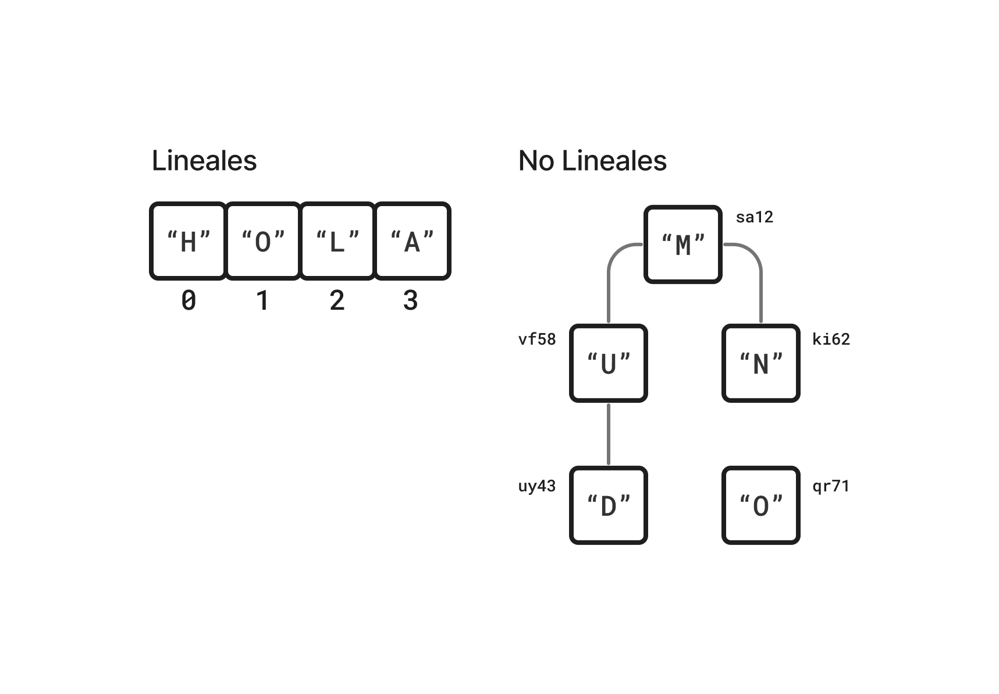
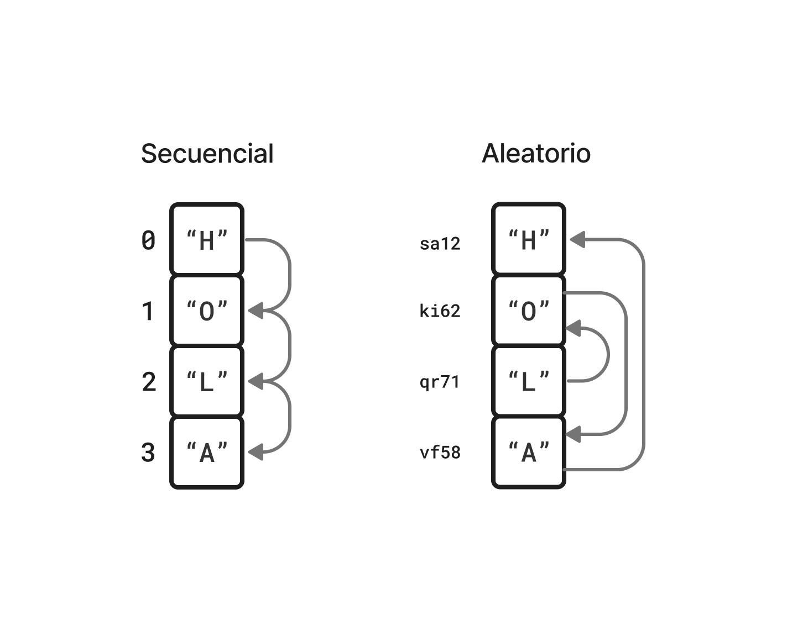
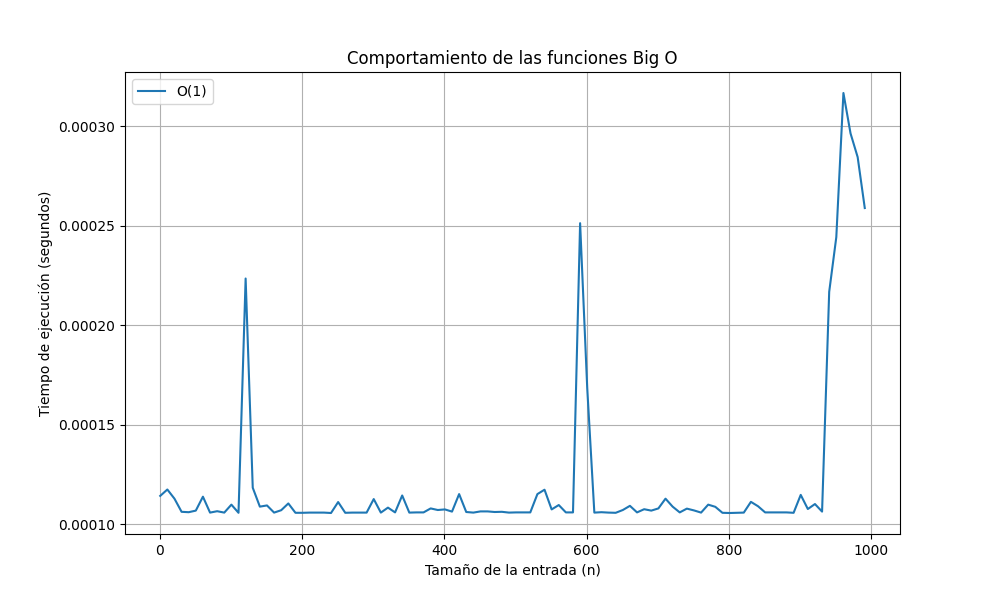
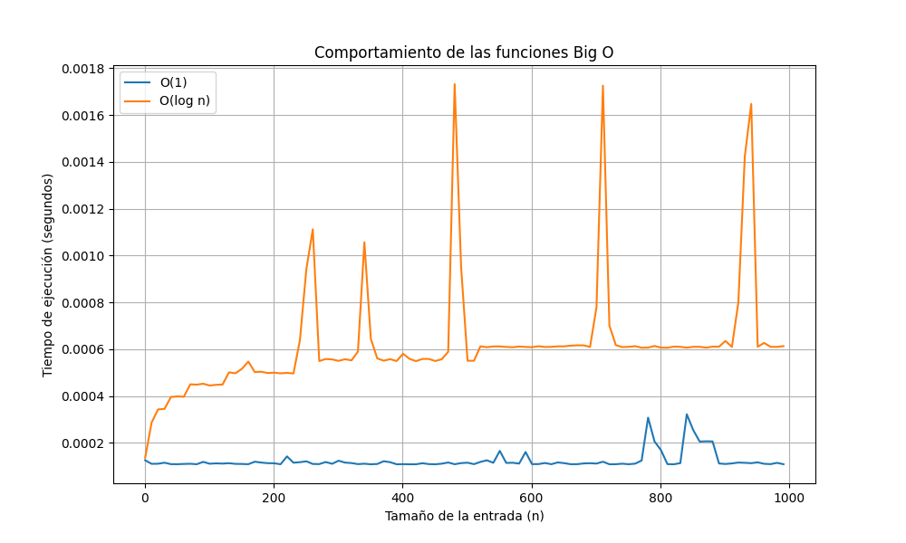
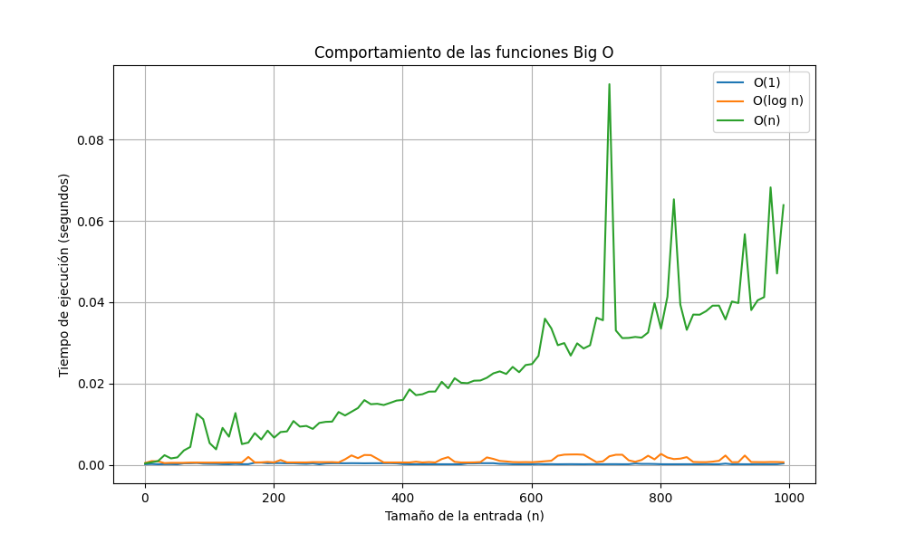
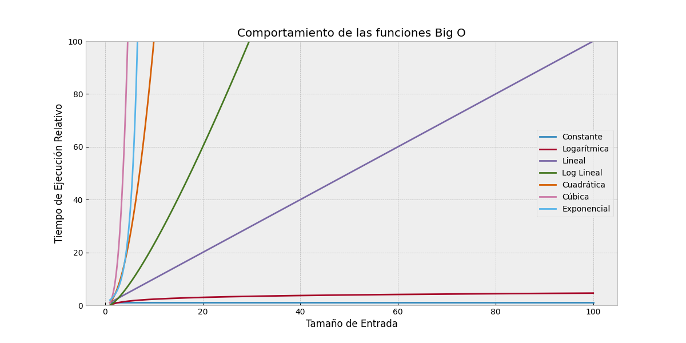

# Unidad 1 <br> Introducción a las Estructuras de Datos

## Estructuras de Datos

---

# Docente


Nombre
: MSC. Jaime Jesús Delgado Meraz

Correo
: <jesus.delgado@tecvalles.mx>

---

# Asignatura

:::: flex
::: col 1/2 px-2
Nombre
: Estructura de Datos

Carrera
: Ingeniería Informática e Ingeniería en Sistemas Computacionales
:::
::: col 1/2
Clave
: AED - 1026

SATCA
: 2 - 3 - 5
:::
::::

---
<!-- _class: toc -->
# Contenidos

1. [Introducción](#introducción)
2. [Tipos de datos abstractos](#tipos-de-datos-abstractos)
3. [Clasificación de las estructuras de datos](#clasificación-de-las-estructuras-de-datos)
4. [Manejo de memoria](#manejo-de-memoria)
5. [Análisis de algoritmos](#análisis-de-algoritmos)

---

<!-- _class: lead -->

# Introducción

---

# Introducción

- Las estructuras de datos son una parte fundamental de la programación, ya que permiten organizar y manipular datos de una manera eficiente.
- Una **estructura de datos** es una forma de organizar un conjunto de datos elementales (números, caracteres, etc.) de tal manera que se puedan realizar operaciones sobre ellos.
- Con el uso de las estructuras de datos se pueden resolver problemas de una manera más eficiente, y así representar de una manera más "real" los datos que se manejan.

---

<!-- _class: lead -->
# Tipos de datos abstractos

---

# Tipos de datos abstractos (TDA)

> Es una abstracción de un tipo de dato, es decir, es una representación de un tipo de dato que se puede utilizar en un programa.

- Los TDA’s se pueden clasificar en:
  - **Tipos de datos**, son TDA’s que representan un tipo de dato, por ejemplo, un número entero, un número real, un carácter, etc., con funciones adicionales para manipularlos.
  - **Estructuras de datos**, son TDA’s que representan una estructura de datos, por ejemplo, una lista, una cola, una pila, etc.

---

# TDAs de tipos de datos

- Este tipo de TDA's son aquellos que representan un tipo de dato, por ejemplo, un número entero, un número real, un carácter, etc.
- Se diferencian de los tipos de datos nativos de un lenguaje de programación en que los TDA’s pueden tener operaciones que permiten manipular los datos que representan.

:::: flex
::: col 1/2 px-2

```java
int a = 5;
int b = 10;
int c = a + b;
```

:::
::: col 1/2 px-2

```java
Integer a = new Integer(5);
Integer b = Integer.valueOf(10);
Integer c = a.add(b);
c = a + b;
```

:::
::::

- Son muy útiles en casos en los que se requiere realizar algunas operaciones como la conversión de un tipo de dato a otro, o la validación de un dato.

---

# TDAs de tipos de datos

- En los lenguajes de programación de tipado dinámico, como Python, los TDA’s de tipos de datos son especialmente útiles para realizar operaciones como la conversión de un tipo de dato a otro.

:::: flex
::: col 1/3 px-1

```python
a = 5
b = 10
c = a + b # c = 15 ✅
```

:::
::: col 1/3 px-1

```python
a = 5
b = "10"
c = a + b # Error ❌
```

:::

::: col 1/3 px-1

```python
a = 5
b = int("10")
c = a + b # c = 15 ✅
```

:::
::::

- De hecho, en Python, los TDA’s de tipos de datos son tan importantes que fungen como **tipos de datos nativos**.

---

# TDAs de estructuras de datos

- Los TDA’s de estructuras de datos son aquellos que representan una estructura de datos, como una lista, una cola, una pila, etc.
- La mayoría de los lenguajes de programación modernos incluyen soporte nativo para estructuras como arreglos y cadenas de caracteres, mientras que para estructuras de datos más complejas como listas, colas, pilas, árboles, entre otras, suele ser necesario utilizar bibliotecas.
- Adicionalmente, si el lenguaje no da soporte a cierta estructura de datos, es posible implementarla utilizando los tipos de datos nativos del lenguaje, por ejemplo, utilizando arreglos.

---

# TDAs de estructuras de datos

- Los TDA’s de estructuras de datos permiten aprovechar las ventajas de las estructuras de datos, como la eficiencia en el uso de la memoria y en la ejecución de las operaciones.
- Los lenguajes de programación modernos suelen incluir bibliotecas desarrolladas por el mismo equipo que da soporte al lenguaje, las cuales incluyen estructuras de datos avanzadas.
- Por ejemplo, en el caso de Python, el lenguaje incluye una biblioteca llamada **collections**.

---

<!-- _class: inverted -->

# ¿Para que reinventar la rueda? 🚲🏍🚗

- Como se mencionó anteriormente, los lenguajes de programación modernos incluyen soporte nativo o extendido (bibliotecas) para estructuras de datos avanzadas.
- Entonces, ¿para que crear nuestras propias estructuras de datos?
  - La respuesta es simple, para aprender a crear nuestras propias estructuras de datos, entender mejor el funcionamiento de las mismas, así como poder adaptarlas a nuestras necesidades.
  - Además, en algunos casos, las estructuras de datos que incluyen los lenguajes de programación no son suficientes para resolver un problema en particular.
  - También nos facilita la comprensión de estructuras de datos más complejas o que no hayan sido desarrolladas por nosotros.

---

# Implementación de TDA's

## Lenguajes con soporte a la POO

- En los lenguajes de programación modernos con soporte a la programación orientada a objetos, los TDA’s se definen como **clases**, las cuales son una abstracción de un tipo de dato y permiten el aprovechamiento de la herencia y el polimorfismo.
- En estos lenguajes, la implementación de un TDA combina el paradigma de la programación orientada a objetos con las estructuras de datos, para definir atributos y métodos que permitan manipular los datos que representan.

---

# Implementación de TDA's

## Lenguajes sin soporte a la POO

- Los lenguajes de programación que no soportan la POO, también permiten definir TDA’s como estructuras, las cuales pueden tener atributos y funciones, sin embargo, se pierde el aprovechamiento de la herencia y el polimorfismo.
- Cabe mencionar que la mayoría de los lenguajes de programación modernos además de soportar la programación orientada a objetos, también incluyen estructuras de datos como parte del lenguaje, ya sea de manera nativa o mediante bibliotecas.

---

# Ejemplos de TDA’s

## Tipos de datos

:::: flex
::: col 1/2

- Los TDA’s de tipos de datos más comunes son:

| TDA | Python | Java |
| --- | :------: | :----: |
| Número entero | ```int``` | ```Integer``` |
| Número real | ```float``` | ```Double``` |
| Carácter | ```str``` | ```Character``` |
| Cadena de caracteres | ```str``` | ```String``` |
| Booleano | ```bool``` | ```Boolean``` |

:::
::: col 1/2

- En lenguajes como Java, a los TDA’s de tipos de datos se les conoce como **wrappers** o **envoltorios** porque ofrecen funcionalidad adicional a los tipos de datos nativos del lenguaje.

:::
::::

---

# Ejemplos de TDA’s

## Estructuras de datos

:::: flex
::: col 1/2

- Los TDA’s de estructuras de datos más comunes son:

| TDA | Python | Java |
| --- | :------: | :----: |
| Lista | ```list``` | ```ArrayList``` |
| Cola | ```deque``` | ```Queue``` |
| Pila | ```deque``` | ```Stack``` |

:::

::: col 1/2

- Estos TDA's tienen diferentes implementaciones en cada lenguaje aunque su funcionalidad es la misma.
- Así mismo, existen otros TDA's de estructuras de datos más complejas como árboles, grafos, etc.

:::
::::

---

<!-- _class: lead -->
# Clasificación de las estructuras de datos

---

# Clasificación de las estructuras de datos

Las estructuras de datos se pueden clasificar en 3 categorías no excluyentes:
  
  Organización de los datos
  : Por la forma en que se organizan los datos, es decir, la forma en que se almacenan los datos ya sea de manera lineal o no lineal.

  Tamaño de la estructura
  : Por la forma en que se define su tamaño, es decir, si el tamaño de la estructura es fijo o puede cambiar durante la ejecución del programa.

  Acceso a los datos
  : Por la forma en que se accede a los datos, es decir, si los datos se acceden de manera secuencial o aleatoria.

---

# Clasificación de las estructuras de datos

- Una estructura de datos puede pertenecer a más de una clasificación, ya que cada clasificación se refiere a una característica diferente de la estructura.
- Una de las primeras estructuras de datos que se trabajan en los lenguajes de programación son las **cadenas de caracteres**, las cuales son estructuras de datos lineales, dinámicas y de acceso no secuencial.
- Estas estructuras integran los datos de tipo carácter en una secuencia de caracteres, además de incluir operaciones para manipularlos.

---

# Clasificación de las estructuras de datos

## Organización de los datos

- Por la forma en que se organizan los datos, las estructuras de datos se pueden clasificar en:

:::: flex
::: col 1/2 px-2

**Estructuras de datos lineales**, se organizan de manera lineal, es decir, cada dato se encuentra en un lugar específico de la estructura.

- Listas
- Colas
- Pilas

:::
::: col 1/2 px-2

**Estructuras de datos no lineales**, cada dato puede estar en cualquier lugar de la estructura, o incluso, puede no estar en la estructura.

- Árboles
- Grafos

:::
::::

---

## Organización de los datos

<div class="h-5/6"></div>



---

# Clasificación de las estructuras de datos

## Tamaño de la estructura

- Por la forma en que se define su tamaño, se pueden clasificar en:

:::: flex
::: col 1/2 px-2

**Estructuras de datos estáticas**, las cuales tienen un tamaño fijo que se define al momento de su creación.

- Arreglos
- Cadenas de caracteres (en algunos lenguajes como C)

:::
::: col 1/2 px-2

**Estructuras de datos dinámicas**, que pueden crecer o disminuir su tamaño durante la ejecución del programa.

- Listas
- Colas
- Pilas
- Árboles
- Grafos

:::
::::

---

## Tamaño de la estructura

:::: flex
::: col 1/2 px-2

```java
int[] a = new int[5];

a[0] = 5;
a[1] = 10;
a[2] = 15;
a[3] = 20;
a[4] = 25;
// a = [5, 10, 15, 20, 25]

a[5] = 30; // Error ❌

// Funciones no soportadas
a.add(30); // Error ❌
a.remove(0); // Error ❌
```

:::
::: col 1/2 px-2

```java
ArrayList<Integer> a = 
  new ArrayList<Integer>();

a.add(5);
a.add(10);
a.add(15);
a.add(20);
a.add(25);
// a = [5, 10, 15, 20, 25]

a.add(30);
// a = [5, 10, 15, 20, 25, 30]
a.remove(0);
// a = [10, 15, 20, 25, 30]
```

:::
::::

---

# Clasificación de las estructuras de datos

## Acceso a los datos

- Por la forma en que se accede a los datos, se pueden clasificar en:

:::: flex
::: col 1/2 px-2

**Estructuras de datos secuenciales**, en las que los datos se acceden de manera secuencial.

- Listas
- Colas
- Pilas

:::
::: col 1/2 px-2

**Estructuras de datos no secuenciales**, en las que los datos se acceden de manera "aleatoria", ya sea mediante un índice o un _hash_.

- Arreglos
- Cadenas de caracteres
- Árboles
- Grafos

:::
::::

---

## Acceso a los datos

<div class="h-5/6"></div>



---

# Clasificación de las estructuras de datos

## Combinación de clasificaciones

| Estructura | Organización | Tamaño | Acceso |
| ---------- | :----------: | :----: | :----: |
| Arreglo | Lineal | Estático | Aleatorio |
| Lista | Lineal | Dinámico | Secuencial |
| Cola | Lineal | Dinámico | Secuencial |
| Pila | Lineal | Dinámico | Secuencial |
| Árbol | No lineal | Dinámico | Aleatorio |
| Grafo | No lineal | Dinámico | Aleatorio |

---

# Clasificación de las estructuras de datos

- Si bien existen diversas formas de clasificar las estructuras de datos, la clasificación más común es la que se basa en la organización de los datos (lineal o no lineal).
- Lo anterior se debe principalmente, a que dicha característica es la que más influye en el funcionamiento de las estructuras de datos.
- De hecho, las características de asignación de tamaño y acceso a los datos pueden variar entre los lenguajes de programación, mientras que la organización de los datos es una característica que se mantiene constante.

---

# Clasificación de las estructuras de datos

- Las estructuras de datos lineales se pueden clasificar en:
  - **Listas**, son estructuras en la que los datos se organizan de forma secuencial, es decir, cada dato se encuentra en un lugar específico de la lista.
  - **Colas**, en estas estructuras los datos se organizan de manera similar a las listas, pero los datos se agregan al final de la cola y se eliminan del inicio de la cola.
  - **Pilas**, estas estructuras se organizan de manera similar a las listas, con la diferencia de que los datos se agregan al final de la pila y se eliminan del final de la pila.

---

# Clasificación de las estructuras de datos

- Las estructuras de datos no lineales se pueden clasificar en:
  - **Árboles**, son estructuras en las que los datos se organizan de manera jerárquica, es decir, cada dato puede tener uno o más datos asociados a él.
    - Árboles binarios
    - Árboles n-arios
  - **Grafos**, estas estructuras son similares a los árboles, con la diferencia de que los datos pueden tener más de un dato asociado a ellos, y además, los datos pueden tener asociaciones entre sí.
    - Grafos dirigidos
    - Grafos no dirigidos
    - Grafos ponderados
    - Grafos no ponderados

---

<!-- _class: inverted -->

# Nota

- Tanto las estructuras de datos lineales como no lineales requieren de un **nodo** para almacenar los datos.
- Un nodo es una estructura que contiene los datos y las referencias a los nodos adyacentes.
- Para un mejor entendimiento tanto de las estructuras de datos lineales como las no lineales, se revisarán las mismas en unidades temáticas posteriores.

---

<!-- _class: lead -->
# Manejo de memoria

---

# Manejo de memoria

- El manejo de memoria es una parte fundamental de las estructuras de datos, ya que permite definir el tamaño de la estructura y la forma en que se almacenan los datos.
- El manejo de memoria se puede clasificar en:
  - Memoria estática
  - Memoria dinámica
- Manejar la memoria de manera eficiente es importante para aprovechar al máximo los recursos del sistema, así como para evitar errores de memoria.

---

# Manejo de memoria

- El manejo o gestión de memoria, es un concepto altamente relacionado con el manejo de estructuras de datos, ya que se refiere a la definición del tamaño de la estructura, la forma en que se almacenan los datos y la disposición de la memoria cuando ya no se requiere.
- En los lenguajes de programación modernos, el manejo de memoria está a cargo del **recolector de basura** (_garbage collector_ 🚛🗑) el cual se encarga de asignar y liberar la memoria de manera automática.
- Aunado a lo anterior, la alta disponibilidad de memoria en los sistemas actuales, hace que el manejo de memoria sea un tema que no se toma en cuenta al momento de desarrollar un programa.

---

# Manejo de memoria

- Si bien, el manejo de memoria suele estar a cargo del recolector de basura, es importante conocer los conceptos básicos del manejo de memoria, ya que nos permite entender mejor el funcionamiento de las estructuras de datos.
- Además, en algunos casos, es necesario utilizar el manejo de memoria de manera manual, por ejemplo, cuando se trabaja con lenguajes de programación de bajo nivel como C o C++.
- Incluso, en lenguajes de programación de alto nivel como Python, es posible utilizar el manejo de memoria de manera manual, aunque no es recomendable.

---

# Manejo de memoria

## Memoria estática

- La memoria estática es aquella que se define al momento de la creación de la estructura de datos, es decir, el tamaño de la estructura se define al momento de su creación y no puede cambiar durante la ejecución del programa.
- Este tipo de memoria se utiliza principalmente en estructuras de datos estáticas, como los arreglos y las cadenas de caracteres en lenguajes de bajo nivel.
- Podríamos pensar en la asignación de memoria estática como un edificio de múltiples pisos 🏬, en el que una vez construido, no se puede modificar su tamaño, sin importar si todos los pisos estan o no en uso.

---

# Manejo de memoria

## Memoria estática

:::: flex
::: col 1/3 px-2

### C

```c
int *a = malloc(3 * sizeof(int));

a[0] = 5;
a[1] = 10;
a[2] = 15;

free(a);
```

:::
::: col 1/3 px-2

### C++

```cpp
int *a = new int[3];

a[0] = 5;
a[1] = 10;
a[2] = 15;

delete[] a;
```

:::

::: col 1/3 px-2

### Java

```java
int[] a = new int[3];

a[0] = 5;
a[1] = 10;
a[2] = 15;
```

:::
::::

- El manejo de memoria estática combina la especificación del tamaño de la estructura, y la liberación de la memoria.

---

# Manejo de memoria

## Memoria dinámica

- La memoria dinámica se define de manera automática durante la ejecución del programa, e incluso puede cambiar durante la ejecución del mismo.
- La mayoría de lenguajes de alto nivel utilizan este tipo de gestión de memoria, ya que permite definir estructuras de datos sin preocuparse por el tamaño.
- Igualmente estos lenguajes integran estrategias de gestión de memoria como el _garbage collector_.
- La gestión de memoria dinámica se puede comparar con una "torre" de hotcakes 🥞, en la que se van agregando hotcakes a la torre, y se van quitando de la misma, según se necesite.

---

# Manejo de memoria

## Memoria dinámica

:::: flex
::: col 1/3 px-2

### Python

```python
a = []

a.append(5)
a.append(10)
a.append(15)
```

:::

::: col 1/3 px-2

### Java

```java
ArrayList<Integer> a = 
  new ArrayList<Integer>();

a.add(5);
a.add(10);
a.add(15);
```

:::

::: col 1/3 px-2

### Dart

```dart
List<int> a = [];

a.add(5);
a.add(10);
a.add(15);
```

:::
::::

- En estos ejemplos, se puede observar que la memoria se asigna de manera automática, y que el tamaño de la estructura puede cambiar durante la ejecución del programa.

---

<!-- _class: lead -->
# Análisis de algoritmos

---

# Análisis de algoritmos

- El análisis de algoritmos es una parte fundamental de las estructuras de datos, ya que permite determinar la eficiencia de las mismas.
- Se puede clasificar en:
  - **Complejidad en el tiempo**, asociada al uso del CPU
  - **Complejidad en el espacio**, relacionada con el uso de la memoria
  - **Eficiencia de los algoritmos**, que es una combinación de las dos anteriores
- La complejidad y la eficiencia de los algoritmos se pueden determinar mediante el uso de la notación **Big O**.

---

# Análisis de algoritmos

## Complejidad en el tiempo

- La complejidad en el tiempo se refiere al número de operaciones que realiza un algoritmo y se ve afectada por factores como el tamaño de la estructura de datos, el tipo de operaciones que se realizan, etc.
- Algunas estrategias para reducir la complejidad en el tiempo son:
  - Reducir el número de operaciones como asignaciones, comparaciones, etc.
  - Reducir el número de ciclos
  - Reducir el número de llamadas a funciones

---

# Análisis de algoritmos

## Complejidad en el espacio

- La complejidad en el espacio se refiere a la cantidad de memoria, comúnmente RAM, aunque también puede ser espacio en disco.
- Este tipo de complejidad se ve afectada por factores como el tamaño de la estructura de datos, el tipo de datos que se almacenan, etc.
- Algunas estrategias para reducir la complejidad en el espacio son:
  - Utilizar estructuras de datos estáticas
  - Reducir el tamaño de las estructuras de datos
  - Priorizar el uso de tipos de datos nativos

---

# Análisis de algoritmos

## Eficiencia de los algoritmos

- La eficiencia de los algoritmos es una combinación de la complejidad en el tiempo y la complejidad en el espacio, en algunos casos, es posible reducir la complejidad en el tiempo a costa de aumentar la complejidad en el espacio, y viceversa.
- La eficiencia ideal de un algoritmo es aquella que tiene una complejidad en el tiempo y en el espacio de $O(1)$, es decir, que sin importar el tamaño de la estructura de datos, el algoritmo siempre realiza el mismo número de operaciones y utiliza la misma cantidad de memoria.
- Cabe mencionar que la eficiencia ideal es prácticamente imposible de lograr, por lo que se busca que los algoritmos tengan una complejidad en el tiempo y en el espacio lo más cercana posible a $O(1)$.

---

# Análisis de algoritmos

## Notación Big O

> Es una notación matemática que se utiliza para describir el comportamiento de un algoritmo

- Es decir, la notación _Big O_ mide la forma en que el algoritmo se comporta en términos de tiempo y espacio.
- La notación _Big O_ se basa en la función matemática $O(n)$, la cual se utiliza para describir el comportamiento de un algoritmo en el peor de los casos, es decir, cuando el algoritmo tiene que realizar el mayor número de operaciones.
- La notación _Big O_ se puede utilizar para describir el comportamiento de un algoritmo en términos de tiempo y espacio, por ejemplo, $O(n)$, $O(n^2)$, $O(2^n)$, etc.

---

## Notación Big O

- La notación _Big O_ se puede clasificar en:

|Nombre | Notación | Descripción |
|---| -------- | ----------- |
| Constante | $O(1)$ | El algoritmo siempre realiza el mismo número de operaciones |
| Logarítmica | $O(log(n))$ | El número de operaciones crece de manera logarítmica |
| Lineal | $O(n)$ | El número de operaciones crece de manera lineal |
| Log lineal | $O(nlog(n))$ | El número de operaciones crece de manera logarítmica |
| Cuadrática | $O(n^2)$ | El número de operaciones crece de manera cuadrática |
| Cúbica | $O(n^3)$ | El número de operaciones crece de manera cúbica |
| Exponencial | $O(2^n)$ | El número de operaciones crece de manera exponencial |

---

## Notación Big O

- Si bien la complejidad ideal para un algoritmo es $O(1)$, en la mayoría de los casos, es imposible lograrla, por lo que se busca que la complejidad del algoritmo sea lo más cercana posible a $O(1)$.
- Por lo anterior, las complejidades por encima de $O(n)$ se consideran ineficientes, ya que el número de operaciones crece de manera exponencial.
- El caso más común, el de la complejidad $O(n^2)$, la cual se considera ineficiente, ya que el número de operaciones crece de manera cuadrática.

---



---



---



---


---


---



---

# Resumen

- Las estructuras de datos son una parte fundamental de la programación, ya que permiten organizar y manipular datos de una manera eficiente.
- Los TDA’s son una abstracción de un tipo de dato, es decir, es una representación de un tipo de dato que se puede utilizar en un programa.
- Los TDA’s se pueden clasificar en **tipos de datos** y **estructuras de datos**.
- Las estructuras de datos se pueden clasificar según la forma en que se organizan los datos, la forma en que se define su tamaño y la forma en que se accede a los datos.
- El análisis de algoritmos es relevante para determinar la eficiencia de las estructuras de datos, y se puede clasificar en complejidad en el tiempo, complejidad en el espacio y eficiencia de los algoritmos.

---

# Lecturas recomendadas

Learn Data Structures and Algorithms
: <https://www.geeksforgeeks.org/learn-data-structures-and-algorithms-dsa-tutorial/>

All You Need to Know About Big O Notation
: <https://skerritt.blog/big-o/>

Big O para Principiantes
: <https://aprenderbigdata.com/big-o/>

---

<!-- _class: inverted -->


<div class="text-center text-middle font-bold font-coding text-8xl mt-10">
  &lt;/Fin&gt;
</div>
