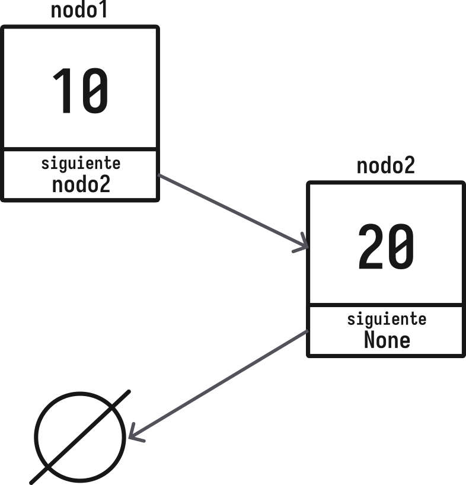
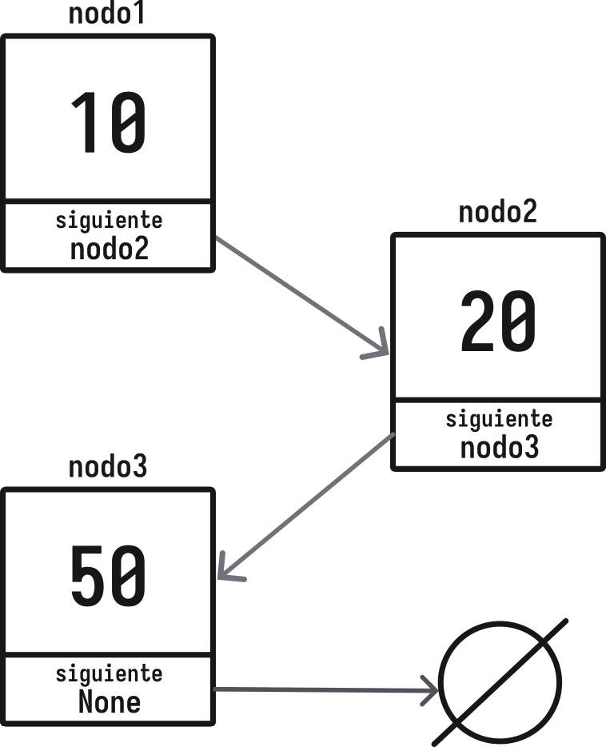
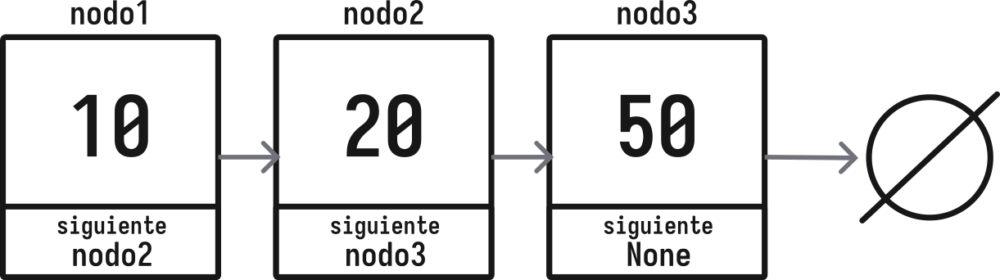
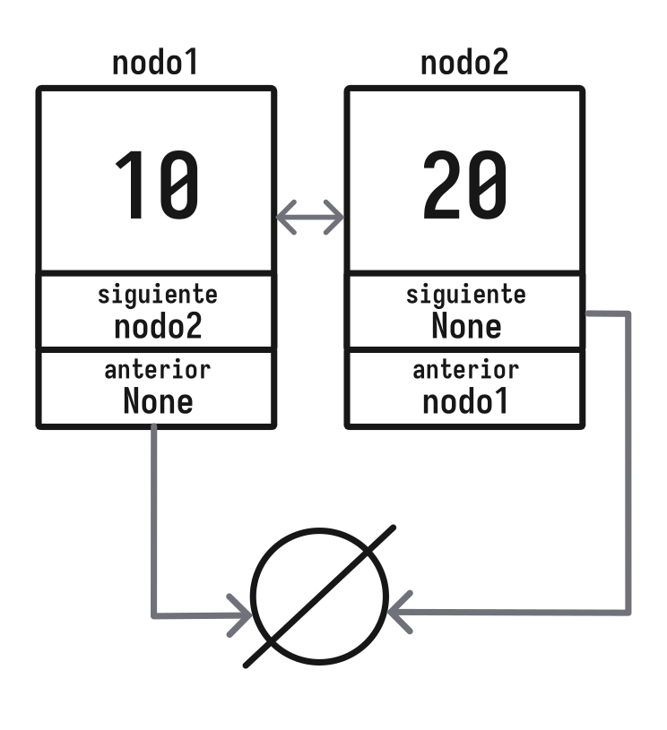
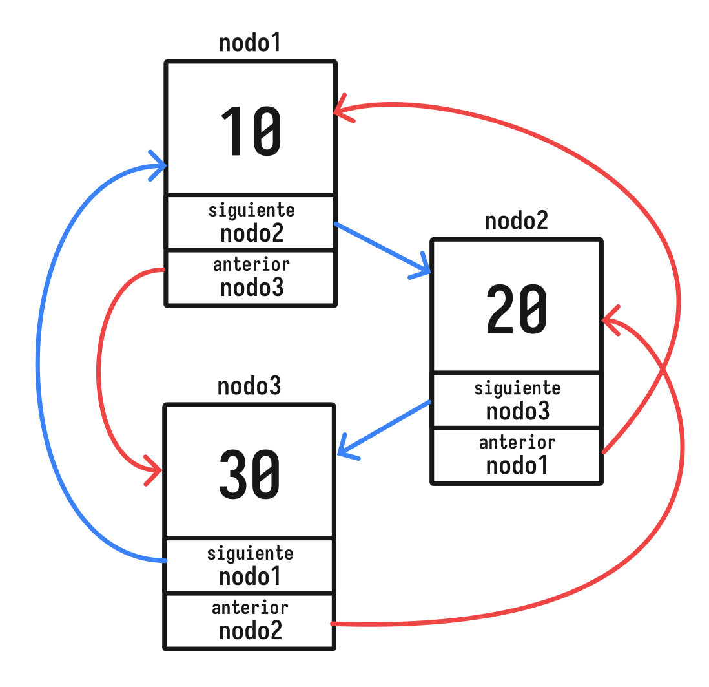
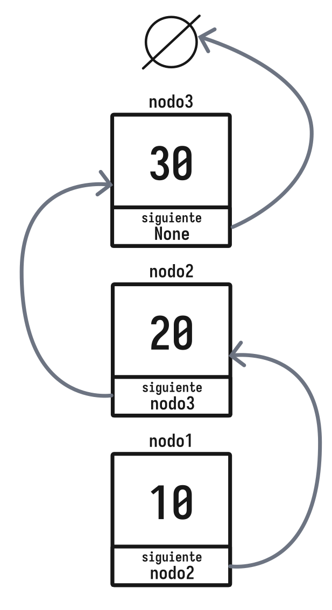

# Unidad 3 <br> Estructuras Lineales

## Estructuras de Datos

---

# Docente


Nombre
: MSC. Jaime Jesús Delgado Meraz

Correo
: <jesus.delgado@tecvalles.mx>

---

# Asignatura

:::: flex
::: col 1/2 px-2
Nombre
: Estructuras de Datos

Carrera
: Ingeniería Informática e Ingeniería en Sistemas Computacionales
:::
::: col 1/2
Clave
: AED - 1026

SATCA
: 2 - 3 - 5
:::
::::

---
<!-- _class: toc -->
# Contenidos

1. [Introducción](#introducción)
2. [Nodo](#nodo)
3. [Listas](#listas)
4. [Pilas](#pilas)
5. [Colas](#colas)

---
<!-- _class: lead -->
# Introducción

---

# Introducción

- Como se ha mencionado en las unidades anteriores, las estructuras de datos son una parte fundamental en el desarrollo de software.
- Se utilizan para almacenar y organizar datos de manera eficiente, permitiendo resolver problemas complejos de manera sencilla.
- En esta unidad se estudiarán las estructuras de datos lineales, las cuales son aquellas que permiten almacenar y acceder a los datos de manera secuencial.
- Se revisarán sus características, operaciones y aplicaciones.

---
<!-- _class: lead -->
# Nodo

---

# Nodo

> Un nodo es una estructura de datos que contiene un valor y una referencia a uno o más nodos.

- Se puede considerar como una caja que contiene un valor y un puntero a otro nodo.
- Los nodos se utilizan para construir estructuras de datos más complejas, como listas, pilas y colas.
- Son una estructura de datos fundamental en la programación.

---

# Nodo

- En la programación, un nodo se puede representar como una estructura o una clase.

```python
class Nodo:
    def __init__(self, valor):
        self.valor = valor
        self.siguiente = None

nodo1 = Nodo(10)
nodo2 = Nodo(20)
nodo1.siguiente = nodo2
```



---

# Nodo

- La estructura de un nodo es muy simple, pero es la base para construir estructuras de datos más complejas.
- Puede contener cualquier tipo de dato, como enteros, flotantes, cadenas, objetos, etc.

::: info
👨🏻‍🏫 Aunque la mayoría de los lenguajes modernos no requieren la creación de la estructura `Nodo`, se desarrollará para tomar como base de las estructuras de datos lineales
:::

---
<!-- _class: lead -->
# Listas

---

# Listas

> Una lista es una estructura de datos que almacena una colección de elementos, en la que cada elemento tiene un sucesor y un predecesor.

- Las listas son una de las estructuras de datos más utilizadas en programación, ya que permiten almacenar y acceder a los datos de manera secuencial.
- La mayoría de los lenguajes de programación modernos incluyen una implementación de listas, ya sea como una alternativa a los arreglos o la estructura de datos principal para almacenar datos.

---

# Listas

## Representación en memoria

- Las listas se pueden representar en memoria como una secuencia de nodos enlazados.
- Cada nodo contiene un valor y una referencia al siguiente nodo.
- El primer nodo se conoce como **cabeza** o **inicio** de la lista.
- El último nodo se conoce como **cola** o **fin** de la lista.



---

# Listas

## Representación en memoria

- Los nodos no necesariamente se encuentran en posiciones contiguas en memoria, pero se pueden representar de manera secuencial.
- La referencia al siguiente nodo se almacena en el nodo actual, lo que permite recorrer la lista de manera secuencial.



---

# Listas

## Representación en memoria

- En general, las listas se pueden representar en memoria como una secuencia de nodos enlazados, donde cada nodo contiene un valor y una referencia al siguiente nodo.

:::: flex
::: col 1/2

```python
class Nodo:
    def __init__(self, valor):
        self.valor = valor
        self.siguiente = None
```

:::
::: col 1/2

```python
nodo1 = Nodo(10)
nodo2 = Nodo(20)
nodo3 = Nodo(30)

nodo1.siguiente = nodo2
nodo2.siguiente = nodo3
```

:::
::::

- En la práctica, es preferible construir una clase que represente la lista y que contenga los métodos necesarios para manipularla.

---

# Listas

## Operaciones

- Las listas permiten realizar operaciones como:
  - Inserción
  - Eliminación
  - Recorrido (o impresión)
  - Búsqueda
  - Ordenamiento

::: info
👨🏻‍🏫 Las operaciones de búsqueda y ordenamiento se revisarán con más detalle en unidades posteriores
:::

---

# Listas

## Tipos de listas

- Las listas pueden clasificarse según sus características y operaciones.
- Las listas más comunes son:
  - Listas simplemente enlazadas
  - Listas doblemente enlazadas
  - Listas circulares
- La diferencia entre estos tipos de listas radica en la forma en que los **nodos** se enlazan entre sí.

---

# Listas

## Listas simplemente enlazadas

> Son listas en las que cada nodo contiene un valor y una referencia al siguiente nodo.

- La referencia al siguiente nodo se almacena en el nodo actual, por su parte, el último nodo de la lista contiene una referencia nula.
- Las listas simplemente enlazadas son las más sencillas y se utilizan en la mayoría de las aplicaciones.
- Python ya cuenta con su propia implementación de listas, sin embargo, se desarrollará una implementación propia para comprender su funcionamiento.

---

# Listas

## Listas simplemente enlazadas: Inserción

```python
class ListaSimple:
    def __init__(self):
        self.cabeza = None
        self.cola = None
        self.tamanio = 0

    def agregar(self, valor):
        nuevo = Nodo(valor) # Crear un nuevo nodo apuntando a None

        if self.cola is None: # Si la lista está vacía
            self.cabeza = nuevo
            self.cola = nuevo
        else: # Si la lista no está vacía
            self.cola.siguiente = nuevo
        
        self.tamanio += 1 # Incrementar el tamaño de la lista
        self.cola = nuevo # Actualizar el último nodo
```

---

# Listas

## Listas simplemente enlazadas

```python
lista = ListaSimple() # None
lista.agregar(10) # 10 -> None
lista.agregar(20) # 10 -> 20 -> None
lista.agregar(30) # 10 -> 20 -> 30 -> None
```

---

# Listas

## Listas simplemente enlazadas: Eliminar

```python
class ListaSimple:
    # ...
    # Elimina el primer nodo con el valor especificado
    def eliminar(self, valor):
        actual = self.cabeza
        anterior = None

        while actual:
            if actual.valor == valor:
                if anterior:
                    anterior.siguiente = actual.siguiente
                else:
                    self.cabeza = actual.siguiente
                self.tamanio -= 1
                return True
            anterior = actual
            actual = actual.siguiente
        return False
```

---

# Listas

## Listas simplemente enlazadas: Eliminar inicio

```python
class ListaSimple:
    # ...
    def eliminar_inicio(self):
        if self.cabeza is None:
            return False
        if self.cabeza.siguiente is None:
            self.cabeza = None
            self.cola = None
        else:
            self.cabeza = self.cabeza.siguiente
        self.tamanio -= 1
        return True
```

---

# Listas

## Listas simplemente enlazadas: Eliminar final

```python
class ListaSimple:
    # ...
    def eliminar_final(self):
        if self.cola is None:
            return False

        actual = self.cabeza
        anterior = None
        while actual.siguiente:
            anterior = actual
            actual = actual.siguiente
        if anterior:
            anterior.siguiente = None
            self.cola = anterior
        else:
            self.cabeza = None
            self.cola = None
        self.tamanio -= 1
        return True
```

---

# Listas

## Listas simplemente enlazadas

```python
lista = ListaSimple() # None
lista.agregar(10) # 10 -> None
lista.agregar(20) # 10 -> 20 -> None
lista.agregar(30) # 10 -> 20 -> 30 -> None

lista.eliminar(20) # 10 -> 30 -> None
```

- La eliminación de un nodo en una lista simplemente enlazada requiere recorrer la lista para encontrar el nodo a eliminar y actualizar las referencias.

---

# Listas

## Listas simplemente enlazadas: Recorrido y búsqueda secuencial

```python
class ListaSimple:
    # ...
    def recorrer(self):
        actual = self.cabeza
        while actual:
            print(actual.valor,
                end=" -> " if actual.siguiente else "\n")
            actual = actual.siguiente

    def buscar(self, valor):
        actual = self.cabeza
        while actual:
            if actual.valor == valor:
                return True
            actual = actual.siguiente
        return False
```

---

# Listas

## Listas simplemente enlazadas

:::: flex
::: col 1/2 px-2

```python
lista = ListaSimple()
lista.agregar(10)
lista.agregar(20)
lista.agregar(30)

# 10 -> 20 -> 30 -> None

lista.recorrer()
# 10 -> 20 -> 30

print(lista.buscar(20)) # True
print(lista.buscar(40)) # False
```

:::
::: col 1/2 px-2

- En la práctica, también se puede recorrer la lista utilizando un ciclo.

```python
actual = lista.cabeza

while actual:
    print(actual.valor)
    actual = actual.siguiente
```

:::
::::

---

# Listas

## Listas simplemente enlazadas

- Al trabajar con listas simplemente enlazadas (o simplemente listas), también se pueden agregar operaciones como:
  - Obtener el tamaño de la lista
  - Obtener el primer y último nodo
  - Obtener el valor de un nodo en una posición específica
  - Obtener el nodo en una posición específica
- Estas operaciones se pueden implementar de manera similar a las operaciones de inserción, eliminación, recorrido y consulta, por lo que no se revisarán con detalle.

---

# Listas

## Listas doblemente enlazadas

> Son listas en las que cada nodo contiene un valor, una referencia al siguiente nodo y una referencia al nodo anterior.

- A diferencia de las listas simplemente enlazadas, las listas doblemente enlazadas permiten recorrer la lista en ambas direcciones, lo que facilita la implementación de algunas operaciones.
- La implementación de listas doblemente enlazadas es más compleja que la de listas simplemente enlazadas, ya que se deben actualizar las referencias en ambos sentidos.

---

# Listas

## Listas doblemente enlazadas

- La implementación de listas doblemente enlazadas es similar a la de listas simplemente enlazadas, pero se deben una estructura de nodo "mejorada" que contenga una referencia al nodo siguiente y al nodo anterior.

```python
class NodoDoble:
    def __init__(self, valor):
        self.valor = valor
        self.siguiente = None
        self.anterior = None
```



---

# Listas

## Listas doblemente enlazadas

- Al trabajar con listas doblemente enlazadas, además de las operaciones que ya se pueden realizar con las listas simples, se pueden agregar operaciones como:
  - Inserción al inicio (la lista simplemente enlazada solo permite la inserción al final)
  - Eliminación al inicio o al final
  - Recorrido en ambas direcciones

---

# Listas

## Listas doblemente enlazadas: Inserción

:::: flex
::: col 1/2

```python
class ListaDoble:
    def __init__(self):
        self.cabeza = None
        self.cola = None
        self.tamanio = 0

    def agregar_final(self, valor):
        nuevo = NodoDoble(valor)
        if self.cola is None:
            self.cabeza = nuevo
            self.cola = nuevo
        else:
            nuevo.anterior = self.cola
            self.cola.siguiente = nuevo
            self.cola = nuevo
        self.tamanio += 1    
```

:::

::: col 1/2 px-2

```python
    def agregar_inicio(self, valor):
        nuevo = NodoDoble(valor)
        if self.cabeza is None:
            self.cabeza = nuevo
            self.cola = nuevo
        else:
            nuevo.siguiente = self.cabeza
            self.cabeza.anterior = nuevo
            self.cabeza = nuevo
        self.tamanio += 1

    def agregar(self, valor):
        self.agregar_final(valor)
```

:::
::::

---

# Listas

## Listas doblemente enlazadas

```python
lista = ListaDoble()
lista.agregar(10)
lista.agregar(20)
lista.agregar(30)

# 10 -> 20 -> 30 -> None

lista.agregar_inicio(5)

# 5 -> 10 -> 20 -> 30 -> None

lista.agregar_final(40)

# 5 -> 10 -> 20 -> 30 -> 40 -> None
```

---

# Listas

## Listas doblemente enlazadas: Eliminación

```python
class ListaDoble:
    # ...
    def eliminar_inicio(self):
        if self.cabeza is None:
            return False
        if self.cabeza.siguiente is None:
            self.cabeza = None
            self.cola = None
        else:
            self.cabeza = self.cabeza.siguiente
            self.cabeza.anterior = None
        self.tamanio -= 1
        return True
```

---

# Listas

## Listas doblemente enlazadas: Eliminación

```python
class ListaDoble:
    # ...
    def eliminar_final(self):
        if self.cola is None:
            return False
        if self.cola.anterior is None:
            self.cabeza = None
            self.cola = None
        else:
            self.cola = self.cola.anterior
            self.cola.siguiente = None
        self.tamanio -= 1
        return True
```

---

# Listas

## Listas doblemente enlazadas: Eliminación

```python
class ListaDoble:
    # ...
    def eliminar(self, valor):
        actual = self.cabeza
        while actual:
            if actual.valor == valor:
                if actual.anterior:
                    actual.anterior.siguiente = actual.siguiente
                else:
                    self.cabeza = actual.siguiente
                if actual.siguiente:
                    actual.siguiente.anterior = actual.anterior
                else:
                    self.cola = actual.anterior
                self.tamanio -= 1
                return True
            actual = actual.siguiente
        return False
```

---

# Listas

## Listas doblemente enlazadas

```python
lista = ListaDoble()
lista.agregar(10)
lista.agregar(20)
lista.agregar(30)
lista.agregar_inicio(5)
# 5 -> 10 -> 20 -> 30 -> None

lista.eliminar(20)
# 5 -> 10 -> 30 -> None

lista.eliminar_inicio()
# 10 -> 30 -> None

lista.eliminar_final()
# 10 -> None
```

---

# Listas

## Listas doblemente enlazadas: Recorrido

```python
class ListaDoble:
    # ...
    def recorrer_inicio(self):
        actual = self.cabeza
        while actual:
            print(actual.valor,
                end=" -> " if actual.siguiente else "\n")
            actual = actual.siguiente

    def recorrer_fin(self):
        actual = self.cola
        while actual:
            print(actual.valor, 
                end=" <- " if actual.anterior else "\n")
            actual = actual.anterior
```

---

# Listas

## Listas doblemente enlazadas

```python
lista = ListaDoble()
lista.agregar(10)
lista.agregar(20)
lista.agregar(30)
lista.agregar_inicio(5)
# 5 -> 10 -> 20 -> 30 -> None

lista.recorrer_inicio()
# 5
# 10
# 20
# 30

lista.recorrer_fin()
# 30
# 20
# 10
# 5
```

---

# Listas

## Listas circulares

> Son listas en las que el último nodo apunta al primer nodo, formando un ciclo.

- Las listas circulares son una variante de las listas simplemente enlazadas, propiamente, más cercanas a las listas doblemente enlazadas.
- La principal ventaja de las listas circulares es que permiten recorrer la lista de manera continua, ya que el último nodo apunta al primer nodo.



---

# Listas

## Listas circulares

- La implementación de listas circulares es similar a la de listas simplemente enlazadas, pero el último nodo siempre apunta al primer nodo.
- Por lo tanto, las operaciones de inserción, eliminación, recorrido y consulta son similares a las de las listas doblemente enlazadas.
- En la práctica, las listas circulares se utilizan en aplicaciones donde se requiere recorrer la lista de manera continua.

---

# Listas

## Listas circulares

- Al trabajar con listas circulares, se pueden agregar operaciones como:
  - Recorrido en ambas direcciones
  - Recorrido continuo
  - Inserción y eliminación al inicio y al final
  - Inserción y eliminación en una posición específica
- Estas operaciones toman como base las operaciones de las listas doblemente enlazadas, por lo que se puede aplicar POO para implementarlas.

---

# Listas

## Listas circulares: Constructor y Recorrido

```python
from listaDoble import ListaDoble

class ListaCircular(ListaDoble):
    def __init__(self):
        super().__init__()

    def recorrer_adelante(self):
        actual = self.cabeza
        while actual:
            print(actual.valor, end=" -> " if actual.siguiente else "\n")
            actual = actual.siguiente
            if actual == self.cabeza:
                break

    def recorrer_atras(self):
        actual = self.cola
        while actual:
            print(actual.valor, end=" -> " if actual.anterior else "\n")
            actual = actual.anterior
            if actual == self.cola:
                break
```

---

# Listas

## Listas circulares: Recorrido continuo

```python
class ListaCircular(ListaDoble):
    # ...
    def recorrer(self, pasos=1):
        actual = self.cabeza
        for _ in range(pasos):
            print(actual.valor, end=" -> ")
            actual = actual.siguiente
```

---

# Listas

## Listas circulares: Inserción

```python
class ListaCircular(ListaDoble):
    # ...
    def agregar_final(self, valor):
        super().agregar_final(valor)
        self.cola.siguiente = self.cabeza
        self.cabeza.anterior = self.cola

    def agregar_inicio(self, valor):
        super().agregar_inicio(valor)
        self.cabeza.anterior = self.cola
        self.cola.siguiente = self.cabeza
```

---

# Listas

## Listas circulares: Eliminación al inicio

```python
class ListaCircular(ListaDoble):
    # ...
    def eliminar_inicio(self):
        if self.cabeza is None:
            return False
        if self.cabeza.siguiente == self.cabeza:
            self.cabeza = None
            self.cola = None
        else:
            self.cabeza = self.cabeza.siguiente
            self.cabeza.anterior = self.cola
            self.cola.siguiente = self.cabeza
        self.tamanio -= 1
        return True
```

---

# Listas

## Listas circulares: Eliminación al final

```python
class ListaCircular(ListaDoble):
    # ...
    def eliminar_final(self):
        if self.cola is None:
            return False
        if self.cola.anterior is self.cola:
            self.cabeza = None
            self.cola = None
        else:
            self.cola = self.cola.anterior
            self.cola.siguiente = self.cabeza
            self.cabeza.anterior = self.cola
        self.tamanio -= 1
        return True
```

---

# Listas

## Listas circulares: Inserción y eliminación  específicas

:::: flex
::: col 1/2 px-2

```python
def agregar(self, valor, posicion=self.tamanio):
    if posicion < 0 or posicion > self.tamanio:
        return False
    if posicion == 0:
        self.agregar_inicio(valor)
    elif posicion == self.tamanio:
        self.agregar_final(valor)
    else:
        nuevo = NodoDoble(valor)
        actual = self.cabeza
        for _ in range(posicion):
            actual = actual.siguiente
        nuevo.anterior = actual.anterior
        nuevo.siguiente = actual
        actual.anterior.siguiente = nuevo
        actual.anterior = nuevo
        self.tamanio += 1
        return True
```

:::
::: col 1/2 px-2

```python
def eliminar(self, posicion):
    if posicion < 0 or posicion >= self.tamanio:
        return False
    if posicion == 0:
        return self.eliminar_inicio()
    elif posicion == self.tamanio - 1:
        return self.eliminar_final()
    else:
        actual = self.cabeza
        for _ in range(posicion):
            actual = actual.siguiente
        actual.anterior.siguiente = actual.siguiente
        actual.siguiente.anterior = actual.anterior
        self.tamanio -= 1
    return True
```

:::
::::

---

# Listas

## Listas circulares

```python
lista = ListaCircular()
lista.agregar(10) # 10
lista.agregar(20) # 10 <-> 20
lista.agregar(30) # 10 <-> 20 <-> 30
lista.agregar_inicio(5) # 5 <-> 10 <-> 20 <-> 30
lista.agregar_final(40) # 5 <-> 10 <-> 20 <-> 30 <-> 40
lista.recorrer_adelante() # 5 -> 10 -> 20 -> 30 -> 40

lista.eliminar(1) # 5 <-> 20 <-> 30 <-> 40
lista.eliminar_inicio() # 20 <-> 30 <-> 40
lista.eliminar_final() # 20 <-> 30
```

---

# Aplicaciones de las listas

- Las listas son una de las estructuras de datos más utilizadas en programación, ya que permiten almacenar y acceder a los datos de manera secuencial.
- Se pueden utilizar para implementar estructuras de datos más complejas, como pilas, colas, árboles y grafos.
- Algunas aplicaciones de las listas son:
  - Almacenar y acceder a datos de manera secuencial
  - Implementar pilas y colas
  - Implementar algoritmos de búsqueda y ordenamiento
  - Implementar estructuras de datos más complejas

---
<!-- _class: lead -->
# Pilas

---

# Pilas

> Una pila es una estructura de datos que permite almacenar y recuperar datos siguiendo el principio de LIFO (Last In, First Out).

- _LIFO_ significa que el último elemento que se inserta en la pila es el primero en ser eliminado.
- Las pilas son una de las estructuras de datos más utilizadas en programación, ya que permiten realizar operaciones como la reversión de cadenas, la evaluación de expresiones aritméticas y la implementación de algoritmos de búsqueda y ordenamiento.

---

# Pilas

- La implementación de una pila se puede realizar utilizando un arreglo o una lista, pero en la práctica, se utiliza una lista simplemente enlazada.
- Las pilas se pueden implementar utilizando las operaciones de inserción y eliminación de las listas simplemente enlazadas.
- Por lo general, las pilas solo permiten la inserción y eliminación de elementos en un extremo, conocido como la **cima** de la pila.
- Para implementar una pila, se pueden utilizar las operaciones `apilar` y `desapilar`.

---

# Pilas

## Operaciones

- Las pilas permiten realizar operaciones como:
  - Apilar (insertar un elemento en la cima de la pila)
  - Desapilar (eliminar el elemento en la cima de la pila)
  - Consultar (obtener el elemento en la cima de la pila sin eliminarlo)
  - Verificar si la pila está vacía
  - Obtener el tamaño de la pila



---

# Pilas

## Implementación

```python
from listaSimple import ListaSimple

class Pila(ListaSimple):
    def __init__(self):
        super().__init__()

    def apilar(self, valor): # Push
        self.agregar(valor)

    def desapilar(self): # Pop
        return self.eliminar_final()

    def consultar(self): # Peek
        return self.cola.valor

    def esta_vacia(self):
        return self.cabeza is None

    def tamanio(self):
        return self.tamanio
```

---

# Pilas

## Implementación

```python
pila = Pila()
pila.apilar(10)
pila.apilar(20)
pila.apilar(30)

# 10 -> 20 -> 30 -> None

print(pila.consultar(), pila.tamanio()) # 30 3
print(pila.desapilar(), pila.tamanio()) # 30 2
print(pila.desapilar(), pila.tamanio()) # 20 1
print(pila.consultar(), pila.tamanio()) # 10 1
```

- Las pilas se utilizan en aplicaciones donde se requiere almacenar y recuperar datos siguiendo el principio de _LIFO_.

---
<!-- _class: lead -->
# Colas

---

# Colas

---

<!-- _class: inverted -->


<div class="text-center text-middle font-bold font-coding text-8xl mt-10">
  &lt;/Fin&gt;
</div>
