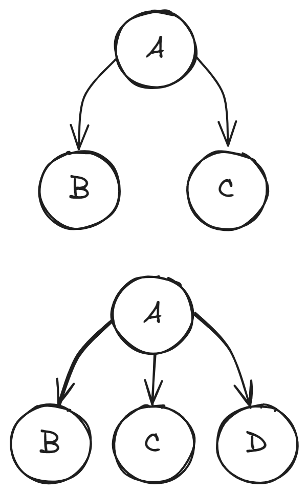
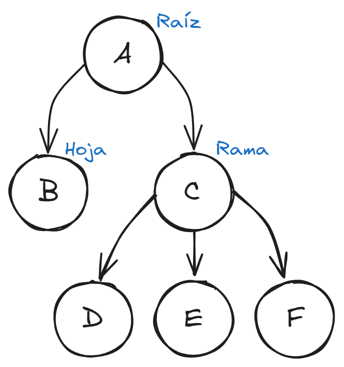

<!-- _paginate: false -->

# Unidad 4 <br> Estructuras No Lineales

## Estructuras de Datos

---

# Docente


Nombre
: MSC. Jaime Jesús Delgado Meraz

Correo
: <jesus.delgado@tecvalles.mx>
: <jaime.dm@cdvalles.tecnm.mx>

---

# Asignatura

:::: flex
::: col 1/2 px-2
Nombre
: Estructuras de Datos

Carrera
: Ingeniería Informática e Ingeniería en Sistemas Computacionales
:::
::: col 1/2
Clave
: AED - 1026

SATCA
: 2 - 3 - 5
:::
::::

---
<!-- _class: toc -->
# Contenidos

1. [Introducción](#introducción)
2. [Nodo](#nodo)
3. [Árboles](#árboles)
4. [Grafos](#grafos)

---
<!-- _class: lead -->
# Introducción

---

# Introducción

- Las estructuras de datos no lineales son aquellas en las que los elementos no están organizados de manera secuencial.
- Son más complejas que las estructuras lineales, sin embargo, esta complejidad también les permite resolver problemas más complejos y variados.
- Las estructuras no lineales también sirven para representar relaciones entre los elementos.

---
<!-- _class: lead -->
# Nodo

---

# Nodo

- Dentro de las estructuras no lineales, el nodo es el elemento básico, al igual que en las estructuras lineales.
- Sin embargo, en las estructuras no lineales, el nodo puede tener más de una relación con otro nodo, lo que permite representar relaciones más complejas.
- _P.e._ en un árbol, un nodo puede tener dos o más hijos, según el tipo de árbol.



---

# Nodo

- Por lo general, un nodo en una estructura no lineal contiene la información del elemento y las referencias a los nodos con los que tiene relación.
- Según se requiera, el nodo podrá usar referencias directas a otros nodos o incluso referencias a estructuras de datos que contienen a otros nodos.
- Al igual que en las estructuras lineales, los nodos y las respectivas estructuras, pueden ser implementados como clases mediante programación orientada a objetos, lo que facilita su uso y mantenimiento.

---
<!-- _class: lead -->
# Árboles

---

# Árboles

> Un árbol es una estructura de datos no lineal que se compone de nodos, donde cada nodo tiene un valor y una lista de referencias a otros nodos.

- Los árboles son estructuras jerárquicas, donde un nodo se considera padre de otro nodo si tiene una referencia a él.
- A su vez, los nodos hijos pueden tener sus propios hijos, formando una estructura en forma de árbol.

::: warning
⚠ Un árbol no puede tener ciclos, es decir, un nodo hijo no puede tener una referencia a un nodo padre.
:::

---

# Árboles

- Un árbol tiene un nodo raíz, que es el nodo principal del árbol 🌱.
- Los nodos que no tienen hijos se llaman hojas 🍃, mientras que aquellos que si tienen hijos se denominan ramas 🌿.
- Es posible que un árbol tenga un solo nodo, en cuyo caso, este nodo es la raíz y también es una hoja.



---

# Árboles

## Características

- La **altura** de un árbol es la longitud del camino más largo desde la raíz hasta una hoja.
- La **anchura** de un árbol es el número máximo de nodos que hay en un nivel, es decir, el número de nodos en el nivel más grande.
- La **profundidad** de un nodo es la longitud del camino desde la raíz hasta el nodo, es decir, el número de aristas que hay en el camino.
- Al número de hijos que puede tener un nodo se le llama **grado**.

---

# Árboles

## Clasificación

- Con base en el grado de los nodos, los árboles se pueden clasificar en:
  - **Árbol binario**: cada nodo tiene a lo más 2 hijos, uno izquierdo y uno derecho, si no tiene un hijo, se le asigna un valor nulo al hijo faltante.
  - **Árbol ternario**: cada nodo tiene a lo más 3 hijos, uno izquierdo, uno central y uno derecho, se puede generalizar a un árbol n-ario.
  - **Árbol n-ario**: cada nodo puede tener la cantidad de hijos que se requiera y puede tener un número variable de hijos en cada nodo.

---

# Árboles

## Clasificación: Casos especiales

- Además de la clasificación por el grado de los nodos, los árboles también se pueden clasificar por su forma (donde $n$ es el grado del árbol):
  - **Árbol raíz**: un árbol con un solo nodo.
  - **Árbol completo**: todos los nodos tienen a lo más $n$ hijos y todos los nodos hoja están en el último nivel.
  - **Árbol balanceado**: todos los nodos tienen a lo más $n$ hijos y la diferencia de altura entre los subárboles izquierdo y derecho es a lo más 1.
  - **Árbol degenerado**: todos los nodos tienen a lo más 1 hijo, es decir, es una lista enlazada.

---

# Árboles

## Operaciones

- Algunas de las operaciones más comunes que se pueden realizar con árboles son:
  - **Inserción**: agregar un nuevo nodo al árbol.
  - **Eliminación**: eliminar un nodo del árbol.
  - **Recorrido**: visitar todos los nodos de un árbol.
  - **Búsqueda**: encontrar un nodo con un valor específico.
  - **Altura**: determinar la altura del árbol.
  - **Anchura**: determinar la anchura del árbol.
- Estas operaciones pueden variar según el tipo de árbol y la implementación.

---

# Árboles

## Implementación

### Implementación de un árbol binario

:::: flex
::: col 1/2

```python
class NodoBinario:
    def __init__(self, valor):
        self.valor = valor
        self.izquierdo = None
        self.derecho = None
```

:::
::: col 1/2

```python
class ArbolBinario:
    def __init__(self):
        self.raiz = None
        self.tamanio = 0
```

:::
::::

- Aunque es posible reutilizar la clase `Nodo` de las estructuras lineales, es recomendable crear una clase específica para los nodos de un árbol, especialmente para identificar los nodos hijos.

---

# Árboles

## Aplicaciones

---
<!-- _class: lead -->
# Grafos

---

# Grafos

---

# Grafos

## Clasificación

---

# Grafos

## Operaciones

---

# Grafos

## Implementación

---

# Grafos

## Aplicaciones

---

# Conclusión

- Al igual que las estructuras lineales, las estructuras no lineales son fundamentales en la programación.
- Las estructuras no lineales son más complejas y su implementación requiere de un mayor esfuerzo, sin embargo, son necesarias para resolver problemas más complejos.
- Las estructuras no lineales son utilizadas en la vida cotidiana, por ejemplo, en la representación de redes sociales, rutas de transporte, etc.

---

<!-- _class: inverted -->


<div class="text-center text-middle font-bold font-coding text-8xl mt-10">
  &lt;/Fin&gt;
</div>
