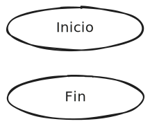
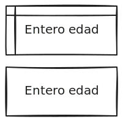
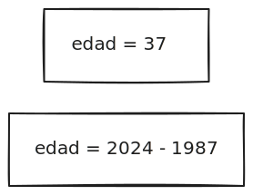
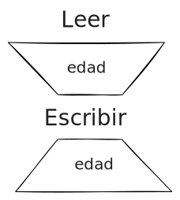
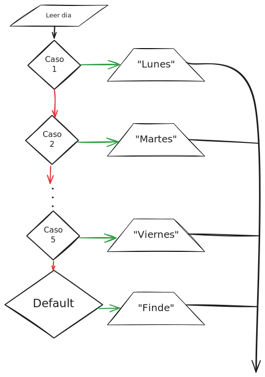
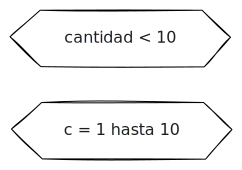
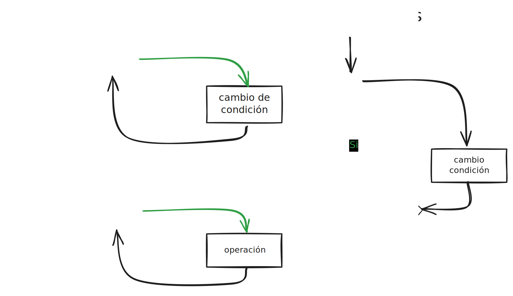
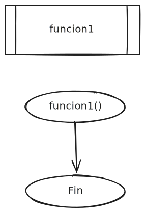
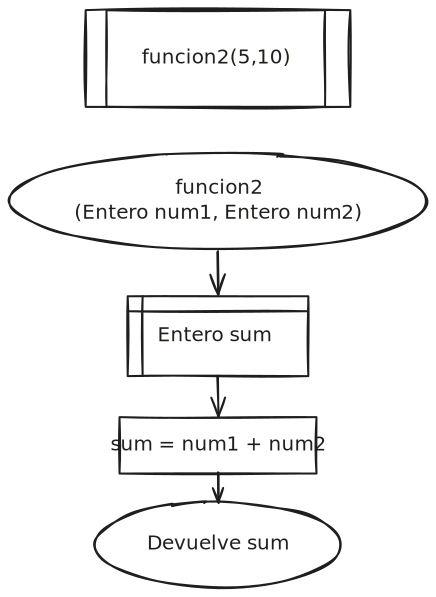

<!-- _class: centered -->
<!-- _paginate: false -->

# Unidad 1

# <!-- fit -->Diseño Algorítmico

## Fundamentos de Programación


---

# Docente


Nombre
: Dr. Jaime Jesús Delgado Meraz

Correo
: <jesus.delgado@tecvalles.mx>
: <jaime.dm@cdvalles.tecnm.mx>

---

# Asignatura

:::: flex
::: col 1/2 px-2
Nombre
: Fundamentos de Programación

Carrera
: Ingeniería en Sistemas Computacionales
: Ingeniería en Desarrollo de Aplicaciones
:::
::: col 1/2
Clave
: AED - 1285

SATCA
: 2 - 3 - 5
:::
::::

---
<!-- _class: toc -->
# Contenidos

1. [Conceptos básicos](#conceptos-básicos)
2. [Representación de algoritmos](#representación-de-algoritmos)
3. [Diseño de algoritmos](#diseño-de-algoritmos)
4. [Diseño de funciones](#diseño-de-funciones)

---

# Competencia específica de la unidad

> Comprende y aplica los conceptos básicos, nomenclatura y herramientas para el diseño de algoritmos orientado a la resolución de problemas.

---

# Introducción

- Las computadoras son sorprendentemente rápidas, pero increíblemente tontas, ya que pueden hacer cualquier cosa que se les indique, pero _exclusivamente_ eso.
- Para un ser humano una instrucción como "Lava los platos 🧼🍽" no requiere mayor explicación para ser desarrollada.
- Por otro lado, una computadora no puede tomar decisiones sobre una instrucción tan vaga, se le debe indicar exactamente que hacer para cada tipo de plato, vaso o utensilio.

---

# Introducción

- Es claro que los seres humanos somos buenos para ciertas tareas que las computadoras realizan pobremente, esto es debido a que los humanos somos buenos para extraer información de "ruido".
- Es decir, podemos entender instrucciones vagas y tomar decisiones basadas en información incompleta o ambigua.
- Sin embargo, una vez que las instrucciones son claras, las computadoras pueden realizarlas aprovechando todo el poder computacional disponible.
- En la idea anterior es que reside la importancia de la **programación**.

---

<!-- _class: lead -->
# Conceptos básicos

---

# Conceptos básicos

- Para poder entender la programación es necesario conocer algunos conceptos básicos:
  - Algoritmo
  - Lenguaje de programación
  - Programa
  - Compilador e intérprete
  - IDE (Entorno de Desarrollo Integrado)

---

# Conceptos básicos

## Algoritmo

> Conjunto finito de instrucciones que se ejecutan en un orden determinado y para determinada situación inicial resuelve un problema en un tiempo finito.

- Cormen, Leiserson, Rivest y Stein (2009) definen un algoritmo como **un procedimiento computacional que toma un valor o conjunto de valores como entrada y produce un valor o conjunto de valores como salida**.
- [Donald Knuth](https://es.wikipedia.org/wiki/Donald_Knuth) (_The Art of Computer Programming_) plantea una definición más simple, diciendo que un algoritmo es **una secuencia finita de pasos que resuelve un problema**.

---

# Conceptos básicos

## Algoritmo

De las definiciones anteriores, se puede establecer que un algoritmo debe ser:

- Claro, debe ser fácil de entender.
- Preciso, cada paso debe ser claramente definido.
- Finito, debe tener un número finito de pasos.
- Efectivo, debe resolver el problema para el que fue diseñado.

Además, un algoritmo debe ser:

- Implementable en un lenguaje de programación
- Independiente de donde se implemente <note>*</note>

<!--
La independencia de un algoritmo dependerá del contexto, ya que si bien, corresponde más a la implementación en un determinado lenguaje de programación, que al algoritmo mismo, la indepedencia de este último, estará dada por las estructuras y estrategias aplicadas según el lenguaje, sistema operativo y/o recursos técnicos y tecnológicos disponibles.

Es decir, un algoritmo puede ser independiente de la plataforma, pero no de la implementación.
-->

---

# Conceptos básicos

## Lenguaje de programación

> Conjunto de reglas sintácticas y semánticas usadas para escribir programas que pueden ser ejecutados por una computadora.

- Un lenguaje de programación es un conjunto de reglas que permiten a un programador escribir instrucciones que una computadora puede entender.
- De manera similar a los lenguajes humanos, cada lenguaje de programación tiene su propia sintaxis, estructura, vocabulario, abreviaturas y reglas gramaticales.

---

# Conceptos básicos

## Lenguaje de programación

La descripción de un lenguaje de programación se divide principalmente en 2 componentes.

:::: flex
::: col 1/2
Sintaxis (_Forma_)
: Es la forma en que se escriben las instrucciones en un lenguaje de programación.
: Describe los símbolos y las combinaciones de los mismos, que forman un programa sintácticamente correcto.
:::

::: col 1/2
Semántica (_Significado_)
: Es el significado de las instrucciones escritas en un lenguaje de programación.
: Provee las reglas para interpretar la sintaxis, limitando las posibles interpretaciones de lo que esta declarado.
:::
::::
  
---

# Lenguaje de programación

## Ranking

| Posición 2024 | Posición 2023 | Delta | Lenguaje| Rating (%) | Delta (%) |
|:---:|:---:|:---:|:---|:---:|:---:|
| 1 | 1 | |  Python | 16.12 | +2.70 |
| 2 | 3 | <true>&uarr;</true>|  C++ | 10.34 | -0.46 |
| 3 | 2 | <false>&darr;</false>|  C | 9.48 | -2.08 |
| 4 | 4 | |  Java| 8.59 | -1.91 |
| 5 | 5 | |  C# | 6.72 | -0.15 |

Tomado del [Índice TIOBE](https://www.tiobe.com/tiobe-index/) (Julio, 2024).

---

# Conceptos básicos

## Programa

> Conjunto de instrucciones que se ejecutan en una computadora para realizar una tarea específica.

- Las instrucciones que componen un programa son escritas en un lenguaje de programación y son interpretadas por un compilador o un intérprete.
- Un programa puede ser tan simple como una calculadora básica o tan complejo como un sistema operativo.
- De igual manera, un programa puede componerse por un sólo algoritmo o incluso ser un conjunto de algoritmos que resuelven un problema específico.

---

# Conceptos básicos

## Programa

Un programa suele tener dos formas:

- El **código fuente** es la forma amigable para la lectura por humanos, de donde los programas ejecutables se derivan y permite que el programador los estudie y desarrolle sus propios algoritmos 👨🏻‍💻, esta escrito en un lenguaje de programación.
- El **ejecutable** o _binario_ es la forma en que la computadora puede usar un programa para entender y ejecutar las instrucciones 🤖, puede ser código binario o un lenguaje intermedio conocido como _bytecode_.

---

# Conceptos básicos

## Compilador e Intérprete

- El código fuente es la forma legible de un programa, el cual puede convertirse en una imagen ejecutable mediante un **compilador** o ejecutado inmediatamente con la ayuda de un  **intérprete**.
- Los compiladores se usan para traducir código fuente de un lenguaje de programación a lo que se conoce conmúnmente como ejecutables y/o binarios.
- Los compiladores son más rápidos que los intérpretes, ya que traducen el código fuente a un lenguaje de máquina antes de ejecutarlo, lo que permite que el programa se ejecute más rápido.

---

# Conceptos básicos

## Compilador e Intérprete

- Los intérpretes se usan para obtener una ejecución inmediata del código fuente y permitir su edición y reinterpretación.
- El interpretado de código es más lento que ejecutar la versión compilada debido a que el intérprete debe decodificar cada instrucción una a la vez, sin embargo, el desarrollo de software se hace más rápido usando un intérprete, ya que no es necesario compilar el código cada vez que se realiza un cambio.
- Si bien, los compiladores e intérpretes son herramientas diferentes, es común encontrar lenguajes de programación que usan ambos métodos.

---

# Conceptos básicos

## Compilador e Intérprete

- Además de la traducción de código fuente a ejecutable, los compiladores e intérpretes también realizan tareas como:
  - Verificar la sintaxis y semántica del código.
  - Optimizar el código para mejorar su rendimiento.
- En algunos casos, un compilador puede ser un intérprete y viceversa, esto es conocido como **compilación Just-In-Time (JIT)**, donde el código fuente es compilado a un lenguaje intermedio que es interpretado por una máquina virtual.

---

# Conceptos básicos

## IDE (Entorno de Desarrollo Integrado)

> Conjunto de herramientas que facilitan la creación, edición, compilación y depuración de programas.

- Un IDE (_Integrated Development Environment_) es un software que combina varias herramientas de desarrollo en un solo paquete, permitiendo a los programadores escribir, compilar, depurar y ejecutar programas en un solo lugar.
- Suelen incluir un editor de texto, un compilador, un depurador, un navegador de archivos y un emulador de terminal.

---

# Conceptos básicos

## IDE (Entorno de Desarrollo Integrado)

Algunos IDEs populares son:

- Visual Studio Code (VSCode)
- IntelliJ IDEA
- Eclipse
- NetBeans
- PyCharm
- Xcode
- Android Studio

---

# Resolución de problemas

- Además de los conceptos básicos revisados, también es importante comprender como se resuelven los problemas mediante la programación.
- Un programa se escribe en un lenguaje de programación y a la actividad de expresar un algoritmo en forma de programa se le denomina **programación**.
- La programación es una actividad creativa que requiere de habilidades de resolución de problemas y pensamiento lógico.

---

# Resolución de problemas

- La resolución de problemas mediante programación requiere al menos de los siguientes pasos:
  1. Definición del problema
  2. Diseño del algoritmo
  3. Transformación del algoritmo en un programa
  4. Ejecución y validación del programa

---

# Resolución de problemas

## Definición del problema

- El propósito de definir el problema es permitir al programador llegar a una cierta comprensión de la naturaleza del mismo.
- El problema debe estar bien definido si se quiere llegar a una solución satisfactoria.
- Para poder definir con precisión el problema se requiere que las especificaciones de entrada y salida sean descritas en detalle.
- La correcta definición de estos requisitos, permitirá llegar a una solución eficaz.

---

# Resolución de problemas

## Diseño del algoritmo

- Problemas complejos necesitan con frecuencia diferentes niveles de refinamiento antes de que se pueda obtener un algoritmo claro, preciso y completo.
- Lo recomendable es dividir del problema original en subproblemas más simples y a continuación dividir estos subproblemas en otros mas simples (_Divide & Conquer_).
- Debe existir una secuencia definida de pasos en la solución propuesta, que permita obtener un resultado coherente.

---

# Resolución de problemas

## Transformación del algoritmo

- La fase de conversión del algoritmo en un lenguaje específico de
  programación se denomina **codificación**, y el algoritmo resultante se denomina **código fuente**.
- Durante la _transformación_ del algoritmo, se debe considerar la sintaxis y semántica del lenguaje de programación, así como las reglas de estilo y buenas prácticas.
- Así mismo, se debe considerar la eficiencia del algoritmo, ya que un algoritmo eficiente es aquel que resuelve el problema en el menor tiempo posible y con los recursos mínimos necesarios.

---

# Resolución de problemas

## Ejecución y validación del programa

- Una vez obtenido el código fuente, la etapa de ejecución y validación del algoritmo suelen estar inmersas en el proceso de transformación.
- Si el algoritmo fue diseñado correctamente, sólo resta probar con los datos de entrada, de lo contrario, se deben realizar las modificaciones pertinentes hasta obtener el resultado esperado.
- La etapa de validación es crucial para garantizar que el programa cumple con los requisitos del problema y que se comporta de manera esperada.

---

<!-- _class: lead -->
# Representación de algoritmos

---

# Representación de algoritmos

- Para poder representar un algoritmo de manera clara y precisa, es necesario utilizar un método que permita describir los pasos a seguir para resolver un problema.
- Se debe utilizar algún método que permita independizar el algoritmo del lenguaje de programación elegido.
- La representación de algoritmos es una tarea fundamental en la programación, ya que permite a los programadores entender y comunicar de manera efectiva la solución a un problema.

---

# Representación de algoritmos

- Los métodos más usuales son:
  - Fórmulas
  - Pseudocódigo
  - Diagramas _Nassi-Schneiderman_
  - Diagramas de Flujo
  - Diagramas de Bloques

::: info
ℹ Para motivos de la asignatura, se utilizará principalmente el **pseudocódigo** y los **diagramas de flujo**.
:::

---
<!-- _class: primary centered -->
> _En igualdad de condiciones, la solución más simple suele ser la más probable_
> <cite>William of Ockham</cite>

<!-- También conocido como el Principio de parsimonia -->

---

# Planteamiento de la solución

- Es muy importante, que antes de empezar a teclear una "solución" en la computadora, se dedique el tiempo de plantear correctamente la solución al problema dado.
- Existen infinitas soluciones para cada uno de los problemas que puedan plantearse, pero siempre debemos encontrar la solución más adecuada, que sea la más práctica y fácil de implementar.
- Siempre es importante considerar el principio de la simplicidad, también conocido como la _Navaja de Ockham_.

---

# Planteamiento de la solución

## Una anécdota

- Se comenta que durante la carrera espacial 🚀 entre Estados Unidos  y Rusia, la NASA invirtió millones de dolares en la investigación y desarrollo de un bolígrafo 🖊️ que fuera capaz de escribir boca arriba en gravedad cero 👨‍🚀 y en condiciones extremas de temperatura 🔥
- Por su parte... Rusia utilizó lápices ✏️

---

<!-- _class: primary centered -->
# Pseudocódigo

---

# Pseudocódigo

- El pseudocódigo es un lenguaje de especificación (descripción) de algoritmos, que permite pasar relativamente fácil hacia la codificación final.
- Funciona como un borrador del algoritmo, que posteriormente se traduce al lenguaje de programación que se requiera.
- La ventaja del pseudocódigo reside en la planificación de un programa, ya que el desarrollador se puede concentrar en la lógica y en las estructuras de control, sin preocuparse por las reglas de un lenguaje específico.
- Una ventaja adicional del pseudocódigo es que permite tanto la modificación rápida de operaciones, como la corrección de errores.

---

# Pseudocódigo

El pseudocódigo utiliza estructuras y sintaxis comunes, que estan disponibles igualmente están disponibles en la mayoría de los lenguajes de programación.

:::: flex
::: col 1/2

- Variables y constantes
- Declaración y asignación
- Operadores
- Entrada y salida
:::
::: col 1/2
- Instrucciones de control
- Instrucciones de repetición
- Funciones
:::
::::

::: info
ℹ Una alternativa al pseudocódigo, son los lenguajes "regionalizados" como **Latino** (<https://www.lenguajelatino.org/>).
:::

---

# Pseudocódigo

## Variables y constantes

> Una variable es un espacio de memoria que se utiliza para almacenar un valor. 🧠

- Se utilizan para almacenar valores que se utilizan en un programa, como números, texto, etc. y su valor esta determinado por el tipo de variable.
- Las variables se pueden utilizar para realizar operaciones, generalmente aritméticas, a través del uso de **operadores**.
- Pesé a su nombre, si se requiere, una variable puede definirse como constante, para evitar que su valor cambie durante la ejecución del programa.

---

# Pseudocódigo

## Variables y constantes

:::: flex
::: col 1/2
Variables
: Son objetos de programación en los que su contenido puede variar durante el proceso de ejecución del algoritmo, tienen un nombre y un tipo.
:::
::: col 1/2
Constantes
: Son objetos de programación que permanecen sin cambios durante todo el desarrollo del algoritmo, en esencia son **variables** que no cambian.
:::
::::

::: warning
⚠️ Variables y constantes deben ser declaradas antes de ser utilizadas, así mismo, los nombres de las constantes suelen ser en **mayúsculas**.
:::

---

# Pseudocódigo

## Variables y constantes

- En pseudocódigo la definición de variables suele seguir la siguiente forma:

```python
VAR nombre = valor : tipo de dato
CONST NOMBRE = valor : tipo de dato # Para las constantes
```

- Dependiendo del lenguaje de programación pueden existir diferentes tipos de variables y puede ser requerido o no, el especificar el tipo de variable al definirla, ya que algunos lenguajes _inferirán_ el tipo de variable.
- Si bien las variables se pueden declarar en cualquier punto del programa, es una buena práctica el hacerlo al inicio del mismo.

---

# Pseudocódigo

## Variables y constantes

### Tipos de datos

| Tipo | Descripción | Python | Java | Pseudocódigo |
| :--- | :--- | :--- | :--- | :--- |
| Entero | Número entero (2024 / -42 ) | ```int``` | ```int``` | `entero` |
| Real | Número real (3.14159)| ```float``` | ```float``` | `decimal` |
| Texto | Cadena de caracteres (```"Hola"```) | ```str``` | ```String``` | `texto` |
| Booleano | Valor lógico (<true>True</true> / <False>False</False>) | ```bool``` | ```boolean``` | `booleano` |
| Caracter | Caracter (`'A'`) | ```char``` | ```char``` | `caracter` |

---

# Pseudocódigo

## Variables y constantes

### Nomenclatura

- Algo muy recomendable a la hora de programar es nombrar a las variables (y constantes) con un nombre significativo que manifieste su contenido, para mejorar su legibilidad.
  - _P.e._ si se quiere almacenar un día del mes, esa variable se podría llamarse `dia` o si se quisiera almacenar el total de la suma de varios productos, se podría usar `precio_final`.
- Es recomendable no usar espacios en blanco en los nombres de las variables o constantes, de la misma manera, se sugiere no utilizar acentos ni caracteres especiales, exceptuando el guión bajo.

---

# Pseudocódigo

## Variables y constantes

### Nomenclatura

Existen diversas convenciones para nombrar las variables:

- 🅿️ **Pascal case**, todas las palabras inician con mayúsculas, unidas sin espacios: `PrecioFinal`
- 🐫 **Camel case**, inicia en minúscula, las palabras se unen usando mayúsculas sin espacios a partir de la 2a palabra: `precioFinal`
- 🐍 **Snake case**, todas las palabras en minúscula, unidas por guión bajo: `precio_final`
- 🍡 **Kebab case**, todas las palabras en minúscula, unidas por guión medio: `precio-final`

---

# Pseudocódigo

## Variables y constantes

### Nomenclatura

Si bien cada desarrollador puede elegir la convención que más le agrade, es importante recordar que en algunos casos, la convención de nombres, dependerá del lenguaje de programación.

_P.e. Java..._

- Los nombres de clase deben estar en **Pascal case**.
- Los nombres de variables deben estar en **Camel case**.
- Los nombres de constantes deben estar en **Snake case** en mayúsculas, conocido como _Screaming Snake case_.

---

# Pseudocódigo

## Declaración y asignación

- En el pseudocódigo, la asignación de valores a variables se realiza mediante el operador de asignación `=` y se puede realizar en la misma línea de la declaración o en líneas separadas.

```python
VAR edad = 37 : entero # Podría omitirse el tipo de dato
VAR peso : decimal
peso = 70.5
```

- La asignación de valores a variables se puede realizar de manera directa o a través de operaciones aritméticas, lógicas o de comparación.

---

# Pseudocódigo

## Declaración y asignación

:::: flex
::: col 1/2 px-2

### Java

```java
int edad = 37;
float peso = 70.5;
String nombre = "Jaime";
const float PI = 3.14159;
```

:::
::: col 1/2

### Python

```python
edad = 37
peso = 70.5
nombre = "Jaime"
PI = 3.14159
```

:::
::::

- Dependiendo del lenguaje de programación, la asignación de valores a variables puede variar, requiriendo especificar el tipo de dato o no.
- Estos ejemplos muestran, la diferencia entre un lenguaje de tipado fijo y uno de tipado dinámico.

---

<!-- _class: inverted -->
# _Duck typing_ 🦆

> "Si camina como un pato y suena como un pato, entonces debe ser un pato."

- Cuando se dice que un lenguaje de programación _infiere_ el tipo de una variable es porque se aplica un estilo de tipado conocido como [_duck typing_](https://es.wikipedia.org/wiki/Duck_typing).
- En palabras más simples, si se puede sumar, restar, multiplicar o dividir, entonces es un número, si se puede concatenar, entonces es una cadena de caracteres, etc.
- Haciendo alusión a un contexto más coloquial, _si huele a pollo, sabe a pollo, entonces es de pollo_ 🐥

---

# Pseudocódigo

## Variables especiales

- Existen ciertas variables **especiales** que se usan para ciertas funciones, estas variables pueden ser:
  - Contadores
  - Acumuladores
  - Interruptores (_Switches_)

---

# Pseudocódigo

## Variables especiales

### Contadores

- Se utilizan para contar cualquier suceso dentro de un algoritmo y se realizan en dos instrucciones:
  1. **Inicialización**, se suele inicializar en `0` si realiza una cuenta natural o desde un valor inicial, si queremos realizar otro tipo de cuenta.
  2. **Incremento**, se aumenta el valor de la variable en `1` si es una cuenta
  natural o con otro valor, si se desea realizar otro tipo de cuenta.

```python
VAR contador : entero
contador = 0
contador = contador + 1 # 1
contador++ # 2
# contador++ es equivalente a contador = contador + 1
```

---

# Pseudocódigo

## Variables especiales

### Acumuladores

- Se utilizan para acumular resultados parciales de cálculos y se realizan en dos instrucciones:
  1. **Inicialización**, se inicia con un valor neutro según el tipo de operación que se realiza, si es una suma se inicializará en `0` y si es un
  producto se inicializará en `1`.
  2. **Acumulación**, se realiza la acumulación según el tipo de operación.

```python
VAR acumulador: entero
acumulador = 0
acumulador = acumulador + 4 # acumulador += 4
acumulador = acumulador * 5 # acumulador *= 5
```

---

# Pseudocódigo

## Variables especiales

### Interruptores

- Se utilizan para transmitir información de un punto a otro dentro del algoritmo, suelen combinarse con los ciclos y las estructuras de control.
- Solo deben tomar dos valores según su tipo:
  - **Numéricos** puede ser `0` y `1`.
  - **Lógicos** pueder ser <true>true</true> o <false>false</false>.

```python
VAR interruptor: booleano
interruptor = false
# Suceso que cambia el estado del interruptor
interruptor = true
```

::: info
ℹ También se les conoce como _banderas_ o _flags_.
:::

---

# Pseudocódigo

## Operadores

> Un operador es un símbolo que representa una operación que se realiza sobre uno o más valores.

- En general, es posible distinguir entre los siguientes tipos de operadores:
  - Operadores aritméticos
  - Operadores lógicos
  - Operadores de comparación

---

# Pseudocódigo

## Operadores aritméticos

:::: flex
::: col 1/2 px-2

- Este tipo de operadores se utilizan para realizar operaciones aritméticas básicas sobre valores numéricos, tal cual en las matemáticas.

:::
::: col 1/2 px-2

|Operador|Significado|Ejemplo|
|:---:|---|:---:|
|+  |Suma | 3 + 2 = 5|
|-  |Resta| 3 - 2 = 1|
|*  |Multiplicación| 3 * 2 = 6|
|/  |División | 3 / 2 = 1.5|
|%  |Módulo   | 3 % 2 = 1|
|** |Potencia | 3 ** 2 = 9|

:::
::::

::: ok
✅ El uso de paréntesis aplica de la misma manera que en las matemáticas.
:::

---

# Pseudocódigo

## Operadores aritméticos

### Ejemplo

```python
VAR a = 10 : entero
VAR b = 3 : entero
VAR c, d, e, f, g, h : entero
c = a + b
d = a - b
e = a * b
f = a / b
g = a % b
h = a ** b
```

- Si se requieren operaciones más complejas, es posible utilizar funciones matemáticas, como las que se encuentran en la librería ```math``` de la mayoría de los lenguajes de programación.

---

# Pseudocódigo

## Operadores aritméticos

### Ejercicio

:::: flex
::: col 1/2 px-2

```python
VAR a = 5 : entero
VAR b = 7 : entero
VAR c = 2 : entero
a = a + b + c
b = c / 2
a = a / b + a * c
c = a + (b - c) - b
```

:::
::: col 1/2 px-2

- ¿Qué valor tiene `a` al finalizar la línea 4?
- ¿Qué valor tiene `b` al finalizar la línea 5?
- ¿Qué valor tiene `a` al finalizar la línea 6?
- ¿Qué valor tiene `c` al finalizar la línea 7?
:::
::::

---

# Pseudocódigo

## Operadores lógicos

- Los operadores lógicos se utilizan para realizar operaciones lógicas entre valores booleanos, las cuales pueden ser conjunción, disyunción o negación y su resultado es un valor booleano.

|Operador| Símbolo | Significado| Ejemplo |
|:---:|:---:|---|:---:|
|``and``| `&&` |Conjunción| ``True and False = False``|
|``or`` | `\|\|` |Disyunción| ``True or False = True``|
|``not``| `!` |Negación   | ``not True = False``|

- En algunos lenguajes de programación, los operadores lógicos se representan con palabras en lugar de símbolos.

---

# Pseudocódigo

## Operadores lógicos

### Ejemplo

```python
VAR a = True : booleano
VAR b = False : booleano
VAR c, d, e : booleano

c = a and b # ALT: a && b
d = a or b  # ALT: a || b
e = not a   # ALT: !a
```

---

# Pseudocódigo

## Operadores de comparación

:::: flex
::: col 1/2 px-2

- Como su nombre lo indica, los operadores de comparación se utilizan para comparar dos valores y su resultado es un valor booleano.

:::
::: col 1/2 px-2

|Operador|Significado|
|:---:|---|
|``==``|Igualdad|
|``!=``|Desigualdad|
|``>``|Mayor que|
|``<``|Menor que|
|``>=``|Mayor o igual que|
|``<=``|Menor o igual que|

:::
::::

---

# Pseudocódigo

## Operadores de comparación

### Ejemplo

```python
VAR a = 10 : entero
VAR b = 3 : entero
VAR c, d, e, f, g, h : entero
c = a == b
d = a != b
e = a > b
f = a < b
g = a >= b
h = a <= b
```

- Los operadores de comparación se suelen usar en estructuras de control para evaluar condiciones y decidir si se ejecuta o no un bloque de instrucciones.

---

# Pseudocódigo

## Operadores de comparación

### Tabla de Verdad

- Para comprender mejor el funcionamiento de los operadores lógicos y de comparación, se puede utilizar una tabla de verdad, la cual muestra el resultado de aplicar un operador lógico a dos valores booleanos.

|a  |b  | a AND b | a OR b |NOT (a)|
|:---:|:---:|:---:|:---:|:---:|
|<true>true</true>  |<true>true</true>  |<true>true</true>  |<true>true</true>  |<false>false</false>  |
|<true>true</true>  |<false>false</false>  |<false>false</false>  |<true>true</true>  |<false>false</false>  |
|<false>false</false>  |<true>true</true>  |<false>false</false>  |<true>true</true>  |<true>true</true>  |
|<false>false</false>  |<false>false</false>  |<false>false</false>  |<false>false</false>  |<true>true</true>  |

---

# Pseudocódigo

## Entrada y salida

- La entrada y salida de datos es una parte fundamental de cualquier programa, ya que permite interactuar con el usuario y obtener los datos necesarios para resolver un problema.
- La entrada de datos se suele realizar a través de un teclado ⌨, mientras que la salida a la consola o pantalla.
- En algunos casos más complejos, la entrada y salida de datos se realiza a través de archivos.

---

# Pseudocódigo

## Entrada y salida

- Las instrucciones para entrada y salida de datos se suelen representar de la siguiente manera:

```python
# 'variable' debe haber sido declarada previamente
LEER variable
ESCRIBIR variable
```

- Es una buena práctica el indicar con un mensaje descriptivo, el dato que se espera al momeno de leer:

```python
VAR nombre : texto
ESCRIBIR "¿Cómo te llamas?"
LEER nombre
ESCRIBIR "Hola", nombre
```

---

# Pseudocódigo

## Entrada y salida

### Entrada avanzada

- Cuando se requiere leer datos de un tipo específico, se realiza un **casting** para convertir el valor leído al tipo de dato que se requiere.
- Para esos casos, la sintaxis del operador ``LEER`` cambia ligeramente:

```python
LEER variable : tipo de dato
```

```python
VAR edad : entero
ESCRIBIR "¿Cuántos años tienes?"
LEER edad : entero
ESCRIBIR "El doble de tu edad es", (edad * 2)
```

- Sino se hiciera el casting a entero, la operación `edad * 2` generaría un error.

---

# Pseudocódigo

## Entrada y salida

### Salida avanzada

- Cuando se requiere ESCRIBIR un mensaje con un formato específico, es necesario especificar el formato de salida, utilizando algunos símbolos denominados **formateadores**.

```python
ESCRIBIR "Tu edad es {} años.", edad
ESCRIBIR "Tu peso es: {:.2f}", peso
```

- También se pueden formatear números enteros con una cierta estructura, separadores de miles, etc.

```python
ESCRIBIR "El folio es: {:0000d}", 123 # 0123
ESCRIBIR "El saldo es: ${:,.2f}", 1234567.89 # $1,234,567.89
```

---

# Pseudocódigo

## Instrucciones de control

> Las estructuras de control son instrucciones que permiten modificar el flujo de ejecución de un programa.

- Estas instrucciones permiten decidir si se ejecuta o no un bloque de instrucciones, también se les conoce como condicionales.
- Se usan para que los programas "tomen decisiones" y realicen diferentes acciones dependiendo de las condiciones que se cumplan.
- Se suelen combinar con los operadores lógicos y de comparación para evaluar condiciones y decidir si se ejecuta o no un bloque de instrucciones.

---

# Pseudocódigo

## Instrucciones de control

- Este tipo de instrucciones se basan en condiciones, las cuales son expresiones lógicas que devuelven <true>true</true> o <false>false</false>, combinando los operadores lógicos y de comparación.
- Se pueden clasificar según su estructura en:
  - Condicional simple
  - Condicional doble
  - Condicional múltiple
  - Condicional por casos

---

# Pseudocódigo

## Instrucciones de control

### Condicional simple

- Si la condición específicada se cumple, ejecuta el código dentro del bloque.

:::: flex
::: col 1/3 px-2

```python
SI condición:
  Instrucciones
FIN-SI
```

:::
::: col 2/3 px-2

```python
INICIO
  VAR numero : entero
  LEER numero : entero
  SI numero < 10:
    ESCRIBIR "{} es menor que 10", numero
  FIN-SI
FIN
```

:::
::::

---

# Pseudocódigo

## Instrucciones de control

### Condicional doble

- Si la condición es verdadera se ejecuta el bloque de instrucciones que contenga, de lo contrario se ejecuta el segundo bloque.

:::: flex
::: col 1/3 px-2

```python
SI condición:
  Instrucciones
SINO:
  Instrucciones
FIN-SI
```

:::
::: col 2/3 px-2

```python
INICIO
  VAR numero : entero
  LEER numero : entero
  SI numero < 10: 
    ESCRIBIR "{} es menor que 10", numero
  SINO:
    ESCRIBIR "{} es mayor o igual que 10", numero
  FIN-SI
FIN
```

:::
::::

---

# Pseudocódigo

## Instrucciones de control

### Condicional múltiple

- Si se requiere, es posible construir condicionales con más de una condición _combinando_ 🧬, _encadenando_ 🔗 o _anidando_ 🐣 varios bloques.
- Para **combinar** condiciones se utilizan los operadores lógicos `and` y `or`.

```python
SI edad <= 18 and gusta_anime == True:
  ESCRIBIR "Chibi Otaku"
SINO:
  ESCRIBIR "Adulto Otaku"
FIN-SI
```

---

# Pseudocódigo

## Instrucciones de control

### Condicional múltiple

- Para **encadenar** condicionales, se deben combinar condicionales simples y dobles.

```python
SI edad < 18:
  ESCRIBIR "Eres menor de edad."
SINO SI edad == 18:
  ESCRIBIR "Bienvenido al mundo adulto 😄!"
SINO:
  ESCRIBIR "Eres mayor de edad."
FIN-SI
```

---

# Pseudocódigo

## Instrucciones de control

### Condicional múltiple

- En algunas situaciones es posible que se requiera que se cumpla una condición, antes de revisar otras condiciones, en estos casos, lo que se suele hacer es anidar estructuras `SI`, para especificar más de una condición.

```python
SI es_vegetariano == True:
  SI con_picante == True:
    ESCRIBIR "Tu pizza será de champiñones con pimiento"
  SINO:
    ESCRIBIR "Tu pizza será de champiñones con piña"
  FIN-SI
SINO:
  ESCRIBIR "Tu pizza será de carnes frías"
FIN-SI
```

---

# Pseudocódigo

## Instrucciones de control

### Condicional por casos

- Existe otra instrucción de control condicional, denominada `SEGUN`, donde de acuerdo con el valor de una variable, se hace una operación u otra.
- Para esta condicional no se utilizan expresiones lógicas sino "casos".

:::: flex
::: col 1/2 px-2

```python
SEGUN valor:
  CASO valor1:
    Instrucciones
    ALTO
  CASO valor2:
    Instrucciones
    ALTO
    ...
  DEFAULT:
    Instrucciones
FIN-SEGUN
```

:::
::: col 1/2 px-2

```python
SEGUN valor:
  CASO valor1: Instrucción
  CASO valor2: Instrucción
    ...
  DEFAULT: Instrucción
FIN-SEGUN
```

- En los casos simples se puede omitir la instrucción `ALTO`.

:::
::::

---

# Pseudocódigo

## Instrucciones de control

### Condicional por casos

:::: flex
::: col 1/2 px-2

```python
INICIO
  VAR mes : entero
  LEER mes
  SEGUN mes:
    CASO 1: ESCRIBIR "Enero"
    CASO 2: ESCRIBIR "Febrero"
    CASO 3: ESCRIBIR "Marzo"
    CASO 4: ESCRIBIR "Abril"
    CASO 5: ESCRIBIR "Mayo"
    ...
    CASO 11: ESCRIBIR "Noviembre"
    CASO 12: ESCRIBIR "Diciembre"
  FIN-SEGUN
FIN
```

:::
::: col 1/2 px-2

```python
INICIO
  VAR dia : entero
  LEER dia
  SEGUN dia:
    CASO 1: ESCRIBIR "Lunes"
    CASO 2: ESCRIBIR "Martes"
    CASO 3: ESCRIBIR "Miércoles"
    CASO 4: ESCRIBIR "Jueves"
    CASO 5: ESCRIBIR "Viernes"
    DEFAULT:
      ESCRIBIR "Fin de semana 🎉"
  FIN-SEGUN
FIN
```

:::
::::

---

# Pseudocódigo

## Instrucciones de repetición

> Son instrucciones que permiten repetir un bloque de instrucciones un número determinado de veces.

- Son muy útiles para realizar cálculos repetitivos, como sumas, multiplicaciones, etc.
- Se pueden combinar con estructuras de control para realizar cálculos más complejos, así como con variables para almacenar los resultados de los cálculos.
- Se conocen también como _bucles_ o _ciclos_.

---

# Pseudocódigo

## Instrucciones de repetición

- El número de veces se determina mediante una condición, si la condición es verdadera se ejecuta el bloque de código que contenga, cuando la condición sea falsa saldrá del bucle 🔁.
- Estas estructuras pueden ser del tipo:
  - Mientras
  - Hacer-mientras
  - Desde-hasta
  - Cada

---

# Pseudocódigo

## Instrucciones de repetición

### Estructura "Mientras"

- Se evalúa la condición antes de iniciar y se repiten las instrucciones mientras siga siendo cierta.
- Es importante que la variable que participa en la condición se modifique dentro del bucle, ya que de lo contrario se genera un bucle infinito.
- Su sintaxis es:

```python
MIENTRAS condición:
  Instrucciones
  Instrucción que modifica la condición # ❗ Importante
  Instrucciones adicionales
FIN-MIENTRAS
```

---

# Pseudocódigo

## Instrucciones de repetición

### Estructura "Mientras"

- En este caso se usa una variable `contador` que se irá incrementando dentro del bucle.

```python
INICIO
  VAR contador = 0 # Puede omitirse el tipo de dato
  MIENTRAS contador < 3:
    ESCRIBIR contador
    contador++ # contador = contador + 1
  FIN-MIENTRAS
FIN
```

- Como resultado se imprimen los números del 0 al 2, ya que al cumplirse la condición `3 < 3` el resultado es <false>false</false> y termina el bucle.

---

# Pseudocódigo

## Instrucciones de repetición

### Estructura "Hacer-Mientras"

- Es similar a la estructura `Mientras`, con la diferencia de realizar las instrucciones al menos una vez y luego evalúa la condición antes de continuar con el bucle.
- Al igual que con `MIENTRAS` se deben evitar los bucles infinitos.
- Su sintaxis es:

```python
HACER:
  Instrucciones
  Instrucción que modifica la condición # ❗ Importante
MIENTRAS condición
```

---

# Pseudocódigo

## Instrucciones de repetición

### Estructura "Hacer-Mientras"

- En este caso se usa una variable `contador` que se irá incrementando dentro del bucle.

```python
INICIO
  VAR contador : entero
  contador = 3
  HACER:
    ESCRIBIR contador
    contador++ # contador = contador + 1
  MIENTRAS contador < 3
FIN
```

- Se imprime en pantalla el 3, enseguida sale del bucle dado que `4 < 3` es <false>false</false>.

---

# Pseudocódigo

## Instrucciones de repetición

### Estructura "Desde-Hasta"

- En esta estructura se repiten las instrucciones desde una variable de control (`c`) a la que le damos un valor inicial (`i`) hasta un valor final (`f`) que se indique, incrementándose en un valor constante.
- Su sintaxis es:

```python
DESDE c=i HASTA f, 1:
  Instrucciones
FIN-DESDE
```

- El funcionamiento de esta estructura se basa en la expresión `c <= f`, incluyendo el valor final, si la constante es negativa, la condición cambia a `c >= f`.

---

# Pseudocódigo

## Instrucciones de repetición

### Estructura "Desde-Hasta"

```python
INICIO
  VAR c : entero
  DESDE c=1 HASTA 5, 1:
    ESCRIBIR c
  FIN-DESDE
FIN
```

- La diferencia con la estructura `Mientras`, es que en el caso de `Mientras` se necesita inicializar la variable fuera del bucle y aumentarla dentro del bucle.
- En la estructura `Desde-Hasta`, la inicialización y el incremento se hace en una línea.

---

# Pseudocódigo

## Instrucciones de repetición

### Estructura "Cada"

- Los lenguajes de programación modernos soportan una estructura de repetición adicional denominada `Cada`.
- Su sintaxis es:

```python
CADA sub_variable EN variable_agrupada:
  Instrucciones
FIN-CADA
```

- Su funcionamiento es parecido a la estructura `Desde-Hasta`, pero en lugar de incrementar una variable, se recorre cada elemento de una variable agrupada.

---

# Pseudocódigo

## Instrucciones de repetición

### Estructura "Cada"

```python
INICIO
  VAR nombre : texto
  nombre = "Jaime"
  CADA letra EN nombre:
    ESCRIBIR letra
  FIN-CADA
FIN
```

- Dado que una cadena es un grupo de caracteres, es posible "recorrer" o **iterar** sobre ella y obtener cada elemento, en este ejemplo `"Jaime"` es equivalente a `['J','a','i','m','e']`.

---

# Pseudocódigo

## Instrucciones de repetición

### Comparativa

Entonces ¿Qué estructura es mejor?

- La estructura `Desde-Hasta` es mejor cuando se conoce el rango, es
decir, el inicio y fin.
  - _P.e. sumar los números del 1 al 20_
- Las estructuras `Mientras` y `Hacer-Mientras` son mejores en los casos donde no se conoce el final.
  - _P.e. sumar todos los números que el usuario vaya ingresando, sin saber cuantos serán_

---

# Pseudocódigo

## Instrucciones de repetición

### Comparativa

- La estructura `Cada` se utiliza cuando se quiere trabajar con todos los datos de un grupo.
  - _P.e. sumar todos los números de un arreglo de enteros_
- Otra diferencia en las estructuras `Mientras` y `Hacer-Mientras` es que su condición debe ser <true>true</true> para que entrar al bucle y <false>false</false> para salir.
- Finalmente, la decisión de que estructura usar puede variar de acuerdo al problema a resolver y a la experiencia del desarrollador.

---

# Pseudocódigo

## Funciones

> Una función es un bloque de código que se puede ejecutar cuando se requiera, sin tener que escribir nuevamente el código.

- Las funciones son muy útiles cuando se requiere ejecutar un bloque de código varias veces, los lenguajes de programación modernos soportan el uso y diseño de funciones.
- Para utilizar estas funciones, se escribe el nombre de la función y los parámetros que se necesiten para funcionar.
- Un **parámetro** es un valor que se le proporciona a una función para que pueda funcionar.

---

# Pseudocódigo

## Funciones

- Una función puede recibir cero o más parámetros, dependiendo de lo que se requiera, por lo que es importante conocer los parámetros que requiere cada función, para obtener el resultado esperado.
- Comúnmente, el resultado de las funciones se debe almacenar en una variable, pero también puede ser usado en una condición o impreso a pantalla.
- Las funciones pueden dividirse en tres tipos:
  - Funciones estándar
  - Funciones avanzadas
  - Funciones del usuario (personalizadas)

---

# Pseudocódigo

## Funciones estándar

- Las funciones estándar son aquellas que vienen incluidas en el núcleo del lenguaje de programación, por lo que no es necesario definirlas.
- Las funciones estándar de los lenguajes de programación suelen ser muy similares, incluyendo según el lenguaje:
  - Instrucciones de entrada y salida
  - Instrucciones de control de flujo y repetición
  - Operaciones matemáticas básicas
  - Operaciones con cadenas de texto

---

# Pseudocódigo

## Funciones estándar

### Entrada y salida

- Las funciones estándar de entrada y salida son aquellas que permiten obtener datos del usuario y mostrar datos en pantalla.

| Función | Descripción |Python| C++ | Java | JavaScript |
|---|---|---|---|---|---|
| ESCRIBIR | Muestra un mensaje en pantalla | ```print()``` | ```cout``` | ```System.out.println()``` | ```console.log()``` |
| LEER | Lee un valor desde el teclado | ```input()``` | ```cin``` | ```Scanner``` | ```prompt()``` |

---

# Pseudocódigo

## Funciones estándar

### Control de flujo y repetición

- Como ya se ha visto, las instrucciones de control de flujo y repetición son aquellas que permiten decidir si se ejecuta o no un bloque de instrucciones, o repetir un bloque de instrucciones un número determinado de veces.
- Estas instrucciones son muy similares en todos los lenguajes de programación, siendo en la mayoría de los casos homónimas.
- Aunque no lo parezca, estas instrucciones son funciones estándar del lenguaje.

---

# Pseudocódigo

## Funciones estándar

### Operaciones matemáticas básicas

- Las funciones estándar de operaciones matemáticas básicas son aquellas que permiten realizar operaciones aritméticas básicas, como suma, resta, multiplicación y división, y que a igual que otras funciones estándar, suelen venir incluidas en el núcleo del lenguaje de programación.
- Estas funciones se representan con los símbolos matemáticos correspondientes, como ```+```, ```-```, ```*``` y ```/```.

---

# Pseudocódigo

## Funciones estándar

### Operaciones con cadenas de texto

- Este tipo de funciones estándar son aquellas que permiten realizar operaciones con cadenas de texto, como concatenar cadenas de texto, obtener la longitud de una cadena, obtener una subcadena, etc.
- Dependiendo del lenguaje de programación, estas funciones pueden estar incluidas en el núcleo del lenguaje o pueden utilizadas como una **función avanzada**, disponible como parte de una librería o módulo.

---

# Pseudocódigo

## Funciones estándar

### Operaciones con cadenas de texto

- Las funciones para texto más comunes son:

| Función | Descripción |
|---|---|
| LONG(s) | Longitud de la cadena `s` |
| LIMPIA(s)| Elimina espacios alrededor de la cadena `s` |
| EN(s, x)| Devuelve el caracter ubicado en la posición `x` de `s` |
| SUB(s, n)| Toma `n` caracteres de `s`, desde el inicio |
| MAYUS(s) | Convierte `s` a mayúsculas |
| MINUS(s) | Convierte `s` a minúsculas |

---

# Pseudocódigo

## Funciones avanzadas

:::: flex
::: col 1/2 px-2

- Las funciones avanzadas son aquellas que no vienen incluidas en el núcleo del lenguaje de programación.
- Pueden utilizarse importando una librería o módulo.

:::

::: col 1/2 px-2

- Entre la librerías de funciones avanzadas más comunes se encuentran:
  - Funciones matemáticas y trigonométricas
  - Funciones con aleatorios
  - Funciones con fechas y horas
  - Funciones para manejo de archivos
:::
::::

---

# Pseudocódigo

## Funciones avanzadas

### Funciones matemáticas

- Incluidas en el módulo ```math```.

| Función | Descripción |
|---|---|
| SQRT(x)| Raíz cuadrada de `x` |
| ABS(x) | Valor absoluto de `x`|
| MAX(x, y) | Valor máximo entre `x` y `y`|
| MIN(x, y) | Valor mínimo entre `x` y `y`|
| LOG(x) | Logaritmo natural de `x`|
| POW(x, y) | `x` elevado a la potencia `y`|

---

# Pseudocódigo

## Funciones avanzadas

### Funciones matemáticas

- Incluidas en el módulo ```math```.

| Función | Descripción |
|---|---|
| ROUND(x) | Entero más cercano a `x`|
| CEIL(x) | Entero superior más cercano a `x`|
| FLOOR(x)| Entero inferior más cercano a `x`|
| TRUNC(x)| Entero más cercano a `x`, sin redondear|
| FACT(x) | Factorial de `x`|
| PI | Valor de PI|

---

# Pseudocódigo

## Funciones avanzadas

### Funciones trigonométricas

- Incluidas en el módulo ```math```.

| Función | Descripción |
|---|---|
| SIN(x) | Seno de `x`|
| COS(x) | Coseno de `x`|
| TAN(x) | Tangente de `x`|
| CTG(x) | Cotangente de `x`|
| SEC(x) | Secante de `x`|
| CSC(x) | Cosecante de `x`|

---

# Pseudocódigo

## Funciones avanzadas

### Funciones con aleatorios

- Incluidas en el módulo ```random```.

| Función | Descripción |
|---|---|
| RAND() | Aleatorio entre `0.0` y `1.0`|
| RAND(x) | Aleatorio entre `0` y `x`|
| RAND(x, y) | Aleatorio entre `x` y `y`|
| CHOICE(lista) | Aleatorio de la lista `lista`|
| SHUFFLE(lista) | Mezcla la lista `lista`|

---

# Pseudocódigo

## Funciones de usuario

- Prácticamente todos los lenguajes de programación modernos soportan la construcción de funciones por parte del usuario para resolver necesidades que no esten implementadas de manera inicial.
- A estas funciones también se les conoce como funciones **personalizadas**, el requisito principal es que estas funciones no tengan el mismo nombre que las funciones nativas del lenguaje.
- Pueden hacer uso de los operadores y funciones nativas del lenguaje e incluso usar otras funciones personalizadas.

---

# Pseudocódigo

## Funciones de usuario

- Las funciones de usuario tienen como principal propósito reutilizar código, ya que permiten ejecutar un bloque de instrucciones varias veces, sin tener que escribir nuevamente el código.
- Permiten dividir un programa en bloques de instrucciones más pequeños, lo que facilita la lectura y comprensión del código.
- Pueden tener diferentes formas (_signatures_), dependiendo de lo que se requiera.

---

# Pseudocódigo

## Funciones de usuario

### Declaración

- Generalmente las funciones de usuario se definen de la siguiente manera:

```python
# Los nombres de funciones siguen la misma regla que las variables
FUNCION funcion1():
  # Instrucciones
FIN-FUNCION
```

- Si la función ocupa parámetros, se deben indicar dentro de los paréntesis, indicando el tipo de dato que se espera:

```python
FUNCION funcion2(param1 : tipo, param2 : tipo):
  # Instrucciones
FIN-FUNCION
```

---

# Pseudocódigo

## Funciones de usuario

### Retorno de valores

- En algunos casos, se requiere que las funciones regresen algún valor calculado dentro de la misma.
- Para ello se utiliza la palabra clave ``DEVUELVE``, además, se debe especificar el tipo de dato que se espera devolver.

```python
FUNCION funcion3(param1 : tipo, param2 : tipo): tipo
  # Instrucciones
  # P.e. valor = param1 + param2 
  DEVUELVE valor
FIN-FUNCION
```

---

# Pseudocódigo

## Funciones de usuario

### Uso

- Para utilizar una función de usuario, se escribe el nombre de la función seguida con paréntesis, si la función ocupa parámetros, se deben indicar dentro de los paréntesis.

```python
funcion1() # No ocupa parámetros y no devuelve un valor
funcion2(10, 5) # Ocupa parámetros y no devuelve un valor

VAR resultado : entero # Se debe declarar la variable
resultado = funcion3(10, 5) # Ocupa parámetros y devuelve un valor
```

::: warning
⚠ El orden y tipo de los parámetros deben coincidir con la definición de la función.
:::

---

# Pseudocódigo

## Funciones de usuario

### Función flecha

- Una versión simplificada de las funciones de usuario, es la **función flecha**, que permite definir funciones de manera más compacta y sencilla.

```python
FUNCION funcion4(param1 : tipo, param2 : tipo): tipo => param1 + param2
```

- Son muy útiles para funciones sencillas que devuelven valores y que no requieren de un bloque de instrucciones muy grande.

::: warning
⚠ Aunque no todos los lenguajes de programación soportan este tipo de funciones es importante conocerlas.
:::

---

# Pseudocódigo

- En resumen, el pseudocódigo es una herramienta que permite describir un algoritmo de manera detallada, sin tener que preocuparse por la sintaxis de un lenguaje de programación en particular.
- Permite representar un algoritmo de manera clara y concisa, utilizando un lenguaje sencillo y cercano al lenguaje natural.
- Dependiendo de los autores, el pseudocódigo puede variar en su estructura y sintaxis, pero en general sigue las mismas reglas y convenciones, lo importante es que sea fácil de entender y de seguir.

---

<!-- _class: primary centered -->
# Diagramas de flujo

---

# Diagramas de flujo

> Un diagrama de flujo es un tipo de diagrama que representa un algoritmo o proceso, mostrando los pasos en figuras diversas y estableciendo su orden conectandolos con flechas.

- Son una herramienta muy útil para representar de manera gráfica los pasos que se deben seguir para resolver un problema.
- Es una representación gráfica muy popular, aunque no es la única, de hecho una alternativa moderna son los diagramas de bloques en lenguajes de programación visuales como [Scratch](https://scratch.mit.edu/) 🐱.

---

# Diagramas de flujo

- Los diagramas de flujo siguen una convención visual definida por la [ISO 5807:1985](https://www.iso.org/es/contents/data/standard/01/19/11955.html) _Information processing — Documentation symbols and conventions for data, program and system flowcharts, program network charts and system resources charts_, que reemplaza a la [ISO 1028:1973](https://www.iso.org/es/contents/data/standard/00/55/5500.html).
- Esta norma establece una serie de símbolos y convenciones para la construcción de diagramas de flujo y otros.


---

# Diagramas de flujo

## Software

- Aunque es posible realizar diagramas de flujo a mano alzada o usando plantillas, existen herramientas especializadas para su creación.
- Aplicaciones como [Excalidraw](https://excalidraw.com/) o [Draw.io](https://app.diagrams.net/) permiten crear diagramas de flujo de manera sencilla y rápida en línea.
- También existen aplicaciones de escritorio como [Lucidchart](https://www.lucidchart.com/pages/es) o [Microsoft Visio](https://www.microsoft.com/es-mx/microsoft-365/visio/flowchart-software) que permiten crear diagramas de flujo más complejos.
- Una alternativa innovadora es [Flowgorithm](https://www.flowgorithm.org/), que permite crear diagramas de flujo interactivos y convertirlos en código.

---

# Diagramas de flujo

De manera similar al pseudocódigo, los diagramas de flujo siguen una serie de convenciones y reglas para su construcción y que abarcan al menos los siguientes elementos:

:::: flex
::: col 1/2

- Variables y constantes
- Declaración y asignación
- Operadores
- Entrada y salida
:::
::: col 1/2
- Instrucciones de control
- Instrucciones de repetición
- Funciones
:::
::::

::: warning
⚠ Dependiendo de software o herramienta que se utilice, los símbolos y convenciones pueden variar ligeramente.
:::

---

# Diagramas de flujo

## Estructura básica

- La estructura básica de un diagrama de flujo se compone de las instrucciones `Inicio - Fin`.
- Estas palabras se representan con un óvalo, con el texto correspondiente en su interior.
- En algunos casos se utiliza la palabra `Principal` en lugar de `Inicio`.



---

# Diagramas de flujo

## Variables y constantes

- El uso de variables y constantes en los diagramas de flujo, sigue las mismas reglas que en el pseudocódigo en cuanto a:
  - Nomenclatura
  - Tipos de datos
- La principal diferencia es la declaración y asignación de variables y constantes, son instrucciones que se representan de manera separada, a diferencia del pseudocódigo, donde se puede tener declaración y asignación en una sola instrucción.

---

# Diagramas de flujo

## Declaración de variables

- La declaración de variables y constantes se realiza mediante un rectángulo con doble borde en la parte superior e izquierda.
- Dentro de la figura se indica el tipo de dato, seguido del nombre de la variable.
- Aunque es posible utilizar un rectángulo simple, esto puede causar confusión con otros símbolos.



---

# Diagramas de flujo

## Asignación de variables

- La asignación de variables se realiza mediante un rectángulo simple, también conocido como **proceso**.
- Dentro de la figura se indica el nombre de la variable, seguido del operador de asignación `=`, y el valor que se le asigna.
- La asignación también puede ser resultado de una operación.



---

# Diagramas de flujo

## Operadores

- Los operadores aritméticos, lógicos y de comparación se utilizan mediante bloques de proceso (rectángulos simples).
- Estos operadores se representa mediante sus respectivos símbolos:
  - Los operadores aritméticos se representan con los símbolos `+`, `-`, `*`, `/`, `++` y `--`.
  - Los operadores lógicos se representan con los símbolos `&&`, `||` y `!`.
  - Los operadores de comparación se representan con los símbolos `=`, `!=`, `<`, `>`, `<=` y `>=`.

---

# Diagramas de flujo

## Entrada

- La entrada de datos se representa mediante un paralelogramo, con la palabra `Leer` en su interior, seguida del nombre de la variable a la que se le asignará el valor.
- En algunos casos se utiliza la palabra `Entrada` en lugar de `Leer`.


---

# Diagramas de flujo

## Salida

- La entrada de datos se representa mediante un paralelogramo, con la palabra `Escribir` en su interior, seguida del mensaje o variable que se desea mostrar en pantalla.
- En algunos casos se utiliza la palabra `Salida` en lugar de `Escribir`.


---

# Diagramas de flujo

## Entrada y salida

- Algunas convenciones sugieren el uso de símbolos diferentes para la entrada y la salida, para evitar confusión.
- Para estos casos se utiliza un trapezoide invertido para la lectura y un trapezoide normal para la escritura.
- En ambos casos se omiten las palabras `Leer` y `Escribir`.



---

# Diagramas de flujo

## Instrucciones de control

- Las instrucciones de control se representan con un rombo, con la condición en su interior.
- Es posible representar instrucciones de control simples y dobles, así como múltiples combinando varios rombos.
- Adicionalmente se despliegan las flechas de acuerdo a la condición.


---

# Diagramas de flujo

## Instrucciones de control

### Casos

- Para representar las instrucciones de control por casos, se usan un rombos con la palabra `Caso` en su interior.
- Se deben representar los casos posibles y las acciones a realizar en cada caso.

::: warning
⚠ Se debe ser cuidadoso al representar los casos, ya que puede resultar confuso.
:::



---

# Diagramas de flujo

## Instrucciones de repetición

- Las instrucciones de control se representan con un hexágono irregular con el lado superior e inferior de mayor longitud.
- En el ámbito de los diagramas de flujo, esta figura recibe el nombre de **preparación**.
- Dentro de la figura se indica la condición de repetición.



---



---

# Diagramas de flujo

## Funciones

- En el pseudocódigo las funciones se representan en dos partes:
  1. La **llamada** o uso, mediante un rectángulo con doble borde a la izquierda y derecha.
  2. La **definición**, mediante una estructura similar al `Inicio - Fin`, pero con el nombre de la función y sus parámetros.



---

# Diagramas de flujo

## Funciones

- Cuando se requieren pasar parámetros se indican en la llamada.
- Si la función devuelve un valor, se indica en el ovalo final con la palabra `Devuelve` y el nombre de la variable.

::: warning
⚠ Algunos autores sugieren describir la función a modo de prosa para evitar saturar el diagrama. _P.e._ ``sumar num1 y num2 y devolver el resultado``.
:::



---

# Diagramas de flujo

- Los diagramas de flujo son una herramienta muy útil para representar algoritmos de manera gráfica, lo que facilita su comprensión y seguimiento.
- Dependiendo de la complejidad del algoritmo, los diagramas de flujo pueden representarse de manera macro o micro, priorizando la claridad y la legibilidad.
- En la práctica, los diagramas de flujo se utilizan para documentar algoritmos, para planificar la implementación de un programa o para explicar un proceso a otras personas, sin necesidad de conocer un lenguaje de programación en particular.

---

<!-- _class: lead -->
# Diseño de algoritmos

---

# Diseño de algoritmos

- El diseño de algoritmos es una parte fundamental de la programación, ya que permite resolver problemas de manera eficiente y efectiva.
- Se basa en la aplicación de técnicas y estrategias para la resolución de problemas, como la **descomposición** y la **abstracción**.
- En otras palabras, se trata de dividir un problema en partes más pequeñas y fáciles de resolver, para luego combinarlas y obtener la solución final.
- Un factor importante al diseñar un algoritmo solución es la capacidad de analizar el problema y determinar la mejor estrategia para resolverlo.

---

# Diseño de algoritmos

- Al diseñar un algoritmo, es importante tener en cuenta los siguientes aspectos:
  - **Eficiencia**: El algoritmo resuelve un problema en el menor tiempo posible y con los recursos mínimos.
  - **Claridad**: El algoritmo es fácil de entender y seguir, tanto para el programador como para otras personas.
  - **Robustez**: El algoritmo es capaz de manejar situaciones inesperadas o errores sin fallar.
  - **Escalabilidad**: El algoritmo es aquel que puede manejar grandes volúmenes de datos sin perder eficiencia.

---

# Diseño de algoritmos

## Planteamiento

- Para empezar el análisis del problema, lo primero que se debe hacer es leer atentamente el problema y extraer lo más importante, omitiendo detalles irrelevantes o extras.
- Una estrategia para extraer lo más importante del problema es realizar una serie de preguntas y tratar de responderlas.
- Aunque esta estrategia no es infalible, puede ayudar a entender el problema y a plantear una solución.

---

# Diseño de algoritmos

## Planteamiento

- ¿El usuario debe introducir algún tipo de dato?
- Si el usuario no ingresa datos ¿Se debe tener algún definido previamente?
- ¿Hay alguna instrucción que deba repetirse en el algoritmo?
- ¿Hay alguna instrucción que dependa de alguna condición para realizarse?
- Si se tiene alguna condicional
  - ¿Se debe hacer algo si no se cumple?
  - ¿Esta depende de alguna anterior?
  - ¿La condición es simple o compuesta?

---

# Diseño de algoritmos

## Planteamiento

- Si se debe repetir algo
  - ¿Se conoce el inicio y el fin o solo el inicio?
  - ¿Cuando debe detenerse? (Condición de salida)
- Si hay condicionales o repeticiones ¿Cuál es la condición o condiciones apropiadas?
- ¿Qué variables necesita el algoritmo?
- ¿De que tipo son la variables que se necesitan?
- ¿Con que valor deben iniciar las variables?

---

# Diseño de algoritmos

## Planteamiento

- ¿Se necesita mostrar algo en pantalla?
- Si se tiene que mostrar algo
  - ¿Qué resultado o resultados se necesitan?
  - ¿En que orden o formato se deben mostrar?
- ¿Hay algún conjunto de instrucciones que se repita en diferentes partes del algoritmo?

---

# Diseño de algoritmos

## Problema 1

### Descripción

> Un vendedor recibe un sueldo base, más un 10% extra por comisión de sus ventas, el vendedor desea saber cuanto dinero obtendrá por concepto de comisiones por las tres ventas que ha realizado este mes, y el total que recibirá.

---

# Diseño de algoritmos

## Problema 1

### Solución propuesta

```python
INICIO
  VAR contador, SALARIO_BASE : entero
  VAR venta, total, COMISION : decimal
  SALARIO_BASE = 1000
  COMISION = 0.1
  total = venta = 0
  DESDE contador=1 HASTA 3, 1:
    ESCRIBIR "Ingresa la venta número {}: ", contador
    LEER venta
    total = total + (venta * COMISION)
  FIN-DESDE
  total = SALARIO_BASE + total
  ESCRIBIR "Este mes el vendedor ganó ${:.2f}", total
FIN
```

---

# Diseño de algoritmos

## Problema 2

### Descripción

> Escriba un algoritmo que determine cuales son los múltiplos de 5, comprendidos entre 1 y N.

---

# Diseño de algoritmos

## Problema 2

### Solución propuesta

```python
INICIO
  VAR n, num : entero
  ESCRIBIR "Número máximo:"
  LEER n
  ESCRIBIR "Los múltiplos de 5 entre 1 y {} son:", n
  DESDE num=1 HASTA n, 1:
    SI num % 5 == 0:
      ESCRIBIR num
    FIN-SI
  FIN-DESDE
FIN
```

---

<!-- _class: lead -->
# Diseño de funciones

---

# Diseño de funciones

- El diseño de funciones es una parte fundamental de la programación, ya que permite reutilizar código y dividir un programa en bloques más pequeños y fáciles de entender.
- Una función es un bloque de código que se puede ejecutar cuando se requiera, sin tener que escribir nuevamente el código.
- Se debe tomar en cuenta que la mayoría de los lenguajes de programación modernos incluyen un amplio conjunto de funciones estándar altamente optimizadas y eficientes.
- Por lo anterior, es importante revisar si existe una función estándar que resuelva el problema antes de diseñar una función personalizada.

---

# Diseño de funciones

- Al diseñar una función, es importante tener en cuenta los siguientes aspectos:
  - **Claridad**: Es fácil de entender y seguir, tanto para el programador como para otras personas.
  - **Reutilización**: Puede ser utilizada en diferentes partes del programa, sin tener que reescribir el código.
  - **Eficiencia**: Resuelve el problema de manera eficiente y efectiva.
- Es importante analizar el subproblema que se busca resolver y determinar la mejor estrategia de solución.
- Una función podrá ser tan simple como sumar dos números o tan compleja como resolver un problema matemático avanzado.

---

<!-- _class: inverted centered -->


<div class="text-center text-middle font-bold font-coding text-8xl mt-10">
  &lt;/Fin&gt;
</div>

---

<!-- paginate: skip -->

# Referencias I

- Cormen, T. H., Leiserson, C. E., Rivest, R. L., & Stein, C. (2009). _Introduction to Algorithms_ (3rd ed.). MIT Press.
- Knuth, D. E. (1997). _The Art of Computer Programming_ (Vol. 1). Addison-Wesley.
- Wikipedia. (2024). _Donald Knuth_. [https://es.wikipedia.org/wiki/Donald_Knuth](https://es.wikipedia.org/wiki/Donald_Knuth)
- TIOBE Index. (2024). [https://www.tiobe.com/tiobe-index/](https://www.tiobe.com/tiobe-index/)
- Wikipedia. (2024). _Navaja de Ockham_. [https://es.wikipedia.org/wiki/Navaja_de_Ockham](https://es.wikipedia.org/wiki/Navaja_de_Ockham)
- Wikipedia. (2024). _Divide y vencerás_. [https://es.wikipedia.org/wiki/Divide_y_vencer%C3%A1s](https://es.wikipedia.org/wiki/Divide_y_vencer%C3%A1s)

---

# Referencias II

- Lenguaje Latino. (2015). [https://www.lenguajelatino.org/](https://www.lenguajelatino.org/)
- Wikipedia. (2024). _Duck typing_. [https://es.wikipedia.org/wiki/Duck_typing](https://es.wikipedia.org/wiki/Duck_typing)
- Wikipedia. (2024). _Pseudocódigo_. [https://es.wikipedia.org/wiki/Pseudoc%C3%B3digo](https://es.wikipedia.org/wiki/Pseudoc%C3%B3digo)
- Scratch. (2024). [https://scratch.mit.edu/](https://scratch.mit.edu/)
- International Organization for Standardization. (2019). _ISO 5807:1985_. [https://www.iso.org/es/contents/data/standard/01/19/11955.html](https://www.iso.org/es/contents/data/standard/01/19/11955.html)
- Excalidraw. (2024). [https://excalidraw.com/](https://excalidraw.com/)
- Draw.io. (2024). [https://app.diagrams.net/](https://app.diagrams.net/)

---

# Referencias III

- Lucidchart. (2024). [https://www.lucidchart.com/pages/es](https://www.lucidchart.com/pages/es)
- Microsoft Visio. (2024). [https://www.microsoft.com/es-mx/microsoft-365/visio/flowchart-software](https://www.microsoft.com/es-mx/microsoft-365/visio/flowchart-software)
- Flowgorithm. (2024). [https://www.flowgorithm.org/](https://www.flowgorithm.org/)
- Jhon DeNero. (2024). _Composing Programs: Designing Functions_. [https://www.composingprograms.com/pages/14-designing-functions.html](https://www.composingprograms.com/pages/14-designing-functions.html)
