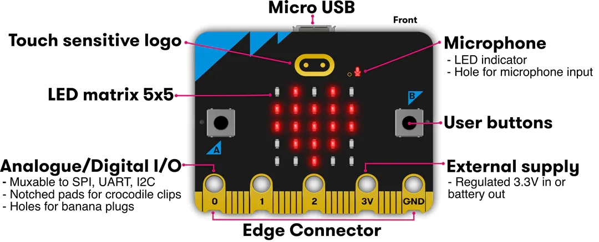
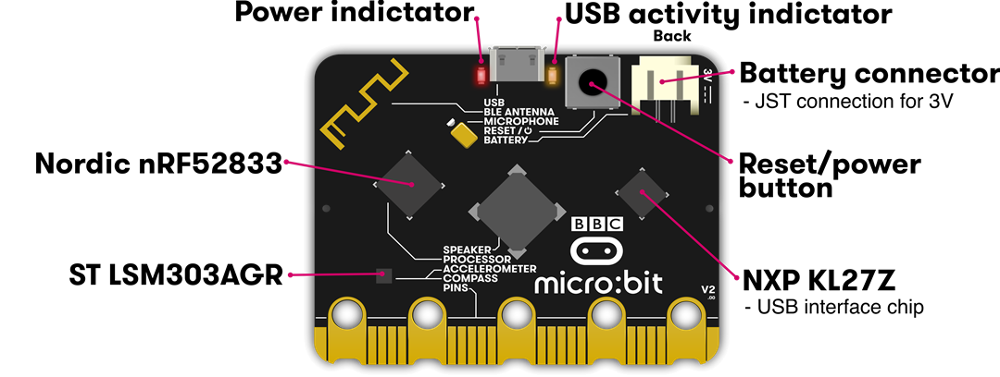
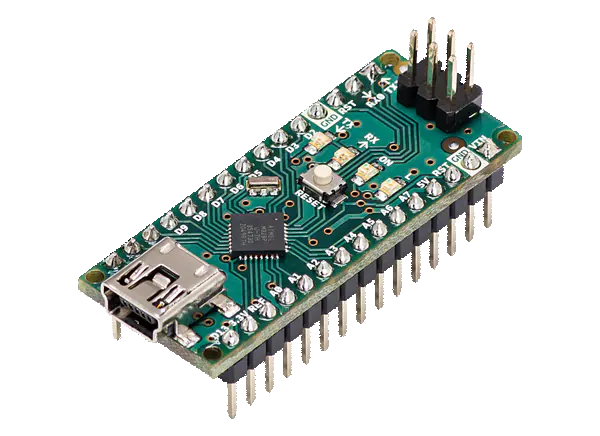
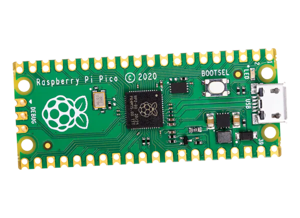
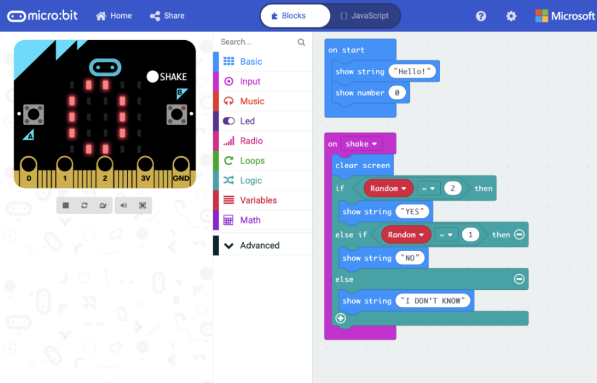
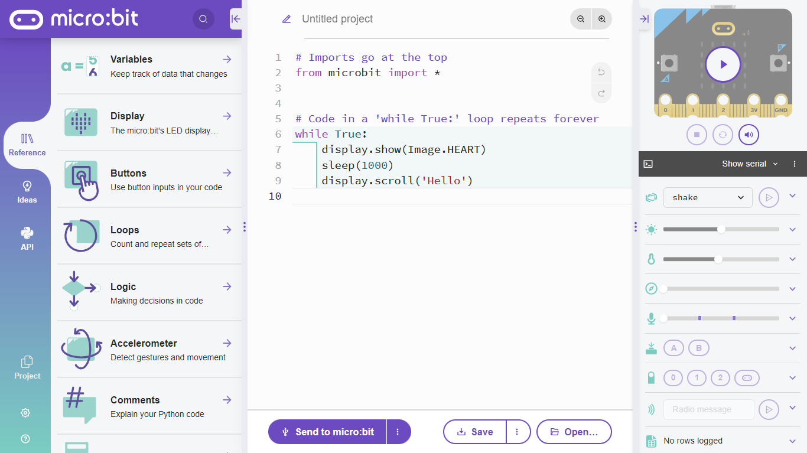
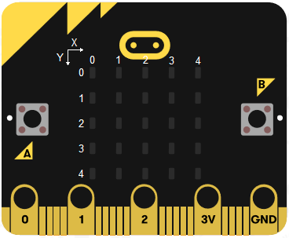
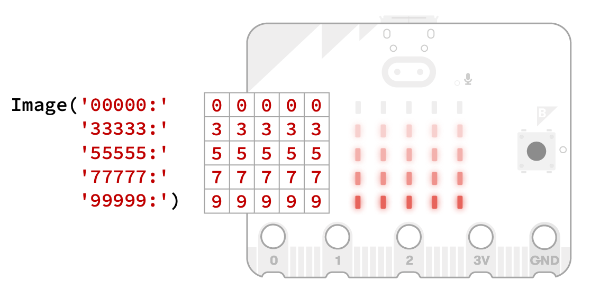
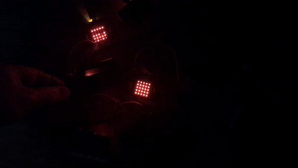

<!--# Programación con Tarjeta Micro:bit

## Introducción Práctica-->

# Introducción Práctica a la Tarjeta Micro:bit

<!---->


---

# Docente


Nombre
: MSC. Jaime Jesús Delgado Meraz

Correo
: <jesus.delgado@tecvalles.mx>
: <jaime.dm@cdvalles.tecnm.mx>

---

# Objetivo

Conocer los conceptos básicos de la programación con la tarjeta programable Micro:bit, su aplicación en la implementación de proyectos de electrónica e Internet de las Cosas (IoT).


---

<!-- _class: toc -->

# Contenidos

1. [Introducción](#introducción)
2. [Conociendo Micro:bit](#conociendo-microbit)
3. [Programación con Micro:bit](#programación-con-microbit)
4. [Proyectos con Micro:bit](#proyectos-con-microbit)
5. [Conclusión](#conclusión)

---

<!-- _class: lead -->

# Introducción

---

# Introducción

> La tarjeta Micro:bit es una pequeña computadora programable de 4x5 cm diseñada para que aprender a programar sea fácil, divertido y al alcance de todos.

- Desarrollada por la British Broadcasting Corporation (BBC) en el Reino Unido, desde 2016.
- Diseñada para ser utilizada en el aula, por estudiantes de todas las edades y niveles de experiencia.
- Surgió como parte de la campaña Make it Digital, para promover la enseñanza de la programación en las escuelas.

---

# Aplicaciones

La tarjeta Micro:bit se puede utilizar para una gran variedad de proyectos, desde simples juegos y animaciones hasta complejos sistemas de control.

- Aprendizaje de la programación
- Robótica
- Domótica
- Automatización
- Control de dispositivos
- Entretenimiento
- Internet de las Cosas (IoT)

---

<!-- _class: lead -->

# Conociendo Micro:bit

---

# Hardware

Microbit (v2) tiene un diseño compacto y resistente, cuenta con el siguiente hardware:

- Procesador ARM Cortex-M0 en un chip Nordic nRF52833
- 128 KB de RAM y 512 KB de memoria flash
- Una matriz de 5x5 LEDs programables
- Dos botones físicos y un botón táctil
- Acelerómetro y magnetómetro (brújula)
- Sensor de temperatura y sensor de luz
- Micrófono y altavoz de tono
- Puerto USB y conector de batería

---

# Soporte de Software

Con un diseño intuitivo y fácil de usar, Microbit (v2) cuenta con las siguientes características de software:

- Editor y compilador de código en línea
- Simulador en línea
- Soporte para diferentes lenguajes de programación y librerías

---

# Vista Frontal

<div class="h-5/6"></div>



---

# Vista Posterior

<div class="h-5/6"></div>



---

# Comparativa Tarjetas Programables

| Tarjeta          |   Micro:bit   | Arduino UNO | Arduino Nano | Raspberry Pi Pico |
| :--------------- | :-----------: | :---------: | :----------: | :---------------: |
| Precio (USD)     |     $16.5     |    $27.6    |    $24.9     |       $4.00       |
| Procesador       | ARM Cortex-M0 | ATmega328P  |  ATmega328P  |   ARM Cortex-M0   |
| Velocidad        |    16 MHz     |   16 MHz    |    16 MHz    |      133 MHz      |
| Memoria RAM      |    128 KB     |    2 KB     |     2 KB     |      264 KB       |
| Memoria Flash    |    512 KB     |    32 KB    |    32 KB     |       2 MB        |
| Entradas/Salidas |      25       |     14      |      14      |        26         |

---

# Comparativa Tarjetas Programables

| Tarjeta                  |                  Micro:bit                   | Arduino UNO | Arduino Nano | Raspberry Pi Pico  |
| :----------------------- | :------------------------------------------: | :---------: | :----------: | :----------------: |
| Lenguaje de Programación |     Bloques, JS, Python, Scratch, C/C++      |    C/C++    |    C/C++     | C/C++, MicroPython |
| Conectividad             |            USB, Bluetooth, Radio             |     USB     |     USB      |        USB         |
| Sensores Integrados      | Acelerómetro, Magnetómetro, Temperatura, Luz |     ❌      |      ❌      |         ❌         |

---

# Conociendo la Competencia

<div class="h-5/6"></div>





---

<!-- _class: lead -->

# Programación con Micro:bit

---

# Programación con Micro:bit

La programación de la tarjeta Micro:bit se puede desarrollar utilizando diferentes lenguajes de programación, incluyendo:

- Microsoft MakeCode (bloques) <https://makecode.microbit.org/>
- Microsoft MakeCode (JavaScript) <https://makecode.microbit.org/>
- Python <https://python.microbit.org/v/3>
- Scratch <https://scratch.mit.edu/microbit>
- C/C++ <https://lancaster-university.github.io/microbit-docs/>

---

# Microsoft MakeCode



- Editor de código en línea
- Programación por bloques (arrastrar y soltar) o en JavaScript
- Simulador en línea
- <https://makecode.microbit.org/>

---

# Python



- Editor de código en línea
- Programación en Python (MicroPython)
- Simulador en línea
- <https://python.microbit.org/v/3>

---

# Herramientas Offline

- Es posible programar la tarjeta Micro:bit utilizando herramientas offline.
- Para ello, es necesario instalar un entorno de desarrollo integrado (IDE) y el compilador de código.
- El IDE más popular para programar Micro:bit es Mu, que se puede descargar desde <https://codewith.mu/>, y que incluye el compilador de código, Mu utiliza Python como lenguaje de programación.
- También es posible descargar la aplicación de escritorio de Microsoft MakeCode desde <https://makecode.microbit.org/offline>, con la que se puede programar Micro:bit utilizando bloques o JavaScript.

---

<!-- _class: lead -->

# Proyectos con Micro:bit

---

# Proyecto 1

## Hola Mundo 👋🏻

- Encender el LED en la posición central de la matriz de LEDs.
- Reproducir una melodía de bienvenida.
- Mostrar el texto "Hola Mundo" en la matriz de LEDs.
- Mostrar una animación de bienvenida.
- Mostrar un emoji de felicidad en la matriz de LEDs.

<div class="text-center text-middle text-6xl mt-6">
  <a target="_blank" href="https://makecode.microbit.org" >makecode.microbit.org</a>
</div>

---

<!-- _class: _inverted -->

<!-- <div class="text-center text-middle text-bold font-mono text-8xl mt-10 p-4">
  &lt;Coding Time /&gt;
</div>

<div class="text-center text-middle text-6xl mt-6">
  <a target="_blank" href="https://makecode.microbit.org" >makecode.microbit.org</a>
</div>

--- -->

# Proyecto 2

## Juego de Dados 🎲

- Al sacudir la tarjeta se debe mostrar un número aleatorio entre 1 y 6 en la matriz de LEDs.
- Mostrar el emoji 😀 si el número es par.
- Mostrar un emoji ☹ si el número es impar.
- En el modo de espera, se debe mostrar un emoji de dado 🎲 en la matriz de LEDs.
- Reproducir una melodía / sonido de victoria si el número es 6.

---

<!-- _class: _inverted -->

<!-- <div class="text-center text-middle text-bold font-mono text-8xl mt-10 p-4">
  &lt;Coding Time /&gt;
</div>

<div class="text-center text-middle text-6xl mt-6">
  <a target="_blank" href="https://python.microbit.org/v/3/">python.microbit.org/v/3/</a>
</div>

--- -->

# Proyecto 2

## Juego de Dados 🎲

### Detección de movimiento

- Es posible detectar el movimiento de la tarjeta utilizando el acelerómetro integrado:

  - Agitar (Shake)
  - Inclinación hacia arriba / abajo (Up / Down)
  - Inclinación hacia la izquierda o derecha (Left y Right)
  - Cara hacia arriba / abajo (Face up / down)
  - Caída libre (Freefall), _p.e._ al lanzar la tarjeta al aire.

- Para detectar el movimiento se utiliza el método `accelerometer.was_gesture()`, que recibe como parámetro el tipo de movimiento a detectar.

---

<!-- _class: inverted -->

# Fuerza G

- La tarjeta Micro:bit también puede detectar la aceleración, que se mide en Gs (gravedades), donde 1G es la gravedad de la Tierra ($9.8 m/s^2$)
- El acelerómetro puede detectar 3 fuerzas G: $X$, $Y$ y $Z$, la combinación de estas permite detectar 3G, 6G y 8G.

| Fuerza G | Similitud                                            |
| :------: | :--------------------------------------------------- |
|    1G    | Aceración de la gravedad de la Tierra 🌎             |
|    3G    | Aceleración que activa las bolsas de aire 🚗💨       |
|    6G    | Aceleración de un auto de carreras F1 en una curva 🏎 |
|    8G    | Aceleración de avión de combate 🛩                    |

---

# Proyecto 2

## Juego de Dados 🎲

### Detección de Movimiento

```python
from microbit import *

while True:
    if accelerometer.was_gesture("shake"):
        display.scroll("Sacudir")
    elif accelerometer.was_gesture("up"):
        display.scroll("Arriba")
    elif accelerometer.was_gesture("right"):
        display.scroll("Derecha")
    elif accelerometer.was_gesture("face up"):
        display.scroll("Cara arriba")
    elif accelerometer.was_gesture("freefall"):
        display.scroll("Cayendo")
```

---

# Proyecto 2

## Juego de Dados 🎲

### Números Aleatorios 🎰

- La generación de números aleatorios es una característica importante en la programación, en la tarjeta Micro:bit, usando Micropython, esto se logra con la librería `random`.
- Para generar un número entero aleatorio se utiliza el método `random.randint()`, que recibe como parámetros el número mínimo y el número máximo.

```python
from microbit import *
import random

while True:
    if accelerometer.was_gesture("shake"):
        display.show(random.randint(1, 6))
```

---

# Proyecto 2

## Juego de Dados 🎲

### Imágenes y Emojis

- La matriz de LEDs de Micro:bit puede mostrar imágenes de 5x5 píxeles.
- Para mostrar una imagen se utiliza el método `display.show()`, que recibe como parámetro un objeto de tipo `Image`.

```python
from microbit import *

while True:
    if accelerometer.was_gesture("shake"):
        display.show(Image.HAPPY)
    elif accelerometer.was_gesture("freefall"):
        display.show(Image.SURPRISED)
    else:
        display.show(Image.ASLEEP)
```

---

# Proyecto 2

## Juego de Dados 🎲

### Imágenes y Emojis

- Se cuenta con un conjunto de imágenes predefinidas:
  - `HEART` ♥, `HEART_SMALL` ❣, `HAPPY` 🙂, `SMILE` ☺, `SAD` 🙁, `CONFUSED` 😕, `ANGRY` 😠, `ASLEEP` 😴, `SURPRISED` 😯, `SILLY` 😋, `FABULOUS` 😎, `MEH` 😏, `PACMAN` 🟡, `GHOST` 👻, `ARROW_N` ⬆, `ARROW_NE` ↗, `ARROW_E` ➡, `ARROW_SE` ↘, `ARROW_S` ⬇, `ARROW_SW` ↙, `ARROW_W` ⬅, `ARROW_NW` ↖, `YES` ✅, `NO` ❌, `TRIANGLE` ⚠, `TRIANGLE_LEFT` 📐, `CHESSBOARD` 🏁, `DIAMOND` 🔷, `DIAMOND_SMALL` 🔹, `SQUARE` ⬛, `SQUARE_SMALL` ◾, `RABBIT` 🐰, `COW` 🐮, `DUCK` 🦆,`TORTOISE` 🐢, `BUTTERFLY` 🦋, `GIRAFFE` 🦒, `SNAKE` 🐍, `MUSIC_CROTCHET` ♩, `MUSIC_QUAVER` ♪, `MUSIC_QUAVERS` 🎵, `PITCHFORK` 🍴, `SCISSORS` ✂, `XMAS` 🎄, `TARGET` 🎯, `TSHIRT` 👕, `ROLLERSKATE` ⛸, `HOUSE` 🏠, `STICKFIGURE` 👤, `SWORD` ⚔, `SKULL` 💀, `UMBRELLA` ☂
- Así como las caras del reloj para cada hora.

---

# Proyecto 2

## Juego de Dados 🎲

### Imágenes Personalizadas

- Además de las imágenes predefinidas, es posible crear imágenes personalizadas.
- Se utiliza el método `Image()`, que recibe como parámetro una cadena de texto con 5 números de 5 dígitos que van del 0 al 9, separados por dos puntos.

 

---

# Proyecto 2

## Juego de Dados 🎲

### Emoji de Dado 🎲

<div class="flex">
  <div class="w-1/2 px-2">

- Para este caso, se representa la cara del dado con el número 3.
- Se crea una imagen, indicando el borde con el número 7 y el punto con el número 9.
- Para mostrar una imagen personalizada se utiliza el método `display.show(Image("00000:00000:00000:00000:00000"))`.

  </div>
  <div class="w-1/2 px-2">

```python
dado = Image("07770:"
              "79007:"
              "70907:"
              "70097:"
              "07770")

display.show(dado)

  ⬜⬛⬛⬛⬜
  ⬛◾⬜⬜⬛
  ⬛⬜◾⬜⬛
  ⬛⬜⬜◾⬛
  ⬜⬛⬛⬛⬜
```

  </div>

</div>

---

# Proyecto 2

## Juego de Dados 🎲

### Melodías 🎶

- La tarjeta Micro:bit puede reproducir melodías utilizando el método `music.play()`, que recibe como parámetro una lista de notas.
  - _P.e._ `["E6:2", "G7", "E7", "C7", "D7", "G7b"]`.
- Las notas musicales se representan con las letras, que corresponden a las notas musicales.

  | Nota  | Do  | Re  | Mi  | Fa  | Sol | La  | Si  |
  | :---- | :-: | :-: | :-: | :-: | :-: | :-: | :-: |
  | Letra |  C  |  D  |  E  |  F  |  G  |  A  |  B  |

- La duración de las notas se representa con números del 1 al 6.
- Las notas se describen usando la letra que corresponde y opcionalmente su octava y duración, _p.e._ `G5:6`.

---

# Proyecto 2

## Juego de Dados 🎲

### Melodías 🎶

- Un ejemplo de una melodía de victoria es:

```python
from microbit import *
import music

music.set_tempo(bpm=240)
song = ["E6:2","G7","E7","C7","D7","G7b"]

while True:
    music.play(song)
```

- Adicionalmente, Micro:bit cuenta con una serie de melodías predefinidas que se pueden utilizar, como `DADADADUM`, `ENTERTAINER`, `PRELUDE`, `ODE`, `NYAN`, `RINGTONE`, `FUNK`, `BLUES`, `BIRTHDAY`, `WEDDING`, `FUNERAL`, `PUNCHLINE`, `BADDY`, `CHASE`, `BA_DING`, `WAWAWAWAA`, `JUMP_UP`, `JUMP_DOWN`, `POWER_UP`, `POWER_DOWN`.

---

<!-- _class: cols-2 -->

# Proyecto 2

## Juego de Dados 🎲

### Código Completo

::: left

```python
from microbit import *
import random, music

dado = Image("07770:"
             "79007:"
             "70907:"
             "70097:"
             "07770")

music.set_tempo(bpm=240)
song = ["E6:2","G7","E7","C7","D7","G7b"]
```

:::
::: right

```python
while True:
    display.show(dado)

    if accelerometer.was_gesture('shake'):
        numero = random.randint(1,6)
        music.play("G5:2")
        display.show(numero)
        sleep(1000)
        if numero % 2 == 0:
            display.show(Image.HAPPY)
        else:
            display.show(Image.SAD)
        sleep(500)

        if numero == 6:
            music.play(song)

```

:::

---

# Proyecto 3

## Instrumento de Medición 📏

- Al presionar el botón A se debe mostrar la temperatura en grados Celsius.
- Al presionar el botón B se debe mostrar la intensidad de luz usando la matriz de LEDs, de forma gráfica.
- Al presionar los botones A y B al mismo tiempo se debe activar la alarma de temperatura, que se debe desactivar al presionar los botones A y B al mismo tiempo.
- Al activar la alarma de temperatura se debe mostrar un emoji de fuego 🔥 si la temperatura es mayor a 30°C, así como reproducir un sonido de alarma.

---

# Proyecto 3

## Instrumento de Medición 📏

### Uso de los botones 🅰🅱

- Es posible detectar si los botones fueron presionados o están siendo presionados, utilizando los métodos `was_pressed()` y `is_pressed()`, respectivamente.
- También es posible contar el número de veces que se presiona un botón en un lapso de tiempo, con el método `get_presses()`.

```python
from microbit import *

while True:
  if button_a.is_pressed() and button_b.is_pressed():
      display.scroll("A + B")
  elif button_a.was_pressed():
      display.scroll("A")
      display.scroll(button_a.get_presses())
  elif button_b.was_pressed():
      display.scroll("B")
      display.scroll(button_b.get_presses())
```

---

# Proyecto 3

## Instrumento de Medición 📏

### Sensor de temperatura 🌡️

- Para leer la temperatura se utiliza el método `temperature()`.
- La temperatura se muestra por default en grados Celsius, el rango de medición es de -10°C a 60°C.

```python
from microbit import *

while True:
    if button_a.was_pressed():
        display.scroll(temperature())
```

::: info
La temperatura se obtiene del sensor de temperatura integrado en el chip de la tarjeta Micro:bit, por lo que es posible que la temperatura no sea precisa.
:::

---

# Proyecto 3

## Instrumento de Medición 📏

### Sensor de luz 💡

- El sensor de luz integrado, obtiene la intensidad de luz en una escala de 0 a 255, la medición la realiza a través de la matriz de leds, que funciona como un fotodiodo.
- Para leer la intensidad de luz se utiliza el método `display.read_light_level()`.

```python
from microbit import *

while True:
    if button_b.was_pressed():
        display.scroll(display.read_light_level())
```

::: warning
La medición puede variar dependiendo de la luz ambiental, así como del tipo de fuente de luz.
:::

---

# Proyecto 3

## Instrumento de Medición 📏

### Gráfica de intensidad de luz 📊

- Se utilizará una función que muestre la intensidad de luz en la matriz de LEDs, de forma gráfica.

```python
# Author: Roberto Colistete Jr. (@rcolistete)
def plot_bar_pixels(value, pixelscale, fromtop = False):
    for y in range(5):
        for x in range(5):
            if fromtop:
                yl = y
            else:
                yl = 4-y
            diff = value - ((x + 1) + y * 5) * pixelscale
            if diff >= 0:
                display.set_pixel(x, yl, 9)
            else:
                display.set_pixel(x, yl, 0)
```

---

<!-- _class: split -->

# Proyecto 3

## Instrumento de Medición 📏

### Emoji de fuego 🔥

::: top

- Para este caso, mostraremos un emoji de fuego en la matriz de LEDs, dado que la tarjeta Micro:bit no cuenta con un emoji de fuego predefinido, se debe crear uno personalizado:

:::

::: left

```python
fuego = Image("00070:"
              "00990:"
              "09590:"
              "95559:"
              "09990")
```

:::
::: right

```text
⬜⬜⬜🟧⬜
⬜⬜🟥🟥⬜
⬜🟥🟨🟥⬜
🟥🟨🟨🟨🟥
⬜🟥🟥🟥⬜
```

:::

---

# Proyecto 3

## Instrumento de Medición 📏

### Sonido de Alarma 🚨

- Para el sonido de alarma se utilizará una melodía personalizada:

```python
music.play(["c5:2","g5:2","b5:2","c2:2", "g5:2"])
```

- En Micro:bit (v2) también se podría utilizar un sonido predefinido:

```python
audio.play(Sound.YAWN)
```

- Algunos de los sonidos disponibles son: `GIGGLE`, `HAPPY`, `HELLO`, `MUSIC`, `SAD`, `SLEEP`, `SOARING`, `SPRING`, `YAWN`.

---

# Proyecto 3

## Instrumento de Medición 📏

### Código Completo

```python
from microbit import *
import music

fuego = Image("00070:00990:09590:95559:09990")
alarma = False

# Adaptado de @rcolistete
def plot_bar_pixels(value, pixelscale, fromtop = False):
    for y in range(5):
        for x in range(5):
            yl = y if fromtop else 4 - y
            diff = value - ((x + 1) + y * 5) * pixelscale
            level = 9 if diff >= 0 else 0
            display.set_pixel(x, yl, level)

def fire_alarm():
    display.show(fuego)
    music.play(["c5:2","g5:2","b5:2","c2:2", "g5:2"])
    wait_clear()
```

---

```python
def wait_clear():
    sleep(1000)
    display.clear()

while True:
    if button_a.is_pressed() and button_b.is_pressed():
        alarma = not alarma
        if alarma:
            display.show(Image.YES)
        else:
            display.show(Image.NO)
        wait_clear()
    elif button_a.was_pressed():
        display.scroll(temperature())
    elif button_b.was_pressed():
        display.show(display.read_light_level())
        sleep(500)
        plot_bar_pixels(display.read_light_level(), int(255/25))
        wait_clear()

    if alarma and temperature() > 30:
        fire_alarm()
```

---

# Proyecto 4

## Brújula 🧭

- Al mover la tarjeta se debe mostrar de manera gráfica la dirección en la que se encuentra.
- Al presionar el botón A se debe mostrar la dirección (en grados) en la que se encuentra la tarjeta Micro:bit.

---

# Proyecto 4

## Brújula 🧭

- Para leer la dirección en la que se encuentra la tarjeta Micro:bit se utiliza el método `compass.heading()`.
- Este método devuelve un número entre 0 y 360, que representa la dirección en grados, donde 0 es el norte, 90 es el este, 180 es el sur y 270 es el oeste.

```python
from microbit import *

while True:
    display.scroll(compass.heading())
    sleep(500)
```

- Antes de utilizar el método `compass.heading()` se debe calibrar la brújula, para ello, se debe mover la tarjeta Micro:bit en forma de 8.

---

# Proyecto 4

## Brújula 🧭

### Grados a Imagen 📐

- Mediante una función se convierten los grados a su respectiva imagen de flecha:

```python
def degrees_to_image(degrees):
    if degrees < 45 or degrees > 315:
        return Image.ARROW_N
    elif degrees < 135:
        return Image.ARROW_E
    elif degrees < 225:
        return Image.ARROW_S
    else:
        return Image.ARROW_W
```


---

# Proyecto 4

## Brújula 🧭

### Código Completo

```python
from microbit import *

def degrees_to_image(degrees):
    if degrees < 45 or degrees > 315:
        return Image.ARROW_N
    elif degrees < 135:
        return Image.ARROW_E
    elif degrees < 225:
        return Image.ARROW_S
    else:
        return Image.ARROW_W

while True:
    display.show(degrees_to_image(compass.heading()))

    if button_a.was_pressed():
        display.scroll(compass.heading())

```

---

<!-- # Proyecto 5: Luciérnaga 🐛💡

- Utilizando un par de tarjetas Micro:bit, simularemos la comunicación entre dos luciérnagas.
- Al presionar el botón A, nuestra "luciérnaga" enviará un mensaje al resto.
- El resto de las "luciérnagas" responderá al mensaje recibido, iluminandose.
- La comunicación se realizará vía radio.
- Las "luciérnagas" que reciben el mensaje, tendrán un posibilidad de replicar el mensaje y comunicarse de vuelta.

---

# Comunicación Vía Radio 📡

- Para enviar el mensaje se utilizará la radio integrada en la tarjeta Micro:bit, para ello, se debe importar la librería `radio` y configurar la tarjeta para que funcione como emisor:

```python
from microbit import *
import radio

radio.on()
radio.config(group=23) # Canal de comunicación
```

- Se tienen disponibles 255 grupos de comunicación, por default se utiliza el grupo 0, también se puede especificar un canal de comunicación, que va del 0 al 83, por default se utiliza el canal 7, la combinación de grupo y canal se utiliza para evitar interferencias entre tarjetas.

---

# Comunicación Vía Radio 📡

- Para enviar mensajes se utiliza el método `radio.send()`, el cual recibe una cadena como parámetro.
- Para recibir mensajes se utiliza el método `radio.receive()`, el cual devuelve una cadena con el mensaje recibido.

```python
from microbit import *
import radio

radio.on()
radio.config(group=23)
radio.send("Hola")

while True:
  msg = radio.receive()
  if msg is not None:
    display.scroll(msg)
```

---

# Animación de Luciérnaga 🐛💡

- Para simular el movimiento de la luciérnaga, se utilizará una animación personalizada:

```python
flash = [Image().invert() * (i / 9) for i in range(9, -1, -1)]
```

- La animación se genera a partir de una lista de imágenes, que se van invirtiendo, y se van mostrando en la matriz de LEDs.
- La animación pretende simular el brillo de la luciérnaga.

---

# Proyecto 5 - Código Completo

```python
from microbit import *
import radio, random

flash = [Image().invert() * (i / 9) for i in range(9, -1, -1)]
radio.on()
radio.config(group=23)

while True:
    if button_a.was_pressed():
        radio.send('hola')

    incoming = radio.receive()
    if incoming == 'hola':
        sleep(random.randint(50, 350))
        display.show(flash, delay=100, wait=False)

        if random.randint(0, 9) % 3 == 0:
            sleep(500)
            radio.send('hola')
```

---

# Proyecto 5 - Luciérnagas



--- -->

# Algunas ideas

- Un contador de pasos mediante el acelerómetro. 👟
- Un reloj digital con alarma. ⏰
- Un medidor de sonido usando el micrófono integrado. 🎤🔊
- Un sistema de comunicación por radio, que permita enviar código Morse y traducirlo a texto. 📡
- Un sistema de monitoreo de temperatura y humedad, que envíe información entre tarjetas. 🌡️💧
- Un sistema de servo-motores para controlar un robot. 🤖

---

# Más ejemplos

- <https://microbit.org/projects/make-it-code-it/> (Bloques)
- <https://fun-science.org.uk/wp-content/uploads/2020/05/Microbit-projects-independent-book.pdf> (Bloques)
- <https://github.com/arm-university/Introduction-to-Computing-with-microbit> (Bloques)
- <https://makecode.microbit.org/projects/> (Bloques)
- Reloj Digital <https://makecode.microbit.org/projects/watch/digital-watch> (Bloques)
- <https://github.com/PacktPublishing/BBC-Micro-bit-in-Practice/> (Python)
- Jardín Inteligente <https://github.com/jimbobbennett/smart-garden-ornaments> (Bloques + Python)

---

<!-- _class: lead -->

# Conclusión

---

# Conclusión

- Microbit es una herramienta versátil y poderosa que puede ser utilizada por personas de todas las edades y niveles de experiencia.
- Es una excelente opción para aprender sobre programación y electrónica y para desarrollar proyectos de IoT.
- Al igual que otras tarjetas, su ámbito de aplicación es muy amplio, por lo que es necesario conocer sus características y limitaciones para poder utilizarla de manera adecuada.
- Con un _shield_ adecuado, es posible utilizar Microbit para desarrollar proyectos de robótica.

---

# Referencias

- <https://microbit.org/es-es/>
- <https://microbit.org/es-es/code/>
- <https://makecode.microbit.org/reference>
- <https://microbit-micropython.readthedocs.io>
- <http://microes.org/index.php>

---

<!-- _class: inverted centered pattern -->


<div class="text-center text-middle font-mono text-8xl mt-10">
  &lt;/Fin&gt;
</div>

<div class="text-center text-middle font-mono text-4xl mt-10">
  Gracias por su atención
</div>
