<!-- _class: cover -->
<!-- _paginate: false -->

# Introducción al Paradigma de la Programación Orientada a Objetos

## Programación Orientada a Objetos

Dr. Jaime Jesús Delgado Meraz

### Unidad 01

#### IAD - 2424

#### AED - 1286


---

# Docente


Nombre
: Dr. Jaime Jesús Delgado Meraz

Correo
: <jesus.delgado@tecvalles.mx>
: <jaime.dm@cdvalles.tecnm.mx>

Enlaces
: :icon:brand-github: github.com/j2deme
: :icon:news: j2deme.github.io
: :icon:brand-instagram: j2deme

---

<!-- _class: cols-2 -->

# Asignatura

::: left

Nombre
: Programación Orientada a Objetos

Carrera
: Ingeniería en Sistemas Computacionales
: Ingeniería en Desarrollo de Aplicaciones
: Ingeniería en Inteligencia Artificial

:::
::: right

Clave
: AED - 1286
: IAD - 2424

SATCA
: 2 - 3 - 5

:::

---

<!-- _class: toc -->

# Contenidos

1. [Definiciones](#definiciones)
2. [Principios](#principios)
3. [Unified Modeling Language (UML)](#unified-modeling-language)

---

# Competencia Específica de la Unidad

> Comprende el concepto de la programación orientada a objetos y distingue las principales características de cada uno de sus pilares

> Diseña y desarrolla diagramas de clases completos, incluyendo todas las notaciones necesarias para una representación precisa y comprensible

---

<!-- _class: lead -->

# Introducción

---

# Introducción

- La programación orientada a objetos, representa un intento de hacer programas que modelen de manera más cercana a la manera en que las personas piensan y se comportan en la vida real.
- Con los lenguajes de programación orientados a objetos, se pueden crear programas que sean más fáciles de entender, de mantener y de reutilizar.
- En los primeros lenguajes de programación, los denominados lenguajes de bajo nivel, la resolución de problemas se hacía identificando una tarea computacional que debía ser ejecutada para dar solución a un problema.
- Programar consistía entonces, en encontrar una secuencia de instrucciones que completaran dicha tarea, logrando un propósito o proceso específico.
  - Esto derivó en lo que se conoce como programación **procedural** o **estructurada**.

---

# Introducción

- En la programación Orientada a Objetos, en lugar de tareas o instrucciones, encontramos **objetos**, los cuales modelan o sirven como representaciones de entidades del mundo real.
  - Como un coche, una persona, una cuenta bancaria, etc.
- Dichos objetos tienen **atributos** que describen su estado y **métodos** que describen su comportamiento.
- Este conjunto de atributos y métodos, permite a los objetos interactuar entre sí, para resolver problemas de manera más natural y sencilla, tal como lo harían en la vida real.
- En el software, los objetos pueden representar entidades reales o abstractas en el dominio del problema.

---

# Introducción

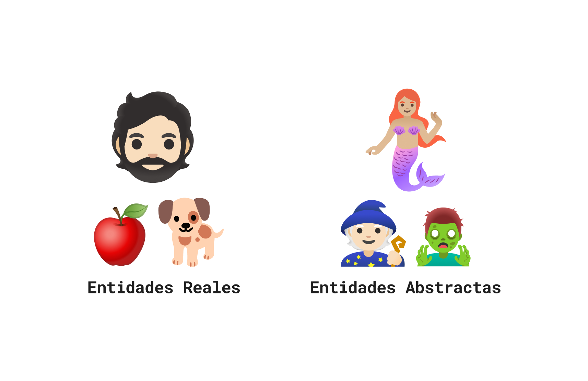

<div class="h-5/6"></div>

---

# Introducción

- Utilizar la programación orientada a objetos, permite hacer el diseño de un programa de manera más natural y por lo tanto más fácil de programar y de que el código sea entendible.
- Los lenguajes de programación orientados a objetos incluyen un conjunto de características que los hacen diferentes de los lenguajes estándar, también conocidos como lenguajes procedurales o estructurados.
- Es importante entender, que usar la programación orientada a objetos, no es algo automático que se da con cambiar de lenguaje de programación, sino que requiere de orientar las estrategias de pensamiento para resolver problemas, con una visión orientada a objetos y el como es que estos objetos interactúan entre sí.

---

<!-- _class: lead -->

# Definiciones

---

# Definiciones

## Orientación a Objetos

> Se refiere a un **paradigma** de programación que utiliza "objetos" para diseñar aplicaciones y programas en una computadora.

Estrictamente hablando, la programación orientada a objetos es un conjunto de herramientas y métodos, que permiten a los programadores construir sistemas de software:

- Confiables
- Intuitivos
- Mantenibles
- Bien documentados
- Reusables

::: ok
Es más conocida como **Programación Orientada a Objetos** o **POO** (por sus siglas).
:::

---

# Definiciones

## Orientación a Objetos

### Conceptualización

- Un programa orientado a objetos está estructurado como una **comunidad** de agentes que interactuan entre sí, denominados **objetos**.
- Cada objeto tiene un rol que jugar y provee un **servicio** o realiza una **acción** que es usada por otros miembros de la comunidad.
- Los agentes, interactuan entre sí a través de **mensajes**.

Imaginemos un ejemplo...

> Bob quiere enviar un ramo de flores a Alice.
>
> Bob no necesita saber como Alice recibe el ramo, solo necesita saber que Alice lo recibirá.
>
> Bob **no** necesita saber como se hace el ramo, **ni** como se entrega, **ni** quien lo entrega.
>
> Bob solo necesita saber que el ramo llegará a Alice.

---

# Definiciones

## Orientación a Objetos

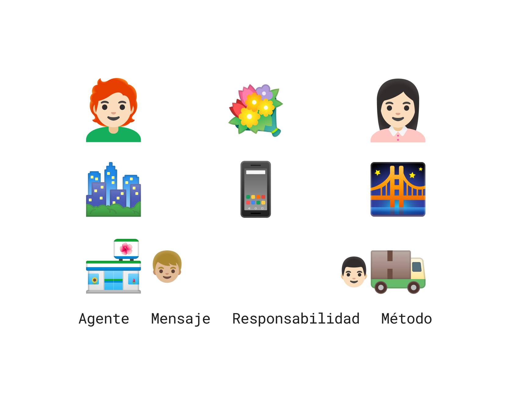

---

# Definiciones

## Tipos de Lenguajes

Imperativos
: Que describen el "como" debe hacerse algo.

Declarativos
: Que describen el "que es" lo que se va a resolver.

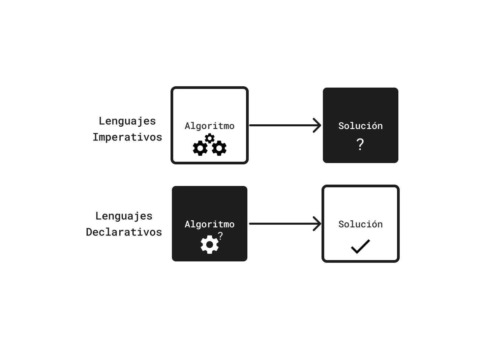

---

# Definiciones

## Paradigma

> Un paradigma es un modelo o patrón que sirve de ejemplo a seguir.

Un paradigma de programación es un enfoque para resolver problemas, utilizando un lenguaje de programación o una combinación de lenguajes de programación.

Se puede entender como una forma de conceptualizar las técnicas de cómputo, y de como las tareas deben estructurarse y organizarse.

- Es un conjunto de reglas y normas que definen cómo se deben escribir los programas.
- Es una forma de pensar y de abordar los problemas de programación.
- Es una forma de organizar y estructurar el código.

La programación orientada a objetos es uno de los múltiples paradigmas de programación.

---

# Definiciones

## Paradigmas de Programación

| Lenguaje    | Imperativo | Estructurado | Orientado a Objetos |   Lógico   | Funcional  | Creación |
| :---------- | :--------: | :----------: | :-----------------: | :--------: | :--------: | :------: |
| Ensamblador | :icon:yes: |  :icon:no:   |      :icon:no:      | :icon:no:  | :icon:no:  |   1949   |
| Fortran     | :icon:yes: |  :icon:no:   |      :icon:no:      | :icon:no:  | :icon:no:  |   1957   |
| Cobol       | :icon:yes: |  :icon:no:   |     :icon:yes:      | :icon:no:  | :icon:yep: |   1959   |
| C           | :icon:yes: |  :icon:yes:  |      :icon:no:      | :icon:no:  | :icon:no:  |   1972   |
| Prolog      | :icon:no:  |  :icon:no:   |      :icon:no:      | :icon:yes: | :icon:no:  |   1972   |
| C++         | :icon:yes: |  :icon:yes:  |     :icon:yes:      | :icon:no:  | :icon:no:  |   1983   |
| Haskell     | :icon:no:  |  :icon:no:   |      :icon:no:      | :icon:no:  | :icon:yes: |   1990   |
| Python      | :icon:yes: |  :icon:yes:  |     :icon:yes:      | :icon:no:  | :icon:yep: |   1991   |
| Java        | :icon:yes: |  :icon:yes:  |     :icon:yes:      | :icon:no:  | :icon:yep: |   1995   |
| Dart        | :icon:yes: |  :icon:yes:  |     :icon:yes:      | :icon:no:  | :icon:yep: |   2011   |

<div class="text-center text-sm -m-1">

:icon:yes:Soportado&emsp;:icon:yep: Parcialmente soportado&emsp;:icon:no: No soportado

</div>

---

<!-- _class: cols-2 -->

# Definiciones

## Paradigmas de Programación

::: left

#### C++

```cpp
public int factorial(int n) {
  int result = 1;
  for (int i = 2; i <= n; i++) {
    result *= i;
  }
  return result;
}
```

#### Python

```python
def factorial(n):
  result = 1
  for i in range(2, n + 1):
    result *= i
  return result
```

:::
::: right

#### Prolog

```prolog
factorial(0, 1).
factorial(N, F) :- N > 0,
  N1 is N - 1,
  factorial(N1, F1),
  F is N * F1.
```

#### Haskell

```haskell
factorial 0 = 1
factorial n = n * factorial (n - 1)
```

:::

---

# Definiciones

## Clases

> Una clase es una plantilla para la creación de objetos de datos según un modelo definido previamente.

- Define un **tipo de dato**.
- Define **atributos** y **métodos** que pueden ser utilizados por los objetos.
- Es un **molde** o **plantilla** para crear objetos.
- Una clase es similar a un tipo de **dato complejo** para objetos, que define que es lo que se puede hacer con ellos.

---

# Definiciones

## Objetos

> Entidades que tienen comportamientos, que almacenan información y que pueden interactuar con otros objetos.

- Un objeto es una instancia de una clase.
- Un objeto es una **entidad** que tiene un **estado** y un **comportamiento**.
- El estado de un objeto es representado por sus **atributos**.
- El comportamiento de un objeto es representado por sus **métodos**.
- Un objeto es una **variable** de un tipo de dato complejo.
- El tipo de dato define que acciones se pueden realizar con una variable.

---

# Definiciones

## Instancias

> Una **instancia** es un objeto específico de una clase, al que se le asigna un espacio en memoria.

- Supongamos que existe una clase a la que vamos a denominar `Plato`.
- Por simplicidad, entenderemos que un `Plato` tiene características (tamaño y color) y acciones (llenar y limpiar).
- Si tomamos `miPlato`, este sería un objeto y a su vez **instancia**, de la clase `Plato`.
- Si instanciaramos `otroPlato` como un objeto de la misma clase, observaríamos que `miPlato` y `otroPlato` son _instancias_ de la misma clase, por lo que comparten atributos y métodos.
- Las instancias son entonces, las asignaciones de memoria de un objeto de una clase.

[info:En adelante, entenderemos _características_ como **atributos** y _acciones_ como **métodos**.]

---

# Definiciones

## Clases, Objetos e Instancias

En la programación orientada a objetos, hablar de los conceptos de clases, objetos e instancias de manera separada es algo difícil.

- Un **objeto** es cualquier cosa, mientras que una clase consiste en una **categoría** de cosas.
- Un objeto es elemento específico que pertenece a una **clase**, es decir, es una **instancia** de una clase.
- Una clase define las **características** de sus objetos y los **métodos** que pueden aplicarse a dichos objetos.
- Una **instancia** es un objeto específico de una clase, al que se le asigna un espacio en memoria.
- En resumen, una clase es un **molde** para crear objetos, y un objeto es una **instancia** de una clase.

---

# Definiciones

## Clases, Objetos e Instancias

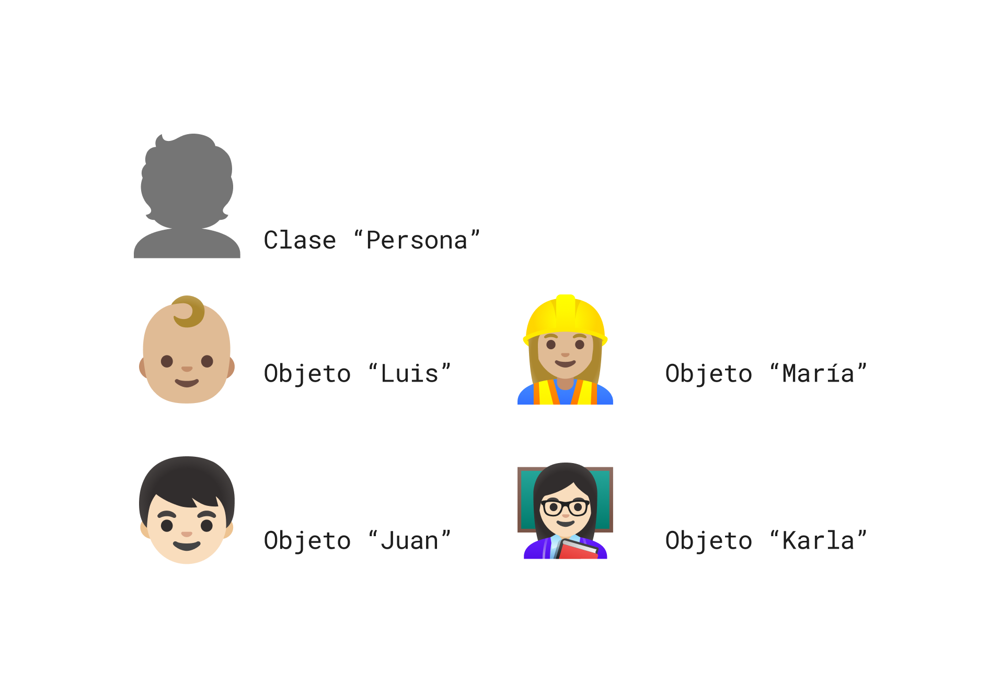

---

<!-- _class: lead -->

# Principios

---

# Principios

La programación orientada objetos, se basa en 4 principios o conceptos básicos, que todo lenguaje orientado a objetos debe soportar:

1. Abstracción
2. Encapsulamiento
3. Herencia
4. Polimorfismo

A estos conceptos se les conoce también como los **pilares** 🏛️ de la programación orientada a objetos y permiten construir programas, que modelan de manera más cercana la realidad.

---

# Principios

## Abstracción

> La abstracción es el proceso de ignorar los detalles de una entidad, para centrarse en los aspectos más importantes.

- La abstracción es un concepto fundamental en la programación orientada a objetos, que permite modelar entidades del mundo real.
- Permite a los desarrolladores, enfocarse en la solución de un problema, sin tener que preocuparse por los detalles de implementación.
- Es muy útil para "transformar" objetos de la vida real a clases.

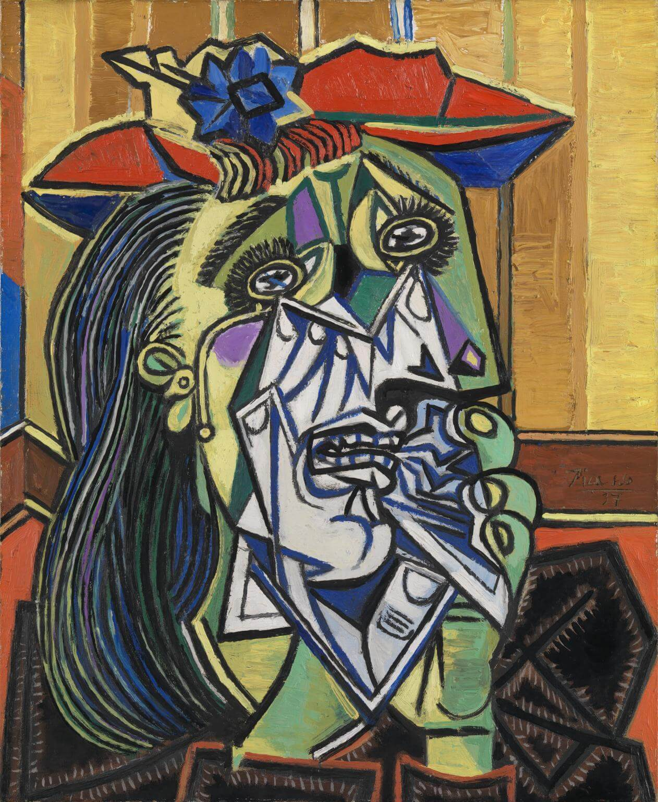

---

# Principios

## Abstracción

- La abstracción es un proceso que se lleva a cabo en la vida diaria, y se ve reflejado en algo tan simple como hacer una lista de pendientes.
- Cuando se hace una lista de pendientes, se está abstrayendo la información importante de cada pendiente, y se está ignorando la información irrelevante.
  - Por supuesto, que se debe poner atención a los detalles en algún momento, pero no es necesario hacerlo desde el principio.
- La abstracción permite enfocarse en lo importante, y no en los detalles, al trasladar esto a la programación, estaríamos hablando las entradas y salidas de un programa, y no en los detalles de implementación.

---

# Principios

## Abstracción

- Es normal que cuando se trabaja con objetos en la vida real, se de por sentado la abstracción, tal así, que no se distingue de primer momento.
- Al preparar un sándwich, se abstraen los pasos necesarios para enfocarse en el resultado final.
  - No es necesario pensar en cómo se cultiva el trigo 🌱 para hacer el pan 🥖, cómo se cría el ganado 🐖 para obtener el jamón, o cómo se produce el queso.
  - Simplemente se toman los ingredientes necesarios (pan, jamón, queso, etc.) y se _ensamblan_ para obtener el sándwich 🥪.
- De manera similar, en programación orientada a objetos, se abstraen los detalles de implementación para enfocarse en la funcionalidad principal.
- Esta abstracción permite trabajar de manera más eficiente y centrarse en la solución del problema principal.

---

# Principios

## Encapsulamiento 💊

> El encapsulamiento es el proceso de ocultar los detalles de implementación de un objeto.

- El **encapsulamiento** es una característica de los lenguajes de programación orientados a objetos.
- Al ocultar los detalles de implementación de un objeto, _limita_ o más bien, **canaliza** la forma en que se puede interactuar con dicho objeto y sus atributos.
- Es una forma de proteger los datos de un objeto, de manera que solo puedan ser modificados por los métodos del objeto.
- El encapsulamiento es una forma de **proteger** los datos de un objeto, de manera que no puedan ser modificados directamente por otros objetos.

---

# Principios

## Encapsulamiento

- En la vida real, se observan muchos ejemplos de encapsulamiento.
- Cuando se construye una casa, no se inventa el cemento, los _blocks_, el metal de las varillas, las instalaciones de plomería, electricidad y aire acondicionado cada que se van a instalar.
- Más bien, se hace uso de sistemas previamente diseñados, probados, lo que reduce tiempo y esfuerzo.
- Únicamente se requiere instalar y usar.

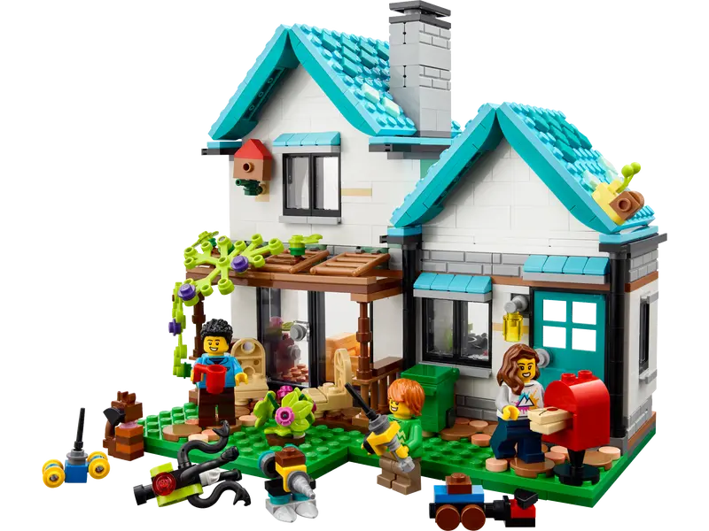

---

# Principios

## Encapsulamiento

- De manera similar a la vida real, el encapsulamiento en la programación orientada a objetos, permite **ocultar** los detalles de implementación de un objeto.
- Al encapsular un objeto, se pueden **ocultar** los detalles de implementación de los atributos y métodos de un objeto, y **exponer** solo los métodos que se desean que sean accesibles.
- Si una función o método ha sido probado con previamente, se tiene la confianza de que producirá el resultado correcto.
- Esta relacionado con la accesibilidad de los atributos y métodos de un objeto.

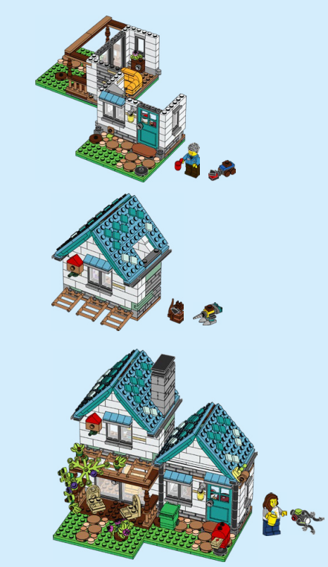

---

# Principios

## Encapsulamiento

### Modificadores de Acceso

- Los modificadores de acceso son útiles para controlar el acceso a los atributos y métodos de una clase, y para garantizar la integridad de los datos.
- Son representados por símbolos o palabras reservadas que indican la visibilidad de los atributos y métodos de una clase, y se utilizan para controlar el acceso a los mismos.

| Modificador | Símbolo |                     Representación                     | Descripción                                      |
| :---------- | :-----: | :----------------------------------------------------: | :----------------------------------------------- |
| Public      |   `+`   |   :icon:circle:{green} / :icon:circle-filled:{green}   | Es visible desde cualquier clase.                |
| Private     |   `-`   |     :icon:square:{red} / :icon:square-filled:{red}     | Es visible solo desde la misma clase.            |
| Protected   |   `#`   | :icon:diamonds:{amber} / :icon:diamonds-filled:{amber} | Es visible desde la misma clase y sus subclases. |
| Package     |   `~`   |  :icon:triangle:{blue} / :icon:triangle-filled:{blue}  | Es visible solo desde el mismo paquete.          |

[info:Dependiendo del software que se utilice, la representación de los modificadores de acceso puede variar, pero los símbolos son los mismos.]

---

# Principios

## Herencia

> La herencia es un mecanismo que permite crear una nueva clase a partir de una clase existente.

- El concepto de utilizar clases, provee de una manera útil de organizar objetos, esto es especialmente útil puesto que las clases son reusables.
- Esto es, que podemos **extenderlas** (heredarlas); podemos crear clases nuevas que extiendan o que sean descendientes de clases existentes.
- Las clases descendientes, pueden **heredar** todos los atributos de la clase original (padre), o pueden sobreescribir métodos de su clase padre a necesidad.
- Al utilizar la herencia, se ahorra una gran cantidad de trabajo, ya que cuando se crea una clase que hereda de otra, sólo requiere agregar las nuevas características y funciones.

---

# Principios

## Herencia

### Reutilización

Cuando una compañía automotriz diseña un nuevo modelo de vehículo, no se construye cada componente desde cero, sino más bien, extiende las funcionalidades de algún modelo previo.

::: primary
Se reutilizan características y/o se modifican funciones heredadas de un elemento ya existente.
:::

De manera similar a lo anterior, se pueden crear programas de manera más fácil, donde muchos de sus componentes son usados "como tal" o con mínimas modificaciones.

- La herencia es fundamental en la programación orientada a objetos, ya que permite la reutilización de código y la creación de jerarquías de clases.

---

# Principios

## Herencia

### Reutilización

A través de la herencia, los lenguajes de programación orientados a objetos, permiten construir clases que sean extensiones de clases existentes.

- En geometría, un `Cubo` es un descendiente de un `Cuadrado`, que a su vez es un descendiente de un `Rectángulo` y este a su vez, de un `Polígono`.
- Un `Cubo` tiene todos los atributos de un `Cuadrado` (más los atributos **heredados**), pero añade una característica adicional de profundidad.
- Al igual que el `Cuadrado`, el `Cubo` también tendría una forma de calcular su área, sin embargo, sería diferente a la que se utiliza para calcular el área del primero.
- Adicionalmente, un `Cubo` tendría un método para calcular el volumen, que no tendría un `Cuadrado`.

::: info
Al programar con herencia, se evita el comenzar desde cero cada vez que se requiere una clase nueva que esté relacionada con el problema a resolver.
:::

---

# Principios

## Polimorfismo

> Del griego _poly_ (muchos) y _morphos_ (formas), el polimorfismo es la capacidad de un objeto de "tomar" muchas formas

En el contexto de la POO, el polimorfismo describe una técnica en la que una clase puede definir una interfaz común para un grupo de clases relacionadas.

- Lo anterior quiere decir, que una clase puede definir un método que se comporta de manera diferente, dependiendo de la clase que lo esté utilizando.
- Esta característica es especialmente útil cuando se trabaja con herencia.

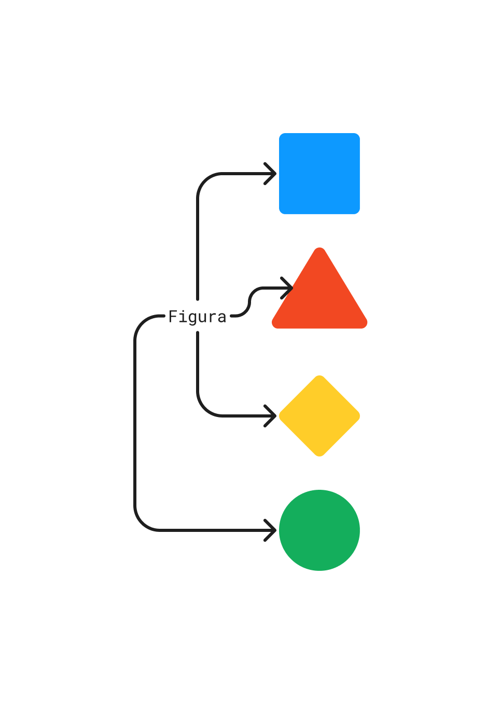

---

# Principios

## Polimorfismo

El polimorfismo únicamente existe en los lenguajes orientados a objetos y **no** existe un comportamiento similar en otros tipos de lenguajes.

Sin el polimorfismo
: - Se tienen que usar módulos separados o diferentes nombres para un método que multiplica dos números y otro que multiplica tres.
: - Se tienen que generar nombres de módulos separados para un método para limpiar un plato, otro para limpiar un carro y otro más para limpiar un bebé.

Con el polimorfismo
: - Se puede usar el mismo nombre de método para diferentes clases.
: - Se puede usar el mismo nombre de método para diferentes propósitos.
: - Se puede usar el mismo nombre de método para diferentes números de argumentos.

---

# Principios

## Polimorfismo

### Un ejemplo

[info:Se presentan ejemplos en **Java**, pero aplica para cualquier lenguaje de programación orientado a objetos]

#### Sin polimorfismo

```java
public class Calculadora {
  public int sumaDosEnteros(int a, int b) {}
  public int sumaTresEnteros(int a, int b, int c) {}
  public float sumaDosFlotantes(float a, float b) {}
  public float sumaTresFlotantes(float a, float b, float c) {}
}
```

#### Con polimorfismo (por sobrecarga)

```java
public class Calculadora {
  public int suma(int a, int b) {}
  public int suma(int a, int b, int c) {}
  public float suma(float a, float b) {}
  public float suma(float a, float b, float c) {}
}
```

---

<!-- _class: split -->

# Principios

## Polimorfismo

### Herencia polimórfica

:::top
El polimorfismo esta relacionado con la herencia, ya que cuando una clase hereda de otra, puede reemplazar o extender métodos de la clase padre, si así lo requiere.
:::

::: left

```java
public class Cuadrado {
  public int area(int lado) {
    return lado * lado;
  }
}
```

:::
::: right

```java
public class Cubo extends Cuadrado {
  public int area(int lado) {
    return 6 * super.area(lado);
  }
}
```

:::

::: bottom

```java
public class Prueba {
  public static void main(String[] args) {
    Cuadrado c = new Cuadrado();
    Cubo b = new Cubo();

    System.out.println(c.area(5)); // 25
    System.out.println(b.area(5)); // 150
  }
}
```

:::

::: info
El `Cubo` hereda o _extiende_ de la clase `Cuadrado` y a su vez, utiliza su método para calcular el área.
:::

---

<!-- _class: cols-2 -->

# Principios

## Polimorfismo

### Herencia polimórfica

::: left

```java
public class Vehiculo {
  public void mover() {
    System.out.println("En movimiento...");
  }
}

public class Carro extends Vehiculo {
  public void mover() {
    System.out.println("🚗 ➡");
  }
}

public class Bicicleta extends Vehiculo {
  public void mover() {
    System.out.println("🚲 ➡");
  }
}
```

:::
::: right

```java
public class Prueba {
  public static void main(String[] args) {
    Vehiculo v = new Vehiculo();
    Vehiculo c = new Carro();
    Vehiculo b = new Bicicleta();

    v.mover(); // En movimiento
    c.mover(); // 🚗 ➡
    b.mover(); // 🚲 ➡
  }
}
```

:::

---

<!-- _class: lead -->

# Unified Modeling Language

---

# Unified Modeling Language (UML)

> El Lenguaje Unificado de Modelado (_UML_, por sus siglas en inglés) es un lenguaje estándar para la especificación, documentación, visualización y desarrollo de sistemas de software.

- Es un lenguaje gráfico que permite modelar sistemas de software, desde la concepción hasta la implementación.
- Creado por Grady Booch, Ivar Jacobson y James Rumbaugh en 1997, con el fin de unificar los métodos de modelado.
- Fue adoptado por el _Object Management Group_ (OMG) en 1997 como un estándar y actualmente es el lenguaje de modelado más utilizado en el mundo.
  - Desde 2004, es un estándar aprobado por la ISO como **ISO/IEC 19501:2005 Information Technology — Open Distributed Processing — Unified Modeling Language (UML)** para la versión 1.4.2.
  - En el 2012 se actualizó la norma a la última versión definitiva disponible en ese momento, la 2.5.1, dando lugar a las normas **ISO/IEC 19505-1:2012**.

---

# Unified Modeling Language (UML)

- Permite a los desarrolladores visualizar, especificar, construir y documentar artefactos de un sistema de software.
- Es independiente de los lenguajes de programación y de los procesos de desarrollo.
- Aunque existen alternativas para el modelado como:
  - **SysML**: _Systems Modeling Language_ (Modelado de Sistemas),
  - **BPMN**: _Business Process Model and Notation_ (Procesos de Negocio),
  - **DMN**: _Decision Model and Notation_ (Modelado de Decisiones),
  - **CMMN**: _Case Management Model and Notation_ (Modelado de Casos de Uso),
  - **SoaML**: _Service Oriented Architecture Modeling Language_ (Arquitectura Orientada a Servicios),
  - **UPDM**: _Unified Profile for DoDAF/MODAF_ (Perfil Unificado para el Modelado de Arquitectura de Defensa),
  - **MARTE**: _Modeling and Analysis of Real-Time and Embedded Systems_ (Modelado y Análisis de Sistemas en Tiempo Real),
- UML sigue siendo el más utilizado por su versatilidad y flexibilidad.

---

<!-- _class: cols-2 -->

# Unified Modeling Language (UML)

## Diagramas UML

::: left

1. Diagramas de Estructura

   - Diagrama de Clases ⭐
   - Diagrama de Objetos ⭐
   - Diagrama de Componentes
   - Diagrama de Despliegue
   - Diagrama de Paquetes
   - Diagrama de Perfiles

2. Diagramas de Interacción

   - Diagrama de Comunicación
   - Diagrama de Tiempo
   - Diagrama de Interacción Generalizada

:::
::: right

3. Diagramas de Comportamiento

   - Diagrama de Casos de Uso
   - Diagrama de Secuencia
   - Diagrama de Colaboración
   - Diagrama de Estados
   - Diagrama de Actividades
   - Diagrama de Máquinas de Estados

4. Diagramas de Agrupamiento

   - Diagrama de Estructura Compuesta
   - Diagramas de Objetos y Componentes

5. Diagramas de Anotación
   - Diagrama de Notación
   - Diagrama de Restricciones

:::

---

# Unified Modeling Language (UML)

- En la programación orientada a objetos, los diagramas UML son una herramienta fundamental para el diseño y modelado de sistemas de software.
- Permiten visualizar elementos como la estructura, la interacción y/o el estado de un sistema, de manera gráfica y sencilla.
- Son particularmente útiles para documentar aspectos fundamentales de un sistema como lo es la **estructura** del sistema, es decir, cómo están organizados los objetos y las clases, se representan mediante **diagramas de clases**.
- Por otro lado, para documentar instancias de clases y cómo interactúan entre sí, se utilizan **diagramas de objetos**.

---

# Unified Modeling Language (UML)

## Diagramas de Clases

- Para representar la estructura de un sistema o programa de Programación Orientada a Objetos en UML, el diagrama más adecuado es el **diagrama de clases**.
- Los diversos componentes en un diagrama de clases pueden representar las clases que se programarán en realidad, los objetos principales o la interacción entre clases y objetos.
- La figura de clase en sí misma consiste en un rectángulo de tres filas.
  - La fila superior contiene el nombre de la clase,
  - La fila del centro contiene los atributos de la clase, y
  - La última fila incluye los métodos o las operaciones que la clase puede utilizar.


---


---

# Unified Modeling Language

## Diagramas de Clases

- Además de representar las clases con sus atributos y métodos, los diagramas de clases también pueden mostrar las relaciones entre las clases.
  - **Asociación**, que indica que una clase está relacionada con otra.
  - **Asociación dirigida**, que indica que una clase está relacionada con otra, pero solo en una dirección.
  - **Agregación**, que indica que una clase es parte de otra.
  - **Composición**, que indica que una clase es parte de otra, pero **no puede existir** sin ella.
  - **Dependencia**, que indica que una clase depende de otra.
  - **Uso**, que indica que una clase utiliza otra (tipo de dependencia).
  - **Generalización**, que indica que una clase tien relación con otra, pero es una **especialización** de ella.
  - **Realización**, que indica que una clase implementa una interfaz.

---

# Unified Modeling Language (UML)

## Diagramas de Clases

### Asociación

- La **asociación** es una relación entre dos clases que indica que un objeto de una clase está relacionado con un objeto de otra clase.
- Una asociación representa una relación bidireccional entre dos clases, indica que las instancias de una clase están conectadas a instancias de otra clase.
- Se representan como una línea sólida que conecta las clases.

> Supongamos un sistema para administra bibliotecas, con dos clases principales `Biblioteca` y `Libro`, cada libro pertenece a una biblioteca, y una biblioteca puede tener muchos libros.
> La relación entre las clases `Biblioteca` y `Libro` se representa como una asociación.

---

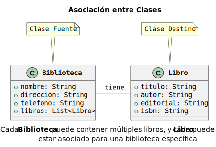

---

# Unified Modeling Language (UML)

## Diagramas de Clases

### Asociación dirigida

- La **asociación dirigida** es una relación entre dos clases que indica que un objeto de una clase está relacionado con un objeto de otra clase, pero solo en una dirección.
- En este tipo de relación, una clase es la clase **principal** y la otra es la clase **dependiente**.
- Se representan como una línea sólida con una flecha que indica la dirección de la relación.

> En un escenario donde un `Maestro` esta asociado con un `Curso` en un sistema de gestión escolar, la asociación es dirigida desde `Maestro` a `Curso`, ya que un maestro puede enseñar varios cursos, pero un curso solo puede ser enseñado por un maestro a la vez.

---


---

# Unified Modeling Language (UML)

## Diagramas de Clases

### Agregación

- La **agregación** es una relación entre dos clases que indica que una clase **es parte** de otra clase.
- En este tipo de relación, una clase es la clase **compuesta** (todo) y la otra es la clase **componente** (parte).
- Se representan como una línea sólida con un rombo en el extremo de la clase compuesta.

> Si se tiene un sistema de gestión de personal, la `Empresa` sería vista todo el todo, mientras que los `Empleados` serían las partes, los empleados son parte de la empresa, y la empresa puede tener muchos empleados.
> La relación entre `Empresa` y `Empleado` es una agregación, ya que incluso si la empresa desaparece, los empleados seguirán existiendo.

---

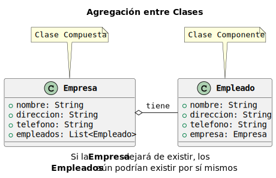

---

# Unified Modeling Language (UML)

## Diagramas de Clases

### Composición

- La **composición** es una relación entre dos clases que indica que una clase **es parte** de otra clase, pero **no puede existir** sin ella.
- Una clase es la clase **compuesta** (todo) y la otra es la clase **componente** (parte).
- Se representan como una línea sólida con un rombo relleno en el extremo de la clase compuesta.
- La composición es una relación **más fuerte** que la agregación.

> En el caso de una `Agenda` digital, los contactos registrados en la agenda son parte de la agenda, y no pueden existir sin ella.
> La relación entre `Agenda` y `Contacto` es una composición, ya que si la agenda se elimina, los contactos también se eliminarían.

---

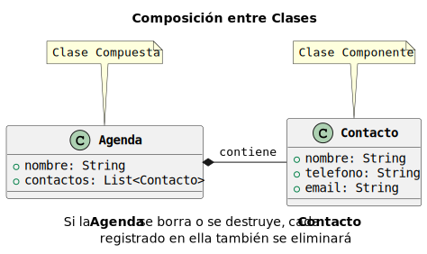

---

# Unified Modeling Language (UML)

## Diagramas de Clases

### Dependencia

- La **dependencia** es una relación entre dos clases que indica que una clase **depende** de otra clase, es decir, que una clase utiliza a la otra, pero no forma parte de ella.
- En este tipo de relación, una clase es la clase **dependiente** y la otra es la clase **principal**.
- Se representan como una flecha punteada que conecta las clases, en dirección de la clase dependiente a la clase principal.

> Si se modelará un `Automovil`, este dependería de un `Motor` para funcionar, con lo que se tendría una dependencia entre ambas clases.
> El `Automovil` depende del `Motor` para funcionar, pero el `Motor` puede existir sin el `Automovil`.

---

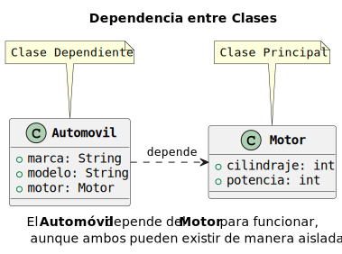

---

# Unified Modeling Language (UML)

## Diagramas de Clases

### Uso (dependencia)

- En UML, el **uso** es una forma más general de la dependencia, con un acoplamiento más débil.
- En este tipo de relación, una clase es la clase **dependiente** y la otra es la clase **principal**, describe la relación entre dos clases que no forman parte de la otra.
- Se representa como una flecha punteada, en dirección de la relación, etiquetada con la palabra `<<use>>`.

> En el sistema de archivos del sistema operativo, un `Documento` puede **usar** una `Impresora` para imprimir, pero la impresora no forma parte del documento.
> La `Impresora` es una clase independiente que puede ser utilizada por el `Documento` para imprimir.

---

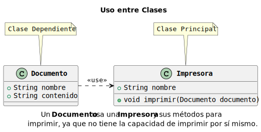

---

# Unified Modeling Language (UML)

## Diagramas de Clases

### Generalización

- La **generalización** es una relación entre dos clases que indica que una clase es una **especialización** de otra clase.
  - Representa una relación de **herencia** entre las clases.
- En este tipo de relación, una clase es la clase **general** y la otra es la clase **especializada**, también pueden ser llamadas clase **padre** y clase **hija**.
- Se representan como una línea sólida con un triángulo en el extremo de la clase especializada.

> En un sistema bancario, un cliente tiene una `Cuenta` general, pero también puede tener una `Cuenta de Ahorro`, una `Cuenta de Cheques` e incluso una `Cuenta de Crédito`.
> Todas estas cuentas son especializaciones de la clase `Cuenta`, por lo que la relación entre `Cuenta` y las cuentas especializadas es una generalización.

---

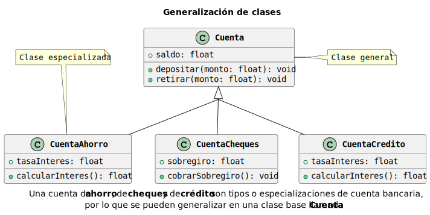

---

# Unified Modeling Language (UML)

## Diagramas de Clases

### Realización

- La **realización** es una relación entre dos clases que indica que una clase **implementa** una interfaz, es un tipo de relación más débil que la generalización.
  - Una interfaz es un conjunto de métodos que una clase debe implementar.
- En este tipo de relación, una clase es la clase **implementadora** y la otra es la clase **interfaz**.
- Se representan como una línea punteada con un triángulo en el extremo de la clase implementadora.

> En el campo de los bienes raíces, una `Propiedad` pertenece a un `Propietario`, el cual puede ser una `Persona física` o una `Persona moral`.
> Ambas clases `Persona física` y `Persona moral` implementan la interfaz `Propietario`, por lo que la relación entre `Propietario` y las clases implementadoras es una **realización**, es decir, tendrán implementaciones concretas de los métodos de la interfaz.

---

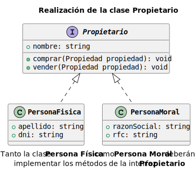

---

# Unified Modeling Language (UML)

## Diagramas de Clases

- En resumen, los diagramas de clases en UML son una herramienta fundamental para el diseño y modelado de sistemas de software en programación orientada a objetos.
- Permiten visualizar la estructura y el comportamiento de un sistema de software, de manera gráfica y sencilla, incluyendo las relaciones entre clases y objetos derivados de ellas.
- Los diagramas de clases son una forma efectiva de comunicar ideas y conceptos, y son ampliamente utilizados en la industria del software para el diseño y desarrollo de sistemas de software.
- Son independientes de los lenguajes de programación y de los procesos de desarrollo, lo que los hace una herramienta versátil y flexible para el modelado de sistemas de software.

---

# Unified Modeling Language (UML)

## Diagramas de Objetos

- Los diagramas de objetos en UML son una representación gráfica que muestra el estado de los objetos y sus relaciones en un momento determinado.
- Proporciona una instantánea 📸 de la estructura del sistema, capturando la visión estática de las instancias presentes y sus asociaciones.
- La principal diferencia entre un diagrama de clases y un diagrama de objetos es que el primero se enfoca en la estructura de un sistema, mientras que el segundo se enfoca en la interacción entre los estados de los objetos en un momento específico.
- Utilizan los mismos elementos que los diagramas de clases, pero se centran en la interacción entre objetos en lugar de en la estructura de las clases.

::: ok
Este tipo de diagramas se utilizan para modelar un sistema en un momento específico, y son útiles para visualizar cómo interactúan los objetos en un sistema.
:::

---

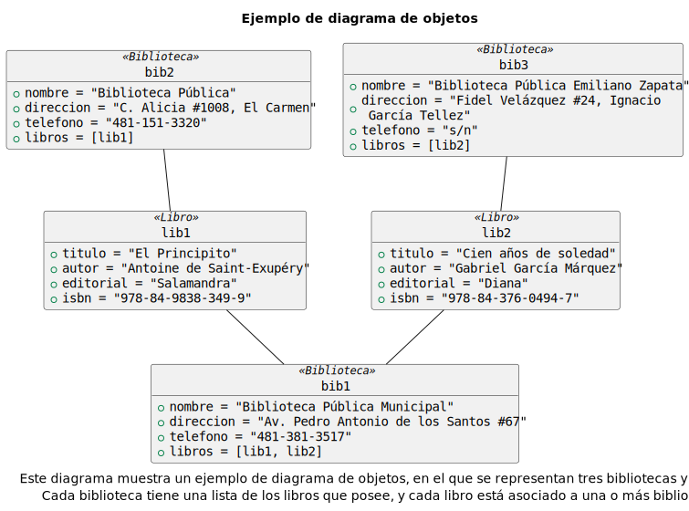

---

# Unified Modeling Language (UML)

## Diagramas de Objetos

- En un diagrama de objetos, los objetos se representan como **instancias** de clases.
- Si se requiere, puede incluirse información adicional sobre los objetos, como sus atributos y métodos.
- Las relaciones entre los objetos se representan generalmente con líneas simples que conectan los objetos.
  - Estas líneas también pueden ser de diferentes tipos de relaciones: asociaciones, agregaciones, composiciones y dependencias.
- Los diagramas de objetos son menos comunes que los diagramas de clases, pero son útiles para visualizar cómo interactúan los objetos en un sistema.

---

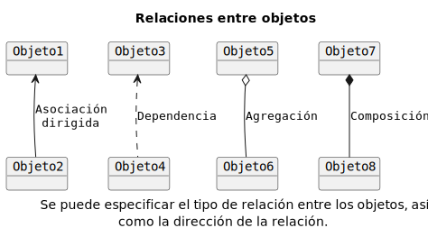

---

# Unified Modeling Language (UML)

## Cardinalidad

> La **cardinalidad** es una propiedad de las relaciones entre clases en UML que indica cuántos objetos de una clase están relacionados con cuántos objetos de otra clase.

- La cardinalidad se representa en un diagrama de clases u objetos, con un número o un rango de números que indica cuántos objetos de una clase están relacionados con cuántos objetos de otra clase.
- Las relaciones de cardinalidad se "anotan" en las líneas que conectan las clases en un diagrama de clases, y se utilizan para indicar cuántos objetos de una clase están relacionados con cuántos objetos de otra clase.
  - Se puede expresar de diferentes maneras, dependiendo de la relación entre las clases, aunque si no se describen, se pueden inferir del tipo de dato que se está utilizando.
  - Es una buena práctica incluirlas, para evitar ambigüedades y malentendidos en el diseño del sistema.

---

# Unified Modeling Language (UML)

## Cardinalidad

### Tipos

|  Cardinalidad   | Descripción                                                |
| :-------------: | :--------------------------------------------------------- |
|       `1`       | Relación con **exactamente** una entidad                   |
|     `0..1`      | Relación con **cero** o **una** entidad                    |
|  `*` (`0..*`)   | Relación con **cero** o **más** entidades                  |
| `0..n` / `1..n` | Relación con **cero** / **una** y **máximo** `n` entidades |
|     `1..*`      | Relación con **al menos** una entidad                      |
|     `m..n`      | Relación con **mínimo** `m` y **máximo** `n` entidades     |
|       `n`       | Relación con **exactamente** `n` entidades                 |

---


---

# Unified Modeling Language (UML)

## Cardinalidad

### Uno a Uno

> Supongamos un sistema de gestión de empleados, donde cada `Empleado` tiene sólo **un cubículo** asignado, y cada `Cubículo` está asignado a **un solo empleado**.

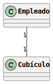

---

# Unified Modeling Language (UML)

## Cardinalidad

### Uno a Muchos

> Consideremos un sistema de gestión escolar en una universidad, donde un `Profesor` puede impartir **varios cursos**, pero un `Curso` solo puede ser impartido por **un profesor** a la vez.

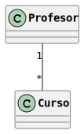

---

# Unified Modeling Language (UML)

## Cardinalidad

### Uno a Muchos

> En un restaurante, un `Cliente` puede hacer **varios pedidos**, sin embargo, un `Pedido` solo puede ser hecho por **un cliente**.

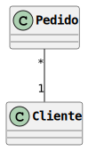

---

# Unified Modeling Language (UML)

## Cardinalidad

### Muchos a Muchos

> Dentro del sistema de control de una biblioteca, un `Libro` puede haber sido escrito por **varios autores**, y un `Autor` puede haber escrito **varios libros**.

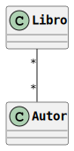

---

# Unified Modeling Language (UML)

## Cardinalidad

### Cero o Uno a Uno

> Una empresa de logística de transporte tiene múltiples `Vehículos`, pero no todos tienen asignado un `Empleado` que los conduzca, y cada `Empleado` esta asignado a **exactamente un** `Vehículo`.

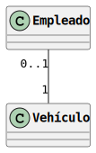

---

# Unified Modeling Language (UML)

## Cardinalidad

### Cero o Uno a Muchos

> Una empresa de desarrollo de software tiene múltiples `Proyectos`, pero no todos tienen asignado un `Líder`, y cada `Líder` puede estar asignado a **varios** `Proyectos`.

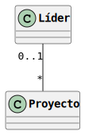

---

# Unified Modeling Language (UML)

## Cardinalidad

### Cero o Muchos a Uno

> Una tienda de pedidos en línea tiene múltiples `Clientes`, pero no todos han realizado un `Pedido`, y cada `Pedido` es realizado por **exactamente un** `Cliente`.


---

# Unified Modeling Language (UML)

## Cardinalidad

### Uno o Muchos<sup>2</sup>

> En una escuela, un `Estudiante` debe estar inscrito en **al menos un** `Clase` (puede estar en varias), y cada `Clase` tiene debe tener **al menos un** `Estudiante` para ser impartida.

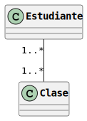

---

# Unified Modeling Language (UML)

## Cardinalidad

- Es importante tener en cuenta que la cardinalidad es una propiedad de las relaciones entre clases en UML que indica cuántos objetos de una clase están relacionados con cuántos objetos de otra clase.
  - También puede utilizarse en otros contextos como los diagramas de entidad-relación en bases de datos.
- Se mostraron ejemplos de las relaciones más comunes, pero existen muchas otras combinaciones posibles de cardinalidades, dependiendo de la relación entre las clases y la especificación del sistema.
- Aunque no es necesario incluir la cardinalidad en un diagrama de clases, es una buena práctica hacerlo para evitar ambigüedades y malentendidos en el diseño del sistema, especialmente en sistemas complejos o que requieren una mayor precisión en cuanto a la cantidad de objetos relacionados.

---

# Unified Modeling Language (UML)

## Herramientas

- Existen muchas herramientas de modelado UML disponibles en el mercado, tanto comerciales como de código abierto:
  - **Lucidchart**: Una herramienta de diagramación en línea que permite crear diagramas UML y otros tipos de diagramas.
  - **Visual Paradigm**: Una herramienta de modelado UML que ofrece una amplia gama de características y funcionalidades.
  - **StarUML**: Una herramienta de modelado UML de código abierto que es fácil de usar y ofrece una interfaz intuitiva.
  - **PlantUML**: Una herramienta de modelado UML basada en texto que permite crear diagramas UML utilizando una sintaxis simple y legible.
  - **UMLet**: Una herramienta de modelado UML de código abierto que es fácil de usar y ofrece una amplia gama de características y funcionalidades.
- Algunas de ellas son gratuitas, mientras que otras son de pago, así mismo, algunas son principalmente gráficas, mientras que otras son basadas en texto.

---

<!-- _class: info -->

:icon:info-circle:

# PlantUML

Para propósitos de este curso, se utilizará la herramienta **PlantUML** para la creación de diagramas UML, por su facilidad de uso.

**Offline**: PlantUML <https://plantuml.com/es/download> (requiere Java)

**Online**: PlantText <https://www.planttext.com/>

---

# Unified Modeling Language (UML)

## PlantUML

- PlantUML es una herramienta de modelado UML basada en texto que permite crear diagramas UML utilizando una sintaxis simple y legible.
- Se utiliza un lenguaje de marcado simple para describir los elementos de un diagrama UML, y PlantUML genera automáticamente el diagrama correspondiente.
- Su principal ventaja es que se enfoca en el contenido del diagrama, en lugar de en la forma, lo que permite a los usuarios centrarse en el diseño del sistema en lugar de en la creación del diagrama.
- Sin embargo, puede tener una curva de aprendizaje un poco _empinada_ para usuarios que prefieren una interfaz gráfica.

::: info
Para propósitos de la asignatura, se revisarán los diagramas de clases y objetos, así como las relaciones más comunes.
:::

---

<!-- _class: split -->

# Unified Modeling Language (UML)

## PlantUML

### EstruClases

::: top
Sin importar si se trabaja con PlantUML de manera local o en línea, la estructura básica de un diagrama UML es la misma.
:::
::: left

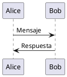

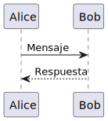

:::
::: right

- Se debe iniciar el diagrama con la directiva `@startuml` y finalizarlo con la directiva `@enduml`.
  - El contenido del diagrama se coloca entre las directivas.
- Además, de incluir un nombre único para el diagrama (`plantuml_101`).

:::
::: bottom
Por default, PlantUML genera un diagrama de secuencia, pero se pueden generar otros tipos de diagramas UML utilizando la sintaxis adecuada.
:::

[warning:Los archivos de PlantUML tienen la extensión `.puml`]

---

<!-- _class: split -->

# Unified Modeling Language (UML)

## PlantUML

### Extras

::: top
Si se requiere, se pueden añadir elementos adicionales al diagrama, como comentarios, títulos, notas, etc.
:::
::: left

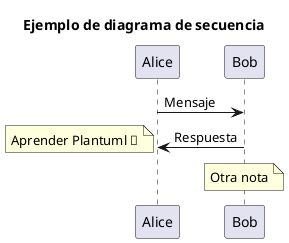

:::
::: right
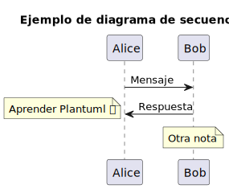
:::

---

# Unified Modeling Language (UML)

## PlantUML

### Diagramas de Clases

- Para crear un diagrama de clases en PlantUML, se utilizan las palabras clave `class` y `interface` para definir las clases y las interfaces, respectivamente.
- Los atributos y métodos de una clase se definen dentro de la clase, utilizando la sintaxis `+` para los atributos públicos, `-` para los atributos privados y `#` para los atributos protegidos.

| Modificador | Símbolo |                     Representación                     | Descripción                                      |
| :---------- | :-----: | :----------------------------------------------------: | :----------------------------------------------- |
| Public      |   `+`   |   :icon:circle:{green} / :icon:circle-filled:{green}   | Es visible desde cualquier clase.                |
| Private     |   `-`   |     :icon:square:{red} / :icon:square-filled:{red}     | Es visible solo desde la misma clase.            |
| Protected   |   `#`   | :icon:diamonds:{amber} / :icon:diamonds-filled:{amber} | Es visible desde la misma clase y sus subclases. |
| Package     |   `~`   |  :icon:triangle:{blue} / :icon:triangle-filled:{blue}  | Es visible solo desde el mismo paquete.          |

---

# Unified Modeling Language (UML)

## PlantUML

### Diagramas de Clases

- Las relaciones entre las clases se definen con símbolos diferentes, según sea el caso:
  - Asociación `A -- B` 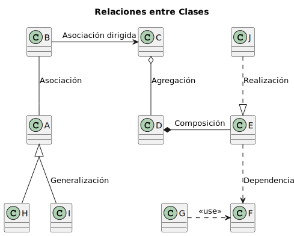
  - Asociación dirigida `A --> B`
  - Agregación `A o-- B`
  - Composición `A *-- B`
  - Dependencia `A ..> B`
  - Uso `A ..> B : <<use>>`
  - Generalización `A <|-- B`
  - Realización `A <|.. B`

---

<!-- _class: cols-2 -->

# Unified Modeling Language (UML)

## PlantUML

### Diagramas de Clases

::: left

- Para definir una clase en PlantUML, se utiliza la palabra clave `class` seguida del nombre de la clase.
- Se pueden incluir los atributos y métodos de la clase dentro de la definición de la clase, agregando los modificadores de acceso correspondientes.
- PlantUML detecta automáticamente los atributos y métodos de la clase y los muestra en el diagrama.
- Finalmente, se especifican las relaciones entre las clases, según sea necesario.

:::
::: right

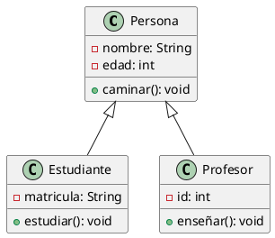

:::

---

# Unified Modeling Language (UML)

## PlantUML

### Diagramas de Clases

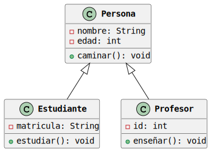

---

# Unified Modeling Language (UML)

## PlantUML

### Diagramas de Objetos

- Para crear un diagrama de objetos en PlantUML, se utiliza la palabra clave `object`, seguida del nombre del objeto y el nombre de la clase a la que pertenece.

```plantuml
object Alice <<Profesor>>
```

- Se pueden incluir los atributos y métodos del objeto dentro de la definición del objeto, aunque es menos común agregar los métodos.

```plantuml
object Bob <<Estudiante>> {
  - nombre = "Bob"
  - edad = 18
}
```

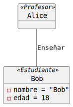

---

# Unified Modeling Language (UML)

## PlantUML

- Si bien PlantUML no es la única herramienta para crear diagramas UML, cuenta con una sintaxis simple y legible que facilita la creación de diagramas, además de ser una herramienta de código abierto y gratuita, lo que la hace accesible para cualquier persona que desee utilizarla.
- Su sintaxis simple, permite a los usuarios, tener una representación visual a partir de una sintaxis muy similar a la de un lenguaje de programación.
- Al ser basada en texto, permite a los equipos de desarrollo mantener los diagramas en un repositorio de control de versiones, lo que facilita la colaboración y la revisión de los diagramas.
- Finalmente, la posibilidad de trabajar diagramas sin necesidad de un editor especializado, permite que los diagramas puedan ser creados en cualquier lugar y en cualquier momento, para luego ser exportados a diferentes formatos.

---

<!-- _class: inverted centered pattern -->


<div class="text-center text-middle font-bold font-coding text-8xl mt-10">
  &lt;/Fin&gt;
</div>

---

<!-- paginate: skip -->
<!-- class: references -->

# Referencias

- Lopez Blasco, J. (2023). _Introducción a POO en Java: Objetos y clases_. <https://openwebinars.net/blog/introduccion-a-poo-en-java-objetos-y-clases/>
- Wikipedia (2024). _Programación Orientada a Objetos_. <https://es.wikipedia.org/wiki/Programaci%C3%B3n_orientada_a_objetos>
- García Solorzano, D. (2020). _Introducción al Paradigma de Programación Orientada a Objetos_ (_Universitat Oberta de Catalunya_). <https://openaccess.uoc.edu/bitstream/10609/149901/2/IntroduccionAlParadigmaDeLaProgramacionOrientadaAObjetos.pdf>
- RJ Code Advance (2019) _Programación Orientada a Objetos - Introducción (POO Parte 1)_. <https://rjcodeadvance.com/programacion-orientada-a-objetos-introduccion-poo/>
- Ávila, J. y Bailón, J. (2023). _Principios de la Programación Orientada a Objetos_. (_Portal Académico del CCH, UNAM_). <https://portalacademico.cch.unam.mx/cibernetica2/principios-programacion-orientada-a-objetos>

---

# Referencias

- Román, C. (2019). _Programación orientada a objetos con Java_. <http://profesores.fi-b.unam.mx/carlos/java/java_basico3_1.html>
- Cerón Garnica, C. (2004). _Introducción a la Programación Orientada a Objetos_. <https://www.cs.buap.mx/~mceron/cap4_progra.pdf>
- Wikipedia (2025). _Unified Modeling Language_. <https://es.wikipedia.org/wiki/Unified_Modeling_Language>
- LucidChart (2024). _¿Qué es el lenguaje unificado de modelado (UML)?_. <https://www.lucidchart.com/pages/es/que-es-el-lenguaje-unificado-de-modelado-uml>
- UML Org (2025). _Unified Modeling Language (UML)_. <https://www.uml.org/>
- PlantUML (2025). _PlantUML_. <https://plantuml.com/es/>
- Ferré Grau, X., Sánchez Segura M. I. (2011). _Desarrollo Orientado a Objetos con UML_. <https://www.uv.mx/personal/maymendez/files/2011/05/umltotal.pdf>
- González Monsivais, J.E. (2012). _UML : Lenguaje de Modelado Unificado_. <https://www.itesrc.edu.mx/portal/articles.php?id_art=1>

---

# Referencias

- International Organization for Standardization (ISO) (2025). _ISO/IEC 19505-1:2012 Information technology — Object Management Group Unified Modeling Language (OMG UML)_. <https://www.iso.org/standard/32624.html>
- GeeksforGeeks (2025). _Class Diagram | Unified Modeling Language (UML)_. <https://www.geeksforgeeks.org/unified-modeling-language-uml-class-diagrams/>
- PlantUML (2023). _Guía de Referencia del Lenguaje PlantUML_. <https://plantuml.com/es/guide>
- PlantText (2023). _PlantText_. <https://www.planttext.com/>
- Siddiqui, S. (2023). _Configuring and Running PlantUML with VS Code_. <https://medium.com/@sadaf.cuagain/configuring-and-running-plantuml-with-vs-code-8f2f6e64bb8d>
- LucidChart. (2024). _Tutorial de Diagrama de Clases UML_. <https://www.lucidchart.com/pages/es/tutorial-de-diagrama-de-clases-uml>
- LucidChart. (2024). _Tutorial de Diagrama de Objetos_. <https://www.lucidchart.com/pages/es/diagrama-de-objetos-uml>
