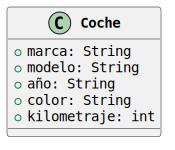
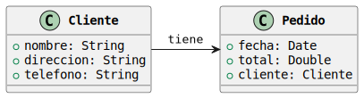
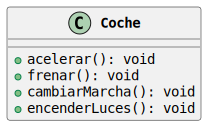
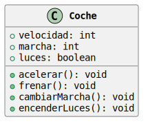

<!-- _class: cover -->
<!-- _paginate: false -->

# Clases y Objetos

## Programación Orientada a Objetos

Dr. Jaime Jesús Delgado Meraz

### Unidad 02

#### AED - 1286

#### IAD - 2424


---

# Docente


Nombre
: Dr. Jaime Jesús Delgado Meraz

Correo
: <jesus.delgado@tecvalles.mx>
: <jaime.dm@cdvalles.tecnm.mx>

Enlaces
: :icon:brand-github: github.com/j2deme
: :icon:news: j2deme.github.io
: :icon:brand-instagram: j2deme

---

<!-- _class: cols-2 -->

# Asignatura

::: left

Nombre
: Programación Orientada a Objetos

Carrera
: Ingeniería en Sistemas Computacionales
: Ingeniería en Desarrollo de Aplicaciones
: Ingeniería en Inteligencia Artificial

:::
::: right

Clave
: AED - 1286
: IAD - 2424

SATCA
: 2 - 3 - 5

:::

---

<!-- _class: toc -->

# Contenidos

1. [Definición de clases](#definición-de-clases)
2. [Declaración de clases](#declaración-de-clases)
3. [Declaración de métodos](#declaración-de-métodos)
4. [Instanciación de objetos](#instanciación-de-objetos)
5. [Referencia al objeto actual](#referencia-al-objeto-actual)
6. [Composición de clases](#composición-de-clases)
7. [Manejo de excepciones](#manejo-de-excepciones)

---

# Competencia Específica de la Unidad

> Define, crea e implementa clases y objetos en la programación, aplicando el paradigma orientado a objetos, para resolver diversos problemas de manera efectiva

---

<!-- _class: lead -->

# Definición de clases

---

<!-- _class: split -->

# Definición de clases

## Clase

::: top

> Una **clase** es una plantilla para la creación de objetos de datos según un modelo predefinido.

- Sin importar el lenguaje de programación, el concepto y la funcionaldiad subyacente de una clase, sigue siendo la misma.
- Sirve para describir un conjunto de variables (atributos) y funciones (métodos), que se agrupan bajo un mismo nombre (clase).
- Los miembros de una clase pueden ser variables, métodos, constructores, bloques de inicialización e incluso clases anidadas.

:::
::: left

#### Java

```java
class NombreClase {
  // Miembros de la clase
}
```

:::

::: right

#### Python

```python
class NombreClase:
  # Miembros de la clase
```

:::

---

# Definición de clases

## Atributos

> Los atributos son variables que se declaran dentro de una clase. Cada objeto de la clase tiene su propia copia de los atributos de la clase.

- Los atributos definen las propiedades de un objeto, y son las características que distinguen a un objeto de otro.
  - Se pueden declarar como públicos, privados o protegidos.
- Suelen estar representados por tipos de datos primitivos, aunque también se pueden utilizar estructuras como arreglos o listas, e incluso otras clases.
- Es importante recordar que los atributos de una clase, no se inicializan automáticamente, por lo que es necesario hacerlo explícitamente (con excepción de algunos lenguajes de tipado dinámico).
- Si la clase hereda de otra, los atributos de la clase padre también se consideran parte de la clase hija.

---

# Definición de clases

## Atributos

- Los atributos son una parte fundamental de la programación orientada a objetos, ya que permiten definir las características o propiedades de un objeto.
- En otras palabras, los atributos son variables internas dentro de los objetos que almacenan información sobre el estado del objeto.
- Son importantes porque permiten modelar objetos de la vida real en el código.

  - _P.e._ si estamos modelando una clase `Coche` podemos definir atributos como `marca`, `modelo`, `año`, `color`, `kilometraje`, entre otros.
  - Estos atributos nos permiten almacenar información sobre el coche y acceder a ella en cualquier momento.



---

# Definición de clases

## Atributos

- Los atributos también son importantes porque permiten establecer relaciones entre objetos, lo que es fundamental en la programación orientada a objetos.
  - _P.e._ si estamos modelando un sistema de ventas, podemos definir una clase `Cliente` con atributos como `nombre`, `direccion`, `telefono`, y una clase `Pedido` con atributos como `fecha`, `total`, y un atributo `cliente` que hace referencia al objeto `Cliente` al que pertenece el pedido.
    
- De esta manera, podemos establecer una relación entre las clase `Cliente` y `Pedido`.

---

# Definición de clases

## Métodos

> Los métodos son funciones que se declaran dentro de una clase y que definen el comportamiento de los objetos de esa clase.

- Los métodos definen el comportamiento de un objeto, y son las acciones que un objeto puede realizar.
  - Al igual que los atributos, pueden ser públicos, privados o protegidos.
- Los métodos, como cualquier función, pueden recibir parámetros y devolver valores, además de poder realizar operaciones sobre los atributos de la clase.
- Los métodos pueden ser estáticos, lo que significa que pertenecen a la clase y no a un objeto en particular.
- Si la clase hereda de otra, los métodos de la clase padre también se consideran parte de la clase hija y pueden ser sobreescritos.

---

# Definición de clases

## Métodos

- Los métodos son entonces **funciones** que se definen dentro de una clase y que pueden ser invocadas por los objetos de esa clase, definen el comportamiento de los objetos y las operaciones a realizar con los atributos de la clase.
  - _P.e._ si estamos modelando la clase `Coche`, podemos definir métodos como `acelerar()`, `frenar()`, `cambiarMarcha()`, `encenderLuces()`, entre otros.
- Estos métodos nos permiten definir el comportamiento del coche y realizar operaciones con los atributos del coche, como la velocidad, la marcha, el estado de las luces, entre otros.



---

<!-- _class: lead -->

# Declaración de clases

---

<!-- _class: split -->

# Declaración de clases

## Declaración

:::top

> La declaración de una clase consiste en definir la plantilla con los miembros (atributos) y comportamientos (métodos) de un objeto.

- La sintaxis para declarar una clase es similar en la mayoría de los lenguajes de programación orientados a objetos, utilizando la palabra clave `class` seguida del nombre de la clase.

:::
::: left

#### Java

```java
class Persona {
  // Atributos
  String nombre;
  int edad;
  // Métodos
  void saludar() {
    System.out.println("Hola, soy " + nombre);
  }
}
```

:::
::: right

#### Python

```python
class Persona:
  # Atributos
  nombre = ""
  edad = 0
  # Métodos
  def saludar(self):
    print("Hola, soy", self.nombre)
```

:::
::: ok
Aunque se revisarán diferentes lenguajes de programación, se dará énfasis en **Python**.
:::

---

# Declaración de clases

## Declaración

```python
class Coche:
  velocidad = 0
  marcha = 0
  luces = False

  def acelerar(self):
    self.velocidad += 10

  def frenar(self):
    if self.velocidad > 0:
      self.velocidad -= 10

  def cambiarMarcha(self, marcha):
    self.marcha = marcha

  def encenderLuces(self):
    self.luces = True
```



---

<!-- _class: split -->

# Declaración de clases

## Atributos

::: top

- La declaración de atributos en la mayoría de los lenguajes programación orientados a objetos sigue una sintaxis similar.

:::
::: left

#### Java

```java
class Persona {
  String nombre;
  String apellido;
  int edad;
}
```

:::
::: right

#### Python

```python
class Persona:
  nombre = ""
  apellido = ""
  edad = 0
```

:::
::: bottom

- Por default, los atributos de una clase son públicos, lo que significa que pueden ser accedidos y modificados desde cualquier parte del programa.
- Este comportamiento sirve para simplificar el código y facilitar el acceso a los atributos de una clase, pero también puede llevar a errores si no se controla el acceso a los atributos.

:::

---

# Declaración de clases

## Métodos

- La declaración de métodos, sigue una sintaxis similar a la de las funciones, con la diferencia de que se definen dentro de una clase y pueden acceder a los atributos de la clase.

#### Java

```java
class Persona {
  // Atributos
  public void saludar() {
    System.out.println("Hola, mi nombre es " + this.nombre + " " + this.apellido);
  }
}
```

#### Python

```python
class Persona:
  # Atributos
  def saludar(self):
    print(f"Hola, mi nombre es {self.nombre} {self.apellido}")
```

---

# Declaración de clases

## Encapsulamiento

> El encapsulamiento es un principio de la programación orientada a objetos que consiste en ocultar los detalles de implementación de un objeto y exponer solo la interfaz pública.

- Los modificadores de acceso permiten definir si un atributo o método es público, privado o protegido, y en algunos casos si su alcance es de paquete.
- Generalmente, los atributos y métodos de una clase son públicos por default, y pueden ser accedidos y modificados desde cualquier parte del programa.
- Sin embargo, es una buena práctica utilizar modificadores de acceso para restringir el acceso a los atributos y métodos de una clase y evitar que se modifiquen de manera incorrecta.
- Lenguajes como Python o Ruby no tienen modificadores de acceso como tal, pero se pueden simular utilizando convenciones de nomenclatura (conocidos como _name mangling_).

---

<!-- _class: split -->

# Declaración de clases

## Encapsulamiento

### Modificadores de acceso

::: top
La mayoría de los lenguajes de programación orientados a objetos utilizan el mismo conjunto de modificadores de acceso para controlar el acceso a los atributos y métodos de una clase.
:::

::: left

Public `+`
: Los atributos y métodos públicos pueden ser accedidos y modificados desde cualquier parte del programa.

Private `-`
: Los atributos y métodos privados solo pueden ser accedidos y modificados desde dentro de la clase.

:::
::: right

Protected `#`
: Los atributos y métodos protegidos solo pueden ser accedidos y modificados desde dentro de la clase y sus subclases.

Package `~`
: Los atributos y métodos de paquete solo pueden ser accedidos y modificados desde dentro del paquete al que pertece la clase.

:::

---

# Declaración de clases

## Encapsulamiento

### Modificadores de acceso

```java {3-5,7,11,15}
class Persona {
  // Atributos
  private String nombre;
  private String apellido;
  private int edad;
  // Métodos
  public void saludar() {
    System.out.println("Hola, mi nombre es " + this.nombre + " " + this.apellido);
  }
  // Getters y Setters
  public String getNombre() {
    return this.nombre;
  }

  public void setNombre(String nombre) {
    this.nombre = nombre;
  }
}
```

---

# Declaración de clases

## Encapsulamiento

### Modificadores de acceso en Python

Python no tiene modificadores de acceso como Java u otros lenguajes de programación orientados a objetos, pero los "simula" utilizando convenciones de nomenclatura, conocidas como _name mangling_[*:Consulta más en <https://www.geeksforgeeks.org/name-mangling-in-python/>].

- Todos los atributos y métodos de una clase son públicos por default, lo que significa que pueden ser accedidos y modificados desde cualquier parte del programa: `objeto.atributo`.
- Para simular atributos y métodos protegidos, se utiliza un guión bajo (`_`) al principio del nombre del atributo o método: `_atributo`.
- Para los atributos y métodos privados, se utiliza un guión bajo doble (`__`) al principio del nombre del atributo o método: `__atributo`.

Estas convenciones de nomenclatura no impiden que los atributos y métodos sean accedidos o modificados, pero indican que no deben ser accedidos o modificados directamente, y sirven como una forma de documentación para los desarrolladores.

---

# Declaración de clases

## Encapsulamiento

### Modificadores de acceso en Python

```python
class Persona:
  # Atributos
  nombre = "" # Atributo público (por default)
  _apellido = "" # Atributo "protegido"
  __edad = 0 # Atributo "privado"

  # Métodos
  def saludar(self):
    print(f"Hola, mi nombre es {self.__nombre} {self.__apellido}")

  def __metodo_privado(self):
    print("Este es un método privado")

  # Getters y Setters
  def get_nombre(self):
    return self.__nombre

  def set_nombre(self, nombre):
    self.__nombre = nombre
```

---

# Declaración de clases

## Encapsulamiento

### Modificadores de acceso en Python

- En Python, los atributos y métodos privados no son realmente privados, ya que se puede acceder a ellos desde fuera de la clase utilizando la convención de nomenclatura `_NombreClase__atributo` o `_NombreClase__metodo`.

```python
jaime = Persona()
jaime.nombre = "Jaime"
jaime._apellido = "Delgado" # Atributo "protegido"
jaime.__edad = 30 # No se puede acceder directamente
jaime._Persona__edad = 30 # Atributo "privado"

jaime.saludar()
jaime._Persona__metodo_privado() # Método privado
```

- Se considera una mala práctica acceder a los atributos y métodos privados de una clase desde fuera de la clase, ya que rompe el encapsulamiento y puede llevar a errores en el código.
  - Lo mismo aplica para los atributos y métodos protegidos, que pueden ser accedidos desde fuera de la clase, pero no deberían serlo.

---

# Declaración de clases

## Constructor

> Un constructor es un método especial que se llama automáticamente cuando se crea un objeto de una clase.

- En la mayoría de los lenguajes de programación orientados a objetos, los constructores se utilizan para inicializar los atributos de un objeto y realizar cualquier otra operación necesaria al crear un objeto.
- Generalmente, los constructores tienen el mismo nombre que la clase y no devuelven ningún valor, ya que su función principal es inicializar los atributos de un objeto.
- Algunos lenguajes de programación permiten tener varios constructores en una clase, lo que se conoce como **sobrecarga de constructores** y permite crear objetos de diferentes maneras.

---

<!-- _class: split -->

# Declaración de clases

## Constructor

::: top

- La sintaxis para definir un constructor puede variar ligeramente entre los lenguajes de programación, pero generalmente se define utilizando el mismo nombre que la clase.

:::

::: left

```java
public class CuentaPasos {
  private int pasos;

  public CuentaPasos() {
    this.pasos = 0;
  }
}
```

:::
::: right

```python
class CuentaPasos:
  pasos = 0

  def __init__(self):
    self.pasos = 0
```

:::
::: bottom

- Es común que los nombres de clase utilicen una convención de nomenclatura en **CamelCase**[*:La primera letra de cada palabra se escribe en mayúscula, sin espacios ni guiones bajos] para distinguirlos de los nombres de variables y funciones.
- Algo importante a notar en Python, es que el constructor se define utilizando el método `__init__`, que no es un constructor en sí, sino un método especial que se llama automáticamente al crear un objeto de la clase.

:::

---

<!-- _class: split -->

# Declaración de clases

## Constructor

### Paso de Parámetros

:::top

- Los constructores también pueden recibir parámetros, los cuales se utilizan para inicializar los atributos de un objeto.

:::
::: left

```java
public class CuentaPasos {
  private int pasos;

  public CuentaPasos(int pasos) {
    this.pasos = pasos;
  }
}
```

:::
::: right

```python
class CuentaPasos:
  pasos = 0

  def __init__(self, pasos):
    self.pasos = pasos
```

:::
::: bottom

- Los parámetros de un constructor se utilizan para inicializar los atributos de un objeto con valores específicos.
- Al igual que los métodos, los constructores pueden recibir cualquier número de parámetros, y los parámetros pueden tener valores por default, en los lenguajes que lo permiten.

:::

---

# Declaración de clases

## Destructor

> Un destructor es un método especial que se llama automáticamente cuando un objeto de una clase es destruido.

- Así como los constructores se utilizan para inicializar los atributos de un objeto, los destructores se utilizan para liberar los recursos utilizados por un objeto y realizar cualquier otra operación necesaria al destruir un objeto.
- Generalmente, los destructores tienen el mismo nombre que la clase, pero con un prefijo o sufijo especial, como `~NombreClase` o `NombreClase::~NombreClase`.
- Algunos lenguajes de programación **no** tienen destructores, ya que se encargan automáticamente de liberar la memoria utilizada por los objetos cuando ya no son necesarios.

---

# Declaración de clases

## Destructor

A diferencia de los constructores, los destructores utilizan una serie de palabras reservadas diversas para su declaración.

- En C++ se utiliza el símbolo `~` seguido del nombre de la clase.
- En Java se utiliza un método llamado `finalize`[*:Obsoleto desde Java 9, al 2025 se encuentra en su versión 23].
- En Python se utiliza el método `__del__`.
- En PHP se utiliza el método `__destruct`.
- En C# se utiliza el método `Dispose`.

Aunque los destructores son muy útiles en lenguajes como C o C++, en otros lenguajes, el uso de destructores no es tan común, ya que el recolector de basura se encarga de liberar la memoria automáticamente, incluso, se considera una mala práctica utilizar destructores en estos lenguajes.

---

<!-- _class: split -->

# Declaración de clases

## Destructor

### Implementación

::: top

Algunos lenguajes requieren la implementación de destructores para liberar la memoria utilizada por los objetos.

:::

::: left

#### C++

```cpp
class CuentaPasos {
  private:
    int pasos;

  public:
    CuentaPasos() {
      pasos = 0;
    }

    ~CuentaPasos() {
      cout << "Objeto destruido" << endl;
    }
};
```

:::
::: right

#### Rust

```rust
struct CuentaPasos {
  pasos: i32
}

impl CuentaPasos {
  fn new() -> CuentaPasos {
    CuentaPasos { pasos: 0 }
  }
}

impl Drop for CuentaPasos {
  fn drop(&mut self) {
    println!("Objeto destruido");
  }
}
```

:::

---

# Declaración de clases

## Destructor

### Implementación moderna

Los lenguajes de programación modernos, sugieren **no** implementar la funcionalidad de los destructores, ya que el recolector de basura se encarga de liberar la memoria automáticamente, según los requerimientos del sistema operativo.

- Al no ser **determinístico**[*:Es decir, que no se conoce cuándo se llamará el destructor de un objeto], no se puede garantizar cuándo se liberarán los recursos utilizados.
- En lugar de utilizar destructores, se recomienda utilizar otros métodos para liberar los recursos utilizados por un objeto, como el método `close` en Java o Python, que se encarga de liberar los recursos utilizados por un objeto cuando ya no son necesarios.
- Estrictamente hablando, el uso de destructores no esta ligado a la "modernidad" de un lenguaje, sino a la forma en que se maneja la memoria y los recursos en el lenguaje, en este sentido, lenguajes como C++ o Rust, que no tienen recolector de basura, requieren la implementación de destructores para liberar la memoria utilizada por los objetos.

---

# Declaración de clases

## Sobrecarga de métodos

> Se define como **sobrecarga** a la posibilidad de definir métodos con el mismo nombre pero con diferentes parámetros, también se conoce como **_overloading_**.

- Se utiliza para definir métodos que realizan la misma operación pero con diferentes parámetros.

```java
public class CuentaPasos {
  private int pasos;

  public void contar() {
    this.pasos++;
  }

  public void contar(int pasos) {
    this.pasos += pasos;
  }
}
```

---

# Declaración de clases

## Sobrecarga de métodos

- La sobrecarga de métodos es una característica común en la mayoría de los lenguajes de programación orientados a objetos, y permite definir métodos con el mismo nombre pero con diferentes parámetros.
- Esto sirve para definir métodos que realizan la misma operación pero con diferentes parámetros, lo que permite reutilizar el nombre del método y simplificar el código.
- En la mayoría de los lenguajes de programación, la sobrecarga de métodos se basa en la cantidad y tipo de parámetros, lo que significa que dos métodos con el mismo nombre pero con diferentes tipos de parámetros se consideran diferentes métodos.
- Sin embargo, algunos lenguajes de programación no permiten la sobrecarga de métodos de manera nativa, ya que se considera una mala práctica y puede llevar a confusiones en el código, como es el caso de Python.

---

# Declaración de clases

## Sobrecarga de métodos

### Python

- A diferencia de otros lenguajes como Java o C++, en Python no es posible sobrecargar métodos de manera nativa.
  - Solo se permite definir un método con un nombre determinado para evitar ambigüedades.

```python
class CuentaPasos:
  pasos = 0

  def contar(self): # Este método queda "oculto" por el siguiente
    self.pasos += 1

  def contar(self, pasos):
    self.pasos += pasos
```

- Python no distingue los métodos por la cantidad y tipo de parámetros, sino por el nombre del método, lo que significa que solo se puede definir un método con un nombre determinado en una clase, y si se define un método con el mismo nombre, se sobrescribe el método anterior.

---

# Declaración de clases

## Sobrecarga de métodos

### Python

- Si se requiere, es posible simular la sobrecarga de métodos utilizando parámetros opcionales.

```python
class CuentaPasos:
  pasos = 0

  def contar(self, pasos = 1):
    self.pasos += pasos
```

- Sin embargo, esto solo es funcional cuando se define un método con el mismo nombre y diferente número de parámetros, pero **no** cuando se define un método con el mismo nombre y diferente tipo de parámetros.
- Además de que no es una solución muy elegante, especialmente cuando se tienen muchos parámetros.

---

<!-- _class: inverted -->

# Instalación de Librerías en Python

- Python permite la instalación de librerías de terceros para extender la funcionalidad del lenguaje, utilizando el administrador de paquetes `pip`.

```bash
pip --version
```

- Este administrador de paquetes permite instalar, desinstalar y actualizar paquetes de Python de manera sencilla, utilizando la línea de comandos y suele venir preinstalado con Python.

```bash
pip install libreria
```

- Los paquetes instalados con `pip` se instalan de manera global, lo que significa que están disponibles para todos los proyectos de Python en el sistema.
- Es posible instalar paquetes de manera local utilizando un entorno virtual, lo que permite tener diferentes versiones de un paquete en diferentes proyectos.

---

<!-- _class: inverted -->

# Instalación de Librerías en Python

- Una alternativa para controlar las dependencias por proyecto, es utilizar un ambiente virtual.
- Un ambiente virtual es un entorno de desarrollo aislado que permite instalar paquetes de Python de manera local, sin afectar al sistema global.

```bash
cd proyecto # Cambiar al directorio del proyecto
python -m venv myenv # Crear un ambiente virtual "myenv"
source myenv/bin/activate # Activar el ambiente virtual

pip install libreria # Instalar la librería en el ambiente virtual

deactivate # Desactivar el ambiente virtual
```

- Aunque en general el uso de ambientes virtuales es opcional, es una buena práctica utilizarlos para evitar conflictos entre paquetes y versiones de Python en diferentes proyectos.
- Sin embargo, se debe ser cuidadoso al instalar paquetes en un ambiente virtual, ya que se pueden generar múltiples instalaciones del mismo paquete en diferentes ambientes virtuales.

---

# Declaración de clases

## Sobrecarga de métodos

### Python

- Para lograr la sobrecarga de métodos en Python, es necesario utilizar la librería `multipledispatch`.

```bash
pip install multipledispatch
```

```python
from multipledispatch import dispatch

class CuentaPasos:
  pasos = 0

  @dispatch() # Método sin parámetros
  def contar(self):
    self.pasos += 1

  @dispatch(int) # Método con un parámetro de tipo entero
  def contar(self, pasos):
    self.pasos += pasos
```

---

# Declaración de clases

## Sobrecarga de métodos

### Python

#### Multipledispatch

- La librería `multipledispatch` permite definir métodos con el mismo nombre pero con diferentes parámetros.
- Para ello, se utiliza el decorador `@dispatch` antes de cada método, indicando los tipos de parámetros que recibe (`int`, `float`, `str`, `bool`, `list`, `tuple`, `dict`, `set`, `object`, `...`)
- En caso de que se utilicen parámetros de diferentes tipos, se ejecutará el método que coincida con el tipo de parámetros.
- En caso de que se utilicen parámetros de un tipo que no se ha definido, se ejecutará el método que no recibe parámetros.

---

# Declaración de clases

## Sobrecarga de métodos

### Python

#### Multipledispatch

```python
from multipledispatch import dispatch

class CuentaPasos:
  pasos = 0

  @dispatch() # Método sin parámetros
  def contar(self):
    self.pasos += 1

  @dispatch(int) # Método con un parámetro de tipo entero
  def contar(self, pasos):
    self.pasos += pasos

  @dispatch(int, int) # Método con dos parámetros de tipo entero
  def contar(self, pasos, saltos = 0):
    self.pasos += pasos +  (2 * saltos)
```

---

# Declaración de clases

## Sobrecarga de operadores

> La sobrecarga de operadores es una característica de la programación orientada a objetos que permite definir el comportamiento de los operadores en una clase.

- Es soportada por la mayoría de los lenguajes de programación orientados a objetos, y permite definir cómo se comportan los operadores en una clase, suele estar relacionada con la sobrecarga de métodos.
- Con la sobrecarga de operadores se pueden definir operaciones personalizadas para los operadores aritméticos, de asignación, de comparación, etc.
- Esto permite que los objetos de una clase se comporten como tipos de datos primitivos, lo cual es muy útil en algunos casos.
  - _P.e._ si queremos sumar dos objetos de una clase `CuentaPasos` para obtener el total de pasos.

---

# Declaración de clases

## Sobrecarga de operadores

- En Java el único operador que se puede sobrecargar es el operador `+`, el cual se utiliza comúnmente para concatenar cadenas de texto.
- Esta "limitación" es una característica de diseño de Java, para que los operadores tengan un comportamiento consistente en todo el lenguaje y se reduzca el riesgo de errores.
- Aunque Java suele ser un lenguaje "insignia" al hablar de la programación orientada a objetos, algunos autores consideran que Java no es un lenguaje orientado a objetos puro[*:https://www.geeksforgeeks.org/java-not-purely-object-oriented-language/].
- Sin embargo, la sobrecarga de operadores no es una característica esencial de la programación orientada a objetos, y no todos los lenguajes de programación orientados a objetos la soportan.

---

# Declaración de clases

## Sobrecarga de operadores

```java
public class CuentaPasos {
  private int pasos;

  public CuentaPasos(int pasos) {
    this.pasos = pasos;
  }

  public CuentaPasos operator+(CuentaPasos cuenta) {
    return new CuentaPasos(this.pasos + cuenta.pasos);
  }

  public getPasos() {
    return this.pasos;
  }
}
```

---

# Declaración de clases

## Sobrecarga de operadores

```java
public class Main {
  public static void main(String[] args) {
    CuentaPasos cuenta1 = new CuentaPasos(10);
    CuentaPasos cuenta2 = new CuentaPasos(20);
    CuentaPasos cuenta3 = cuenta1 + cuenta2;

    System.out.println(cuenta3.getPasos()); // 30
  }
}
```

::: info
Si bien, algunos compiladores alternativos para Java como **Manifold** permiten sobrecargar un número mayor de operadores, es importante recordar que Java no soporta la sobrecarga de operadores de manera nativa.
:::

---

<!-- _class: inverted -->

# Lenguajes puramente Orientados a Objetos

- Muchas veces, al pensar en Programación Orientada a Objetos se piensa en lenguajes como Java o C++, sin embargo, estos lenguajes **no** son puramente orientados a objetos.

> Un lenguaje puramente orientado a objetos es aquel en el que **todo** es un objeto, incluyendo los tipos de datos primitivos.

- Ejemplos de lenguajes puramente orientados a objetos son Smalltalk, Ruby, Scala, Python, entre otros, mismos que desde su concepción fueron diseñados para ser orientados a objetos.
- Lo anterior no significa que los lenguajes "no puros" no sean buenos, sino que tienen características que los hacen diferentes y que pueden ser útiles en diferentes contextos.

---

# Declaración de clases

## Sobrecarga de operadores

### Python

#### Operadores aritméticos

- En Python, la sobrecarga de operadores se realiza mediante métodos especiales, los cuales se conocen como **métodos mágicos**.

```python
class CuentaPasos:
  pasos = 0

  def __init__(self, pasos):
    self.pasos = pasos

  def __add__(self, cuenta):
    return CuentaPasos(self.pasos + cuenta.pasos)

  def __sub__(self, cuenta):
    return CuentaPasos(self.pasos - cuenta.pasos)

  def getPasos(self):
    return self.pasos
```

---

# Declaración de clases

## Sobrecarga de operadores

### Python

#### Operadores aritméticos

- Cada operador aritmético tiene un método mágico asociado, que se llama automáticamente cuando se utiliza el operador con un objeto de la clase.

```python
cuenta1 = CuentaPasos(10)
cuenta2 = CuentaPasos(20)
cuenta3 = cuenta1 + cuenta2
cuenta2 = cuenta2 - cuenta1

print(cuenta3.getPasos()) # 30
print(cuenta2.getPasos()) # 10
```

---

<!-- _class: inverted -->

# Métodos mágicos en Python

En Python, la sobrecarga de operadores se realiza mediante métodos especiales, los cuales se conocen como 🧙🏻‍♂️ **métodos mágicos**.

- Los métodos mágicos son métodos especiales que se utilizan para realizar operaciones especiales, como la sobrecarga de operadores.
- Se identifican porque comienzan y terminan con doble guión bajo (`__metodo__`).
- De hecho, no se llaman directamente, sino que se invocan de forma implícita cuando se utiliza un operador.
- Los operadores más comúnmente sobrecargados con métodos mágicos son suma (`__add__`), resta (`__sub__`), multiplicación (`__mul__`), división (`__div__`) e igualdad (`__eq__`).

[tip:https://rszalski.github.io/magicmethods/#operators]

---

# Declaración de clases

## Sobrecarga de operadores

Los operadores pueden ser unarios o binarios.

- Los operadores unarios son aquellos que actúan sobre un solo operando, como el operador de negación (`!`) o el operador de incremento (`++`) o decremento (`--`).
- Los operadores binarios son aquellos que actúan sobre dos operandos, como el operador de suma (`+`) o el operador de asignación (`=`).

Algunos operadores pueden ser unitarios o binarios, dependiendo de su contexto.

- _P.e._ el operador de suma (`+`) puede ser unitario o binario, dependiendo de si se utiliza para sumar dos números o para indicar el signo de un número.

---

# Declaración de clases

## Sobrecarga de operadores

### Python

#### Operadores sobrecargables

- Los operadores que comúnmente se pueden sobrecargar son:
  - Operadores aritméticos: `+`, `-`, `*`, `/`, `//`, `%`, `**`
  - Operadores de comparación: `==`, `!=`, `>`, `<`, `>=`, `<=`
  - Operadores de asignación: `=`, `+=`, `-=`, `*=`, `/=`
  - Operadores lógicos: `and`, `or`, `not`
  - Operadores de identidad: `is`, `is not`
  - Operadores de membresía: `in`, `not in`
  - Operadores de bit: `&`, `|`, `^`, `~`, `<<`, `>>`
- Dependiendo del lenguaje, se pueden sobrecargar [otros operadores](https://realpython.com/python-operators-expressions/).
  - Es importante tener en cuenta que no es necesario sobrecargar todos los operadores, sino solo aquellos que sean necesarios para el comportamiento de la clase.

---

# Declaración de clases

## Sobrecarga de operadores

### Python

#### No sobrecargables

- Así como es posible sobrecargar algunos operadores, hay otros que **no** se pueden sobrecargar, esto es debido a que son operadores especiales que tienen un significado específico en el lenguaje.
- Los operadores que **no** se pueden sobrecargar son:
  - Operadores de acceso: `.`, `[]`, `()`, `->`
  - Operadores de alcance: `::`
  - Operadores condicionales: `?:`
  - Operadores de secuencia: `,`, `...`
  - Operadores de tipo: `sizeof`, `typeid`, `alignof`

::: warning
La sobrecarga de operadores puede ser útil en algunos casos, sin embargo, sino se realiza correctamente, puede llegar a ser confusa y propensa a errores. En lenguajes como Python, la sobrecarga permite que el código sea más legible y expresivo.
:::

---

# Declaración de clases

## Sobrecarga de operadores

### Conversión a String

Otra sobrecarga de operadores que se puede realizar es la **conversión a string**, esta sirve para representar un objeto como una cadena de caracteres.

- En algunos lenguajes, como Java, la conversión a string se realiza mediante el método `toString()`.
- En Python, la conversión a string se realiza mediante el método `__str__`.
- Esta conversión se realiza cuando se imprime un objeto o cuando se utiliza la función de conversión a string.

---

<!-- _class: cols-2 -->

# Declaración de clases

## Sobrecarga de operadores

### Conversión a String

::: left

```java
class CuentaPasos {
  int pasos = 0;

  public CuentaPasos(int pasos) {
    this.pasos = pasos;
  }

  public String toString() {
    return pasos + " 👟";
  }
}

CuentaPasos cuenta = new CuentaPasos(10);
System.out.println(cuenta); // 10 👟
```

:::
::: right

```python
class CuentaPasos:
  pasos = 0

  def __init__(self, pasos):
    self.pasos = pasos

  def __str__(self):
    return str(self.pasos) + " 👟"

cuenta = CuentaPasos(10)
print(cuenta) # 10 👟
```

:::

---

<!-- _class: inverted -->

# **str** vs **repr**

- En Python, además del método `__str__` existe otro método mágico llamado `__repr__`, el cual se utiliza para representar un objeto como una cadena de caracteres.
- La diferencia entre ambos es que `__str__` se utiliza para representar un objeto como una cadena de caracteres legible para humanos, mientras que `__repr__` se utiliza para representar un objeto como una cadena de caracteres legible para la máquina.
  - _P.e._ `__str__` puede devolver `10 👟`, mientras que `__repr__` puede devolver `CuentaPasos(10)`.

---

<!-- _class: lead -->

# Declaración de métodos

---

# Declaración de métodos

## Métodos

> Los métodos son funciones que se definen dentro de una clase y que se utilizan para modificar el estado de un objeto.

- Los métodos son similares a las funciones, pero se definen dentro de una clase.
- Se utilizan para realizar operaciones con los atributos de un objeto.
- Los métodos pueden recibir parámetros y devolver un valor.
- Los métodos se declaran de la misma forma que las funciones, pero dentro de una clase.

---

# Declaración de métodos

::: primary
La declaración de un método incluye su nombre, los parámetros que recibe y el tipo de valor que devuelve.
:::

```java
public class Coche {
  int marcha = 0;

  public void cambiarMarcha(int marcha) {
    this.marcha = marcha;
  }
}
```

```python
class CuentaPasos:
  pasos = 0

  def contar(self):
    self.pasos += 1
```

---

# Declaración de métodos

## Método sin parámetros y sin retorno de valor

<div class="flex">
  <div class="w-1/2">

```java
public void contar() {
  this.pasos++;
}
```

  </div>
  <div class="w-1/2">

```python
def contar(self):
  self.pasos += 1
```

  </div>
</div>

## Método con parámetros y sin retorno de valor

<div class="flex">
  <div class="w-1/2">

```java
public void cambiarMarcha(int marcha) {
  this.marcha = marcha;
}
```

  </div>
  <div class="w-1/2">

```python
def cambiarMarcha(self, marcha):
  self.marcha = marcha
```

  </div>
</div>

---

# Declaración de métodos

## Método sin parámetros y con retorno de valor

<div class="flex">
  <div class="w-1/2">

```java
public int obtenerPasos() {
  return this.pasos;
}
```

  </div>
  <div class="w-1/2">

```python
def obtenerPasos(self):
  return self.pasos
```

  </div>
</div>

## Método con parámetros y con retorno de valor

<div class="flex">
  <div class="w-1/2">

```java
public double calcularDistancia(int pasos) {
  return pasos * 0.7; // 1 paso = 0.7 metros
}
```

  </div>
  <div class="w-1/2">

```python
def calcularDistancia(self, pasos):
  return pasos * 0.7 # 1 paso = 0.7 metros
```

  </div>
</div>

---

# Declaración de métodos

## Paso de mensajes

Además de modificar el estado de un objeto, los métodos también se utilizan para llamar a otros métodos de la misma clase, a esto se le conoce como **enviar mensajes**.

```python
class CuentaPasos:
  pasos = 0

  def contar(self):
    self.pasos += 1

  def brincarAdelante(self):
    self.contar()
    self.contar()
```

---

# Declaración de métodos

## Paso de parámetros

Los parámetros se utilizan para enviar valores a un método.

```python
class CuentaPasos:
  pasos = 0

  def contar(self):
    self.pasos += 1

  def calcularDistancia(self, pasos):
    # 0.7 pasos por cada metro
    return pasos * 0.7

  def distanciaAPasos(self, distancia):
    return round(distancia / 0.7)
```

---

# Declaración de métodos

## Retorno de valores

El retorno de valores se refiere al valor que devuelve un método después de su ejecución.

- El valor de retorno puede ser cualquier tipo de dato, incluyendo objetos.
- En los lenguajes fuertemente tipados se utiliza la palabra reservada `void` cuando el método (función) no devuelve ningún valor.

```java
public void brincarAdelante() {
  this.contar();
  this.contar();
}
```

---

# Declaración de métodos

## Retorno de valores

```python
class CuentaPasos:
  pasos = 0

  def contar(self):
    self.pasos += 1

  # Función sin retorno
  def brincarAdelante(self):
    self.contar()
    self.contar()

  # Función con retorno
  def calcularDistancia(self, pasos):
    # 0.7 pasos por cada metro
    return pasos * 0.7
```

---

<!-- _class: lead -->

# Instanciación de objetos

---

# Instanciación de objetos

> La instanciación de objetos es el proceso de crear un objeto a partir una clase.

- En la programación orientada a objetos, un objeto es una instancia de una clase, y se crea utilizando el constructor de la clase.
- La instanciación de objetos se realiza mediante la palabra reservada `new` en lenguajes como Java o C++, o mediante la llamada al constructor de la clase en lenguajes como Python o Ruby.
- Al instanciar un objeto, se reserva un espacio en memoria para almacenar el objeto y se inicializan los atributos del objeto con los valores por default o con los valores pasados como parámetros al constructor.

---

# Instanciación de objetos

Consideremos la clase `CuentaPasos` definida anteriormente.

### Java

```java
CuentaPasos cuenta = new CuentaPasos(10);
```

### Python

```python
cuenta = CuentaPasos(10)
```

- En algunos lenguajes de programación, como Java, es necesario utilizar la palabra reservada `new` para instanciar un objeto, mientras que en otros lenguajes, como Python, no es necesario utilizar la palabra reservada `new`, ya que la instanciación de objetos se realiza directamente mediante la llamada al constructor de la clase.

---

# Instanciación de objetos

## Objetos

> Un **objeto** es una instancia de una clase.

- En otras palabras, un objeto es una variable que contiene una referencia a una clase.
- Los objetos son importantes porque nos permiten crear instancias de una clase y utilizar sus atributos y métodos.
  - _P.e._ si estamos modelando una clase `Coche`, podemos crear un objeto `coche1` que sea una instancia de la clase `Coche` y que contenga los atributos y métodos de la misma.
- De esta manera, podemos crear múltiples objetos de una misma clase y utilizarlos en nuestro programa.

---

<!-- _class: cols-2 -->

# Instanciación de objetos

::: left

```python
class Coche:
  __velocidad = 0
  __marcha = 0
  __luces = False

  def __init__(self, luces = False):
    self.__luces = luces

  def acelerar(self):
    self.__velocidad += 10

  def frenar(self):
    self.__velocidad -= 10

  def cambiarMarcha(self, marcha):
    self.__marcha = marcha

  def encenderLuces(self):
    self.__luces = True
```

:::
::: right

```python
  def __str__(self):
    return f"Velocidad: {self.__velocidad}, Marcha: {self.__marcha}, Luces: {self.__luces}"
```

:::

---

<!-- _class: split -->

# Instanciación de objetos

::: left

### Java

```java
class Coche {
  String marca;
  String modelo;
  int anio;
}

Coche tsuru = new Coche();
Coche aveo = new Coche();
```

:::
::: right

### Python

```python
class Coche:
  marca = ""
  modelo = ""
  anio = 0


tsuru = Coche()
aveo = Coche()
```

:::
::: top
A la declaración de un objeto se le conoce como **instanciación**, y el mecánismo mediante el cual el lenguaje de programación reserva memoria para los objetos.
:::

---

<!-- _class: cols-2 -->

# Instanciación de objetos

## Objetos

::: left
La **instanciación** de una clase es el proceso de crear un objeto a partir de una clase.

En la mayoría de los lenguajes de programación orientados a objetos, la instanciación sigue una sintaxis similar.
:::
::: right

```python
class Persona:
  nombre = ""
  apellido = ""
  edad = 0

jaime = Persona()
```

```java
class Persona {
  String nombre;
  String apellido;
  int edad;
}

Persona jaime = new Persona();
```

:::

---

# Instanciación de objetos

La instanciación de objetos es un proceso importante en la programación orientada a objetos, ya que nos permite crear instancias de una clase y utilizar sus atributos y métodos.

- La correcta instanciación de objetos, es una estrategia básica para el manejo de memoria en la programación orientada a objetos.
- Una mala instanciación de objetos puede llevar a errores en el código, como la pérdida de memoria o la corrupción de datos, o simplemente a un mal rendimiento del programa.

---

<!-- _class: lead -->

# Referencia al objeto actual

---

# Referencia al objeto actual

> En la programación orientada a objetos, la referencia al objeto actual se utiliza para hacer referencia al objeto que está siendo manipulado en un determinado método dentro de una clase.

- Sirve para acceder a los atributos y métodos del objeto actual.
- Se puede decir que es una forma de asegurar que los atributos (variables) y métodos (funciones) que se están modificando o utilizando son aquellos que pertenecen a la instancia de memoria que realmente se está utilizando.
- Con esto se evita que se modifiquen atributos o se utilicen métodos de otros objetos, o incluso variables o funciones que no pertenecen a la clase.

---

# Referencia al Objeto Actual

## This & Self

Dependiendo del lenguaje de programación, la referencia al objeto actual se hace de una forma u otra.

- En Java, la referencia al objeto actual se hace con la palabra reservada `this`, también se utiliza en otros lenguajes como C#, C++ y PHP.
- En Python, la referencia al objeto actual se hace con la palabra reservada `self`, también se utiliza en otros lenguajes como Ruby, Objective-C y PHP.
- PHP puede utilizar ambas palabras reservadas, `this` y `self`, dependiendo del contexto en el que se utilicen, pero su uso más común es `this`.

En ambos casos, se utiliza para acceder a los atributos y métodos del objeto actual.

---

# Referencia al objeto actual

## Java

```java {6,10}
public class Persona {
  String nombre;
  String apellido;

  public void saludar() {
    System.out.println("Hola, mi nombre es " + this.nombreCompleto());
  }

  public String nombreCompleto() {
    return this.nombre + " " + this.apellido;
  }
}
```

---

# Referencia al abjeto actual

## Python

```python {6,9}
class Persona:
  nombre = ""
  apellido = ""

  def saludar(self):
    print("Hola, mi nombre es " + self.nombreCompleto())

  def nombreCompleto(self):
    return self.nombre + " " + self.apellido
```

---

<!-- _class: lead -->

# Composición de clases

---

# Composición de clases

::: primary
La composición es un principio de la programación orientada a objetos que consiste en crear objetos complejos a partir de objetos más simples.
:::

- La composición se utiliza para crear objetos complejos a partir de objetos más simples.
  - _P.e._ un objeto `Coche` se puede componer de objetos `Motor`, `Ruedas`, `Puertas`, `Ventanas`, `Asientos`, etc.
- La composición se utiliza para crear relaciones entre objetos, como la relación entre un objeto `Coche` y un objeto `Motor`.

---

# Composición de clases

La composición se puede realizar mediante **atributos** o mediante **métodos**.

Basada en atributos
: Cuando un objeto se compone de otros objetos a través de sus atributos.
: _P.e._ un objeto `Coche` se compone de un objeto `Motor`, un objeto `Chasis` y una lista de objetos `Llanta`.

Basada en métodos
: Cuando un objeto se compone de otros objetos a través de sus métodos.
: _P.e._ un objeto `Coche` se compone de un objeto `Motor` que es un parámetro de un método del objeto `Coche`.

---

<!-- _class: split -->

# Composición

## Composición basada en atributos

::: top

- Se puede decir que el objeto `Coche` se compone de un objeto `Motor`, un objeto `Chasis` y una lista de objetos `Llanta`.
- En este caso, los objetos `Motor`, `Chasis` y `Llanta` son atributos del objeto `Coche`.

:::
::: left

```java
class Coche {
  Motor motor;
  Chasis chasis;
  ArrayList<Llanta> llantas;
}
```

:::
::: right

```python
class Coche:
  motor = Motor()
  chasis = Chasis()
  llantas = [Llanta(), Llanta(), Llanta(), Llanta()]
```

:::

---

<!-- _class: split -->

# Composición

## Composición basada en métodos

::: top

- En este caso, el objeto `Coche` tiene un método `encender` que recibe como parámetro un objeto `Motor`, el cual es utilizado para encender el motor del coche.
- Se puede decir que el objeto `Coche` se compone de un objeto `Motor` que es un parámetro del método `encender`.

:::
::: right

```java
class Coche {
  public void encender(Motor motor) {
    motor.encender();
  }
}
```

:::
::: left

```python
class Coche:
  def encender(self, motor):
    motor.encender()
```

:::

---

# Composición

Es importante tener en cuenta que la composición es un principio de la programación orientada a objetos que se utiliza para crear objetos complejos a partir de objetos más simples.

- Es posible que un objeto se componga de otros objetos a través de sus atributos o de sus métodos, que tipo de composición se utilice dependerá del diseño de la clase y de la relación que se quiera establecer entre los objetos.
- Igualmente, es posible que la composición por atributos y por métodos se utilicen en conjunto, dependiendo de las necesidades del programa.
- La composición de atributos se utiliza principalmente para crear **relaciones entre objetos**, mientras que la composición por métodos se utiliza para realizar **operaciones con otros objetos**.

---

# Composición

## Composición por métodos

- Supongamos una clase `Coche` que se compone de un objeto `Motor` y una lista de objetos `Llanta`.

```python
class Motor:
  def __init__(self, no_serie):
    self.no_serie = no_serie

  def encender(self):
    print("Encendiendo motor")

  def __str__(self):
    return f"Motor: {self.no_serie}"
```

---

# Composición

## Composición por métodos

- La clase `Llanta` se utilizará mediante una lista de objetos de tipo `Llanta`.

```python
class Llanta:
  def __init__(self, etiqueta):
    self.etiqueta = etiqueta
    self.presion = 0

  def inflar(self, presion=32):
    self.presion = presion
    print(f"Inflando llanta a {self.presion} PSI")

  def __str__(self):
    return f"{self.etiqueta} ({self.presion} PSI)"
```

---

<!-- _class: cols-2 -->

# Composición

## Composición por métodos

::: left

```python
class Coche:
  def __init__(self):
    self.llantas = []

  def encender(self, motor):
    motor.encender()

  def agregarLlanta(self, llanta):
    self.llantas.append(llanta)
```

:::
::: right

```python
  motor = Motor("67894")
  coche = Coche()
  coche.encender(motor)

fi = Llanta("FI")
fi.inflar(28)
fd = Llanta("FD")
fd.inflar(28)

coche.agregarLlanta(fi)
coche.agregarLlanta(fd)

```

:::

---

<!-- _class: cols-2 -->

# Composición

## Composición por atributos

::: left

```python
class Coche:
  def __init__(self, no_serie):
    self.motor = Motor(no_serie)
    self.ruedas = [
      Llanta("FI"), Llanta("FD"),
      Llanta("TI"), Llanta("TD")
    ]

def encender(self):
  self.motor.encender()

def inflarRuedas(self):
  for llanta in self.ruedas:
    llanta.inflar()
```

:::
::: right

```python
coche = Coche("123456")
coche.encender()
coche.inflarRuedas()

print(coche.motor) # Motor: 123456

print(coche.llantas[0]) # FI (32 PSI)
print(coche.llantas[2]) # TI (32 PSI)
```

:::

---

<!-- _class: lead -->

# Manejo de excepciones

---

# Manejo de excepciones

---

<!-- _class: inverted centered pattern -->


<div class="text-center text-middle font-bold font-coding text-8xl mt-10">
  &lt;/Fin&gt;
</div>

---

<!-- paginate: skip -->
<!-- class: references -->

# Referencias

- Editor B@UNAM, CCH & ENP (2023). _Conceptos Básicos de Programación Orientada a Objetos_. <https://alianza.bunam.unam.mx/cch/conceptos-basicos-de-programacion-orientada-a-objetos/>
- Martínez Canelo, M. (2020). _¿Qué es la Programación Orientada a Objetos?_. <https://profile.es/blog/que-es-la-programacion-orientada-a-objetos/>
- IBM. (2021). _Programación Orientada a Objetos_. <https://www.ibm.com/docs/es/spss-modeler/saas?topic=language-object-oriented-programming>
- IBM. (2021). _Definición de una Clase_. <https://www.ibm.com/docs/es/spss-modeler/saas?topic=programming-defining-class>
- IBM. (2021). _Definición de Atributos de Clase y Métodos_. <https://www.ibm.com/docs/es/spss-modeler/saas?topic=programming-defining-class-attributes-methods>
- Python Software Foundation. (2022). _Data Classes_. <https://docs.python.org/3/library/dataclasses.html>

---

# Referencias

- Álvarez, E.J. (2022). _Introducción a DataClasses en Python_. <https://platzi.com/blog/introduccion-a-dataclasses-en-python/>
- Silveira, O.S. (2022). _How to Use Python Data Classes in 2023 (A Beginner’s Guide)_. <https://www.dataquest.io/blog/how-to-use-python-data-classes/>
- GeeksforGeeks. (2024). _Access Modifiers in Python : Public, Private and Protected_. <https://www.geeksforgeeks.org/access-modifiers-in-python-public-private-and-protected/>
- GeeksforGeeks. (2020). _Name Mangling in Python_. <https://www.geeksforgeeks.org/name-mangling-in-python/>
- Tamrakar, S.M. (2024). _Understanding Name Mangling in Python: A Mechanism for Attribute Protection_. <https://suyojtamrakar.medium.com/understanding-name-mangling-in-python-a-mechanism-for-attribute-protection-920716e05dda>
- Medewar, G. B. (2024). _What are Java Default Parameters?_. <https://www.scaler.com/topics/java-default-parameters/>

---

# Referencias

- Wikipedia. (2024)._Recolector de Basura_.<https://es.wikipedia.org/wiki/Recolector_de_basura>
- Okafor, C.C. (2023). _Rust’s Ownership System: Memory Safety Without Garbage Collection_. <https://doziestar.medium.com/rusts-ownership-system-memory-safety-without-garbage-collection-c820542aaf14>
- Astral (2025). _uv_. <https://github.com/astral-sh/uv>
- Hostinger Tutorials. (2024). _How to Create a Virtual Environment in Python_. <https://www.hostinger.com/tutorials/how-to-create-a-python-virtual-environment>
- GeekforGeeks. (2024). _Why Java is not a purely Object-Oriented Language?_. <https://www.geeksforgeeks.org/java-not-purely-object-oriented-language/>
- Kettler, R. (2012). _A Guide to Python's Magic Methods_.<https://rszalski.github.io/magicmethods/#operators>
- NXT Wave .(2025). _Method Overloading in Python With Practical Examples_. <https://www.ccbp.in/blog/articles/method-overloading-in-python>

---

# Referencias

- Manifold Systems. (2025). _Manifold_. <https://manifold.systems/>
