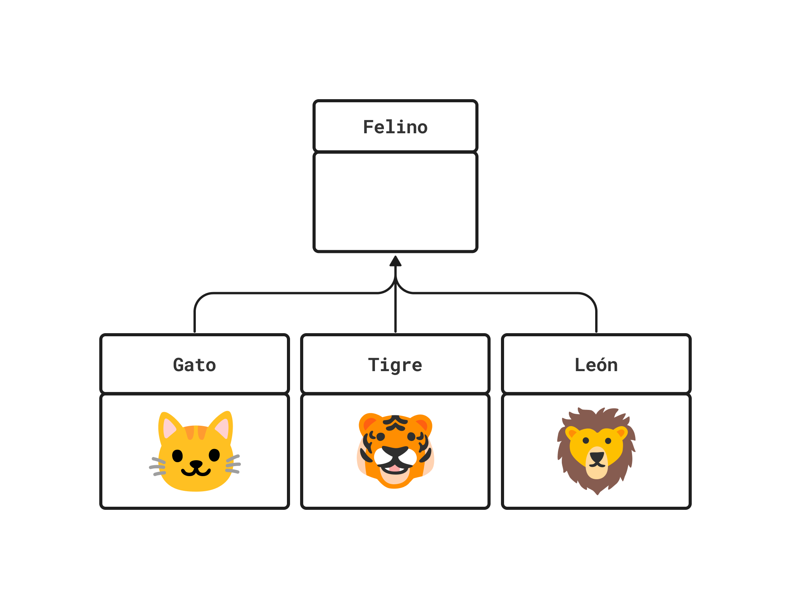
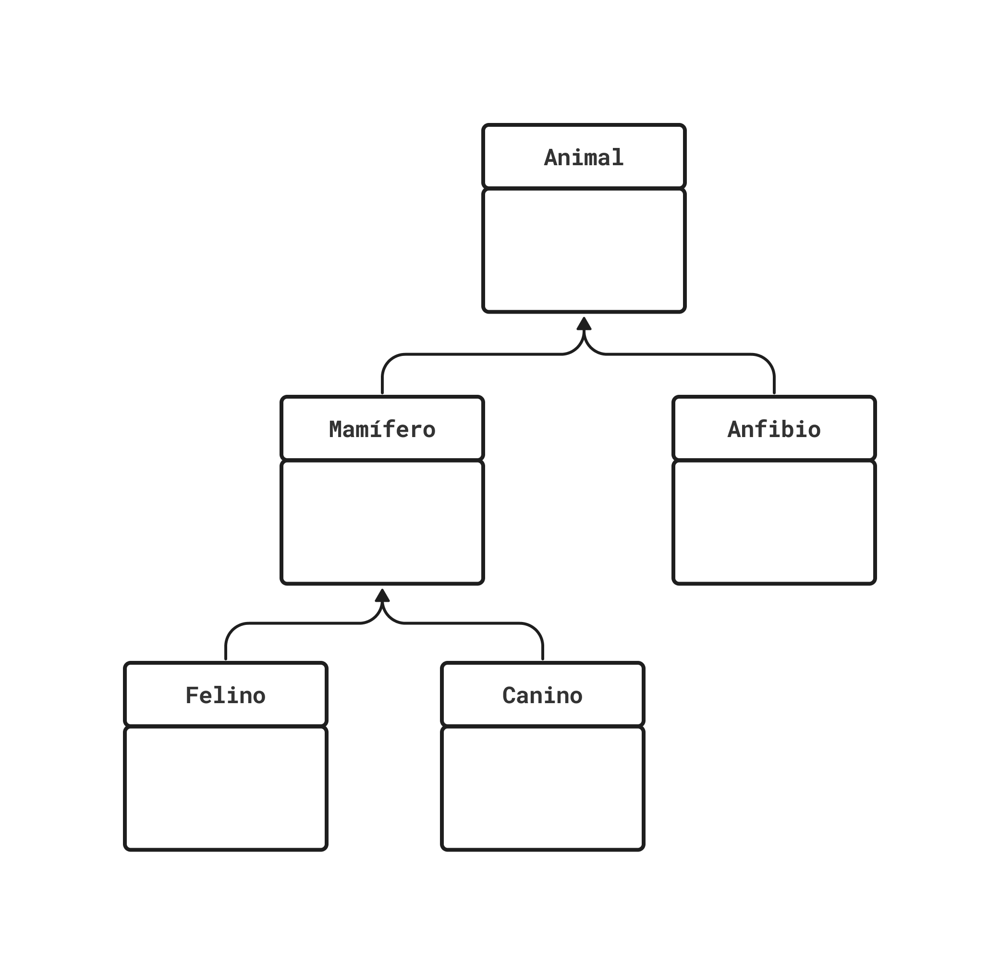
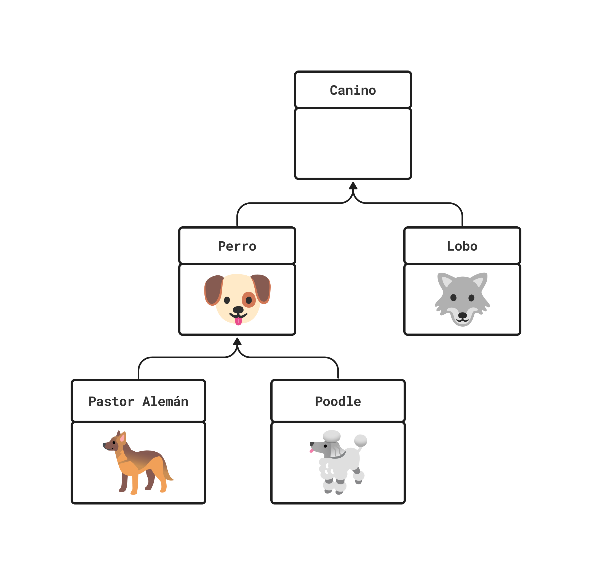
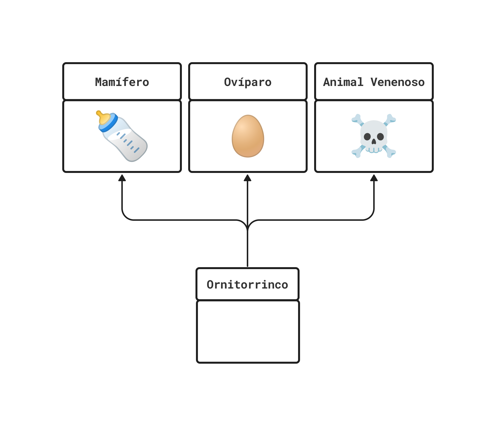

<!-- _class: cover -->
<!-- _paginate: false -->

# Herencia

## Programación Orientada a Objetos

Dr. Jaime Jesús Delgado Meraz

### Unidad 03

#### AED - 1286

#### IAD - 2424


---

# Docente


Nombre
: Dr. Jaime Jesús Delgado Meraz

Correo
: <jesus.delgado@tecvalles.mx>
: <jaime.dm@cdvalles.tecnm.mx>

Enlaces
: :icon:brand-github: github.com/j2deme
: :icon:news: j2deme.github.io
: :icon:brand-instagram: j2deme

---

<!-- _class: cols-2 -->

# Asignatura

::: left

Nombre
: Programación Orientada a Objetos

Carrera
: Ingeniería en Sistemas Computacionales
: Ingeniería en Desarrollo de Aplicaciones
: Ingeniería en Inteligencia Artificial

:::
::: right

Clave
: AED - 1286

SATCA
: 2 - 3 - 5

:::

---

<!-- _class: toc -->

# Contenidos

1. [Herencia](#herencia)
2. [Herencia simple](#herencia-simple)
3. [Herencia múltiple](#herencia-múltiple)
4. [Atributos y métodos heredados](#atributos-y-métodos-heredados)
5. [Referencia a la clase base](#referencia-a-la-clase-base)
6. [Overriding](#overriding)
7. [Constructores con herencia](#constructores-con-herencia)

---

# Competencia específica de la unidad

> Implementa los conceptos de herencia para diseñar clases base y derivadas, así como para emplear clases abstractas, con el propósito de desarrollar soluciones de software de forma eficiente y modular

---

<!-- _class: lead -->

# Herencia

---

# Herencia

## Clases y herencia

::: primary
Una clase es una plantilla para la creación de objetos de datos según un modelo predefinido.
:::

- Cada clase es un modelo que define un conjunto de variables (el estado), y métodos apropiados para operar con dichos datos (el comportamiento).
- Las clases puede incluir sus propios métodos y atributos, pero también puede incluir métodos y atributos heredados de clases previas.

---

# Herencia

::: primary
La herencia es un mecanismo que permite crear nuevas clases a partir de otras ya existentes.
:::

- La herencia se basa en la reutilización de código, donde una clase nueva puede **heredar** los atributos y métodos de una clase existente.
- La herencia permite definir una jerarquía de clases, donde una **clase base** puede ser extendida por una o más **clases derivadas**.
- La clase de la cual se deriva se conoce como clase base, clase padre o superclase.
- Por su parte, la nueva clase se conoce como clase derivada, clase hija o subclase.
- La relación natural que representa este mecanismo es la relación **es un**.
  - _P.e._ Un perro **es un** animal, una manzana **es una** fruta.

---

# Herencia

## Ventajas

- **Reutilización de código**: Se pueden reutilizar los atributos y métodos de una clase base en una clase derivada.
- **Extensibilidad**: Se pueden agregar nuevos atributos y métodos a una clase derivada sin modificar la clase base.
- **Facilidad de mantenimiento**: Al modificar la clase base, los cambios se reflejan en todas las clases derivadas.
- **Polimorfismo**: Se pueden definir métodos en la clase base y redefinirlos en las clases derivadas[*:Se revisará en la siguiente unidad].

---

# Herencia

## Desventajas

- **Acoplamiento**: Las clases derivadas dependen de la clase base, lo que puede aumentar el acoplamiento entre las clases.
- **Complejidad**: La herencia puede aumentar la complejidad de un programa, especialmente cuando se hereda de múltiples clases base.
- **Jerarquía profunda**: Una jerarquía de clases muy profunda puede hacer que el código sea difícil de entender y mantener.
- **Ambigüedad**: La herencia múltiple puede causar problemas de ambigüedad cuando se heredan miembros con el mismo nombre.

---

# Herencia

## Tipos de herencia

La herencia se puede clasificar en dos tipos:

Simple
: Una clase derivada hereda los atributos y métodos de una única clase base.

Múltiple
: Una clase derivada hereda los atributos y métodos de múltiples clases base.

---

<!-- _class: lead -->

# Herencia simple

---

# Herencia simple



- La herencia simple es aquella en la que una clase derivada hereda los atributos y métodos de una única clase base.
- La herencia simple es la forma más común de herencia y se basa en la relación entre la clase base y la clase derivada.

---

# Herencia simple

## Clase base o superclase



> La clase base es la clase de la cual se deriva una nueva clase.

- La clase base puede ser una clase definida por el usuario o una clase de la biblioteca estándar.
- La clase base puede ser una clase derivada de otra clase.

---

# Herencia simple

## Definición de una clase base

### Java

```java
class Animal {
  String nombre;
  int edad;

  Animal(String nombre, int edad) {
    this.nombre = nombre;
    this.edad = edad;
  }

  void comer() {
    System.out.println(this.nombre + " esta comiendo");
  }

  void dormir() {
    System.out.println(this.nombre + " esta durmiendo");
  }

  void hacerSonido() {
    System.out.println(this.nombre + " esta haciendo sonidos");
  }
}
```

---

# Herencia simple

## Definición de una clase base

### Python

```python
class Animal:
  def __init__(self, nombre, edad):
    self.nombre = nombre
    self.edad = edad

  def comer(self):
    print(f'{self.nombre} esta comiendo')

  def dormir(self):
    print(f'{self.nombre} esta durmiendo')

  def hacer_sonido(self):
    print(f'{self.nombre} esta haciendo sonidos')
```

---

# Herencia simple

## Clase derivada o subclase



> La clase derivada es la clase que se deriva de una clase base.

- La clase derivada hereda todos los atributos y métodos de la clase base y puede agregar nuevos atributos y métodos.
- En la clase derivada, se pueden redefinir los métodos heredados para modificar su comportamiento.

---

<!-- _class: cols-2 -->

# Definición de la Clase Derivada

::: left

```java
class Perro extends Animal {
  String raza;

  Perro(String nomb, int edad, String raza) {
    super(nomb, edad);
    this.raza = raza;
  }

  void hacerSonido() {
    System.out.println(this.nombre + " esta ladrando");
  }
}

class Gato extends Animal {
  int vidas;

  Gato(String nombre, int edad, int vidas) {
    super(nombre, edad);
    this.vidas = vidas;
  }

  void hacerSonido() {
    System.out.println(this.nombre + " esta maullando");
  }
}
```

:::
::: right

```python
class Perro(Animal):
  def __init__(self, nombre, edad, raza):
    super().__init__(nombre, edad)
    self.raza = raza

  def hacer_sonido(self):
    print(f'{self.nombre} esta ladrando')

class Gato(Animal):
  def __init__(self, nombre, edad, vidas):
    super().__init__(nombre, edad)
    self.vidas = vidas

  def hacer_sonido(self):
    print(f'{self.nombre} esta maullando')
```

:::

---

<!-- _class: cols-2 -->

# Herencia simple

## Uso

::: left

```java
class Main {
  public static void main(String[] args) {
    Perro perro = new Perro("Firulais", 5, "Chihuahua");
    Gato gato = new Gato("Garfield", 3, 7);

    perro.comer(); // Firulais esta comiendo
    perro.dormir(); // Firulais esta durmiendo
    perro.hacerSonido(); // Firulais esta ladrando
    perrro.vidas; // ❌ Error

    gato.comer(); // Garfield esta comiendo
    gato.dormir(); // Garfield esta durmiendo
    gato.hacerSonido(); // Garfield esta maullando
  }
}
```

:::
::: right

```python
if __name__ == '__main__':
  perro = Perro('Firulais', 5, 'Chihuahua')
  gato = Gato('Garfield', 3, 7)

  perro.comer() # Firulais esta comiendo
  perro.dormir() # Firulais esta durmiendo
  perro.hacer_sonido() # Firulais esta ladrando

  gato.comer() # Garfield esta comiendo
  gato.dormir() # Garfield esta durmiendo
  gato.hacer_sonido() # Garfield esta maullando
  gato.raza # ❌ Error
```

:::

---

<!-- _class: lead -->

# Herencia múltiple

---

# Herencia múltiple

::: primary
La herencia múltiple es una característica que permite a una clase derivada heredar de múltiples clases base.
:::

- La herencia múltiple es una característica que **no** está presente en todos los lenguajes de programación orientada a objetos.
- Se utiliza para crear clases que heredan de múltiples clases base.
  - _P.e._ Imaginemos una clase `Murcielago` que hereda de las clases `Mamifero` y `Volador`.

---

# Herencia múltiple

- En lenguajes como _Python_ y _JavaScript_, la herencia múltiple se puede utilizar de forma nativa.

```python
class Murcielago(Mamifero, Volador):
  # ...
```

```javascript
class Murcielago extends Mamifero, Volador {
  // ...
}
```

---

# Herencia múltiple

## Consideraciones

Al momento de heredar de múltiples clases base, se debe considerar que:

- Las clases base pueden tener atributos y métodos con el mismo nombre, por lo que se debe considerar el orden de herencia.
- El orden de herencia puede afectar el funcionamiento de los métodos de la clase derivada.
- Esta consideración de orden también debe tomarse en cuenta momento de llamar al constructor de la clase base.

::: warning
Para evitar problemas de ambigüedad, de ser posible se debe evitar heredar de clases base que tengan miembros con el mismo nombre.
:::

---

# Herencia múltiple

## Consideraciones

- En lenguajes como _Python_ y _JavaScript_, el orden de herencia se define en la declaración de la clase.

```python
class Murcielago(Mamifero, Volador):
  # ...
```

- Si se desea llamar al constructor de la clase base, se debe considerar el orden de herencia.

```python
class Murcielago(Mamifero, Volador):
  def __init__(self, nombre, edad, especie):
    Mamifero.__init__(self, nombre, edad, especie)
    Volador.__init__(self, nombre, edad)
```

---

# Herencia múltiple

## Consideraciones

- Cuando se hereda de múltiples clases base, se debe considerar el orden de herencia al momento de llamar a los métodos de la clase base.

```python
# Suponiendo que ambas superclases tuvieran un método denominado
# "soy_un" y la subclase no lo tuviera
class Murcielago(Mamifero, Volador):
  # ...

dracula = Murcielago(nombre='Drácula', edad=100, especie='Vampiro')
dracula.soy_un() # Soy un mamífero
```

- Se ejecuta el método de la primera clase base en el orden de herencia, determinado por el [_Method Resolution Order_](https://www.educative.io/answers/what-is-mro-in-python).

---

<!-- _class: inverted -->

# Herencia múltiple vs Herencia en cascada

> No se debe confundir la herencia múltiple con la herencia en cascada.

- La herencia múltiple se da cuando una clase hereda de múltiples clases base.
  _P.e._ `class Murcielago(Mamifero, Volador)`
- La herencia en cascada por otro lado se da cuando una clase hereda de una clase base, y esta a su vez hereda de otra clase base.
  - _P.e._ `class Perro(Mamifero)` y `class Mamifero(SerVivo)`

---

# Herencia múltiple

## Uso en lenguajes no soportados

- Es posible emular la herencia múltiple en lenguajes que no la soportan de manera nativa, como _Java_ y _C#_, mediante el uso de interfaces.

```java
class Murcielago extends Mamifero, Volador { // ❌ Error de compilación
  // ...
}

class Perro extends Mamifero implements Volador { // ✅
  // ...
}
```

- Al implementar una interfaz, se debe implementar todos sus métodos, por lo que al momento de heredar clase padre es importante considerar si se _extiende_ o _implementa_.

---

# Herencia múltiple

## Uso de interfaces



Supongamos que tenemos una clase `Ornitorrinco` que hereda de las clases `Mamifero`, `Ovíparo` y `Venenoso`.

::: warning
No se deben confundir las interfaces de los lenguajes de programación con las _Interfaces de Usuario_ (UI).
:::

---

```java
class Mamifero {
  public void amamantar() {
    System.out.println("🍼");
  }

  public void parir() {
    System.out.println("👶🏻");
  }
}

// Las interfaces no requieren implementación de métodos
interface Oviparo {
  int NUMERO_HUEVOS = 0;
  public void ponerHuevo();
}

interface Venenoso {
  public void inyectarVeneno();
}
```

---

```java
class Ornitorrinco extends Mamifero implements Oviparo, Venenoso {
  public amamantar() {
    System.out.println("Amamantar a un ornitorrinco es raro");
  }

  public void ponerHuevo() {
    System.out.println("🥚");
    NUMERO_HUEVOS++;
  }

  public void inyectarVeneno() {
    System.out.println("💉");
  }
}
```

- Al implementar la herencia múltiple en Java, se debe considerar que una clase solo puede heredar de una clase padre, pero puede implementar múltiples interfaces.

---

# Herencia múltiple

## Implementación nativa

```python
class Mamifero:
  def __init__(self, nombre, edad):
    self.nombre = nombre
    self.edad = edad

  def amamantar(self):
    print('🍼')

  def parir(self):
    print('👶🏻')

class Oviparo:
  NUMERO_HUEVOS = 0
  def poner_huevo(self):
    print('🥚')
    self.NUMERO_HUEVOS += 1

class Venenoso:
  def inyectar_veneno(self):
    print('💉')
```

---

```python
class Ornitorrinco(Mamifero, Oviparo, Venenoso):
  # ...
  # A diferencia del uso de interfaces en Java, en Python,
  # no se requiere implementar los métodos de las clases base
  def __init__(self, nombre, edad):
    # Llama al constructor de la clase Mamifero, la primera clase
    # base, determinada por el MRO
    super().__init__(nombre, edad)
    self.NUMERO_HUEVOS = 0

perry = Ornitorrinco('Perry', 5)
print(f'{perry.nombre} ha puesto {perry.NUMERO_HUEVOS} huevos') # 0
perry.poner_huevo() # 🥚
print(f'{perry.nombre} ha puesto {perry.NUMERO_HUEVOS} huevos') # 1
```

---

<!-- _class: lead -->

# Atributos y métodos heredados

---

# Atributos y métodos heredados

::: info
Los miembros de una clase son sus atributos y métodos.
:::

- Estos miembros pueden ser heredados desde una clase base a sus clases derivadas y pueden ser utilizados como si fueran miembros propios.
- Los miembros heredados también pueden ser utilizados para definir nuevos miembros en la clase derivada.
  - _P.e._ si se tuvieran los atributos `nombre` y `apellidos` en la clase base, se podrían utilizar para definir un nuevo atributo `nombre_completo` en la clase derivada.

---

# Atributos y métodos heredados

## Superclase `Animal`

```python
class Animal:
  def __init__(self, nombre, edad):
    self.nombre = nombre
    self.edad = edad

  def comer(self):
    print(f'{self.nombre} esta comiendo')

  def dormir(self):
    print(f'{self.nombre} esta durmiendo')

  def hacer_sonido(self):
    print(f'{self.nombre} esta haciendo sonidos')
```

---

# Atributos y métodos heredados

## Como miembros propios

```python
class Perro(Animal):
  def __init__(self, nombre, edad, raza):
    super().__init__(nombre, edad)
    self.raza = raza # Miembro propio

  def hacer_sonido(self):
    # Se utiliza el miembro heredado "nombre"
    print(f'{self.nombre} esta ladrando')

class Gato(Animal):
  def __init__(self, nombre, edad, vidas):
    super().__init__(nombre, edad)
    self.vidas = vidas # Miembro propio

  def hacer_sonido(self):
    # Se utiliza el miembro heredado "nombre"
    print(f'{self.nombre} esta maullando')
```

---

<!-- _class: cols-2 -->

# Atributos y métodos heredados

## Definición de nuevos miembros

::: left

```python
class Perro(Animal):
  def __init__(self, nombre, edad, raza):
    super().__init__(nombre, edad)
    self.raza = raza

  def es_cachorro(self): # Nuevo miembro
    # Se utiliza el miembro heredado "edad"
    return self.edad < 2
```

:::
::: right

```python
class Gato(Animal):
  def __init__(self, nombre, edad, vidas):
    super().__init__(nombre, edad)
    self.vidas = vidas

  def sobrevive(self): # Nuevo miembro
    # Se utiliza el miembro heredado "edad"
    if self.edad > 15 or self.vidas > 1:
      self.vidas -= 1

    return self.vidas > 0

  def hacer_sonido(self):
    super().hacer_sonido() # Miembro heredado
    print(f'Miau! 🐈')
```

:::

---

<!-- _class: lead -->

# Referencia a la clase base

---

# Referencia a la clase base

- La referencia a la clase base es una característica que permite a una clase derivada acceder a los atributos y métodos de la clase base.
- La referencia a la clase base se utiliza para llamar a los métodos heredados y agregar más funcionalidad a los métodos de la clase derivada.
- Las palabras clave utilizadas para hacer referencia a la clase base varían según el lenguaje de programación, pero suelen ser `super` o `parent`.

---

# Referencia a la clase base

## Uso en lenguajes

Para hacer referencia al objeto de la clase base, se utiliza la palabra clave `super`.

```python
class Perro(Animal):
  def hacer_sonido(self):
    super().hacer_sonido()
    print(f'{self.nombre} esta ladrando')
```

```java
class Gato extends Animal {
  public void hacerSonido() {
    super.hacerSonido();
    System.out.println(this.nombre + " esta maullando");
  }
}
```

- En lenguajes como _PHP_ y _JavaScript_ se utiliza la palabra `parent` para hacer referencia al objeto de la clase padre.

---

# Referencia a la clase base

## Usos de la referencia `super`

- Las referencias a la clase padre pueden ser utilizadas para acceder a los atributos heredados.
- Así también, pueden ser utilizadas para acceder a los métodos heredados y llamarlos.
- En el caso de los métodos, se puede utilizar la referencia a la clase padre para llamar a un método heredado y luego agregarle más funcionalidad.
- Cuando un método hace referencia a un método heredado de la clase padre, se conoce como **_overriding_**.

---

<!-- _class: split inverted -->

# Overriding vs Overloading

::: top

> La principal diferencia entre _overriding_ y _overloading_ es que el primero se realiza en clases derivadas, mientras que el segundo se realiza en la misma clase.
> ::
> ::: left

```python
class Animal:
  def hacer_sonido(self):
    print(f'Haciendo sonidos...')

class Gato(Animal):
  def hacer_sonido(self):
    super().hacer_sonido()
    print(f'Miau! 🐈')
```

El **overriding** se utiliza para redefinir un método heredado.

:::
::: right

```java
class Animal {
  public void hacerSonido() {
    System.out.println("Haciendo sonidos...");
  }

  public void hacerSonido(String sonido) {
    System.out.println(sonido);
  }
}
```

El **overloading** se utiliza para definir un método con el mismo nombre, pero con diferentes parámetros.

:::

---

<!-- _class: lead -->

# Overriding

---

# Overriding

> El **_overriding_** es una técnica de programación que permite modificar el comportamiento de un método heredado

- Sirve para agregar más funcionalidad al método padre, a través de su redefinición en las clases derivadas.
- Para redefinir un método, se utiliza el mismo nombre del método heredado.
- En lenguajes como _Java_ y _C#_, se utiliza la anotación `@Override` para indicar que se está redefiniendo un método heredado.

---

# Overriding

## Java

::: info
La anotación `@Override` suele ser utilizada por los IDEs para indicar que se está redefiniendo un método heredado.
:::

```java
class Gato extends Animal {
  @Override // Indica que se esta redefiniendo un método heredado
  public void hacerSonido() {
    super.hacerSonido(); // Llamada al método heredado
    System.out.println("Miau! 🐈"); // Nueva funcionalidad
  }
}
```

---

# Overriding

## Python

```python
class Gato(Animal):
  def hacer_sonido(self): # Redefinición del método heredado
    super().hacer_sonido() # Llamada al método heredado
    print(f'Miau! 🐈') # Nueva funcionalidad
```

En _Python_ y _JavaScript_ no existe una palabra clave para indicar que se está redefiniendo un método heredado.

- Si no se llama al método heredado, se dice que se está **_sobreescribiendo_** el método, conocido como **_overriding_**.
- Si se llama al método heredado, se dice que se está **_extendiendo_** el método, conocido como **_overloading_**.

---

<!-- _class: lead -->

# Constructores con herencia

---

# Constructores con herencia

Al utilizar la herencia, se debe tener en cuenta que el (los) constructor(es) de la clase base no son heredados.

- Se debe definir un constructor para cada clase derivada.
- En los constructores de las clases derivadas, se debe llamar al constructor de la clase base.
- En _Python_ y _JavaScript_, se debe llamar explícitamente al constructor de la clase base, mientras que en lenguajes como _Java_ y _C#_, la llamada al constructor es implícita.

---

# Constructores con herencia

## Super constructor

```python
class Perro(Animal):
  def __init__ (self, nombre, edad, raza):
    super().__init__(nombre, edad) # Llamada explicita
    self.raza = raza
```

```java
class Gato extends Animal {
  public Gato(String nombre, int edad, int vidas) {
    super(nombre, edad); // Llamada implicita
    this.vidas = vidas;
  }
}
```

::: warning
Sino se llama al constructor de la clase base, no se inicializarán los atributos heredados.
:::

---

# Constructores con herencia

## Omisión del super constructor

Cuando el constructor de la clase derivada no llama al constructor de la clase base, se dice que se está **_ocultando_** el constructor de la clase base.

- Lo anterior es válido en lenguajes como _Python_ y _JavaScript_, pero no en lenguajes como _Java_ y _C#_.

```python
class Perro(Animal):
  def __init__(self, nombre, edad, raza):
    self.raza = raza
```

```java
class Gato extends Animal {
  public Gato(String nombre, int edad, int vidas) {
    this.vidas = vidas; // ❌ Error de compilación
  }
}
```

---

# Constructores con herencia

## Destructores

- Aunque no es común, en algunos lenguajes de programación, como _C++_ y _Python_, se pueden definir destructores para liberar recursos al finalizar la vida de un objeto.

```python
class Perro(Animal):
  def __del__(self):
    print(f'{self.nombre} se ha ido al cielo de los perros')
```

```java
class Gato extends Animal {
  public void finalize() { // Implementación no recomendada
    System.out.println(this.nombre + " se ha ido al cielo de los gatos");
  }
}
```

::: info
Los destructores no son heredados en ningún lenguaje de programación, pero su implementación tampoco es obligatoria.
:::

---

# Constructores con herencia

## Implementación

```python
class Animal:
  def __init__(self, nombre, edad):
    self.nombre = nombre
    self.edad = edad

  def hacer_sonido(self):
    print(f'Haciendo sonidos...')

  def __del__(self):
    print(f'{self.nombre} se ha ido al cielo de los animales')
```

---

<!-- _header: '' -->

```python
class Perro(Animal):
  def __init__(self, nombre, edad, raza):
    super().__init__(nombre, edad)
    self.raza = raza

  def hacer_sonido(self):
    super().hacer_sonido()
    print(f'Guau! 🐕')

  def __del__(self):
    print(f'{self.nombre} se ha ido al cielo de los perros')
```

```python
class Gato(Animal):
  def __init__(self, nombre, edad, vidas):
    super().__init__(nombre, edad)
    self.vidas = vidas

  def hacer_sonido(self):
    super().hacer_sonido()
    print(f'Miau! 🐈')

  def __del__(self):
    print(f'{self.nombre} se ha ido al cielo de los gatos')
```

---

```python
perro = Perro('Firulais', 5, 'Chihuahua')
gato = Gato('Garfield', 3, 7)

perro.hacer_sonido() # Haciendo sonidos... Guau! 🐕
gato.hacer_sonido() # Haciendo sonidos... Miau! 🐈

del perro # Firulais se ha ido al cielo de los animales
del gato # Garfield se ha ido al cielo de los gatos
```

También es posible instanciar objetos de la clase base.

```python
animal = Animal('Pikachu', 2)
animal.hacer_sonido() # Haciendo sonidos...
del animal # Pikachu se ha ido al cielo de los animales
```

En todos los casos, la llamada al destructor de la clase base es opcional.

---

<!-- _class: lead -->

# Clases Abstractas

---

# Clases Abstractas

---

<!-- _class: lead -->

# Métodos Abstractos

---

# Métodos Abstractos

---

<!-- _class: inverted centered pattern -->


<div class="text-center text-middle font-bold font-coding text-8xl mt-10">
  &lt;/Fin&gt;
</div>

---

<!-- paginate: skip -->
<!-- class: references -->

# Referencias

-
-
-
