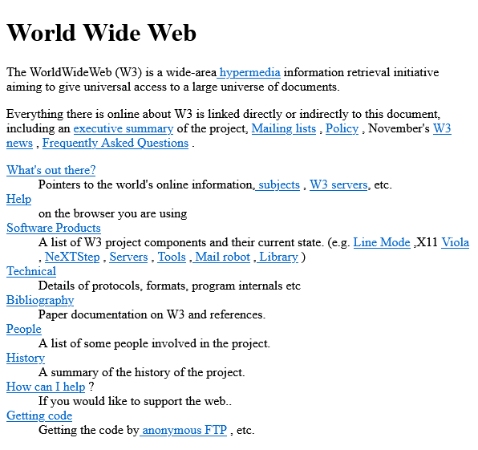
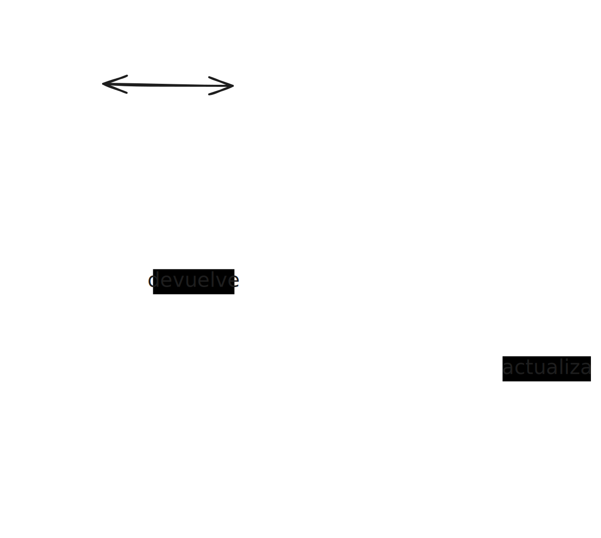
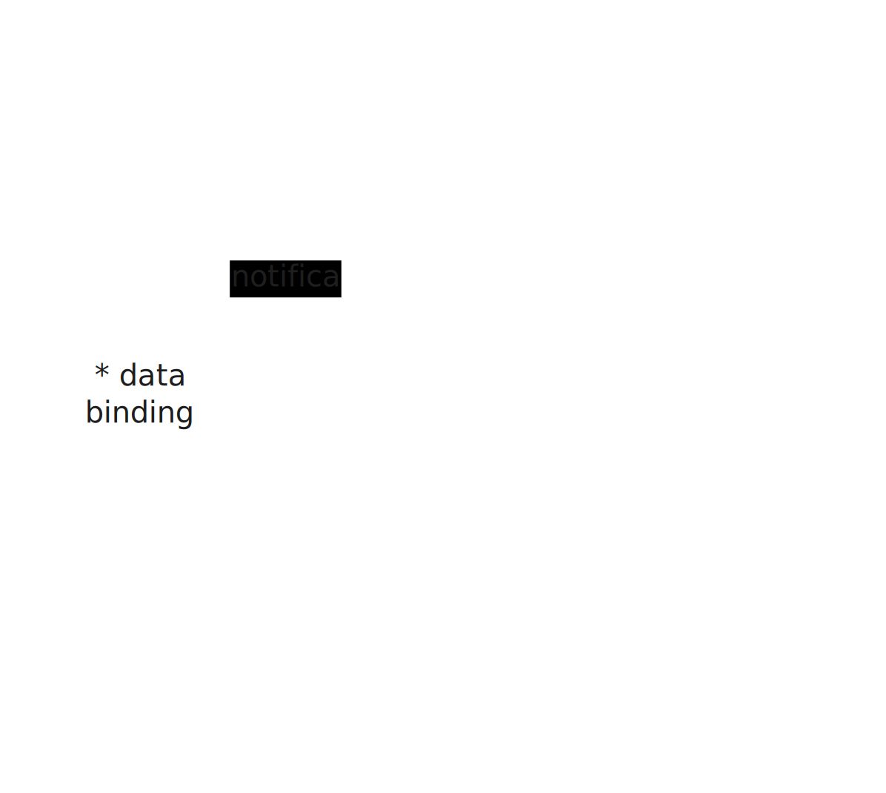

<!-- _class: centered -->
<!-- _paginate: false -->

# Unidad 1

# <!-- fit --> Introducción a las Aplicaciones Web

## Programación Web


---

# Docente


Nombre
: Dr. Jaime Jesús Delgado Meraz

Correo
: <jesus.delgado@tecvalles.mx>
: <jaime.dm@cdvalles.tecnm.mx>

---

# Asignatura

:::: flex
::: col 1/2 px-2
Nombre
: Programación Web

Carrera
: Ingeniería en Sistemas Computacionales
: Ingeniería en Tecnologías de la Información y Comunicaciones

:::
::: col 1/2
Clave
: AEB - 1055

SATCA
: 1 - 4 - 5
:::
::::

---
<!-- _class: toc -->
# Contenidos

1. [Evolución de las aplicaciones web](#evolución-de-las-aplicaciones-web)
2. [Arquitectura de las aplicaciones web](#arquitectura-de-las-aplicaciones-web)
3. [Tecnologías para el desarrollo de aplicaciones web](#tecnologías-para-el-desarrollo-de-aplicaciones-web)
4. [Planificación de aplicaciones web](#planificación-de-aplicaciones-web)

---

# Competencia específica de la unidad

> Conoce la evolución, arquitectura, tecnologías y planificación de las aplicaciones web para la preparación de un ambiente de desarrollo

---

<!-- _class: lead -->
# Evolución de las aplicaciones web

---

# Evolución de las aplicaciones web

- Las aplicaciones web han evolucionado desde la creación de la World Wide Web (WWW) en 1989 por Tim Berners-Lee.
- Se han visto principalmente influenciadas por la evolución de las tecnologías de la información y comunicación (TIC), así como por las necesidades de los usuarios.
- Actualmente, las aplicaciones web son una parte fundamental de la vida cotidiana de las personas y de las organizaciones.
- Un ejemplo de ello son las redes sociales, los servicios de correo electrónico, los servicios de almacenamiento en la nube, los servicios de _streaming_, entre otros.

---

# Evolución de las aplicaciones web

## Generaciones

Desde la creación de la WWW, las aplicaciones web han evolucionado en diferentes generaciones con sus propias características y tecnologías.

1. **Primera generación**: Web estática.
2. **Segunda generación**: Web social.
3. **Tercera generación**: Web semántica.
4. **Cuarta generación**: Web conectada.

---

# Evolución de las aplicaciones web

## Generaciones

### 1a generación

1989
: Un científico británico llamado Tim Berners-Lee, que trabajaba en el CERN (_Conseil Européen pour la Recherche Nucléaire_), inventó la idea de la World Wide Web (WWW).
: La idea detrás de la WWW era simple:
  > Permitir a los científicos compartir información de manera eficiente.



---

# Evolución de las aplicaciones web

## Generaciones

### 1a generación

1991
: Berners-Lee creó el primer servidor web, denominado **httpd** (_HyperText Transfer Protocol Daemon_), el primer navegador web llamado **WorldWideWeb** y la propuesta inicial del lenguaje de marcado **HTML** (_HyperText Markup Language_).

::: ok
13 de los 18 elementos de la propuesta inicial siguen siendo parte de HTML.
:::

1993
: Surge el navegador **Mosaic** permitió por primera vez la visualización de imágenes en las páginas web.

---

# Evolución de las aplicaciones web

## Generaciones

### 1a generación

1994
: Se funda el **W3C** (_World Wide Web Consortium_) con el objetivo de estandarizar las tecnologías de la WWW y asegurar su crecimiento a largo plazo.

1995
: Brendan Eich creó **JavaScript** en 10 días, este lenguaje de programación permitió a los desarrolladores crear páginas web interactivas.
: **Netscape Navigator** se convirtió en el navegador web más popular, con una cuota de mercado del 90%, este navegador fue el primero en soportar JavaScript.

---

# Evolución de las aplicaciones web

## Generaciones

### 1a generación

1996
: Microsoft lanzó **Internet Explorer 3.0**, que incluía soporte para CSS (_Cascading Style Sheets_).

1997
: Se publicó la especificación de **CSS1**, que permitió a los desarrolladores web separar el contenido de la presentación.

1998
: Se publicó la especificación de **CSS2**, que añadió soporte para tablas, listas, y otros elementos.

---

# Evolución de las aplicaciones web

## Generaciones

### 1a generación

1999
: **Macromedia Flash** se convirtió en una herramienta popular para crear animaciones y contenido multimedia en las páginas web.

2000
: Microsoft lanzó **Internet Explorer 5.0**, que incluía soporte para **XML** (_eXtensible Markup Language_).

2001
: Microsoft lanzó **Internet Explorer 6.0**, que incluía soporte para **XMLHTTP**, una tecnología que permitía a las páginas web actualizar su contenido sin recargar la página.

---

# Evolución de las aplicaciones web

## Generaciones

### 1a generación

2002
: Mozilla lanzó **Phoenix**, un navegador web de código abierto que más tarde se convertiría en **Mozilla Firefox**.

2003
: Apple lanzó **Safari**, un navegador web basado en **KHTML** (_KDE HTML Layout_).
: En este año también se publicó la especificación de **CSS3**, que añadió soporte para sombras, bordes redondeados, y otras características.
: Para finales del 2003, **Internet Explorer 6.0** tenía una cuota de mercado del 90% y las páginas web comenzaron a depender de las características propietarias de este navegador.

---

# Evolución de las aplicaciones web

## Generaciones

### 2a generación

> Esta generación se caracteriza por la aparición de aplicaciones web interactivas y colaborativas.

2004
: **Flickr** se convirtió en el primer sitio web en permitir a los usuarios compartir fotos en línea, marcando el comienzo de la Web 2.0.
: **Mozilla Firefox** se convirtió en el navegador web más popular, con una cuota de mercado del 60% y se convirtió en el primer navegador en soportar **SVG** (_Scalable Vector Graphics_).

---

# Evolución de las aplicaciones web

## Generaciones

### 2a generación

2005
: Google lanzó **Google Maps**, permitiendo a los usuarios buscar y navegar por mapas interactivos, así mismo surgió **YouTube**, que permitió a los usuarios compartir y ver videos en línea.
: **AJAX** (_Asynchronous JavaScript and XML_) se convirtió en una tecnología popular para crear aplicaciones web interactivas.
: Herramientas como **Ruby on Rails** y **WordPress** para crear aplicaciones web como blogs y sitios web se hicieron muy populares por su facilidad de uso.

---

# Evolución de las aplicaciones web

## Generaciones

### 2a generación

2006 - 2008
: Google lanzó **Google Chrome** y unos años después **Android**, un sistema operativo móvil basado en **Linux**.
: Aparecieron redes sociales como **Twitter** y **Facebook**, que permitieron a los usuarios compartir mensajes cortos y fotos en línea.
: **HTML5** se convirtió en una especificación oficial del W3C.

2009
: Aparecieron servicios de almacenamiento en la nube como **Dropbox** y **Google Drive**, así como servicios de música en línea como **Spotify** y **Pandora**.

---

# Evolución de las aplicaciones web

## Generaciones

### 3a generación

> La web semántica, se refiere a la idea de que la información en la web debe ser entendida por las máquinas, no sólo por los humanos.

2010
: **Schema.org** se lanzó como una colaboración entre Google, Microsoft, Yahoo y Yandex para crear un vocabulario común para la Web Semántica.
: Apareció la iniciativa **Linked Data** para conectar datos en la web de una manera que sea fácil de entender para las máquinas.

::: info
Algunos expertos consideran que esta generación es parte de la Web 2.0, mientras que otros consideran que es una nueva generación de la _WWW_.
:::

---

# Evolución de las aplicaciones web

## Generaciones

### 3a generación

La web semántica permitió entender mejor el contenido de las páginas web, dando lugar a la aparición de los asistentes de voz como **Siri**, **Google Now** y **Cortana**.

2011
: **Google Knowledge Graph** se lanzó como una base de datos de conocimiento para mejorar los resultados de búsqueda de Google.
: **Wolfram Alpha** se lanzó como un motor de búsqueda de conocimiento computacional.
: Facebook lanzó **Facebook Graph Search** como un motor de búsqueda de contenido dentro de su red social.

---

# Evolución de las aplicaciones web

## Generaciones

### 4a generación

> La web conectada, se refiere a una red en la que los dispositivos y las aplicaciones se comunican entre sí para proporcionar una experiencia de usuario más personalizada.

2012
: **Nest** lanzó el termostato inteligente, que se conecta a Internet para controlar la temperatura de una casa.
: **Fitbit** lanzó el primer rastreador de actividad física que se conecta a Internet para monitorizar la actividad física de una persona.
: **Google Glass** se lanzó como un dispositivo de realidad aumentada que se conecta a Internet para mostrar información en tiempo real.

---

# Evolución de las aplicaciones web

## Generaciones

### 4a generación

2013 - 2015
: Surgen los **smartwatches** como **Pebble**, **Apple Watch** y **Samsung Gear**, que se conectan a Internet para mostrar notificaciones y monitorizar la actividad física.
: Igualmente, **Amazon Echo** y **Google Home** se lanzaron como altavoces inteligentes que se conectan a Internet para responder a preguntas y controlar dispositivos domésticos.
: **Internet of Things** (_IoT_) se convirtió en un término popular para describir la red de dispositivos conectados a Internet.

---

# Evolución de las aplicaciones web

## Generaciones

### 4a generación

2016 - 2020
: **5G** se lanzó como una nueva generación de tecnología de red móvil que permite velocidades de descarga más rápidas y una menor latencia.
: **WebAssembly** se lanzó como una tecnología para ejecutar código de alto rendimiento en el navegador.
: **Progressive Web Apps** (_PWAs_) se convirtieron en una tecnología popular para crear aplicaciones web que se comportan como aplicaciones nativas.
: **WebRTC** (_Web Real-Time Communication_) se lanzó como una tecnología para permitir la comunicación en tiempo real en el navegador.

---

# Evolución de las aplicaciones web

## Generaciones

### 4a generación

2021 - 2024
: **Web3** se lanzó como una nueva generación de la web que se basa en la descentralización, _blockchain_ y la criptografía.
: **NFTs** (_Non-Fungible Tokens_) se convirtieron en una forma popular de vender arte digital en línea.
: **Metaverse** se convirtió en un término popular para describir un mundo virtual en el que las personas pueden interactuar entre sí y con objetos digitales.
: Aparecieron nuevas tecnologías como **AR** (_Augmented Reality_) y **VR** (_Virtual Reality_) para crear experiencias inmersivas en la web.

---

# Evolución de las aplicaciones web

## Generaciones

### 4a generación

2024 - 2030
: Para el futuro, se espera que la web conectada siga evolucionando con la aparición de nuevas tecnologías como **AI** (_Artificial Intelligence_), **Quantum Computing** y **Edge Computing**.

- Se proyecta que la web conectada permitirá a los dispositivos y las aplicaciones comunicarse entre sí de una manera más inteligente y personalizada.
- Y que tendrá un impacto significativo en la forma en que las personas trabajan, se comunican y se divierten en el futuro.

---

# Evolución de las aplicaciones web

## Conclusiones

- Es claro que las aplicaciones web han evolucionado desde su creación en 1989, pasando de ser algo estático a algo social, semántico y conectado.
- La evolución de las aplicaciones web ha sido impulsada por las tecnologías de la información y comunicación, así como por las necesidades de los usuarios.
- Aunque los expertos no están de acuerdo en cuántas generaciones de aplicaciones web existen, es claro que las aplicaciones web seguirán evolucionando en el futuro.
- La web conectada, con dispositivos y aplicaciones que se comunican entre sí, es una tendencia que se espera que continúe en el futuro.

---

<!-- _class: lead -->
# Arquitectura de las aplicaciones web

---

# Arquitectura de las aplicaciones web

> La arquitectura de las aplicaciones web se refiere a la estructura y diseño de una aplicación web, incluyendo los componentes y tecnologías que se utilizan para construirla.

- En general, las aplicaciones web siguen un modelo cliente-servidor, en el que el cliente es el navegador web y el servidor es el servidor web.
- La arquitectura de una aplicación web puede variar dependiendo de sus requerimientos y tecnologías utilizadas.
- Algunos de los modelos de arquitectura más comunes son **MVC** (_Model-View-Controller_), **MVVM** (_Model-View-ViewModel_), **MVP** (_Model-View-Presenter_), **REST** (_Representational State Transfer_), entre otros.

---

# Arquitectura de las aplicaciones web

## Modelo Cliente-Servidor

- El cliente envía una petición al servidor, el servidor procesa la petición y envía una respuesta al cliente.
- El servidor puede ser un servidor web, un servidor de aplicaciones o un servidor de base de datos.
- Por su parte, el cliente puede ser un navegador web, una aplicación móvil o una aplicación de escritorio.


---

# Arquitectura de las aplicaciones web

## MVC (_Model-View-Controller_)

**Modelo**
: Representa los datos y la lógica de negocio de la aplicación.

**Vista**
: Representa la interfaz de usuario de la aplicación.

**Controlador**
: Recibe y procesa las solicitudes de usuario, actuando como un mediador.



---

# Arquitectura de las aplicaciones web

## MVVM (_Model-View-ViewModel_)

**Modelo**
: Representa los datos y la lógica de negocio de la aplicación.

**Vista**
: Representa la interfaz de usuario de la aplicación.

**ViewModel**
: Soporta el manejo de estados entre la vista y el modelo.

<!-- Este tipo de arquitectura o patrón hace uso extensivo de la comunicación enlazada (data binding) que permite que los cambios en el modelo se reflejen automáticamente en la vista (one-way binding) y viceversa (two-way binding). -->



---

# Arquitectura de las aplicaciones web

## MVP (_Model-View-Presenter_)

**Modelo**
: Representa los datos y la lógica de negocio de la aplicación.

**Vista**
: Representa la interfaz de usuario de la aplicación.

**Presenter**
: Recibe datos de la vista, los procesa en el modelo y actualiza la vista.


---

# Arquitectura de las aplicaciones web

## REST (_Representational State Transfer_)

> Es un estilo arquitectónico para el diseño de aplicaciones web que se basa en la transferencia de representaciones de recursos.

- **Recursos**: Son los objetos que se manipulan a través de la API.
- **Representaciones**: Son las formas en que se presentan los recursos (JSON, XML, HTML, etc.).


---

# Arquitectura de las aplicaciones web

## Conclusiones

- Aunque existen múltiples modelos arquitecturales no hay un modelo único que sea el mejor para todas las aplicaciones web, cada uno tiene sus propias ventajas y desventajas.
- Es posible encontrar algunas otras variantes de estos modelos, como **MVVM-C** (_Model-View-ViewModel-Coordinator_) y **VIPER** (_View-Interactor-Presenter-Entity-Routing_).
- La elección de un modelo dependerá de los requerimientos de la aplicación, las tecnologías utilizadas y las preferencias del desarrollador.
- En general, es importante seguir las mejores prácticas de arquitectura para garantizar la escalabilidad, mantenibilidad y rendimiento de una aplicación web.

---

<!-- _class: lead -->
# Tecnologías para el desarrollo de aplicaciones web

---

# Tecnologías para el desarrollo de aplicaciones web

En general, las tecnologías para el desarrollo de aplicaciones web se dividen en dos categorías:

**Front-end**
: Se refiere a las tecnologías que se utilizan para construir la interfaz de usuario de una aplicación web, como **HTML**, **CSS** y **JavaScript**.

**Back-end**
: Se refiere a las tecnologías que se utilizan para construir la lógica de negocio y la base de datos de una aplicación web, como **Node.js**, **Python**, **Ruby** y **PHP**, así como bases de datos como **MySQL**, **PostgreSQL** y **MongoDB**.

---

# Tecnologías para el desarrollo de aplicaciones web

## Front-end

> El front-end de una aplicación web se refiere a la parte de la aplicación que interactúa con el usuario, es decir, la interfaz de usuario.

- En el contexto de las aplicaciones web, el front-end se refiere a las tecnologías que se utilizan para construir la interfaz de usuario de una aplicación web, como **HTML**, **CSS** y **JavaScript**.
- Cada una de estas tecnologías tiene su propio propósito y se utiliza para diferentes aspectos de la interfaz de usuario, como la estructura, el estilo y la interactividad, respectivamente.

---

# Tecnologías para el desarrollo de aplicaciones web

## Front-end

### HTML (_HyperText Markup Language_)

> Es un lenguaje de marcado que se utiliza para estructurar el contenido de una página web.

```html
<!DOCTYPE html>
<html>
  <head>
    <title>Mi primera página web</title>
  </head>
  <body>
    <h1>Hola, mundo!</h1>
    <p>Esta es mi primera página web.</p>
  </body>
</html>
```

---

# Tecnologías para el desarrollo de aplicaciones web

## Front-end

### HTML (_HyperText Markup Language_)

- Creado por Tim Berners-Lee en 1989, con el objetivo de compartir información de manera eficiente.
- Incluye elementos, también conocidos como **etiquetas** para organizar el contenido con encabezados, párrafos, listas, tablas, formularios, imágenes, vínculos, entre otros.
- Es un lenguaje de marcado, no de programación, ya que no tiene la capacidad de realizar operaciones lógicas o matemáticas.
- Es la base de la estructura de una página web y de hecho, no se puede tener una página web sin HTML.

---

# Tecnologías para el desarrollo de aplicaciones web

## Front-end

### CSS (_Cascading Style Sheets_)

> Es un lenguaje de estilo que se utiliza para dar estilo a la presentación de una página web.

```css
body {
  font-family: Arial, sans-serif;
  background-color: #f0f0f0;
}

h1 {
  color: #0097c9;
}

p {
  font-size: 16px;
}
```

---

# Tecnologías para el desarrollo de aplicaciones web

## Front-end

### CSS (_Cascading Style Sheets_)

- Creado por Håkon Wium Lie y Bert Bos en 1996, con el objetivo de separar la presentación del contenido.
- Permite dar estilo a los elementos de una página web, como colores, fuentes, márgenes, bordes, alineación, entre otros.
- No es considerado como un lenguaje de programación, ya que no tiene la capacidad de realizar operaciones lógicas o matemáticas, sin embargo, se pueden utilizar variables y funciones.
- Es la base de la presentación de una página web y es fundamental para la experiencia visual del usuario.

---

# Tecnologías para el desarrollo de aplicaciones web

## Front-end

### JavaScript

> Es un lenguaje de programación que se utiliza para añadir interactividad a una página web.

```js
document.getElementById('myButton').addEventListener('click', function() {
  alert('¡Hola, mundo!');
});

document.getElementById('myButton').addEventListener('mouseover', function() {
  this.style.backgroundColor = 'red';
});
```

---

# Tecnologías para el desarrollo de aplicaciones web

## Front-end

### JavaScript

- Creado por Brendan Eich en 1995, con el objetivo de añadir interactividad a las páginas web.
- Permite añadir interactividad a una página web, como eventos, animaciones, validaciones, entre otros.
- Es un lenguaje de programación interpretado, orientado a objetos y basado en prototipos, actualmente es uno de los lenguajes de programación más populares.

::: info
La versión borrador de JavaScript, "Mocha" fue desarrollada por Brendan Eich en tan sólo 10 días.
:::

---

# Tecnologías para el desarrollo de aplicaciones web

## Front-end


---

# Tecnologías para el desarrollo de aplicaciones web

## Front-end

- En general, las tecnologías front-end suelen englobarse en **HTML**, **CSS** y **JavaScript**.
- Sin embargo, debido a la complejidad de las aplicaciones web modernas, han surgido múltiples tecnologías y herramientas para facilitar el desarrollo front-end, aunque principalmente derivadas de las antes mencionadas.
- Algunas de estas tecnologías y herramientas son **React**, **Angular**, **Vue.js**, **Sass**, **Less**, **Bootstrap**, **Tailwind CSS**, **Webpack**, **Babel**, **ESLint**, entre otras.

---

# Tecnologías para el desarrollo de aplicaciones web

## Back-end

> El back-end de una aplicación web se refiere a la parte de la aplicación que se ejecuta en el servidor, es decir, la lógica de negocio y la base de datos.

- La lógica de negocio se refiere a cómo se procesan las solicitudes de los usuarios y cómo se generan las respuestas.
- La base de datos se refiere al almacenamiento de los datos de una aplicación web, como usuarios, productos, pedidos, entre otros.
- Características como la escalabilidad, el rendimiento y la seguridad de una aplicación web dependen en gran medida del back-end.

---

# Tecnologías para el desarrollo de aplicaciones web

## Back-end

### Lógica de negocios

> Se refiere a cómo se procesan las solicitudes de los usuarios y cómo se generan las respuestas.

- La lógica de negocio de una aplicación web puede ser tan simple como un servidor que devuelve un archivo HTML, o tan compleja como un servidor que procesa solicitudes de usuarios, interactúa con una base de datos y genera respuestas personalizadas.
- En general, la lógica de negocio se implementa utilizando un lenguaje de programación back-end.

---

# Tecnologías para el desarrollo de aplicaciones web

## Back-end

### Lenguajes de programación

- A lo largo de los años, han surgido múltiples lenguajes de programación para el desarrollo back-end de aplicaciones web, algunos de los más populares son **Node.js**, **Python**, **Ruby** y **PHP**.
- Cada uno de estos lenguajes tiene sus propias características y ventajas, por lo que la elección de un lenguaje dependerá de los requerimientos de la aplicación y las preferencias del desarrollador.
- En general, los lenguajes de programación back-end se utilizan para procesar las solicitudes de los usuarios, interactuar con la base de datos y generar las respuestas.

---

# Tecnologías para el desarrollo de aplicaciones web

## Back-end

### Node.js

- Creado por Ryan Dahl en 2009, se ha vuelto muy popular en los últimos años, ya que permite a los desarrolladores utilizar JavaScript tanto en el front-end como en el back-end.
- Es un entorno de ejecución de JavaScript basado en el motor V8 de Google Chrome.
- Permite a los desarrolladores crear aplicaciones web escalables y de alto rendimiento utilizando un solo lenguaje de programación.


---

# Tecnologías para el desarrollo de aplicaciones web

## Back-end

### Python

- Creado por Guido van Rossum en 1991, es un lenguaje de programación de propósito general que se ha vuelto muy popular en el desarrollo back-end.
- Es conocido por su sintaxis clara y legible, así como por su amplia biblioteca estándar.
- Es muy útil para el desarrollo de aplicaciones web, ya que cuenta con múltiples frameworks como **Django**, **Flask** y **FastAPI**.


---

# Tecnologías para el desarrollo de aplicaciones web

## Back-end

### Ruby

- Creado por Yukihiro Matsumoto en 1995, es un lenguaje de programación de propósito general que se ha vuelto muy popular en el desarrollo back-end.
- Es conocido por su sintaxis simple y elegante, así como por su filosofía de la felicidad del programador.
- Es muy útil para el desarrollo de aplicaciones web, ya que cuenta con el framework **Ruby on Rails**.


---

# Tecnologías para el desarrollo de aplicaciones web

## Back-end

### PHP

- Creado por Rasmus Lerdorf en 1994, es un lenguaje de programación de propósito general que se ha vuelto muy popular en el desarrollo back-end.
- Es conocido por su facilidad de uso y su amplia compatibilidad con servidores web.
- Es uno de los lenguajes back-end más antiguos y populares, ya que se utiliza en más del 80% de los sitios web.


---

# Tecnologías para el desarrollo de aplicaciones web

## Back-end

### Bases de datos

- Las bases de datos son un componente fundamental del back-end de una aplicación web, ya que se utilizan para almacenar y recuperar datos.
- Existen múltiples tipos de bases de datos, como **MySQL**, **PostgreSQL**, **MongoDB**, **SQLite**, **Redis**, entre otros.
- Cada tipo de base de datos tiene sus propias características y ventajas, por lo que la elección de una base de datos dependerá de los requerimientos de la aplicación y las preferencias del desarrollador.

---

# Tecnologías para el desarrollo de aplicaciones web

## Back-end

### Bases de datos

- **MySQL**: Es un SGBD relacional de código abierto que se utiliza en una amplia variedad de aplicaciones web, desde blogs y sitios web hasta aplicaciones empresariales.
- **PostgreSQL**: Es un SGBD relacional de código abierto que se utiliza en aplicaciones web que requieren una alta disponibilidad y escalabilidad, así como una mayor seguridad.
- **MongoDB**: Es un SGBD NoSQL de código abierto que se utiliza en aplicaciones web que requieren una alta flexibilidad y escalabilidad, así como un almacenamiento de datos basado en documentos.

---

# Tecnologías para el desarrollo de aplicaciones web

## Back-end

### Bases de datos

- **SQLite**: Es un SGBD relacional de código abierto que se utiliza en aplicaciones web que requieren una base de datos ligera y fácil de usar, así como una alta portabilidad.
- **Redis**: Es un sistema de almacenamiento de datos en memoria de código abierto, utilizado en aplicaciones web que requieren una alta velocidad y rendimiento, así como una baja latencia.
- Cada tipo de base de datos tiene sus propias características y ventajas, por lo que la elección de una base de datos dependerá de los requerimientos de la aplicación y las preferencias del desarrollador.

---

<!-- _class: lead -->
# Planificación de aplicaciones web

---

# Planificación de aplicaciones web

> La planificación de una aplicación web se refiere a la definición de los objetivos, requerimientos, alcance, recursos y cronograma de un proyecto de desarrollo de aplicaciones web.

- La planificación de una aplicación web es fundamental para garantizar el éxito del proyecto, ya que permite a los desarrolladores y a los interesados tener una visión clara de lo que se espera del proyecto.
- Dependiendo de la complejidad del proyecto, puede ser necesario utilizar herramientas de planificación como **Gantt**, **Kanban**, **Scrum**, **Trello**, **Jira**, entre otras.
- En proyectos sencillos, la planificación puede acotarse a simplemente definir los contenidos, estructura y diseño de la aplicación web.

---

# Planificación de aplicaciones web

- Aunque en la práctica la planificación de una aplicación web puede variar dependiendo de los requerimientos y tecnologías utilizadas, en general, se pueden seguir los siguientes pasos:

1. Análisis de requerimientos.
2. Diseño de la aplicación.
3. Desarrollo de la aplicación.
4. Implementación de la aplicación.
5. Mantenimiento de la aplicación.

---

# Planificación de aplicaciones web

**Análisis de requerimientos**
: Consiste en identificar los objetivos, alcance, recursos y cronograma del proyecto, así como los requerimientos funcionales y no funcionales de la aplicación web.

**Diseño de la aplicación**
: Consiste en definir la estructura, diseño y contenido de la aplicación web, así como los flujos de navegación y las interacciones de usuario.

**Desarrollo de la aplicación**
: Consiste en implementar la lógica de negocio, la base de datos y la interfaz de usuario de la aplicación web.

---

# Planificación de aplicaciones web

**Implementación de la aplicación**
: Consiste en desplegar la aplicación web en un servidor web, configurar la base de datos y realizar pruebas de rendimiento y seguridad.

**Mantenimiento de la aplicación**
: Consiste en corregir errores, añadir nuevas funcionalidades y actualizar la aplicación web de acuerdo a los requerimientos del usuario.

- En general, la planificación de una aplicación web es un proceso iterativo, en el que se van definiendo y refinando los requerimientos a medida que avanza el proyecto.

---

# Planificación de aplicaciones web

## Conclusiones

- La planificación de una aplicación web es fundamental para garantizar el éxito del proyecto, ya que permite a los desarrolladores y a los interesados tener una visión clara de lo que se espera del proyecto.
- Dependiendo de la complejidad del proyecto, puede ser necesario utilizar herramientas de planificación como **Gantt**, **Kanban**, **Scrum**, **Trello**, **Jira**, entre otras.
- Adicionalmente, el uso de herramientas colaborativas como **GitHub**, **GitLab**, **Bitbucket**, **Slack**, **Microsoft Teams**, entre otras, facilitan la comunicación y colaboración entre los miembros del equipo de desarrollo.

---

<!-- _class: inverted centered pattern -->


<div class="text-center text-middle font-bold font-coding text-8xl mt-10">
  &lt;/Fin&gt;
</div>

---

<!-- paginate: skip -->

# Referencias I

- CERN. (2024). _World Wide Web_. <https://home.cern/science/computing/birth-web>.
- W3C. (2024). _W3C History_. <https://www.w3.org/History.html>.
- Mozilla. (2024). _The History of the Web_. <https://developer.mozilla.org/en-US/docs/Web/History>.
- Wikipedia. (2024). _Web 1.0_. <https://en.wikipedia.org/wiki/Web_1.0>.
- Wikipedia. (2024). _Web 2.0_. <https://en.wikipedia.org/wiki/Web_2.0>.
- Wikipedia. (2024). _Web 3.0_. <https://en.wikipedia.org/wiki/Web_3.0>.

---

# Referencias II

- Ayush Soni (2023). _MVC, MVP, MVVM, MVVM-C, and VIPER architecture patterns_. <https://dev.to/ayushsoni1010/mvc-mvp-mvvm-mvvm-c-and-viper-architecture-patterns-1l3g>
- Mozilla. (2024). _Introduction to the Model-View-Controller (MVC) pattern_. <https://developer.mozilla.org/en-US/docs/Glossary/MVC>.
- ButtonDown (2023). _Was Javascript really made in 10 days?_. <https://buttondown.com/hillelwayne/archive/did-brendan-eich-really-make-javascript-in-10-days/>.
- Wikipedia. (2024). _HTML_. <https://en.wikipedia.org/wiki/HTML>.
- Wikipedia. (2024). _CSS_. <https://en.wikipedia.org/wiki/CSS>.

---

# Referencias III

- Wikipedia. (2024). _JavaScript_. <https://en.wikipedia.org/wiki/JavaScript>.
- Wikipedia. (2024). _Node.js_. <https://en.wikipedia.org/wiki/Node.js>.
- Wikipedia. (2024). _Python_. <https://en.wikipedia.org/wiki/Python_(programming_language)>.
- Wikipedia. (2024). _Ruby_. <https://en.wikipedia.org/wiki/Ruby_(programming_language)>.
- Wikipedia. (2024). _PHP_. <https://en.wikipedia.org/wiki/PHP>.
- Wikipedia. (2024). _MySQL_. <https://en.wikipedia.org/wiki/MySQL>.
- Wikipedia. (2024). _PostgreSQL_. <https://en.wikipedia.org/wiki/PostgreSQL>.
- Wikipedia. (2024). _MongoDB_. <https://en.wikipedia.org/wiki/MongoDB>.

---

# Referencias IV

- Wikipedia. (2024). _SQLite_. <https://en.wikipedia.org/wiki/SQLite>.
- Wikipedia. (2024). _Redis_. <https://en.wikipedia.org/wiki/Redis>.
- Wikipedia. (2024). _Web application_. <https://en.wikipedia.org/wiki/Web_application>.
- GanntProject. (2024). _GanttProject_. <https://www.ganttproject.biz/>.
- Trello. (2024). _Trello_. <https://trello.com/>.
- Atlassian. (2024). _Jira_. <https://www.atlassian.com/software/jira>.
- GitHub. (2024). _GitHub_. <https://www.github.com/>.
- GitLab. (2024). _GitLab_. <https://www.gitlab.com/>.

---

# Referencias V

- Bitbucket. (2024). _Bitbucket_. <https://www.bitbucket.org/>.
- Slack. (2024). _Slack_. <https://www.slack.com/>.
- Microsoft. (2024). _Microsoft Teams_. <https://www.microsoft.com/en-us/microsoft-teams/group-chat-software>.
- Web and Crafts. (Mayo, 2024). _Website Development Process in 6 Steps: A Step-By-Step Guide_. <https://webandcrafts.com/blog/website-development-process>
