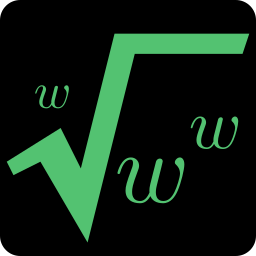

<!-- _class: centered -->
<!-- _paginate: false -->

# Unidad 2

# <!-- fit --> HTML, XML y CSS

## Programación Web


---

# Docente


Nombre
: Dr. Jaime Jesús Delgado Meraz

Correo
: <jesus.delgado@tecvalles.mx>
: <jaime.dm@cdvalles.tecnm.mx>

---

# Asignatura

:::: flex
::: col 1/2 px-2
Nombre
: Programación Web

Carrera
: Ingeniería en Sistemas Computacionales
: Ingeniería en Tecnologías de la Información y Comunicaciones

:::
::: col 1/2 px-2
Clave
: AEB - 1055

SATCA
: 1 - 4 - 5
:::
::::

---

<!-- _class: toc -->

# Contenidos

1. [Introducción](#introducción)
2. [Estructura global de un documento web](#estructura-global-de-un-documento-web)
3. [Elementos básicos](#elementos-básicos)
4. [Formularios](#formularios)
5. [Lenguajes de presentación en documentos web](#lenguajes-de-presentación-en-documentos-web)
6. [Selectores](#selectores)
7. [Modelo de caja](#modelo-de-caja)

---

# Competencia específica de la unidad

> Conoce y aplica las herramientas para construir páginas web, considerando la interfaz gráfica de usuario, un lenguaje de marcado y de presentación

---

<!-- _class: lead -->
# Introducción

---

# Introducción

- En la actualidad, la creación de páginas web es una tarea común para muchos profesionales de la informática, por lo que es necesario conocer las tecnologías que se utilizan para ello.
- Si bien existen herramientas que permiten la creación de páginas y sitios web sin necesidad de conocer las tecnologías subyacentes, es importante conocerlos para poder realizar tareas más avanzadas y personalizar las páginas y sitios web, así como para poder corregir errores que puedan surgir.

---

# Introducción

- En esta unidad se estudiarán las tecnologías HTML, XML y CSS, que son las tecnologías básicas para la creación de páginas web<note>*</note>.
- Se estudiarán los conceptos básicos de estas tecnologías, así como su sintaxis y su uso en la creación de páginas web.
- Se revisará también la forma en que se pueden combinar estas tecnologías para crear páginas web más complejas y atractivas.

::: note
Para efectos didácticos consideraremos los conceptos de documento web, página web y sitio web como sinónimos.
:::

---

<!-- _class: lead -->
# Estructura global de un documento web

---

# Estructura global de un documento web

> Un documento web es un archivo que contiene información que se puede visualizar en un navegador web.

- En general, un documento web está compuesto por dos partes principales:

:::: flex
::: col 1/2 px-2
Contenido
: Es la información que se desea mostrar en la página web.
: Que puede incluir desde texto simple hasta imágenes, videos, animaciones, etc.
:::
::: col 1/2 px-2
Presentación
: Es la forma en que se muestra esa información.
: Que incluye aspectos como el color, el tamaño y el tipo de letra, la posición de los elementos, etc.
:::
::::

---

# Estructura global de un documento web

- Para poder crear un documento web es necesario utilizar un lenguaje de marcado, que es un lenguaje que permite definir la estructura del documento web.
- Los lenguajes de marcado más comunes para la creación de páginas web son HTML y XML.
  - **HTML** (_HyperText Markup Language_) es un lenguaje de marcado que se utiliza para crear páginas web.
  - **XML** (_eXtensible Markup Language_) es un lenguaje de marcado que se utiliza para crear documentos estructurados.
- De hecho, HTML es un subconjunto de XML, por lo que se puede decir que HTML es un tipo de XML, aunque el primero antecede al segundo.

---

# Estructura global de un documento web

## HTML

> HTML (_HyperText Markup Language_) es un lenguaje de marcado que se utiliza para crear páginas web.

- Creado por el CERN (_Conseil Européen pour la Recherche Nucléaire_) en 1991, con el objetivo de crear un lenguaje de marcado que permitiera la creación de páginas web.
- Se utiliza para crear páginas web que contienen información estructurada, como texto, imágenes, videos, entre otros.
- Es un lenguaje sencillo y fácil de aprender, ya que se basa en etiquetas que se utilizan para definir la estructura de la página web.

---

# Estructura global de un documento web

## HTML

### Características

- Es un lenguaje de marcado, lo que significa que se utiliza para definir la estructura de un documento, pero no la presentación.
- Aunque sus etiquetas son fijas y definidas, se pueden combinar de diferentes formas para crear páginas web con distintas estructuras.
- Una de las características más importantes de HTML es que es un lenguaje de marcado **semántico**, lo que significa que las etiquetas que se utilizan tienen un significado específico que indica la función que cumplen en la página web.
- Lo anterior también es relevante para la forma en que los navegadores interpretan las páginas web y las presentan a los usuarios.

---

# Estructura global de un documento web

## HTML

### Sintaxis

- Un documento HTML está compuesto por elementos, que son las unidades básicas de información, inicia con una declaración que indique la versión de HTML que se está utilizando, el lenguaje y el tipo de documento.

```html
<!DOCTYPE html>
<html lang="es">
  <!-- Contenido del documento -->
</html>
```

- Los elementos se definen mediante **etiquetas** no arbitrarias, es decir, que no se pueden definir nuevas etiquetas más allá de las que ya existen en el estándar.

---

# Estructura global de un documento web

## HTML

### Sintaxis

- Las etiquetas se utilizan para representar información y se definen mediante un nombre que se encierra entre corchetes angulares `<` y `>`, y pueden tener atributos que se utilizan para proporcionar información adicional sobre el elemento.

```html
<elemento atributo="valor">contenido</elemento>
```

- Los elementos pueden tener elementos hijos, que son elementos que están contenidos dentro de otro elemento.

```html
<elemento>
  <hijo>contenido</hijo>
</elemento>
```

---

# Estructura global de un documento web

## HTML

### Sintaxis

#### Jerarquía de elementos

- Aunque en general los elementos HTML se pueden combinar de diferentes formas, existe una jerarquía básica que se utiliza para definir la estructura de una página web.

```html
<!DOCTYPE html>
<html lang="es">
  <head>
    <!-- Metadatos del documento -->
  </head>
  <body>
    <!-- Contenido del documento -->
  </body>
</html>
```

---

# Estructura global de un documento web

## HTML

### Sintaxis

#### Metadatos

- Los metadatos son información adicional sobre el documento, como el título, la descripción, las palabras clave, etc.
- Se definen en la sección `<head>` del documento, que es la sección que contiene la información sobre el documento, pero no el contenido que se muestra en la página web.

```html
<head>
  <title>Título del documento</title>
  <meta charset="utf-8">
  <meta name="viewport" content="width=device-width, initial-scale=1.0">
  <meta name="author" content="Autor del documento">
  <meta name="description" content="Descripción del documento">
  <meta name="keywords" content="palabra1, palabra2, palabra3">
</head>
```

---

# Estructura global de un documento web

## HTML

### Sintaxis

#### Contenido

- El contenido de un documento HTML se define en la sección `<body>`, que es la sección que contiene el contenido que se muestra en la página web.

```html
<body>
  <h1>Título de la página</h1>
  <p>Párrafo de texto</p>
  
</body>
```

- Las etiquetas para contenido pueden ser de diferentes tipos, como encabezados, párrafos, imágenes, listas, tablas, formularios, entre otras.

---

# Estructura global de un documento web

## HTML

### Ejemplo

```html
<!DOCTYPE html>
<html lang="es">
<head>
  <title>Mi primera página web</title>
  <meta charset="utf-8">
  <meta name="viewport" content="width=device-width, initial-scale=1.0">
</head>
<body>
  <h1>Bienvenido a mi página web</h1>
  <p>Esta es una página de ejemplo que contiene información sobre:</p>
  <ul>
    <li>HTML</li>
    <li>XML</li>
    <li>CSS</li>
  </ul>
  
</body>
</html>
```

---

# Estructura global de un documento web

## HTML

### Presentación

- En general, HTML se utiliza para definir la estructura de un documento web, pero no la presentación.
- Aunque puede combinarse con CSS (_Cascading Style Sheets_) para definir la presentación del documento, no es obligatorio.
- De hecho, cada navegador cuenta con un conjunto de estilos predeterminado para mostrar los elementos HTML, por lo que es posible crear páginas web sin necesidad de definir estilos adicionales.

---

# Estructura global de un documento web

## HTML

### Transformación

- Una vez que se ha creado un documento HTML, es necesario guardarlo en un archivo con extensión `.html` y abrirlo en un navegador web para visualizarlo.
- Los navegadores web interpretan el código HTML y muestran el contenido en la ventana del navegador.
- Es importante tener en cuenta que los navegadores interpretan el código HTML de forma diferente, no obstante, siguen los estándares definidos por el W3C (_World Wide Web Consortium_).

---

# Estructura global de un documento web

## HTML

### Conclusión

- HTML es un lenguaje de marcado que se utiliza para crear páginas web, pero no proporciona una forma de definir la presentación de los documentos.
- Es un lenguaje sencillo y fácil de aprender, ya que se basa en etiquetas sencillas que se utilizan para definir la estructura de la página web.
- Aunque no es considerado un lenguaje de programación, si puede combinarse con otros lenguajes y tecnologías, para crear páginas web más complejas y atractivas.

---

# Estructura global de un documento web

## XML

> XML (_eXtensible Markup Language_) es un lenguaje de marcado que se utiliza para crear documentos estructurados.

- Creado por el W3C (_World Wide Web Consortium_) en 1996, con el objetivo de ser un lenguaje de marcado genérico que pudiera ser utilizado para crear documentos estructurados.
- Se utiliza para crear documentos que contienen información estructurada, como bases de datos, documentos de texto, entre otros, pero también se puede utilizar en combinación con el XSLT (_eXtensible Stylesheet Language Transformations_) para crear páginas web.

---

# Estructura global de un documento web

## XML

### Características

- Es un lenguaje de marcado genérico, lo que significa que se puede utilizar para crear documentos de cualquier tipo.
- Es altamente extensible, lo que significa que se pueden definir etiquetas personalizadas.
- Esta basado texto plano, lo que significa que los documentos XML se pueden leer y editar con un editor de texto.
- No tiene un conjunto fijo de etiquetas, lo que significa que se pueden definir las etiquetas que se necesiten<note>*</note>.

::: note
Aunque puede asociarse un archivo de definición de esquemas (_XSD_), no es necesario para la creación de documentos XML.
:::

---

# Estructura global de un documento web

## XML

### Sintaxis

- Un documento XML está compuesto por elementos, que son las unidades básicas de información, inicia con una declaración que indique la versión de XML que se está utilizando y la codificación de caracteres.

```xml
<?xml version="1.0" encoding="UTF-8"?>
```

- Los elementos se definen mediante **etiquetas**, que son secuencias de caracteres que se utilizan para representar información.

```xml
<elemento>contenido</elemento>
```

---

# Estructura global de un documento web

## XML

### Sintaxis

- Si un elemento no tiene contenido pero debe estar presente, se puede utilizar una forma abreviada para definirlo.

```xml
<elemento />
```

- También pueden tener atributos, que se utilizan para proporcionar información adicional sobre el elemento.

```xml
<elemento atributo="valor">contenido</elemento>

<tema nombre="XML" materia="Programación Web">...</tema>
```

---

# Estructura global de un documento web

## XML

### Sintaxis

- Los elementos pueden tener elementos hijos, que son elementos que están contenidos dentro de otro elemento.

:::: flex
::: col 1/2 px-2

```xml
<elemento>
  <hijo>contenido</hijo>
</elemento>
```

:::
::: col 1/2 px-2

```xml
<elemento>
  <hijo>contenido</hijo>
  <hijo>contenido</hijo>
</elemento>
```

:::
::::

- De esta forma, se pueden crear estructuras jerárquicas de información y al igual que los elementos padre, los elementos hijos pueden tener atributos.

```xml
<elemento>
  <hijo atributo="valor">contenido</hijo>
</elemento>
```

---

# Estructura global de un documento web

## XML

### Ejemplo

El XML permite crear documentos estructurados de forma jerárquica, lo cual es útil para representar información compleja de forma organizada.

```xml
<?xml version="1.0" encoding="UTF-8"?>
<biblioteca>
  <libro>
    <titulo>El Quijote</titulo>
    <autor>Miguel de Cervantes</autor>
    <editorial>Editorial Cervantes</editorial>
    <year>1605</year>
  </libro>
  <libro>
    <titulo>La Odisea</titulo>
    <autor>Homero</autor>
    <editorial>Editorial Homero</editorial>
    <year>800 a.C.</year>
  </libro>
</biblioteca>
```

---

# Estructura global de un documento web

## XML

### Presentación

- Aunque XML permite crear documentos estructurados, no proporciona una forma de definir la presentación de los documentos.
- Para definir la presentación de los documentos XML se puede utilizar XSLT (_eXtensible Stylesheet Language Transformations_), que es un lenguaje de transformación que se utiliza para transformar documentos XML en otros formatos, como HTML.
- XSLT se utiliza para definir reglas de transformación que indican cómo se debe transformar un documento XML en otro formato.

---

# Estructura global de un documento web

## XML

### Presentación

- El primer paso para utilizar XSLT es crear una hoja de estilos, que es un documento XML que contiene las reglas de transformación.

```xml
<?xml version="1.0"?>
<xsl:stylesheet version="1.0" xmlns:xsl="http://www.w3.org/1999/XSL/Transform">
  <!-- Plantillas de transformación -->
</xsl:stylesheet>
```

- La hoja de estilos se compone de plantillas, que son reglas que indican cómo se debe transformar un elemento XML en otro formato.

::: info
Aunque también es posible integrar CSS en la presentación de un documento XML, XSLT es más adecuado para la transformación de documentos XML en otros formatos.
:::

---

# Estructura global de un documento web

## XML

### Presentación

- Las plantillas se definen dentro de una etiqueta raíz `<xsl:template>`, indicando el elemento a transformar mediante el atributo `match`.

```xml
<xsl:template match="elemento raíz">
  <!-- Reglas de transformación -->
</xsl:template>
```

- Las reglas de transformación se definen mediante las etiquetas:
  - `<xsl:for-each>`, para recorrer los elementos de un documento XML, y
  - `<xsl:value-of>`, para obtener el valor de un elemento XML.

```xml
<xsl:for-each select="elemento">
  <xsl:value-of select="atributo" />
</xsl:for-each>
```

---

# Estructura global de un documento web

## XML

### Presentación

```xml
<?xml version="1.0" encoding="UTF-8"?>
<xsl:stylesheet version="1.0" xmlns:xsl="http://www.w3.org/1999/XSL/Transform">
<xsl:template match="biblioteca">

<html>
  <body>
    <h2>Mi biblioteca</h2>
    <table border="1">
      <tr>
        <th>Título</th>
        <th>Autor</th>
        <th>Editorial</th>
        <th>Año</th>
      </tr>
      <!-- Continua en la siguiente diapositiva -->
```

---

# Estructura global de un documento web

## XML

### Presentación

```xml
      <!-- Continua desde la diapositiva anterior -->
      <xsl:for-each select="libro">
        <tr>
          <td><xsl:value-of select="titulo" /></td>
          <td><xsl:value-of select="autor" /></td>
          <td><xsl:value-of select="editorial" /></td>
          <td><xsl:value-of select="year" /></td>
        </tr>
      </xsl:for-each>
    </table>
  </body>
</html>

</xsl:template>
</xsl:stylesheet>
```

---

# Estructura global de un documento web

## XML

### Transformación

- Una vez que se ha creado la hoja de estilos, es necesario aplicarla al documento XML que se desea transformar.

```xml
<?xml version="1.0" encoding="UTF-8"?>
<?xml-stylesheet type="text/xsl" href="biblioteca.xsl"?>
<biblioteca>
  <libro>
  ...
  </libro>
</biblioteca>
```

- Asumiendo que se tuviera la siguiente estructura de archivos:

```txt
📂
├── biblioteca.xml
└── biblioteca.xsl
```

---

# Estructura global de un documento web

## XML

### Transformación

- Al utilizar un navegador web, este se encargará de aplicar la hoja de estilos al documento XML y mostrar el resultado en el navegador.
- Devolviendo una tabla con la información de los libros de la biblioteca.

| Título    | Autor              | Editorial           | Año    |
| --------- | ------------------ | ------------------- | ------ |
| El Quijote| Miguel de Cervantes| Editorial Cervantes | 1605   |
| La Odisea | Homero             | Editorial Homero    | 800 a.C.|

::: warning
Por cuestiones de seguridad, algunos navegadores no permiten la transformación de documentos XML con XSLT si no se encuentran en un servidor web.
:::

---

# Estructura global de un documento web

## XML

### Conclusión

- XML es un lenguaje de marcado que se utiliza para crear documentos estructurados, pero no proporciona una forma de definir la presentación de los documentos.
- Aunque se puede combinar con XSLT para definir la presentación de los documentos, es más común utilizar HTML para la creación de páginas web.
- De hecho, a diferencia del XML + XSLT, los navegadores web pueden interpretar directamente los documentos HTML y mostrarlos en el navegador, sin necesidad de un servidor web.
- Sin embargo, nunca está de más conocer las posibilidades que ofrece XML y XSLT para la creación de documentos estructurados.

---

<!-- _class: lead -->
# Elementos básicos

---

# Elementos básicos

- La estructura de un documento web se define mediante elementos, que son las unidades básicas de información.
- Tanto en HTML como en XML, los elementos se definen mediante **etiquetas**, que son secuencias de caracteres que se utilizan para representar información.
- Dependiendo del lenguaje de marcado, el conjunto de etiquetas posibles puede variar, pero en general, tiene una estructura similar, enmarcada por corchetes angulares `<` y `>`.

::: info
Para efectos de esta unidad, nos centraremos en los elementos básicos de HTML, ya que es el lenguaje de marcado más común para la creación de páginas web.
:::

---

# Elementos básicos

- HTML cuenta con un conjunto de etiquetas predefinidas que se utilizan para representar diferentes tipos de información.
- A la fecha<note>*</note> el estándar de HTML incluye **112** elementos, que se utilizan para representar desde texto simple hasta imágenes, videos, formularios, entre otros.
- Aunque no es necesario conocer todos los elementos de HTML, es importante conocer los elementos básicos que se utilizan con mayor frecuencia en la creación de páginas web.

::: note
Septiembre, 2024 (<https://meiert.com/en/indices/html-elements/>)
:::

---

# Elementos básicos

## Texto

Los elementos de texto se utilizan para representar, como su nombre lo indica, texto en una página web.

En general, se dividen en los siguientes tipos:

- **Encabezados**: Se utilizan para representar títulos y subtítulos en una página web.
- **Párrafos**: Se utilizan para representar texto en prosa en una página web.
- **Texto técnico**: Se utiliza para representar texto en un contexto técnico.
- **Matemáticas**: Permiten representar fórmulas y operaciones matemáticas.

---

# Elementos básicos

## Texto

### Encabezados

- Los encabezados se representan mediante las etiquetas `<h1>` a `<h6>`, donde `<h1>` es el encabezado más importante y `<h6>` el menos importante.

```html
<h1>Encabezado 1</h1>
<h2>Encabezado 2</h2>
<h3>Encabezado 3</h3>
<h4>Encabezado 4</h4>
<h5>Encabezado 5</h5>
<h6>Encabezado 6</h6>
```

- Los encabezados se utilizan para representar títulos y subtítulos en una página web, y se utilizan para estructurar la información de la página.

---

# Elementos básicos

## Texto

### Encabezados

- Se pueden combinar según se requiera para crear una estructura jerárquica de la información.

```html
<h1>Unidad 1</h1>
<h2>Tema 1.1</h2>
<h2>Tema 1.2</h2>

<h1>Unidad 2</h1>
<h2>Tema 2.1</h2>
<h2>Tema 2.2</h2>
<h3>Subtema 2.2.1</h3>
```

::: info
Aunque es posible definir encabezados más allá del `<h6>`, estos no pertenecen al estándar por lo que los navegadores no los identifican semánticamente.
:::

---

# Elementos básicos

## Texto

### Párrafos

- Los párrafos se representan mediante la etiqueta `<p>`, que se utiliza para representar texto en prosa en el cuerpo de una página web.

```html
<p>Este es un párrafo de texto.</p>
```

- Son muy comunes en las páginas web, ya que permiten representar texto en un formato legible y fácil de leer.
- Suelen combinarse con etiquetas de formato, como negritas, cursivas, subrayados, entre otros, para resaltar la información.

---

<!-- _class: inverted -->

# Una nota sobre la semántica

- Aunque para efectos prácticos podría omitirse el uso de la etiqueta `<p>` para representar párrafos, es importante tener en cuenta que HTML es un lenguaje de marcado semántico.
- Esto significa que las etiquetas que se utilizan tienen un significado específico que indica la función que cumplen en la página web.
- Además, el uso de etiquetas semánticas será muy relevante para el estilizado y la interacción.

---

# Elementos básicos

## Texto

### Párrafos - Formato

- HTML cuenta con etiquetas que se utilizan para dar formato al texto, como negritas, cursivas, subrayados, entre otros.

:::: flex
::: col 1/2 px-2

```html
<p>
  Las <strong>negritas</strong> y
  <em>cursivas</em> son útiles 
  para resaltar la información.
</p>
```

:::
::: col 1/2 px-2

<p>
  Las <strong>negritas</strong> y
   <em>cursivas</em> son útiles
   para resaltar la información.
</p>

:::
::::

:::: flex
::: col 1/2 px-2

```html
<p>
  <del>El texto tachado</del> y el
  <ins>subrayado</ins> son útiles 
  para mostrar modificaciones.
</p>
```

:::
::: col 1/2 px-2

<p>
  El texto <del>tachado</del> y el
  <ins>subrayado</ins> son útiles para
   mostrar modificaciones.
</p>

:::
::::

---

# Elementos básicos

## Texto

### Párrafos - Formato

- HTML cuenta con etiquetas que se utilizan para dar formato al texto, como negritas, cursivas, subrayados, entre otros.

:::: flex
::: col 1/2 px-2

```html
<p>
  Lo <mark>importante</mark> se puede
  resaltar y combinar con emojis 😁
  y símbolos &uarr;.
</p>
```

:::
::: col 1/2 px-2

<p>
  Lo <mark>importante</mark> se puede resaltar y combinar con emojis 😁 y símbolos &uarr;.
</p>

:::
::::

::: ok
Símbolos disponibles en: <https://www.toptal.com/designers/htmlarrows/>
:::

---

# Elementos básicos

## Texto

### Texto técnico

- Es posible que además del texto en prosa y formateado, se pueda requerir de texto para representar contenido más "técnico".

:::: flex
::: col 1/2 px-2

```html
<p>
  Cualquiera puede copiar (<kbd>Ctrl + C</kbd>)
  y pegar (<kbd>Ctrl + V</kbd>).
</p>
```

:::
::: col 1/2 px-2

<p>
  Cualquiera puede copiar (<kbd>Ctrl + C</kbd>)
  y pegar (<kbd>Ctrl + V</kbd>).
</p>

:::
::::

:::: flex
::: col 1/2 px-2

```html
<p>
Pero no cualquiera escribe algo como:
<code>function saludar() {
  return 'Hola, mundo!';
}
</code>
</p>
```

:::
::: col 1/2 px-2

<p>Pero no cualquiera escribe algo como:
<code>function saludar() {
  return 'Hola, mundo!';
}
</code>
</p>

:::
::::

---

# Elementos básicos

## Texto

### Texto técnico

- Es posible que además del texto en prosa y formateado, se pueda requerir de texto para representar contenido más "técnico".

:::: flex
::: col 1/2 px-2

```html
Aunque HTML no se ve afectado por los espacios 
adicionales...

<pre>
  ¿Que pasa si quiero algo con      muchos    
  es    pa    ci    os?
</pre>
```

:::
::: col 1/2 px-2

Aunque HTML no se ve afectado por los espacios adicionales...
<pre>
  ¿Que pasa si quiero algo con     muchos
  es    pa    ci    os?
</pre>

:::
::::

- La etiqueta `<pre>` es muy útil para representar texto en una fuente fija, no proporcional, exactamente como se capturo, y donde los espacios son mostrados tal como están escritos.

---

<!-- _class: inverted -->

# Wrapping up

- Más allá del estilo que se le pueda dar a las etiquetas ``<code>`` y ``<pre>``, es importante tener en cuenta que estas etiquetas tienen un significado específico.
- En el caso de ``<code>``, se utiliza para representar texto que debe ser interpretado como código fuente y se caracteríza también por permitir el _wrapping_ de texto, es decir, que no excede el borde de la página.
- Por otro lado, la etiqueta ``<pre>`` "resetea" el estilo del texto en su interior y establece un modo **estricto** para los espacios, tabulaciones y saltos de línea, omitiendo por completo el _wrapping_ de texto.

---

<!-- _class: inverted -->

# Wrapping up

Adicionalmente, al combinar la etiqueta ``<code>`` con algo de CSS y JS, puede dar resultados muy vistosos.

```js
function fondoBasadoTiempo() {
  const body = document.body;
  const hour = new Date().getHours();

  if (hour >= 6 && hour < 12) {
    body.style.backgroundColor = '#FFFAE3'; // Color claro
  } else if (hour >= 12 && hour < 18) {
    body.style.backgroundColor = '#FFD700'; // Color dorado
  } else {
    body.style.backgroundColor = '#2C3E50'; // Color oscuro
  }
}

fondoBasadoTiempo();
```

---

# Elementos básicos

## Texto

### Matemáticas

- HTML cuenta con etiquetas básicas que permiten representar fórmulas y operaciones matemáticas.

:::: flex
::: col 1/2 px-2

```html
<p>
  Se puede representar una
  operación sencilla como:
  27 + 2 - 2 = 10 &divide; 2
  &times; 5
</p>
```

:::
::: col 1/2 px-2
Se puede representar una operación sencilla como: 27 + 2 - 2 = 10 &divide; 2 &times; 5
:::
::::

:::: flex
::: col 1/2 px-2

```html
<p>
  Una fórmula matemática como
    ax<sup>2</sup> + bx + c = 0
  ó una fórmula química 
    H<sub>2</sub>0.
</p>
```

:::
::: col 1/2 px-2
<p>Una fórmula matemática como ax<sup>2</sup> + bx + c = 0 ó una fórmula química H<sub>2</sub>0.</p>
:::
::::

---

# Elementos básicos

## Texto

### Matemáticas

- HTML permite representar fórmulas y operaciones matemáticas, y cuando se requiere de una representación más compleja, se puede utilizar MathML (_Mathematical Markup Language_).
- MathML es muy útil para representar fórmulas matemáticas complejas.



---

# Elementos básicos

## Texto

### Matemáticas

:::: flex
::: col 3/4 px-2

```html
<math xmlns="http://www.w3.org/1998/Math/MathML">
  <mrow>
    <mi>x</mi><mo>=</mo>
    <mfrac>
      <mrow>
        <mo>-</mo><mi>b</mi><mo>±</mo>
        <msqrt>
          <mrow>
            <msup>
              <mi>b</mi><mn>2</mn>
            </msup>
            <mo>-</mo>
            <mn>4</mn><mi>a</mi><mi>c</mi>
          </mrow>
        </msqrt>
      </mrow>
      <mrow><mn>2</mn><mi>a</mi></mrow>
    </mfrac>
  </mrow>
</math>
```

:::
::: col 1/4 px-2

<math xmlns="http://www.w3.org/1998/Math/MathML">
  <mrow>
    <mi>x</mi>
    <mo>=</mo>
    <mfrac>
      <mrow>
        <mo>-</mo>
        <mi>b</mi>
        <mo>±</mo>
        <msqrt>
          <mrow>
            <msup>
              <mi>b</mi>
              <mn>2</mn>
            </msup>
            <mo>-</mo>
            <mn>4</mn>
            <mi>a</mi>
            <mi>c</mi>
          </mrow>
        </msqrt>
      </mrow>
      <mrow>
        <mn>2</mn>
        <mi>a</mi>
      </mrow>
    </mfrac>
  </mrow>
</math>

- Otros ejemplos pueden ser:

<math xmlns="http://www.w3.org/1998/Math/MathML">
  <mrow>
    <mrow>
      <mo>(</mo>
      <mtable>
        <mtr>
          <mtd>
            <mi>a</mi>
          </mtd>
          <mtd>
            <mi>b</mi>
          </mtd>
        </mtr>
        <mtr>
          <mtd>
            <mi>c</mi>
          </mtd>
          <mtd>
            <mi>d</mi>
          </mtd>
        </mtr>
      </mtable>
      <mo>)</mo>
    </mrow>
    <mo>&#x2062;</mo>
    <mrow>
      <mo>(</mo>
      <mtable>
        <mtr>
          <mtd>
            <mi>x</mi>
          </mtd>
        </mtr>
        <mtr>
          <mtd>
            <mi>y</mi>
          </mtd>
        </mtr>
      </mtable>
      <mo>)</mo>
    </mrow>
  </mrow>
  <mo>=</mo>
  <mrow>
    <mo>(</mo>
    <mtable>
      <mtr>
        <mtd>
          <mi>e</mi>
        </mtd>
      </mtr>
      <mtr>
        <mtd>
          <mi>f</mi>
        </mtd>
      </mtr>
    </mtable>
    <mo>)</mo>
  </mrow>
</math>

<br/>
<br/>
<math xmlns="http://www.w3.org/1998/Math/MathML">
  <mrow>
    <mo>{</mo>
    <mtable>
      <mtr>
        <mtd>
          <mrow>
            <mrow>
              <mi>a</mi>
              <mo>&#x2062;</mo>
              <mi>x</mi>
            </mrow>
            <mo>+</mo>
            <mrow>
              <mi>b</mi>
              <mo>&#x2062;</mo>
              <mi>y</mi>
            </mrow>
          </mrow>
          <mo>=</mo>
          <mi>e</mi>
        </mtd>
      </mtr>
      <mtr>
        <mtd>
          <mrow>
            <mrow>
              <mi>c</mi>
              <mo>&#x2062;</mo>
              <mi>x</mi>
            </mrow>
            <mo>+</mo>
            <mrow>
              <mi>d</mi>
              <mo>&#x2062;</mo>
              <mi>y</mi>
            </mrow>
          </mrow>
          <mo>=</mo>
          <mi>f</mi>
        </mtd>
      </mtr>
    </mtable>
  </mrow>
</math>

:::
::::

---

# Elementos básicos

## Texto

### Matemáticas

- Es importante tener en cuenta que MathML es un lenguaje de marcado específico para representar fórmulas matemáticas diferente a HTML.
- Adicionalmente, debido a su complejidad, no esta diseñado para escribir directamente, sino que se recomienda utilizar un editor especializado como: MathType (<https://www.wiris.com/es/mathtype/>) o iMathEQ (<https://www.imatheq.com/>).

::: info
Más información en: <https://developer.mozilla.org/es/docs/Web/MathML>
:::

---

# Elementos básicos

## Vínculos

- Los vínculos se representan mediante la etiqueta `<a>` (_**a**nchor_), que se utiliza para crear enlaces a otras páginas web, archivos, direcciones de correo electrónico, entre otros.

```html
<a href="https://www.google.com">Ir a Google</a>
```

- El atributo `href` se utiliza para especificar la dirección a la que se debe dirigir el enlace.
- El texto que se muestra en el enlace se especifica entre las etiquetas de apertura y cierre del enlace.

---

# Elementos básicos

## Vínculos

- Se pueden combinar con otros elementos para crear enlaces más complejos.

```html
<p>
  Visita mi <a href="https://www.github.com/j2deme">perfil de GitHub</a>
  para más información.
</p>
```

- Los enlaces se abren en la misma ventana del navegador por defecto, pero se puede especificar que se abran en una nueva ventana utilizando el atributo `target`.

```html
<a href="https://www.google.com" target="_blank">Ir a Google</a>
```

---

# Elementos básicos

## Vínculos

### HREF

- El atributo `href` (_**H**ypertext **REF**erence_) es el atributo más importante de la etiqueta `<a>`, ya que se utiliza para especificar la dirección a la que se debe dirigir el enlace.
  - Puede ser una dirección web (`https://www.google.com`).
  - Un correo electrónico (`mailto:jesus.delgado@tecvalles.mx`).
  - Un archivo (`archivo.pdf`).
  - Un identificador de anclaje (`#seccion`), se combina con el atributo `id` de los elementos.
  - Un teléfono (`tel:+521234567890`).
  - Un contacto de WhatsApp (`https://wa.me/+521234567890`).
  
---

# Elementos básicos

## Listas

- Las listas se utilizan para representar información de forma ordenada o desordenada.
- HTML cuenta con tres tipos de listas:
  - **Listas ordenadas**: Se utilizan para representar listas de elementos ordenados.
  - **Listas desordenadas**: Se utilizan para representar listas de elementos sin un orden específico.
  - **Listas de definición**: Se utilizan para representar listas de términos y definiciones, como un glosario.

---

# Elementos básicos

## Listas

### Listas ordenadas

- Las listas ordenadas se representan con la etiqueta `<ol>` (_**o**rdered **l**ist_), que se utiliza para representar listas de elementos ordenados.

```html
<ol>
  <li>Elemento 1</li>
  <li>Elemento 2</li>
  <li>Elemento 3</li>
</ol>
```

- Los elementos de la lista se representan mediante la etiqueta `<li>` (_**l**ist **i**tem_), que representa un elemento de la lista.
- Por defecto, los elementos de la lista se representan con números arábigos, iniciando en 1.

---

# Elementos básicos

## Listas

### Listas ordenadas

:::: flex
::: col 1/2 px-2

- Si se requiere, es posible cambiar el tipo de numeración de la lista a través del atributo `type`.

```html
<ol type="A">
  <li>Elemento 1</li>
  <li>Elemento 2</li>
  <li>Elemento 3</li>
</ol>
```

:::
::: col 1/2 px-2

- Los valores posibles son:
  - `1`: Números arábigos.
  - `A`: Letras mayúsculas.
  - `a`: Letras minúsculas.
  - `I`: Números romanos mayúsculas.
  - `i`: Números romanos minúsculas.

:::
::::

---

# Elementos básicos

## Listas

### Listas ordenadas

:::: flex
::: col 1/2 px-2

- Igualmente, es posible cambiar el valor inicial de la numeración de la lista a través del atributo `start`.

```html
<ol start="10">
  <li>Elemento 10</li>
  <li>Elemento 11</li>
  <li>Elemento 12</li>
</ol>
```

:::
::: col 1/2 px-2

- Sin el atributo `start`:

  1. Elemento 10
  2. Elemento 11
  3. Elemento 12

- Con el atributo `start`:

  <ol start="10">
    <li>Elemento 10</li>
    <li>Elemento 11</li>
    <li>Elemento 12</li>
  </ol>

:::
::::

---

# Elementos básicos

## Listas

### Listas desordenadas

- Las listas desordenadas se representan con la etiqueta `<ul>` (_**u**nordered **l**ist_), que se utiliza para representar listas de elementos sin un orden específico.

:::: flex
::: col 1/2 px-2

```html
<ul>
  <li>Elemento 1</li>
  <li>Elemento 2</li>
  <li>Elemento 3</li>
</ul>
```

:::
::: col 1/2 px-2

<ul type="disc">
  <li>Elemento 1</li>
  <li>Elemento 2</li>
  <li>Elemento 3</li>
</ul>

:::
::::

- También se les conoce como listas de viñetas, y al igual que en las listas ordenadas, los elementos se representan mediante la etiqueta `<li>`.

---

# Elementos básicos

## Listas

### Listas desordenadas

:::: flex
::: col 1/2 px-2

- Si se requiere, es posible cambiar el tipo de viñeta a través del atributo `type`.

```html
<ul type="circle">
  <li>Elemento 1</li>
  <li>Elemento 2</li>
  <li>Elemento 3</li>
</ul>
```

:::
::: col 1/2 px-2

- Los valores posibles son:
  - `disc`: Círculos sólidos &#x25CF;
  - `circle`: Círculos vacíos &#x25CB;
  - `square`: Cuadrados &#x25A0;

:::
::::

::: ok
Es posible cambiar la viñeta, su color y otros atributos, pero para esto se requiere utilizar CSS.
:::

---

# Elementos básicos

## Listas

### Listas desordenadas

::::: flex
:::: col 1/2 px-2

- Si el caso lo requiere es posible cambiar la viñeta de un elemento en específico.

```html
<ul>
  <li>Elemento</li>
  <li type="circle">Elemento</li>
  <li type="square">Elemento</li>
  <li>Elemento</li>
</ul>
```

::::
:::: col 1/2 px-2

<ul type="disc" class="ml-10">
  <li>Elemento</li>
  <li type="circle">Elemento</li>
  <li type="square">Elemento</li>
  <li>Elemento</li>
</ul>

::: error
Se recomienda mantener la consistencia en el diseño de las listas.

Recordando que **no** porque se pueda hacer, **debe** hacerse.
:::

::::
:::::

---

# Elementos básicos

## Listas

### Listas de definición

- Las listas de definición, también conocidas como listas de glosario, son listas que se utilizan para representar términos y sus definiciones.
- Se componen a partir de tres elementos:
  1. **Lista**: Se representa mediante la etiqueta `<dl>` (_**d**efinition **l**ist_).
  2. **Término**: Se representa mediante la etiqueta `<dt>` (_**d**efinition **t**erm_).
  3. **Definición**: Se representa mediante la etiqueta `<dd>` (_**d**efinition **d**escription_).
- A diferencia de las listas ordenadas y desordenadas, este tipo de lista no utiliza la etiqueta `<li>`.

---
<!-- _class: cols-2 -->
# Elementos básicos

## Listas

### Listas de definición

::: left

```html
<dl>
  <dt>HTML</dt>
  <dd>Lenguaje de marcado de hipertexto.</dd>
  <dt>CSS</dt>
  <dd>Lenguaje de hojas de estilo en cascada.</dd>
  <dt>JS</dt>
  <dd>Lenguaje de programación JavaScript.</dd>
  <dd>Útil para interactividad.</dd>
</dl>
```

:::
::: right

<dl>
  <dt>HTML</dt>
  <dd>Lenguaje de marcado de hipertexto.</dd>
  <dt>CSS</dt>
  <dd>Lenguaje de hojas de estilo en cascada.</dd>
  <dt>JS</dt>
  <dd>Lenguaje de programación JavaScript.</dd>
  <dd>Útil para interactividad.</dd>
</dl>

:::

---

# Elementos básicos

## Tablas

- Las tablas se utilizan para representar información en forma de filas y columnas.
- Son muy útiles para representar información que por su naturaleza, puede estructurarse de manera tabular, como registros, horarios, entre otros.
- La estructura más básica de una tabla se compone de tres elementos:
  1. **Tabla**: Se representa mediante la etiqueta `<table>`.
  2. **Fila**: Se representa mediante la etiqueta `<tr>`.
  3. **Celda**: Se representa mediante la etiqueta `<td>`.

---

# Elementos básicos

## Tablas

### Estructura básica

:::: flex
::: col 1/2 px-2

```html
<table>
  <tr>
    <td>Celda 1</td>
    <td>Celda 2</td>
  </tr>
  <tr>
    <td>Celda 3</td>
    <td>Celda 4</td>
  </tr>
  <tr>
    <td>Celda 5</td>
    <td>Celda 6</td>
  </tr>
</table>
```

:::
::: col 1/2 px-2

<table>
  <tr>
    <td>Celda 1</td>
    <td>Celda 2</td>
  </tr>
  <tr>
    <td>Celda 3</td>
    <td>Celda 4</td>
  </tr>
  <tr>
    <td>Celda 5</td>
    <td>Celda 6</td>
  </tr>
</table>

- Por default, las tablas no poseen bordes, pero estos pueden ser agregados a través de CSS.

:::
::::

---

# Elementos básicos

## Tablas

### Atributos

- Existen algunos atributos  ya _obsoletos_, para la etiqueta `<table>`, que por motivos _históricos_, es importante conocer:
  - `border`: Este atributo se utilizaba para especificar el ancho del borde de la tabla.
  - `bgcolor`: Se utilizaba para especificar el color de fondo de la tabla.
  - `align`: Se utilizaba para especificar la alineación horizontal de la tabla en relación a la página.

::: warning
Aunque _aún_ se pueden utilizar, es posible que en un futuro los navegadores dejen de darles soporte en favor del CSS.
:::

---

# Elementos básicos

## Objetos

---

# Elementos básicos

## Imágenes

---

# Elementos básicos

## Aplicaciones

---

<!-- _class: lead -->
# Formularios

---

# Formularios

---

<!-- _class: lead -->
# Lenguajes de presentación en documentos web

---

# Lenguajes de presentación en documentos web

---

<!-- _class: lead -->
# Selectores

---

# Selectores

---

<!-- _class: lead -->
# Modelo de caja

---

# Modelo de caja

---

<!-- _class: inverted centered pattern -->


<div class="text-center text-middle font-bold font-coding text-8xl mt-10">
  &lt;/Fin&gt;
</div>

<script src="https://unpkg.com/@phosphor-icons/web"></script>

---

<!-- paginate: skip -->

# Referencias I

- W3C. (2024). _HTML: Living Standard_. <https://html.spec.whatwg.org/multipage/>
- Mozilla Developer Network. (2024). _HTML_. <https://developer.mozilla.org/es/docs/Web/HTML>
- Meiert, J. (2024). _HTML Elements Index_. <https://meiert.com/en/indices/html-elements/>
- W3C. (2024). _Extensible Markup Language (XML) 1.0 (Fifth Edition)_. <https://www.w3.org/TR/xml/>
- Mozilla Developer Network. (2024). _XML_. <https://developer.mozilla.org/es/docs/Web/XML>

---

# Referencias II

- Mozilla Developer Network. (2024). _XSLT_. <https://developer.mozilla.org/es/docs/Web/XSLT>
- W3C. (2024). _XSL Transformations (XSLT) Version 1.0_. <https://www.w3.org/TR/xslt/>
- XSLT for the Modern Web. (2024). _What is XSLT and is it still relevant in a website context in 2024_. <https://xsltforthemodernweb.medium.com/what-is-xslt-and-is-it-still-relevant-in-a-website-context-in-2024-fdb18d6aa675>
- W3C. (2024). _MathML Version 3.0 2nd Edition_. <https://www.w3.org/TR/MathML3/>

---

# Referencias III

- W3C. (2024). _Cascading Style Sheets Snapshot 2023 Specification_. <https://www.w3.org/TR/CSS/>
- Mozilla Developer Network. (2024). _CSS_. <https://developer.mozilla.org/es/docs/Web/CSS>
