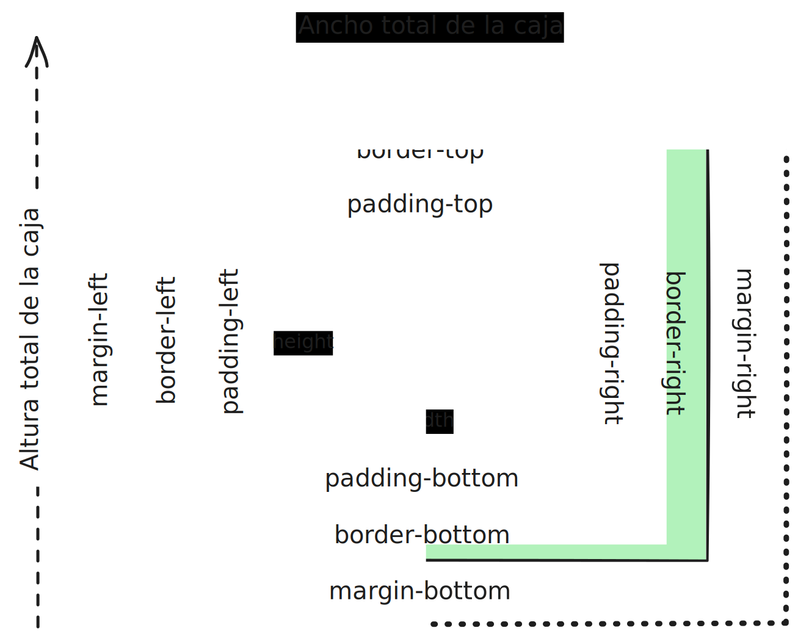

<!-- _class: centered -->
<!-- _paginate: false -->

# Unidad 2

# <!-- fit --> HTML, XML y CSS

## Programación Web


---

# Docente


Nombre
: Dr. Jaime Jesús Delgado Meraz

Correo
: <jesus.delgado@tecvalles.mx>
: <jaime.dm@cdvalles.tecnm.mx>

---

# Asignatura

:::: flex
::: col 1/2 px-2
Nombre
: Programación Web

Carrera
: Ingeniería en Sistemas Computacionales
: Ingeniería en Tecnologías de la Información y Comunicaciones

:::
::: col 1/2 px-2
Clave
: AEB - 1055

SATCA
: 1 - 4 - 5
:::
::::

---

<!-- _class: toc -->

# Contenidos

1. [Introducción](#introducción)
2. [Estructura global de un documento web](#estructura-global-de-un-documento-web)
3. [Elementos básicos](#elementos-básicos)
4. [Formularios](#formularios)
5. [Lenguajes de presentación en documentos web](#lenguajes-de-presentación-en-documentos-web)
6. [Selectores](#selectores)
7. [Modelo de caja](#modelo-de-caja)

---

# Competencia específica de la unidad

> Conoce y aplica las herramientas para construir páginas web, considerando la interfaz gráfica de usuario, un lenguaje de marcado y de presentación

---

<!-- _class: lead -->

# Introducción

---

# Introducción

- En la actualidad, la creación de páginas web es una tarea común para muchos profesionales de la informática, por lo que es necesario conocer las tecnologías que se utilizan para ello.
- Si bien existen herramientas que permiten la creación de páginas y sitios web sin necesidad de conocer las tecnologías subyacentes, es importante conocerlos para poder realizar tareas más avanzadas y personalizar las páginas y sitios web, así como para poder corregir errores que puedan surgir.

---

# Introducción

- En esta unidad se estudiarán las tecnologías HTML, XML y CSS, que son las tecnologías básicas para la creación de páginas web<note>\*</note>.
- Se estudiarán los conceptos básicos de estas tecnologías, así como su sintaxis y su uso en la creación de páginas web.
- Se revisará también la forma en que se pueden combinar estas tecnologías para crear páginas web más complejas y atractivas.

::: note
Para efectos didácticos consideraremos los conceptos de documento web, página web y sitio web como sinónimos.
:::

---

<!-- _class: lead -->

# Estructura global de un documento web

---

# Estructura global de un documento web

> Un documento web es un archivo que contiene información que se puede visualizar en un navegador web.

- En general, un documento web está compuesto por dos partes principales:

:::: flex
::: col 1/2 px-2
Contenido
: Es la información que se desea mostrar en la página web.
: Que puede incluir desde texto simple hasta imágenes, videos, animaciones, etc.
:::
::: col 1/2 px-2
Presentación
: Es la forma en que se muestra esa información.
: Que incluye aspectos como el color, el tamaño y el tipo de letra, la posición de los elementos, etc.
:::
::::

---

# Estructura global de un documento web

- Para poder crear un documento web es necesario utilizar un lenguaje de marcado, que es un lenguaje que permite definir la estructura del documento web.
- Los lenguajes de marcado más comunes para la creación de páginas web son HTML y XML.
  - **HTML** (_HyperText Markup Language_) es un lenguaje de marcado que se utiliza para crear páginas web.
  - **XML** (_eXtensible Markup Language_) es un lenguaje de marcado que se utiliza para crear documentos estructurados.
- De hecho, HTML es un subconjunto de XML, por lo que se puede decir que HTML es un tipo de XML, aunque el primero antecede al segundo.

---

# Estructura global de un documento web

## HTML

> HTML (_HyperText Markup Language_) es un lenguaje de marcado que se utiliza para crear páginas web.

- Creado por el CERN (_Conseil Européen pour la Recherche Nucléaire_) en 1991, con el objetivo de crear un lenguaje de marcado que permitiera la creación de páginas web.
- Se utiliza para crear páginas web que contienen información estructurada, como texto, imágenes, videos, entre otros.
- Es un lenguaje sencillo y fácil de aprender, ya que se basa en etiquetas que se utilizan para definir la estructura de la página web.

---

# Estructura global de un documento web

## HTML

### Características

- Es un lenguaje de marcado, lo que significa que se utiliza para definir la estructura de un documento, pero no la presentación.
- Aunque sus etiquetas son fijas y definidas, se pueden combinar de diferentes formas para crear páginas web con distintas estructuras.
- Una de las características más importantes de HTML es que es un lenguaje de marcado **semántico**, lo que significa que las etiquetas que se utilizan tienen un significado específico que indica la función que cumplen en la página web.
- Lo anterior también es relevante para la forma en que los navegadores interpretan las páginas web y las presentan a los usuarios.

---

# Estructura global de un documento web

## HTML

### Sintaxis

- Un documento HTML está compuesto por elementos, que son las unidades básicas de información, inicia con una declaración que indique la versión de HTML que se está utilizando, el lenguaje y el tipo de documento.

```html
<!DOCTYPE html>
<html lang="es">
  <!-- Contenido del documento -->
</html>
```

- Los elementos se definen mediante **etiquetas** no arbitrarias, es decir, que no se pueden definir nuevas etiquetas más allá de las que ya existen en el estándar.

---

# Estructura global de un documento web

## HTML

### Sintaxis

- Las etiquetas se utilizan para representar información y se definen mediante un nombre que se encierra entre corchetes angulares `<` y `>`, y pueden tener atributos que se utilizan para proporcionar información adicional sobre el elemento.

```html
<elemento atributo="valor">contenido</elemento>
```

- Los elementos pueden tener elementos hijos, que son elementos que están contenidos dentro de otro elemento.

```html
<elemento>
  <hijo>contenido</hijo>
</elemento>
```

---

# Estructura global de un documento web

## HTML

### Sintaxis

#### Jerarquía de elementos

- Aunque en general los elementos HTML se pueden combinar de diferentes formas, existe una jerarquía básica que se utiliza para definir la estructura de una página web.

```html
<!DOCTYPE html>
<html lang="es">
  <head>
    <!-- Metadatos del documento -->
  </head>
  <body>
    <!-- Contenido del documento -->
  </body>
</html>
```

---

# Estructura global de un documento web

## HTML

### Sintaxis

#### Metadatos

- Los metadatos son información adicional sobre el documento, como el título, la descripción, las palabras clave, etc.
- Se definen en la sección `<head>` del documento, que es la sección que contiene la información sobre el documento, pero no el contenido que se muestra en la página web.

```html
<head>
  <title>Título del documento</title>
  <meta charset="utf-8" />
  <meta name="viewport" content="width=device-width, initial-scale=1.0" />
  <meta name="author" content="Autor del documento" />
  <meta name="description" content="Descripción del documento" />
  <meta name="keywords" content="palabra1, palabra2, palabra3" />
</head>
```

---

# Estructura global de un documento web

## HTML

### Sintaxis

#### Contenido

- El contenido de un documento HTML se define en la sección `<body>`, que es la sección que contiene el contenido que se muestra en la página web.

```html
<body>
  <h1>Título de la página</h1>
  <p>Párrafo de texto</p>
  
</body>
```

- Las etiquetas para contenido pueden ser de diferentes tipos, como encabezados, párrafos, imágenes, listas, tablas, formularios, entre otras.

---

# Estructura global de un documento web

## HTML

### Ejemplo

```html
<!DOCTYPE html>
<html lang="es">
  <head>
    <title>Mi primera página web</title>
    <meta charset="utf-8" />
    <meta name="viewport" content="width=device-width, initial-scale=1.0" />
  </head>
  <body>
    <h1>Bienvenido a mi página web</h1>
    <p>Esta es una página de ejemplo que contiene información sobre:</p>
    <ul>
      <li>HTML</li>
      <li>XML</li>
      <li>CSS</li>
    </ul>
    
  </body>
</html>
```

---

# Estructura global de un documento web

## HTML

### Presentación

- En general, HTML se utiliza para definir la estructura de un documento web, pero no la presentación.
- Aunque puede combinarse con CSS (_Cascading Style Sheets_) para definir la presentación del documento, no es obligatorio.
- De hecho, cada navegador cuenta con un conjunto de estilos predeterminado para mostrar los elementos HTML, por lo que es posible crear páginas web sin necesidad de definir estilos adicionales.

---

# Estructura global de un documento web

## HTML

### Transformación

- Una vez que se ha creado un documento HTML, es necesario guardarlo en un archivo con extensión `.html` y abrirlo en un navegador web para visualizarlo.
- Los navegadores web interpretan el código HTML y muestran el contenido en la ventana del navegador.
- Es importante tener en cuenta que los navegadores interpretan el código HTML de forma diferente, no obstante, siguen los estándares definidos por el W3C (_World Wide Web Consortium_).

---

# Estructura global de un documento web

## HTML

### Conclusión

- HTML es un lenguaje de marcado que se utiliza para crear páginas web, pero no proporciona una forma de definir la presentación de los documentos.
- Es un lenguaje sencillo y fácil de aprender, ya que se basa en etiquetas sencillas que se utilizan para definir la estructura de la página web.
- Aunque no es considerado un lenguaje de programación, si puede combinarse con otros lenguajes y tecnologías, para crear páginas web más complejas y atractivas.

---

# Estructura global de un documento web

## XML

> XML (_eXtensible Markup Language_) es un lenguaje de marcado que se utiliza para crear documentos estructurados.

- Creado por el W3C (_World Wide Web Consortium_) en 1996, con el objetivo de ser un lenguaje de marcado genérico que pudiera ser utilizado para crear documentos estructurados.
- Se utiliza para crear documentos que contienen información estructurada, como bases de datos, documentos de texto, entre otros, pero también se puede utilizar en combinación con el XSLT (_eXtensible Stylesheet Language Transformations_) para crear páginas web.

---

# Estructura global de un documento web

## XML

### Características

- Es un lenguaje de marcado genérico, lo que significa que se puede utilizar para crear documentos de cualquier tipo.
- Es altamente extensible, lo que significa que se pueden definir etiquetas personalizadas.
- Esta basado texto plano, lo que significa que los documentos XML se pueden leer y editar con un editor de texto.
- No tiene un conjunto fijo de etiquetas, lo que significa que se pueden definir las etiquetas que se necesiten<note>\*</note>.

::: note
Aunque puede asociarse un archivo de definición de esquemas (_XSD_), no es necesario para la creación de documentos XML.
:::

---

# Estructura global de un documento web

## XML

### Sintaxis

- Un documento XML está compuesto por elementos, que son las unidades básicas de información, inicia con una declaración que indique la versión de XML que se está utilizando y la codificación de caracteres.

```xml
<?xml version="1.0" encoding="UTF-8"?>
```

- Los elementos se definen mediante **etiquetas**, que son secuencias de caracteres que se utilizan para representar información.

```xml
<elemento>contenido</elemento>
```

---

# Estructura global de un documento web

## XML

### Sintaxis

- Si un elemento no tiene contenido pero debe estar presente, se puede utilizar una forma abreviada para definirlo.

```xml
<elemento />
```

- También pueden tener atributos, que se utilizan para proporcionar información adicional sobre el elemento.

```xml
<elemento atributo="valor">contenido</elemento>

<tema nombre="XML" materia="Programación Web">...</tema>
```

---

# Estructura global de un documento web

## XML

### Sintaxis

- Los elementos pueden tener elementos hijos, que son elementos que están contenidos dentro de otro elemento.

:::: flex
::: col 1/2 px-2

```xml
<elemento>
  <hijo>contenido</hijo>
</elemento>
```

:::
::: col 1/2 px-2

```xml
<elemento>
  <hijo>contenido</hijo>
  <hijo>contenido</hijo>
</elemento>
```

:::
::::

- De esta forma, se pueden crear estructuras jerárquicas de información y al igual que los elementos padre, los elementos hijos pueden tener atributos.

```xml
<elemento>
  <hijo atributo="valor">contenido</hijo>
</elemento>
```

---

# Estructura global de un documento web

## XML

### Ejemplo

El XML permite crear documentos estructurados de forma jerárquica, lo cual es útil para representar información compleja de forma organizada.

```xml
<?xml version="1.0" encoding="UTF-8"?>
<biblioteca>
  <libro>
    <titulo>El Quijote</titulo>
    <autor>Miguel de Cervantes</autor>
    <editorial>Editorial Cervantes</editorial>
    <year>1605</year>
  </libro>
  <libro>
    <titulo>La Odisea</titulo>
    <autor>Homero</autor>
    <editorial>Editorial Homero</editorial>
    <year>800 a.C.</year>
  </libro>
</biblioteca>
```

---

# Estructura global de un documento web

## XML

### Presentación

- Aunque XML permite crear documentos estructurados, no proporciona una forma de definir la presentación de los documentos.
- Para definir la presentación de los documentos XML se puede utilizar XSLT (_eXtensible Stylesheet Language Transformations_), que es un lenguaje de transformación que se utiliza para transformar documentos XML en otros formatos, como HTML.
- XSLT se utiliza para definir reglas de transformación que indican cómo se debe transformar un documento XML en otro formato.

---

# Estructura global de un documento web

## XML

### Presentación

- El primer paso para utilizar XSLT es crear una hoja de estilos, que es un documento XML que contiene las reglas de transformación.

```xml
<?xml version="1.0"?>
<xsl:stylesheet version="1.0" xmlns:xsl="http://www.w3.org/1999/XSL/Transform">
  <!-- Plantillas de transformación -->
</xsl:stylesheet>
```

- La hoja de estilos se compone de plantillas, que son reglas que indican cómo se debe transformar un elemento XML en otro formato.

::: info
Aunque también es posible integrar CSS en la presentación de un documento XML, XSLT es más adecuado para la transformación de documentos XML en otros formatos.
:::

---

# Estructura global de un documento web

## XML

### Presentación

- Las plantillas se definen dentro de una etiqueta raíz `<xsl:template>`, indicando el elemento a transformar mediante el atributo `match`.

```xml
<xsl:template match="elemento raíz">
  <!-- Reglas de transformación -->
</xsl:template>
```

- Las reglas de transformación se definen mediante las etiquetas:
  - `<xsl:for-each>`, para recorrer los elementos de un documento XML, y
  - `<xsl:value-of>`, para obtener el valor de un elemento XML.

```xml
<xsl:for-each select="elemento">
  <xsl:value-of select="atributo" />
</xsl:for-each>
```

---

# Estructura global de un documento web

## XML

### Presentación

```xml
<?xml version="1.0" encoding="UTF-8"?>
<xsl:stylesheet version="1.0" xmlns:xsl="http://www.w3.org/1999/XSL/Transform">
<xsl:template match="biblioteca">

<html>
  <body>
    <h2>Mi biblioteca</h2>
    <table border="1">
      <tr>
        <th>Título</th>
        <th>Autor</th>
        <th>Editorial</th>
        <th>Año</th>
      </tr>
      <!-- Continua en la siguiente diapositiva -->
```

---

# Estructura global de un documento web

## XML

### Presentación

```xml
      <!-- Continua desde la diapositiva anterior -->
      <xsl:for-each select="libro">
        <tr>
          <td><xsl:value-of select="titulo" /></td>
          <td><xsl:value-of select="autor" /></td>
          <td><xsl:value-of select="editorial" /></td>
          <td><xsl:value-of select="year" /></td>
        </tr>
      </xsl:for-each>
    </table>
  </body>
</html>

</xsl:template>
</xsl:stylesheet>
```

---

# Estructura global de un documento web

## XML

### Transformación

- Una vez que se ha creado la hoja de estilos, es necesario aplicarla al documento XML que se desea transformar.

```xml
<?xml version="1.0" encoding="UTF-8"?>
<?xml-stylesheet type="text/xsl" href="biblioteca.xsl"?>
<biblioteca>
  <libro>
  ...
  </libro>
</biblioteca>
```

- Asumiendo que se tuviera la siguiente estructura de archivos:

```txt
📂
├── biblioteca.xml
└── biblioteca.xsl
```

---

# Estructura global de un documento web

## XML

### Transformación

- Al utilizar un navegador web, este se encargará de aplicar la hoja de estilos al documento XML y mostrar el resultado en el navegador.
- Devolviendo una tabla con la información de los libros de la biblioteca.

| Título     | Autor               | Editorial           | Año      |
| ---------- | ------------------- | ------------------- | -------- |
| El Quijote | Miguel de Cervantes | Editorial Cervantes | 1605     |
| La Odisea  | Homero              | Editorial Homero    | 800 a.C. |

::: warning
Por cuestiones de seguridad, algunos navegadores no permiten la transformación de documentos XML con XSLT si no se encuentran en un servidor web.
:::

---

# Estructura global de un documento web

## XML

### Conclusión

- XML es un lenguaje de marcado que se utiliza para crear documentos estructurados, pero no proporciona una forma de definir la presentación de los documentos.
- Aunque se puede combinar con XSLT para definir la presentación de los documentos, es más común utilizar HTML para la creación de páginas web.
- De hecho, a diferencia del XML + XSLT, los navegadores web pueden interpretar directamente los documentos HTML y mostrarlos en el navegador, sin necesidad de un servidor web.
- Sin embargo, nunca está de más conocer las posibilidades que ofrece XML y XSLT para la creación de documentos estructurados.

---

<!-- _class: lead -->

# Elementos básicos

---

# Elementos básicos

- La estructura de un documento web se define mediante elementos, que son las unidades básicas de información.
- Tanto en HTML como en XML, los elementos se definen mediante **etiquetas**, que son secuencias de caracteres que se utilizan para representar información.
- Dependiendo del lenguaje de marcado, el conjunto de etiquetas posibles puede variar, pero en general, tiene una estructura similar, enmarcada por corchetes angulares `<` y `>`.

::: info
Para efectos de esta unidad, nos centraremos en los elementos básicos de HTML, ya que es el lenguaje de marcado más común para la creación de páginas web.
:::

---

# Elementos básicos

- HTML cuenta con un conjunto de etiquetas predefinidas que se utilizan para representar diferentes tipos de información.
- A la fecha<note>\*</note> el estándar de HTML incluye **112** elementos, que se utilizan para representar desde texto simple hasta imágenes, videos, formularios, entre otros.
- Aunque no es necesario conocer todos los elementos de HTML, es importante conocer los elementos básicos que se utilizan con mayor frecuencia en la creación de páginas web.

::: note
Septiembre, 2024 (<https://meiert.com/en/indices/html-elements/>)
:::

---

# Elementos básicos

## Texto

Los elementos de texto se utilizan para representar, como su nombre lo indica, texto en una página web.

En general, se dividen en los siguientes tipos:

- **Encabezados**: Se utilizan para representar títulos y subtítulos en una página web.
- **Párrafos**: Se utilizan para representar texto en prosa en una página web.
- **Texto técnico**: Se utiliza para representar texto en un contexto técnico.
- **Matemáticas**: Permiten representar fórmulas y operaciones matemáticas.

---

# Elementos básicos

## Texto

### Encabezados

- Los encabezados se representan mediante las etiquetas `<h1>` a `<h6>`, donde `<h1>` es el encabezado más importante y `<h6>` el menos importante.

```html
<h1>Encabezado 1</h1>
<h2>Encabezado 2</h2>
<h3>Encabezado 3</h3>
<h4>Encabezado 4</h4>
<h5>Encabezado 5</h5>
<h6>Encabezado 6</h6>
```

- Los encabezados se utilizan para representar títulos y subtítulos en una página web, y se utilizan para estructurar la información de la página.

---

# Elementos básicos

## Texto

### Encabezados

- Se pueden combinar según se requiera para crear una estructura jerárquica de la información.

```html
<h1>Unidad 1</h1>
<h2>Tema 1.1</h2>
<h2>Tema 1.2</h2>

<h1>Unidad 2</h1>
<h2>Tema 2.1</h2>
<h2>Tema 2.2</h2>
<h3>Subtema 2.2.1</h3>
```

::: info
Aunque es posible definir encabezados más allá del `<h6>`, estos no pertenecen al estándar por lo que los navegadores no los identifican semánticamente.
:::

---

# Elementos básicos

## Texto

### Párrafos

- Los párrafos se representan mediante la etiqueta `<p>`, que se utiliza para representar texto en prosa en el cuerpo de una página web.

```html
<p>Este es un párrafo de texto.</p>
```

- Son muy comunes en las páginas web, ya que permiten representar texto en un formato legible y fácil de leer.
- Suelen combinarse con etiquetas de formato, como negritas, cursivas, subrayados, entre otros, para resaltar la información.

---

<!-- _class: inverted -->

# Una nota sobre la semántica

- Aunque para efectos prácticos podría omitirse el uso de la etiqueta `<p>` para representar párrafos, es importante tener en cuenta que HTML es un lenguaje de marcado semántico.
- Esto significa que las etiquetas que se utilizan tienen un significado específico que indica la función que cumplen en la página web.
- Además, el uso de etiquetas semánticas será muy relevante para el estilizado y la interacción.

---

# Elementos básicos

## Texto

### Párrafos - Formato

- HTML cuenta con etiquetas que se utilizan para dar formato al texto, como negritas, cursivas, subrayados, entre otros.

:::: flex
::: col 1/2 px-2

```html
<p>
  Las <strong>negritas</strong> y <em>cursivas</em> son útiles para resaltar la
  información.
</p>
```

:::
::: col 1/2 px-2

<p>
  Las <strong>negritas</strong> y
   <em>cursivas</em> son útiles
   para resaltar la información.
</p>

:::
::::

:::: flex
::: col 1/2 px-2

```html
<p>
  <del>El texto tachado</del> y el <ins>subrayado</ins> son útiles para mostrar
  modificaciones.
</p>
```

:::
::: col 1/2 px-2

<p>
  El texto <del>tachado</del> y el
  <ins>subrayado</ins> son útiles para
   mostrar modificaciones.
</p>

:::
::::

---

# Elementos básicos

## Texto

### Párrafos - Formato

- HTML cuenta con etiquetas que se utilizan para dar formato al texto, como negritas, cursivas, subrayados, entre otros.

:::: flex
::: col 1/2 px-2

```html
<p>
  Lo <mark>importante</mark> se puede resaltar y combinar con emojis 😁 y
  símbolos &uarr;.
</p>
```

:::
::: col 1/2 px-2

<p>
  Lo <mark>importante</mark> se puede resaltar y combinar con emojis 😁 y símbolos &uarr;.
</p>

:::
::::

::: ok
Símbolos disponibles en: <https://www.toptal.com/designers/htmlarrows/>
:::

---

# Elementos básicos

## Texto

### Texto técnico

- Es posible que además del texto en prosa y formateado, se pueda requerir de texto para representar contenido más "técnico".

:::: flex
::: col 1/2 px-2

```html
<p>
  Cualquiera puede copiar (<kbd>Ctrl + C</kbd>) y pegar (<kbd>Ctrl + V</kbd>).
</p>
```

:::
::: col 1/2 px-2

<p>
  Cualquiera puede copiar (<kbd>Ctrl + C</kbd>)
  y pegar (<kbd>Ctrl + V</kbd>).
</p>

:::
::::

:::: flex
::: col 1/2 px-2

```html
<p>
  Pero no cualquiera escribe algo como:
  <code>function saludar() { return 'Hola, mundo!'; } </code>
</p>
```

:::
::: col 1/2 px-2

<p>Pero no cualquiera escribe algo como:
<code>function saludar() {
  return 'Hola, mundo!';
}
</code>
</p>

:::
::::

---

# Elementos básicos

## Texto

### Texto técnico

- Es posible que además del texto en prosa y formateado, se pueda requerir de texto para representar contenido más "técnico".

:::: flex
::: col 1/2 px-2

```html
Aunque HTML no se ve afectado por los espacios adicionales...

<pre>
  ¿Que pasa si quiero algo con      muchos    
  es    pa    ci    os?
</pre>
```

:::
::: col 1/2 px-2

Aunque HTML no se ve afectado por los espacios adicionales...

<pre>
  ¿Que pasa si quiero algo con     muchos
  es    pa    ci    os?
</pre>

:::
::::

- La etiqueta `<pre>` es muy útil para representar texto en una fuente fija, no proporcional, exactamente como se capturo, y donde los espacios son mostrados tal como están escritos.

---

<!-- _class: inverted -->

# Wrapping up

- Más allá del estilo que se le pueda dar a las etiquetas `<code>` y `<pre>`, es importante tener en cuenta que estas etiquetas tienen un significado específico.
- En el caso de `<code>`, se utiliza para representar texto que debe ser interpretado como código fuente y se caracteríza también por permitir el _wrapping_ de texto, es decir, que no excede el borde de la página.
- Por otro lado, la etiqueta `<pre>` "resetea" el estilo del texto en su interior y establece un modo **estricto** para los espacios, tabulaciones y saltos de línea, omitiendo por completo el _wrapping_ de texto.

---

<!-- _class: inverted -->

# Wrapping up

Adicionalmente, al combinar la etiqueta `<code>` con algo de CSS y JS, puede dar resultados muy vistosos.

```js
function fondoBasadoTiempo() {
  const body = document.body;
  const hour = new Date().getHours();

  if (hour >= 6 && hour < 12) {
    body.style.backgroundColor = "#FFFAE3"; // Color claro
  } else if (hour >= 12 && hour < 18) {
    body.style.backgroundColor = "#FFD700"; // Color dorado
  } else {
    body.style.backgroundColor = "#2C3E50"; // Color oscuro
  }
}

fondoBasadoTiempo();
```

---

# Elementos básicos

## Texto

### Matemáticas

- HTML cuenta con etiquetas básicas que permiten representar fórmulas y operaciones matemáticas.

:::: flex
::: col 1/2 px-2

```html
<p>
  Se puede representar una operación sencilla como: 27 + 2 - 2 = 10 &divide; 2
  &times; 5
</p>
```

:::
::: col 1/2 px-2
Se puede representar una operación sencilla como: 27 + 2 - 2 = 10 &divide; 2 &times; 5
:::
::::

:::: flex
::: col 1/2 px-2

```html
<p>
  Una fórmula matemática como ax<sup>2</sup> + bx + c = 0 ó una fórmula química
  H<sub>2</sub>0.
</p>
```

:::
::: col 1/2 px-2

<p>Una fórmula matemática como ax<sup>2</sup> + bx + c = 0 ó una fórmula química H<sub>2</sub>0.</p>
:::
::::

---

# Elementos básicos

## Texto

### Matemáticas

- HTML permite representar fórmulas y operaciones matemáticas, y cuando se requiere de una representación más compleja, se puede utilizar MathML (_Mathematical Markup Language_).
- MathML es muy útil para representar fórmulas matemáticas complejas.


---

# Elementos básicos

## Texto

### Matemáticas

:::: flex
::: col 3/4 px-2

```html
<math xmlns="http://www.w3.org/1998/Math/MathML">
  <mrow>
    <mi>x</mi><mo>=</mo>
    <mfrac>
      <mrow>
        <mo>-</mo><mi>b</mi><mo>±</mo>
        <msqrt>
          <mrow>
            <msup> <mi>b</mi><mn>2</mn> </msup>
            <mo>-</mo>
            <mn>4</mn><mi>a</mi><mi>c</mi>
          </mrow>
        </msqrt>
      </mrow>
      <mrow><mn>2</mn><mi>a</mi></mrow>
    </mfrac>
  </mrow>
</math>
```

:::
::: col 1/4 px-2

<math xmlns="http://www.w3.org/1998/Math/MathML">
  <mrow>
    <mi>x</mi>
    <mo>=</mo>
    <mfrac>
      <mrow>
        <mo>-</mo>
        <mi>b</mi>
        <mo>±</mo>
        <msqrt>
          <mrow>
            <msup>
              <mi>b</mi>
              <mn>2</mn>
            </msup>
            <mo>-</mo>
            <mn>4</mn>
            <mi>a</mi>
            <mi>c</mi>
          </mrow>
        </msqrt>
      </mrow>
      <mrow>
        <mn>2</mn>
        <mi>a</mi>
      </mrow>
    </mfrac>
  </mrow>
</math>

- Otros ejemplos pueden ser:

<math xmlns="http://www.w3.org/1998/Math/MathML">
  <mrow>
    <mrow>
      <mo>(</mo>
      <mtable>
        <mtr>
          <mtd>
            <mi>a</mi>
          </mtd>
          <mtd>
            <mi>b</mi>
          </mtd>
        </mtr>
        <mtr>
          <mtd>
            <mi>c</mi>
          </mtd>
          <mtd>
            <mi>d</mi>
          </mtd>
        </mtr>
      </mtable>
      <mo>)</mo>
    </mrow>
    <mo>&#x2062;</mo>
    <mrow>
      <mo>(</mo>
      <mtable>
        <mtr>
          <mtd>
            <mi>x</mi>
          </mtd>
        </mtr>
        <mtr>
          <mtd>
            <mi>y</mi>
          </mtd>
        </mtr>
      </mtable>
      <mo>)</mo>
    </mrow>
  </mrow>
  <mo>=</mo>
  <mrow>
    <mo>(</mo>
    <mtable>
      <mtr>
        <mtd>
          <mi>e</mi>
        </mtd>
      </mtr>
      <mtr>
        <mtd>
          <mi>f</mi>
        </mtd>
      </mtr>
    </mtable>
    <mo>)</mo>
  </mrow>
</math>

<br/>
<br/>
<math xmlns="http://www.w3.org/1998/Math/MathML">
  <mrow>
    <mo>{</mo>
    <mtable>
      <mtr>
        <mtd>
          <mrow>
            <mrow>
              <mi>a</mi>
              <mo>&#x2062;</mo>
              <mi>x</mi>
            </mrow>
            <mo>+</mo>
            <mrow>
              <mi>b</mi>
              <mo>&#x2062;</mo>
              <mi>y</mi>
            </mrow>
          </mrow>
          <mo>=</mo>
          <mi>e</mi>
        </mtd>
      </mtr>
      <mtr>
        <mtd>
          <mrow>
            <mrow>
              <mi>c</mi>
              <mo>&#x2062;</mo>
              <mi>x</mi>
            </mrow>
            <mo>+</mo>
            <mrow>
              <mi>d</mi>
              <mo>&#x2062;</mo>
              <mi>y</mi>
            </mrow>
          </mrow>
          <mo>=</mo>
          <mi>f</mi>
        </mtd>
      </mtr>
    </mtable>
  </mrow>
</math>

:::
::::

---

# Elementos básicos

## Texto

### Matemáticas

- Es importante tener en cuenta que MathML es un lenguaje de marcado específico para representar fórmulas matemáticas diferente a HTML.
- Adicionalmente, debido a su complejidad, no esta diseñado para escribir directamente, sino que se recomienda utilizar un editor especializado como: MathType (<https://www.wiris.com/es/mathtype/>) o iMathEQ (<https://www.imatheq.com/>).

::: info
Más información en: <https://developer.mozilla.org/es/docs/Web/MathML>
:::

---

# Elementos básicos

## Vínculos

- Los vínculos se representan mediante la etiqueta `<a>` (_**a**nchor_), que se utiliza para crear enlaces a otras páginas web, archivos, direcciones de correo electrónico, entre otros.

```html
<a href="https://www.google.com">Ir a Google</a>
```

- El atributo `href` se utiliza para especificar la dirección a la que se debe dirigir el enlace.
- El texto que se muestra en el enlace se especifica entre las etiquetas de apertura y cierre del enlace.

---

# Elementos básicos

## Vínculos

- Se pueden combinar con otros elementos para crear enlaces más complejos.

```html
<p>
  Visita mi <a href="https://www.github.com/j2deme">perfil de GitHub</a>
  para más información.
</p>
```

- Los enlaces se abren en la misma ventana del navegador por defecto, pero se puede especificar que se abran en una nueva ventana utilizando el atributo `target`.

```html
<a href="https://www.google.com" target="_blank">Ir a Google</a>
```

---

# Elementos básicos

## Vínculos

### HREF

- El atributo `href` (_**H**ypertext **REF**erence_) es el atributo más importante de la etiqueta `<a>`, ya que se utiliza para especificar la dirección a la que se debe dirigir el enlace.
  - Puede ser una dirección web (`https://www.google.com`).
  - Un correo electrónico (`mailto:jesus.delgado@tecvalles.mx`).
  - Un archivo (`archivo.pdf`).
  - Un identificador de anclaje (`#seccion`), se combina con el atributo `id` de los elementos.
  - Un teléfono (`tel:+521234567890`).
  - Un contacto de WhatsApp (`https://wa.me/+521234567890`).

---

# Elementos básicos

## Listas

- Las listas se utilizan para representar información de forma ordenada o desordenada.
- HTML cuenta con tres tipos de listas:
  - **Listas ordenadas**: Se utilizan para representar listas de elementos ordenados.
  - **Listas desordenadas**: Se utilizan para representar listas de elementos sin un orden específico.
  - **Listas de definición**: Se utilizan para representar listas de términos y definiciones, como un glosario.

---

# Elementos básicos

## Listas

### Listas ordenadas

- Las listas ordenadas se representan con la etiqueta `<ol>` (_**o**rdered **l**ist_), que se utiliza para representar listas de elementos ordenados.

```html
<ol>
  <li>Elemento 1</li>
  <li>Elemento 2</li>
  <li>Elemento 3</li>
</ol>
```

- Los elementos de la lista se representan mediante la etiqueta `<li>` (_**l**ist **i**tem_), que representa un elemento de la lista.
- Por defecto, los elementos de la lista se representan con números arábigos, iniciando en 1.

---

# Elementos básicos

## Listas

### Listas ordenadas

:::: flex
::: col 1/2 px-2

- Si se requiere, es posible cambiar el tipo de numeración de la lista a través del atributo `type`.

```html
<ol type="A">
  <li>Elemento 1</li>
  <li>Elemento 2</li>
  <li>Elemento 3</li>
</ol>
```

:::
::: col 1/2 px-2

- Los valores posibles son:
  - `1`: Números arábigos.
  - `A`: Letras mayúsculas.
  - `a`: Letras minúsculas.
  - `I`: Números romanos mayúsculas.
  - `i`: Números romanos minúsculas.

:::
::::

---

# Elementos básicos

## Listas

### Listas ordenadas

:::: flex
::: col 1/2 px-2

- Igualmente, es posible cambiar el valor inicial de la numeración de la lista a través del atributo `start`.

```html
<ol start="10">
  <li>Elemento 10</li>
  <li>Elemento 11</li>
  <li>Elemento 12</li>
</ol>
```

:::
::: col 1/2 px-2

- Sin el atributo `start`:

  1. Elemento 10
  2. Elemento 11
  3. Elemento 12

- Con el atributo `start`:

  <ol start="10">
    <li>Elemento 10</li>
    <li>Elemento 11</li>
    <li>Elemento 12</li>
  </ol>

:::
::::

---

# Elementos básicos

## Listas

### Listas desordenadas

- Las listas desordenadas se representan con la etiqueta `<ul>` (_**u**nordered **l**ist_), que se utiliza para representar listas de elementos sin un orden específico.

:::: flex
::: col 1/2 px-2

```html
<ul>
  <li>Elemento 1</li>
  <li>Elemento 2</li>
  <li>Elemento 3</li>
</ul>
```

:::
::: col 1/2 px-2

<ul type="disc">
  <li>Elemento 1</li>
  <li>Elemento 2</li>
  <li>Elemento 3</li>
</ul>

:::
::::

- También se les conoce como listas de viñetas, y al igual que en las listas ordenadas, los elementos se representan mediante la etiqueta `<li>`.

---

# Elementos básicos

## Listas

### Listas desordenadas

:::: flex
::: col 1/2 px-2

- Si se requiere, es posible cambiar el tipo de viñeta a través del atributo `type`.

```html
<ul type="circle">
  <li>Elemento 1</li>
  <li>Elemento 2</li>
  <li>Elemento 3</li>
</ul>
```

:::
::: col 1/2 px-2

- Los valores posibles son:
  - `disc`: Círculos sólidos &#x25CF;
  - `circle`: Círculos vacíos &#x25CB;
  - `square`: Cuadrados &#x25A0;

:::
::::

::: ok
Es posible cambiar la viñeta, su color y otros atributos, pero para esto se requiere utilizar CSS.
:::

---

# Elementos básicos

## Listas

### Listas desordenadas

::::: flex
:::: col 1/2 px-2

- Si el caso lo requiere es posible cambiar la viñeta de un elemento en específico.

```html
<ul>
  <li>Elemento</li>
  <li type="circle">Elemento</li>
  <li type="square">Elemento</li>
  <li>Elemento</li>
</ul>
```

::::
:::: col 1/2 px-2

<ul type="disc" class="ml-10">
  <li>Elemento</li>
  <li type="circle">Elemento</li>
  <li type="square">Elemento</li>
  <li>Elemento</li>
</ul>

::: error
Se recomienda mantener la consistencia en el diseño de las listas.

Recordando que **no** porque se pueda hacer, **debe** hacerse.
:::

::::
:::::

---

# Elementos básicos

## Listas

### Listas de definición

- Las listas de definición, también conocidas como listas de glosario, son listas que se utilizan para representar términos y sus definiciones.
- Se componen a partir de tres elementos:
  1. **Lista**: Se representa mediante la etiqueta `<dl>` (_**d**efinition **l**ist_).
  2. **Término**: Se representa mediante la etiqueta `<dt>` (_**d**efinition **t**erm_).
  3. **Definición**: Se representa mediante la etiqueta `<dd>` (_**d**efinition **d**escription_).
- A diferencia de las listas ordenadas y desordenadas, este tipo de lista no utiliza la etiqueta `<li>`.

---

<!-- _class: cols-2 -->

# Elementos básicos

## Listas

### Listas de definición

::: left

```html
<dl>
  <dt>HTML</dt>
  <dd>Lenguaje de marcado de hipertexto.</dd>
  <dt>CSS</dt>
  <dd>Lenguaje de hojas de estilo en cascada.</dd>
  <dt>JS</dt>
  <dd>Lenguaje de programación JavaScript.</dd>
  <dd>Útil para interactividad.</dd>
</dl>
```

:::
::: right

<dl>
  <dt>HTML</dt>
  <dd>Lenguaje de marcado de hipertexto.</dd>
  <dt>CSS</dt>
  <dd>Lenguaje de hojas de estilo en cascada.</dd>
  <dt>JS</dt>
  <dd>Lenguaje de programación JavaScript.</dd>
  <dd>Útil para interactividad.</dd>
</dl>

:::

---

# Elementos básicos

## Tablas

- Las tablas se utilizan para representar información en forma de filas y columnas.
- Son muy útiles para representar información que por su naturaleza, puede estructurarse de manera tabular, como registros, horarios, entre otros.
- La estructura más básica de una tabla se compone de tres elementos:
  1. **Tabla**: Se representa mediante la etiqueta `<table>`.
  2. **Fila**: Se representa mediante la etiqueta `<tr>`.
  3. **Celda**: Se representa mediante la etiqueta `<td>`.

---

# Elementos básicos

## Tablas

### Estructura básica

:::: flex
::: col 1/2 px-2

```html
<table>
  <tr>
    <td>Celda 1</td>
    <td>Celda 2</td>
  </tr>
  <tr>
    <td>Celda 3</td>
    <td>Celda 4</td>
  </tr>
  <tr>
    <td>Celda 5</td>
    <td>Celda 6</td>
  </tr>
</table>
```

:::
::: col 1/2 px-2

<table>
  <tr>
    <td>Celda 1</td>
    <td>Celda 2</td>
  </tr>
  <tr>
    <td>Celda 3</td>
    <td>Celda 4</td>
  </tr>
  <tr>
    <td>Celda 5</td>
    <td>Celda 6</td>
  </tr>
</table>

- Por default, las tablas no poseen bordes, pero estos pueden ser agregados a través de CSS.

:::
::::

---

# Elementos básicos

## Tablas

### Atributos

- Existen algunos atributos ya _obsoletos_, para la etiqueta `<table>`, que por motivos _históricos_, es importante conocer:
  - `border`: Este atributo se utilizaba para especificar el ancho del borde de la tabla.
  - `bgcolor`: Se utilizaba para especificar el color de fondo de la tabla.
  - `align`: Se utilizaba para especificar la alineación horizontal de la tabla en relación a la página.

::: warning
Aunque _aún_ se pueden utilizar, es posible que en un futuro los navegadores dejen de darles soporte en favor del CSS.
:::

---

# Elementos básicos

## Tablas

### Semántica

- Al igual que con otros elementos de HTML, la semántica es muy importante, por lo cual el estándar, define tres elementos adicionales para representar tablas:
  1. **Encabezado de tabla**: Se representa mediante la etiqueta `<thead>`.
  2. **Cuerpo de tabla**: Se representa mediante la etiqueta `<tbody>`.
  3. **Pie de tabla**: Se representa mediante la etiqueta `<tfoot>`.
- Cada uno de estos elementos se utiliza para representar una parte específica de la tabla, en conjunto con las etiquetas básicas de las tablas, para formar una tabla semánticamente correcta.

---

# Elementos básicos

## Tablas

### Semántica

- Una tabla semánticamente correcta se compone de los siguientes elementos:

```html
<table>
  <thead>
    <!-- Fila(s) de encabezado(s) -->
  </thead>
  <tbody>
    <!-- Filas de contenido -->
  </tbody>
  <tfoot>
    <!-- Fila(s) de pie(s) -->
  </tfoot>
</table>
```

- Algunas tablas pueden no tener un pie de tabla, por lo que el uso de `<tfoot>` es opcional, adicionalmente, si la estructura del documento lo requiere, las tablas pueden tener una leyenda, que se representa mediante la etiqueta `<caption>`.

---

<!-- _class: split -->

# Elementos básicos

## Tablas

### Encabezado

::: top

- El encabezado de tabla se representa mediante la etiqueta `<thead>`, y se utiliza para agrupar las filas de encabezado de la tabla.

:::

::: left

```html
<table>
  <thead>
    <tr>
      <th>Nombre</th>
      <th>Edad</th>
    </tr>
  </thead>
  <!-- ... -->
</table>
```

:::
::: right

| Nombre | Edad |
| :----- | ---- |

:::

::: bottom

- Los encabezados de tabla se representan mediante la etiqueta `<th>` (_**t**able **h**eader_), en lugar de `<td>`, que se utiliza para representar celdas de contenido.

:::

---

<!-- _class: split -->

# Elementos básicos

## Tablas

### Cuerpo

::: top

- El cuerpo de la tabla de agrupa mediante la etiqueta `<tbody>`, que permite agrupar las filas de contenido de manera semántica.

:::

::: left

```html
<table>
  <thead>
    <!-- Encabezado -->
  </thead>
  <tbody>
    <tr>
      <td>Jaime</td>
      <td>37</td>
    </tr>
    <tr>
      <td>Alonso</td>
      <td>12</td>
    </tr>
  </tbody>
</table>
```

:::
::: right

| Nombre | Edad |
| :----- | ---- |
| Jaime  | 37   |
| Alonso | 12   |

- Aunque no se observa un cambio aparente en la tabla, el uso de la etiqueta `<tbody>` permite que la información sea entendible por los buscadores y algoritmos de análisis de datos.

:::

---

<!-- _class: split -->

# Elementos básicos

## Tablas

### Pie de tabla

::: top

- Como ya se planteo anteriormente, el pie de tabla es una estructura que puede omitirse, sin embargo, puede ser múy útil para mostrar totales, promedios, entre otros.

:::
::: left

```html
<table>
  <thead>
    <!-- Encabezado -->
  </thead>
  <tbody>
    <!-- Contenido -->
  </tbody>
  <tfoot>
    <tr>
      <td>Total</td>
      <td>49</td>
    </tr>
  </tfoot>
</table>
```

:::
::: right

| Nombre | Edad |
| :----- | ---- |
| Jaime  | 37   |
| Alonso | 12   |
| Total  | 49   |

- No tiene un impacto visual directo, pero es muy útil para representar información adicional.

:::

---

# Elementos básicos

## Tablas

### Combinación

- Si se requiere, es posible combinar las estructuras de la tabla para representar información más compleja.
- Esto se logra mediante la combinación de filas y columnas, utilizando atributos adicionales en las etiquetas `<th>` y `<td>`.
  - El atributo `colspan` se utiliza para combinar celdas en una fila.
  - El atributo `rowspan` se utiliza para combinar celdas en una columna.
- Una celda combinada se extiende a través de las celdas adyacentes, ocupando el espacio correspondiente, por lo que no es necesario agregar celdas vacías.

---

<!-- _class: cols-2 -->

# Elementos básicos

## Tablas

### Combinación

::: left

```html
<table>
  <thead>
    <tr>
      <th colspan="2">Información</th>
    </tr>
    <tr>
      <th>Docente</th>
      <th>Materias</th>
    </tr>
  </thead>
  <tbody>
    <tr>
      <td rowspan="2">Jaime</td>
      <td>Programación Web</td>
    </tr>
    <tr>
      <td>Fundamentos de Programación</td>
    </tr>
  </tbody>
</table>
```

:::
::: right

<table>
  <thead>
    <tr>
      <th colspan="2">Información</th>
    </tr>
    <tr>
      <th>Docente</th>
      <th>Materias</th>
    </tr>
  </thead>
  <tbody>
    <tr>
      <td rowspan="2">Jaime</td>
      <td>Programación Web</td>
    </tr>
    <tr>
      <td>Fundamentos de Programación</td>
    </tr>
  </tbody>
</table>

- La combinación de celdas es una técnica muy útil para representar información tabular compleja
  :::

---

# Elementos básicos

## Objetos

- HTML permite la inclusión de elementos multimedia, como imágenes, audio y video, para enriquecer el contenido de una página web.
- Los elementos multimedia se representan mediante las etiquetas ``, `<audio>` y `<video>`, respectivamente.
- Son muy útiles para complementar la información que se presenta en texto, así como para hacer las páginas web más interesantes para los usuarios.

---

<!-- _class: split -->

# Elementos básicos

## Objetos

### Imágenes

::: left

- Las imágenes se representan mediante la etiqueta `` (_**im**a**g**e_):

```html

```

- Esta etiqueta requiere como mínimo los atributos `src` y `alt`.

:::

::: right

- Actualmente, el estándar soporta los siguientes tipos de imágenes:
  - APNG (_Animated Portable Network Graphics_)
  - AVIF (_AV1 Image File Format_)
  - GIF (_Graphics Interchange Format_)
  - JPEG (_Joint Photographic Expert Group image_)
  - PNG (_Portable Network Graphics_)
  - SVG (_Scalable Vector Graphics_)
  - WebP (_Web Picture format_)

:::

---

# Elementos básicos

## Objetos

### Imágenes

- Adicionalmente, puede incluir atributos como:
  - `width`: Ancho de la imagen en píxeles.
  - `height`: Alto de la imagen en píxeles.
  - `loading`: Indica cómo se debe cargar la imagen (`eager` / `lazy`).
  - `srcset`: Indica la ruta de la imagen en diferentes resoluciones.

```html

```

---

<!-- _class: split -->

# Elementos básicos

## Objetos

### Audio

::: left

- Los archivos de audio se representan mediante la etiqueta `<audio>`:

```html
<audio src="audio.mp3" controls>
  Tu navegador no soporta el elemento <code>audio</code>.
</audio>
```

- Esta etiqueta requiere como mínimo el atributo `src`.
- El atributo `controls` agrega controles de reproducción al audio.

:::

::: right

- El estándar soporta por lo menos los siguientes tipos de audio:
  - MP3 (_MPEG-1 Audio Layer III_)
  - WAV (_Waveform Audio File Format_)
  - OGG (_Ogg Vorbis_)
  - AAC (_Advanced Audio Coding_)
  - FLAC (_Free Lossless Audio Codec_)
  - M4A (_MPEG-4 Audio_)
  - WMA (_Windows Media Audio_)

:::

::: warning
Es importante tener en cuenta que no todos los navegadores soportan los mismos formatos de audio.
:::

<!-- https://interactive-examples.mdn.mozilla.net/media/cc0-audio/t-rex-roar.mp3 -->

---

# Elementos básicos

## Objetos

### Audio

- La etiqueta `<audio>` puede incluir atributos como:
  - `autoplay`: Indica si el audio debe comenzar a reproducirse automáticamente.
  - `loop`: Indica si el audio debe repetirse una vez que finaliza.
  - `muted`: Indica si el audio debe reproducirse en silencio.
  - `preload`: Indica cómo se debe cargar el audio (`none` / `metadata` / `auto`).

```html
<audio src="audio.mp3" controls autoplay loop muted preload="auto">
  Tu navegador no soporta el elemento <code>audio</code>.
</audio>
```

- La etiqueta `<audio>` puede incluir elementos de texto en su interior, como alternativa en caso de que el navegador no soporte el elemento `<audio>`.

---

<!-- _class: split -->

# Elementos básicos

## Objetos

### Video

::: left

- Los archivos de video se representan mediante la etiqueta `<video>`:

```html
<video src="video.mp4" controls>
  Tu navegador no soporta el elemento <code>video</code>.
</video>
```

- Esta etiqueta requiere como mínimo el atributo `src`.
- El atributo `controls` agrega controles de reproducción al video.

:::

::: right

- El estándar soporta por lo menos los siguientes tipos de video:
  - MP4 (_MPEG-4 Part 14_)
  - WebM (_WebM Project_)
  - OGV (_Ogg Video Format_)
  - AVI (_Audio Video Interleave_)
  - MOV (_QuickTime File Format_)
  - FLV (_Flash Video Format_)
  - MKV (_Matroska Multimedia Container_)
  - WMV (_Windows Media Video_)

:::

::: warning
Al igual que con la etiqueta `<audio>`, no todos los navegadores soportan los mismos formatos de video.
:::

<!--
https://interactive-examples.mdn.mozilla.net/media/cc0-videos/flower.webm
https://interactive-examples.mdn.mozilla.net/media/cc0-videos/flower.mp4
-->

---

# Elementos básicos

## Objetos

### Video

- La etiqueta `<video>` puede incluir atributos como:
  - `autoplay`: Indica si el video debe comenzar a reproducirse automáticamente.
  - `loop`: Indica si el video debe repetirse una vez que finaliza.
  - `muted`: Indica si el video debe reproducirse en silencio.
  - `preload`: Indica cómo se debe cargar el video (`none` / `metadata` / `auto`).
  - `poster`: Indica la ruta de una imagen que se muestra antes de que el video comience a reproducirse.

```html
<video src="video.mp4" controls autoplay loop muted preload="auto">
  Tu navegador no soporta el elemento <code>video</code>.
</video>
```

---

# Elementos básicos

## Objetos

### Video

- En algunos casos, cuando no se esta seguro sobre la compatibilidad del formato de video, se puede usar una sintaxis alternativa:

```html
<video controls width="250">
  <source src="video.webm" type="video/webm" />
  <source src="video.mp4" type="video/mp4" />

  Descarga el video en <a href="video.webm">WEBM</a> o
  <a href="video.mp4">MP4</a>.
</video>
```

- Como se observa, no se especifica el atributo `src` y por el contrario, se establecen elementos de tipo `source` en el interior de la etiqueta `video`.
- Adicionalmente, si la resolución del video es muy grande, se puede ajustar con los atributos `width` y `height` según se requiera.

---

# Elementos básicos

## Objetos

Otros elementos multimedia que se pueden incluir en una página web son:

- **Canvas**: Se utiliza para dibujar gráficos, animaciones y otros gráficos interactivos.
- **SVG**: Se utiliza para representar gráficos vectoriales escalables.
- **Mapas de imagen**: Se utilizan para crear áreas interactivas en una imagen.
- **Objetos incrustados**: Se utilizan para incrustar contenido externo, como PDF, Flash, entre otros, incluso pueden ser útiles para incrustar publicaciones de redes sociales.

---

# Elementos básicos

## Aplicaciones

> También conocidas como _widgets_, son elementos que se pueden incluir en una página web para proporcionar funcionalidades adicionales.

- Son pequeños programas se pueden desarrollar utilizando tecnologías como JavaScript, CSS y HTML, y se pueden utilizar para crear juegos, aplicaciones de productividad, aplicaciones de comunicación, entre otros.
- Son muy útiles para crear experiencias interactivas y enriquecer el contenido de una página web.
- Principalmente funcionan mediante el uso de la etiqueta `iframe`.

---

# Elementos básicos

## Aplicaciones

- Pueden ser de distintos tipos como:
  - **Calendarios**: Para mostrar eventos y fechas importantes.
  - **Mapas**: Para mostrar ubicaciones geográficas.
  - **Formularios**: Para recopilar información de los usuarios.
  - **Gráficos**: Para mostrar datos de forma visual.
  - **Reproductores multimedia**: Para reproducir audio y video.
  - **Juegos**: Para entretener a los usuarios.
- En la práctica, existen muchos tipos de widgets que se pueden añadir a una página web.

---

<!-- _class: split -->

# Elementos básicos

## Aplicaciones

### Ejemplos: Youtube

::: left

```html
<iframe
  width="560"
  height="315"
  src="https://www.youtube.com/embed/GKnQGP67Xd0?si=reNXOZxUijIgVnec"
  title="YouTube video player"
  frameborder="0"
  allow="accelerometer; autoplay; clipboard-write; encrypted-media; gyroscope; picture-in-picture; web-share"
  referrerpolicy="strict-origin-when-cross-origin"
  allowfullscreen
></iframe>
```

:::
::: right

<iframe width="560" height="315" src="https://www.youtube.com/embed/GKnQGP67Xd0?si=reNXOZxUijIgVnec" title="YouTube video player" frameborder="0" allow="accelerometer; autoplay; clipboard-write; encrypted-media; gyroscope; picture-in-picture; web-share" referrerpolicy="strict-origin-when-cross-origin" allowfullscreen></iframe>
:::

---

<!-- _class: split -->

# Elementos básicos

## Aplicaciones

### Ejemplos: Spotify

::: top

```html
<iframe
  style="border-radius:12px"
  src="https://open.spotify.com/embed/track/6Sq7ltF9Qa7SNFBsV5Cogx?utm_source=generator&theme=0"
  width="100%"
  height="152"
  frameborder="0"
  allowfullscreen=""
  allow="autoplay; clipboard-write; encrypted-media; fullscreen; picture-in-picture"
  loading="lazy"
></iframe>
```

:::
::: bottom

<iframe style="border-radius:12px" src="https://open.spotify.com/embed/track/6Sq7ltF9Qa7SNFBsV5Cogx?utm_source=generator&theme=0" width="100%" height="152" frameBorder="0" allowfullscreen="" allow="autoplay; clipboard-write; encrypted-media; fullscreen; picture-in-picture" loading="lazy"></iframe>
:::

---

<!-- _class: split -->

# Elementos básicos

## Aplicaciones

### Ejemplos: Mapa

::: left

```html
<iframe
  src="https://www.google.com/maps/embed?pb=!1m14!1m12!1m3!1d2615.3870479883053!2d-99.03487695558658!3d22.02219656855538!2m3!1f0!2f0!3f0!3m2!1i1024!2i768!4f13.1!5e0!3m2!1ses-419!2smx!4v1728871579860!5m2!1ses-419!2smx"
  width="600"
  height="450"
  style="border:0;"
  allowfullscreen=""
  loading="lazy"
  referrerpolicy="no-referrer-when-downgrade"
></iframe>
```

:::

::: right

<iframe src="https://www.google.com/maps/embed?pb=!1m14!1m12!1m3!1d2615.3870479883053!2d-99.03487695558658!3d22.02219656855538!2m3!1f0!2f0!3f0!3m2!1i1024!2i768!4f13.1!5e0!3m2!1ses-419!2smx!4v1728871579860!5m2!1ses-419!2smx" width="550" height="450" style="border:0;" allowfullscreen="" loading="lazy" referrerpolicy="no-referrer-when-downgrade"></iframe>
:::

---

<!-- _class: lead -->

# Formularios

---

# Formularios

- Los formularios son elementos muy importantes en una página web, ya que permiten a los usuarios enviar información al servidor, aunque actualmente, también se pueden procesar en el lado del cliente.
- Al igual que sus contrapartes físicas, los formularios en HTML se componen de varios elementos, como campos de texto, botones, casillas de verificación, botones de opción, entre otros.
- Son múy útiles para la construcción de sitios web interactivos así como para el desarrollo de gestores de contenido, en combinación con un lenguaje de back-end.

---

# Formularios

## Componentes

- Algunos de los componentes más comunes de un formulario en HTML son:
  - `<form>`: Es el elemento contenedor para todos los demás elementos del formulario y define el conjunto de datos que se enviarán cuando se envíe el formulario.
  - `<input>`: Es el elemento más versátil, utilizado para crear una amplia variedad de campos de entrada, _p.e._: texto, contraseñas, fechas, colores, entre otros.
  - `<textarea>`: Crea un área de texto de múltiples líneas para introducir grandes cantidades de texto.
  - `<select>`: Crea una lista de opciones desplegable para seleccionar un valor.
  - `<button>`: Crea un botón que se puede utilizar para enviar el formulario o realizar otras acciones.

---

<!-- _class: cols-2 -->

# Formularios

## Componentes

### Form

::: left

- Esta etiqueta es el contenedor principal para los formularios.
- Incluye al menos los atributos:
  - `method`: para especificar la forma de enviar los datos, ya sea por `GET` o `POST`.
  - `action`: que hace referencia al archivo que se encargará de procesar el formulario.

:::
::: right

```html
<form method="POST" action="procesa.php">
  <!-- Componentes del formulario -->
</form>

<form method="GET" action="procesa.php">
  <!-- Componentes del formulario -->
</form>
```

- Si el formulario permite la subida de archivos, deberá incluir el atributo `enctype="multipart/form-data"`.

:::

::: info
La principal diferencia entre los `method` disponibles, es que con `GET` los datos "viajan" en la ruta y son visibles, mientras que con `POST` los datos se comunican encriptados.
:::

---

# Formularios

## Componentes

### Input

- Esta etiqueta es la más versátil y se utiliza para crear una amplia variedad de campos de entrada.
  - `type`: Es el atributo más importante, ya que define el tipo de campo de entrada que se creará.
  - `name`: Es el nombre del campo, que se utilizará para identificar el campo cuando se envíe el formulario.
  - `value`: Es el valor predeterminado del campo.
  - `placeholder`: Es un texto de ayuda que se muestra en el campo cuando está vacío.
  - `required`: Indica que el campo es obligatorio.
  - `disabled`: Indica que el campo está deshabilitado.

```html
<input type="text" name="nombre" placeholder="Nombre" required />
```

---

<!-- _class: split -->

# Formularios

## Componentes

### Input

::: top
La etiqueta `input` soporta varios tipos de campos de entrada, algunos de los más comunes son:
:::
::: left

- `text`: Campo de texto.
- `password`: Campo de contraseña.
- `file`: Campo de archivo.
- `checkbox`: Casilla de verificación.
- `radio`: Botón de opción.
- `hidden`: Campo de texto oculto

:::
::: right

```html
<input type="text" name="nombre" />
<input type="password" name="clave" />
<input type="file" name="archivo" />
<input type="checkbox" name="acepto" />
<input type="radio" name="sexo" value="M" />
<input type="hidden" name="folio" />
```

<input type="text" placeholder="Input de tipo text" />
<input type="file" name="archivo" />
<p><input type="checkbox" name="acepto" checked/></p>
<p><input type="radio" name="sexo" value="M" checked/></p>

:::

---

<!-- _class: split -->

# Formularios

## Componentes

### Input

::: top
Para mejorar la compatibilidad entre dispositivos, el estándar incluye soporte para tipos más específicos como:
:::
::: left

- `email`: Campo específicamente diseñado para direcciones de correo electrónico.
- `url`: Campo para introducir direcciones web.
- `number`: Campo numérico, permitiendo especificar un rango de valores y un paso.
- `range`: Control deslizante para seleccionar un valor dentro de un rango.
- `date`: Campo para seleccionar una fecha.
- `month`: Campo para seleccionar un mes.

:::
::: right

- `week`: Campo para seleccionar una semana.
- `time`: Campo para seleccionar una hora.
- `datetime-local`: Campo para seleccionar una fecha y hora.
- `color`: Selector de color.
- `search`: Campo de búsqueda.
- `tel`: Campo para introducir números de teléfono.

:::

---

# Formularios

## Componentes

### Input

- Algunas ventajas de utilizar un `<input>` de un tipo adecuado son las siguientes:
  - Se tiene validación automática del campo, directamente por el navegador, sin necesidad de alguna implementación adicional.
  - Si el tipo es soportado<note>\*</note> por el navegador, se ofrece una experiencia de uso (_UX_) más intuitiva para el usuario.
  - En el caso de los dispositivos móviles, el teclado del dispositivo se adapta automáticamente al tipo de dato esperado en el campo.
  - Igualmente, para los móviles, para tipos como las fechas, horas y colores, se ofrecen selectores enriquecidos, nativos del dispositivo.

::: note
Recordando que el soporte puede variar según el dispositivo y versión del navegador.
:::

---

# Formularios

## Componentes

### Textarea

- La etiqueta `<textarea>` se utiliza para crear un área de texto de múltiples líneas.
- Al igual que con el elemento `<input>`, se puede especificar un valor predeterminado, con la diferencia de que el valor predeterminado se coloca entre las etiquetas de apertura y cierre de la etiqueta `<textarea>`.
- Adicionalmente, se puede especificar el número de filas y columnas que tendrá el área de texto.

```html
<textarea name="comentario" rows="4" cols="50">
  Escribe aquí tu comentario...
</textarea>
```

<textarea name="comentario" rows="4" cols="50">
  Escribe aquí tu comentario...
</textarea>

---

# Formularios

## Componentes

### Label

- Un elemento importante en los formularios es la etiqueta `<label>`, que se utiliza para asociar un texto descriptivo a un campo de entrada.
- La etiqueta `<label>` se utiliza para mejorar la accesibilidad de los formularios, ya que permite a los usuarios identificar fácilmente el propósito de un campo de entrada.
- En la práctica, se asocia mediante el atributo `for` con el `id` del campo de entrada.

```html
<label for="nombre">Nombre:</label>
<input type="text" id="nombre" name="nombre" />
```

- El uso del `label` es especialmente útil para campos de entrada de tipo `radio` y `checkbox`, ya que permite seleccionar el campo de entrada al hacer clic en el texto del `label`.

---

<!-- _class: cols-2 -->

# Formularios

## Componentes

### Label

::: left

```html
<form method="POST" action="/procesa">
  <p>
    <label for="nombre">Nombre:</label>
    <input type="text" id="nombre" name="nombre" />
  </p>
  <div>
    <label for="masculino">
      <input type="radio" id="masculino" name="genero" value="M" checked />
      Masculino
    </label>
  </div>
  <div>
    <label for="femenino">
      <input type="radio" id="femenino" name="genero" value="F" /> Femenino
    </label>
  </div>
</form>
```

:::
::: right

<form method="POST" action="/procesa">
  <p>
    <label for="nombre">Nombre:</label>
    <input type="text" id="nombre" name="nombre" />
  </p>
  <div>
    <label for="masculino"> <input type="radio" id="masculino" name="genero" value="M" checked /> Masculino </label>
  </div>
  <div>
    <label for="femenino"> <input type="radio" id="femenino" name="genero" value="F" /> Femenino </label>
  </div>
</form>

:::

---

<!-- _class: split -->

# Formularios

## Componentes

### Select

::: top

- La etiqueta `<select>` se utiliza para crear una lista desplegable de opciones, en otros ámbitos se le conoce como _dropdown_.

:::

::: left

```html
<select name="pais">
  <option value="MX" selected>México</option>
  <option value="US">Estados Unidos</option>
  <option value="CA">Canadá</option>
</select>
```

:::
::: right

<select name="pais">
  <option value="MX" selected>México</option>
  <option value="US">Estados Unidos</option>
  <option value="CA">Canadá</option>
</select>

:::

::: bottom

- Cada `option` requiere el atributo `value` que especifica el valor que se enviará al servidor, y en su interior el texto que se mostrará.
- Si se requiere que una opción este seleccionada por default, se puede agregar el atributo `selected` a la opción deseada.

:::

---

<!-- _class: cols-2 -->

# Formularios

## Componentes

### Select

::: left

- La etiqueta `<select>` puede incluir el atributo `multiple`, que permite seleccionar múltiples opciones.

```html
<select name="colores" multiple size="2">
  <option value="rojo">Rojo</option>
  <option value="verde">Verde</option>
  <option value="azul">Azul</option>
</select>
```

<select name="colores" multiple size="2">
  <option value="rojo">Rojo</option>
  <option value="verde">Verde</option>
  <option value="azul">Azul</option>
</select>

:::
::: right

- Se pueden agrupar las opciones mediante el uso de la etiqueta `<optgroup>`.

```html
<select name="colores">
  <optgroup label="Colores primarios">
    <option value="rojo">Rojo</option>
    <option value="verde">Verde</option>
    <option value="azul">Azul</option>
  </optgroup>
  <optgroup label="Colores secundarios">
    <option value="amarillo">Amarillo</option>
    <option value="naranja">Naranja</option>
    <option value="violeta">Violeta</option>
  </optgroup>
</select>
```

<select name="colores">
  <optgroup label="Colores primarios">
    <option value="rojo">Rojo</option>
    <option value="verde">Verde</option>
    <option value="azul">Azul</option>
  </optgroup>
  <optgroup label="Colores secundarios">
    <option value="amarillo">Amarillo</option>
    <option value="naranja">Naranja</option>
    <option value="violeta">Violeta</option>
  </optgroup>
</select>

:::

---

<!-- _class: split -->

# Formularios

## Componentes

### Button

::: top

La etiqueta `<button>` se utiliza para crear un botón en un formulario, y se puede especificar el tipo de botón mediante el atributo `type`.

:::
::: left

- El tipo `submit` se utiliza para enviar el formulario.
- El tipo `reset` se utiliza para restablecer los valores del formulario.
- El tipo `button` se utiliza para crear un botón genérico, que puede ser utilizado para realizar otras acciones mediante JavaScript.

:::
::: right

```html
<button type="submit">Enviar</button>

<button type="reset">Limpiar</button>

<button type="button">Cancelar</button>
```

<button type="submit">Enviar</button> <button type="reset">Limpiar</button> <button type="button">Cancelar</button>

:::

---

<!-- _class: split -->

# Formularios

## Componentes

### Button

::: top

- La etiqueta `<button>` también puede incluir texto o elementos HTML en su interior, lo que permite personalizar el aspecto del botón.

:::
::: left

```html
<button type="submit">
  
  Guardar
</button>
```

:::
::: right

<button type="submit">
  
  Guardar
</button>

:::

::: ok

Aunque se puede usar directamente imágenes dentro de un botón, actualmente es más común el uso de _icon fonts_ para este tipo de elementos.

:::

---

<!-- _class: split -->

# Formularios

## Componentes

### Fieldset

::: top

- La etiqueta `<fieldset>` se utiliza para agrupar elementos relacionados en un formulario, se utiliza en combinación con la etiqueta `<legend>` para proporcionar una descripción del grupo de elementos.

:::
::: left

```html
<fieldset>
  <legend>Datos personales</legend>
  <label for="nombre">Nombre:</label>
  <input type="text" id="nombre" name="nombre" />
  <label for="apellido">Apellido:</label>
  <input type="text" id="apellido" name="apellido" />
</fieldset>
```

:::
::: right

<fieldset>
  <legend>Datos personales</legend>
  <label for="nombre">Nombre:</label>
  <input type="text" id="nombre" name="nombre" />
  <label for="apellido">Apellido:</label>
  <input type="text" id="apellido" name="apellido" />
</fieldset>

:::

---

# Formularios

## Componentes

### Fieldset

- La etiqueta `<fieldset>` también se puede utilizar para deshabilitar un grupo de elementos, mediante el atributo `disabled`.

```html
<fieldset disabled>
  <legend>Datos personales</legend>
  <label for="nombre">Nombre:</label>
  <input type="text" id="nombre" name="nombre" />
  <label for="apellido">Apellido:</label>
  <input type="text" id="apellido" name="apellido" />
</fieldset>
```

- Esta característica es muy útil para deshabilitar un grupo de elementos en un formulario, por ejemplo, cuando se requiere que el usuario complete un campo antes de continuar.

---

<!-- _class: cols-2 -->

# Formularios

## Componentes

### Extras

::: left

```html
<input list="colores" name="color" />
<datalist id="colores">
  <option value="Rojo" />
  <option value="Verde" />
  <option value="Azul" />
</datalist>

<output name="resultado" for="numero">0</output>

<progress value="75" max="100">75%</progress>

<meter value="0.5" min="0" max="1">50%</meter>

<details>
  <summary>Detalles</summary>
  <p>Contenido de los detalles...</p>
</details>
```

:::
::: right

- HTML soporta algunos componentes adicionales como:

<input list="colores" name="color" />
<datalist id="colores">
  <option value="Rojo" />
  <option value="Verde" />
  <option value="Azul" />
</datalist>

<output name="resultado" for="numero">0</output>

<progress value="75" max="100">75%</progress>

<meter value="0.5" min="0" max="1">50%</meter>

<details>
  <summary>Detalles</summary>
  <p>Contenido de los detalles...</p>
</details>

:::

---

# Formularios

## Atributos

- Los formularios en HTML pueden incluir una serie de atributos que permiten personalizar su comportamiento y apariencia.
  - `autocomplete`: Indica si el navegador debe completar automáticamente los campos del formulario.
  - `novalidate`: Indica que el formulario no debe ser validado cuando se envíe.
  - `target`: Indica dónde se debe abrir la respuesta del formulario (`_self` / `_blank`).
  - `enctype`: Indica cómo se deben codificar los datos del formulario (`application/x-www-form-urlencoded` / `multipart/form-data` / `text/plain`).
  - `accept-charset`: Indica el conjunto de caracteres que se utilizará para codificar los datos del formulario.

---

<!-- _class: lead -->

# Lenguajes de presentación en documentos web

---

# Lenguajes de presentación en documentos web

- Los lenguajes de presentación son un conjunto de tecnologías que permiten definir la apariencia y el diseño de un documento web.
- Los lenguajes de presentación más comunes son:

  CSS (_Cascading Style Sheets_)
  : Se utiliza para definir el estilo de un documento web, como el color, la fuente, el tamaño y la disposición de los elementos.

  XSL (_Extensible Stylesheet Language_)
  : Se utiliza para transformar documentos XML en otros formatos, como HTML, PDF o texto plano.

- Estos lenguajes son fundamentales para la creación de páginas web atractivas y fáciles de leer.

---

<!-- _class: centered -->

::: warning

# Nota

Previamente se revisó el lenguaje XSL para la transformación de documentos XML, por lo que en esta sección se abordará el lenguaje CSS.

:::

---

# Lenguajes de presentación en documentos web

## CSS

> CSS (_Cascading Style Sheets_) es un lenguaje de estilo que se utiliza para definir la apariencia y el diseño de un documento web.

- Surge como una solución a la necesidad de separar el contenido de la presentación.
- Su primera versión fue publicada en 1996 por el W3C y daba soporte a propiedades básicas como el color, la tipografía y el espaciado.
- Actualmente, CSS3 es la versión más reciente y ofrece soporte para propiedades avanzadas como las animaciones, las transformaciones y las fuentes web.
- CSS **no** es un lenguaje de programación, sino un lenguaje de estilo que se utiliza para definir el aspecto visual de un documento web.

---

# Lenguajes de presentación en documentos web

## CSS

- El CSS se compone de reglas que se aplican a los elementos de un documento web.
- Estas **reglas** se componen de un **selector** y un **bloque de declaración**.
  - El **selector** indica a qué elementos se aplicará la regla.
  - El **bloque de declaración** contiene una o más **declaraciones** que definen el estilo de los elementos seleccionados.

```css
selector {
  propiedad: valor;
}
```

- Las **propiedades** son los atributos que se aplican a los elementos, como el color, la fuente, el tamaño, el espaciado, entre otros.

---

<!-- _class: primary centered pattern -->

# CSS

---

# CSS

## Uso

- La aplicación de CSS a un documento web se puede hacer de tres maneras:
  - **Interno**: Se incluye directamente en el documento HTML, mediante la etiqueta `<style>`.
  - **Externo**: Se almacena en un archivo independiente con extensión `.css` y se enlaza al documento HTML mediante la etiqueta `<link>`.
  - **Embebido**: También conocido como _inline_ (en línea), se incluye directamente en el elemento HTML mediante el atributo `style`.
- Aunque las tres formas son válidas, se recomienda utilizar la forma externa para mantener el código más organizado y facilitar su mantenimiento.
- Adicionalmente, se pueden generar conflictos si se utilizan las tres formas al mismo tiempo.

---

<!-- _class: cols-2 -->

# CSS

## Uso

::: left

```html
<!DOCTYPE html>
<html lang="es">
  <head>
    <title>Ejemplo de CSS</title>
    <!-- Interno -->
    <style>
      h1 {
        color: red;
      }
    </style>
    <!-- Externo -->
    <link rel="stylesheet" href="app.css" />
  </head>
  <body>
    <!-- Embebido -->
    <h1 style="font-size: 34px;">Título</h1>
  </body>
</html>
```

:::
::: right

```css
/* app.css */
h1 {
  font-family: "Comic Sans MS", "Comic Sans", sans-serif;
}
```

<h1 style="color: red; font-size: 34px;font-family: 'Comic Sans MS', 'Comic Sans', sans-serif;">Título</h1>

:::

---

# CSS

## Propiedades

- Todos los elementos de HTML tienen propiedades básicas que pueden estilizarse mediante CSS, como: `color`, `font-family`, `font-size`, `text-align`, `background-color`, `border`, `margin`, `padding`, entre otros.
- Así mismo, aunque podemos aplicar cualquier propiedad a cualquier elemento, si no corresponden a la naturaleza del mismo, no se verán reflejadas.

```css
hr {
  font-family: monospace; /* No tiene efecto */
  background-color: #0074e8; /* Sí tiene efecto */
}
```

<hr style="font-family: monospace; background-color: #0074e8;" />

- En la práctica, se recomienda aplicar propiedades que sean coherentes con la naturaleza del elemento, para evitar problemas de compatibilidad y accesibilidad.

---

# CSS

## Propiedades

- Las propiedades de CSS se pueden agrupar en varias categorías, como:
  - **Tipografía**: Propiedades relacionadas con la fuente y el texto, como `font-family`, `font-size`, `font-weight`, `text-align`, `text-decoration`, entre otros.
  - **Color**: Propiedades relacionadas con el color, como `color`, `background-color`, `border-color`, `box-shadow`, entre otros.
  - **Espaciado**: Propiedades relacionadas con el espaciado, como `margin`, `padding`, `border`, `width`, `height`, entre otros.
  - **Diseño**: Propiedades relacionadas con el diseño, como `display`, `position`, `float`, `clear`, `overflow`, entre otros.
- Las primeras tres categorías son las más comunes y se utilizan para definir el estilo visual de un documento web.

---

<!-- _class: split -->

# CSS

## Propiedades

### Tipografía

::: top
Las propiedades de tipografía se utilizan para definir el estilo del texto en un documento web.
:::

::: left

- Algunas de las propiedades más comunes son:
  - `font-family`: Define la fuente del texto.
  - `font-size`: Define el tamaño del texto.
  - `font-weight`: Define el grosor del texto.
  - `text-align`: Define la alineación del texto.
  - `text-decoration`: Define la decoración del texto.

:::
::: right

```css
h2 {
  font-family: "Arial", sans-serif;
  font-size: 24px;
  font-weight: bold;
  text-align: center;
  text-decoration: underline;
}
```

<br>

<h2 style="font-family: 'Arial', sans-serif; font-size: 24px; font-weight: bold; text-align: center; text-decoration: underline;">Título</h2>

:::

---

# CSS

## Propiedades

### Tipografía

- Al trabajar con tipografías, es importante tener en cuenta que no todas las tipografías están disponibles en todos los dispositivos.
- Además, es recomendable utilizar tipografías genéricas como `sans-serif`, `serif` y `monospace` para garantizar la compatibilidad.
- Otro elemento a considerar es el tamaño de la fuente, que se puede especificar en unidades como píxeles, ems, rems, porcentajes, entre otros.
- Utilizar unidades relativas permite que el tamaño del texto se ajuste automáticamente al tamaño de la ventana del navegador, lo que mejora la accesibilidad y la usabilidad del sitio.

---

<!-- _class: split -->

# CSS

## Propiedades

### Tipografía

::: top

| Unidad | Descripción                           |                    Ejemplo                     |
| :----: | ------------------------------------- | :--------------------------------------------: |
|  `px`  | Píxeles                               |   <span style="font-size: 16px;">16px</span>   |
|  `em`  | Tamaño relativo al padre              |  <span style="font-size: 1.5em;">1.5em</span>  |
| `rem`  | Tamaño relativo al `html`             | <span style="font-size: 1.5rem;">1.5rem</span> |
|  `%`   | Porcentaje                            |   <span style="font-size: 150%;">150%</span>   |
|  `vw`  | Porcentaje del ancho de la ventana    |    <span style="font-size: 5vw;">5vw</span>    |
|  `vh`  | Porcentaje de la altura de la ventana |    <span style="font-size: 5vh;">5vh</span>    |

:::

::: info
La elección de la unidad de medida depende del diseño y la estructura del sitio, así como de las preferencias del diseñador.
:::

---

<!-- _class: split -->

# CSS

## Propiedades

### Color

::: top

Estas propiedas se utilizan para definir el color de los elementos en un documento web.

:::

::: left

- Algunas de las propiedades más comunes son:
  - `color`: Define el color del texto.
  - `background-color`: Define el color de fondo de un elemento.
  - `border-color`: Define el color del borde de un elemento.
  - `box-shadow`: Define la sombra de un elemento.
  - `text-shadow`: Define la sombra del texto.

:::

::: right

```css
h1 {
  color: #0074e8;
  background-color: #00cc99;
  border: 1px solid #ff00ff;
  box-shadow: 2px 2px 5px #ffff00;
  text-shadow: 1px 1px 2px #ff3333;
}
```

<h1 style="color: #0074e8;
  background-color: #00cc99;
  border: 1px solid #ff00ff;
  box-shadow: 2px 2px 5px #ffff00;
  text-shadow: 1px 1px 2px #ff3333;">Hola</h1>

<div class="swatch dots">
  <div style="background-color: #0074e8;"></div>
  <div style="background-color: #00cc99;"></div>
  <div style="background-color: #ff00ff;"></div>
  <div style="background-color: #ffff00;"></div>
  <div style="background-color: #ff3333;"></div>
</div>

:::

---

<!-- _class: cols-2 -->

# CSS

## Propiedades

### Color

::: left

- Los colores en CSS se pueden especificar de varias maneras (modelos), utilizando:
  - Nombres predefinidos.
  - Hexadecimales.
  - RGB (_Red, Green, Blue_).
  - RGBA (_Red, Green, Blue, Alpha_).
  - HSL (_Hue, Saturation, Lightness_).
  - HSLA (_Hue, Saturation, Lightness, Alpha_).

:::

::: right

```css
h2 {
  color: red;
  background-color: #ff9428;
  border-color: rgb(15, 80, 250);
  box-shadow: 2px 2px 5px rgba(204, 2, 204, 0.5);
  text-shadow: 1px 1px 2px rgba(4, 204, 24, 0.5);
}
```

<div class="swatch dots">
  <div style="background-color: red;"></div>
  <div style
  ="background-color: #ff9428;"></div>
  <div style="background-color: rgb(15, 80, 250);"></div>
  <div style="background-color: rgba(204, 2, 204, 0.5);"></div>
  <div style="background-color: rgba(4, 204, 24, 0.5);"></div>
</div>

- El _alpha_ en los colores RGBA y HSLA se utiliza para definir la transparencia del color, con un valor entre 0 y 1.

:::

---

# CSS

## Propiedades

### Color

#### ¿Entonces que modelo de color es mejor?

La respuesta depende diversos factores que van desde el gusto del desarrollador, hasta el espectro de colores que queremos abarcar.

- Se puede utilizar cualquiera de los 140 nombres de color compatibles con CSS (`red`, `green`, `pink`, entre otros) para trabajar de manera más intuitiva, sin embargo, este modelo presenta ciertas inconsistencias:

  - _P.e._ Entre `gray` y `darkgray` (
    <div class="dot" style="background-color: gray;"></div> / <div class="dot" style="background-color: darkgray;"></div>
    ).

- Los códigos **hex**adecimales, se componen por 3 pares de carácteres (0-9, A-F), combinan rojo, verde y azul (desde `00` hasta `FF`), dando un total de 16,777,216 combinaciones de colores.
  - Esta forma de representación suele ser la más utilizada.

---

# CSS

## Propiedades

### Color

#### ¿Entonces que modelo de color es mejor?

- Otro modelo es el **<span style="color:red;">R</span><span style="color:green;">G</span><span style="color:blue;">B</span>**, que se basa en la combinación de los colores rojo, verde y azul, se componen por una secuencia de 3 números separados por coma (0 al 255), pueden incluir un 4o número decimal (0 al 1), que representa la transparencia del color.
- Un último modelo que se puede utilizar es el **HSL**, el cual se basa en el matiz (_hue_), saturación (_saturation_) y luminosidad (_lightness_) del color, que también pueden incluir un 4o valor _alpha_.
  - El primer valor va del 0 al 360, donde el rojo se ubica en esos valores, 120 representa el color verde y 240 el azul.
  - La saturación y luminosidad se miden en porcentajes de 0 a 100.

Finalmente, la elección dependerá en gran parte de los conocimientos de teoría de color que se tengan.

---

<!-- _class: cols-2 -->

# CSS

## _Color Modes_

<div class="left">


</div>
<div class="right">


</div>

<div class="note">

Se presenta el cilíndro _HSV_ en representación del _HSL_, para mayor claridad.

</div>

---

<!-- _class: lead -->

# Selectores

---

# Selectores

> Los selectores son patrones que se utilizan para seleccionar los elementos a los que se aplicarán las reglas de estilo.

- Los selectores se utilizan para definir qué elementos se verán afectados por una regla de estilo.
- Se componen de una serie de reglas que se aplican a los elementos que coinciden con el patrón del selector.
- Los selectores pueden ser muy simples, como seleccionar todos los elementos de un tipo específico, o muy complejos, como seleccionar elementos con una clase específica dentro de un contenedor específico.

```css
selector {
  propiedad: valor;
}
```

---

# Selectores

## Tipos

| Selector        | Descripción                                              | Ejemplo                          |
| --------------- | -------------------------------------------------------- | -------------------------------- |
| Universal       | Selecciona todos los elementos de la página.             | `* { color: red; }`              |
| Elemento        | Selecciona todos los elementos de un tipo específico.    | `h1 { color: blue; }`            |
| Clase           | Selecciona todos los elementos con una clase específica. | `.azul { color: blue; }`         |
| ID              | Selecciona un elemento con un ID específico.             | `#principal { color: green; }`   |
| Atributo        | Selecciona elementos con un atributo específico.         | `[type="text"] { color: red; }`  |
| Pseudo-clase    | Selecciona elementos en un estado específico.            | `a:hover { color: red; }`        |
| Pseudo-elemento | Selecciona partes específicas de un elemento.            | `p::first-line { color: blue; }` |

::: info
Los selectores por etiqueta, clase e ID son los más comunes , por lo que se revisarán con mayor detalle los selectores por atributo, pseudo-clase y pseudo-elemento.
:::

---

# Selectores

## Tipos

### Atributo

| Selector               | Descripción                                                     | Ejemplo                                    |
| ---------------------- | --------------------------------------------------------------- | ------------------------------------------ |
| `[atributo]`           | Atributo utilizado                                              | `[type] { color: green; }`                 |
| `[atributo="valor"]`   | Atributo y un valor específico.                                 | `[type="text"] { color: red; }`            |
| `[atributo~="valor"]`  | El atributo contiene una palabra específica.                    | `[class~="azul"] { color: blue; }`         |
| `[atributo\|="valor"]` | El atributo inicia con un valor específico seguido de un guión. | `[lang\|="es"] { color: red; }`            |
| `[atributo^="valor"]`  | El atributo inicia con un valor específico.                     | `[href^="https://"] { color: blue; }`      |
| `[atributo$="valor"]`  | El atributo termina con un valor específico.                    | `[src$=".png"] { border: 1px solid red; }` |
| `[atributo*="valor"]`  | El atributo contiene un valor específico.                       | `[title*="ejemplo"] { color: green; }`     |

---

<!-- _class: cols-2 -->

# Selectores

## Tipos

### Atributos

::: left

```css
[type] {
  color: green;
}

input[type="text"] {
  color: red;
}

div[class~="azul"] {
  color: blue;
}

html[lang|="es"] {
  font-family: "Arial", sans-serif;
}
```

:::
::: right

```css
a[href^="https://"]
{
  color: blue;
}

img[src$=".png"] {
  border: 1px solid red;
}

div[title*="ejemplo"] {
  color: green;
}
```

:::

---

# Selectores

## Tipos

### Pseudo-clases

- Las pseudo-clases se utilizan para seleccionar elementos en un estado específico, aplican estilos a los elementos en función de la interacción del usuario con ellos.
- Algunas de las pseudo-clases más comunes son:
  - `:hover`: Se aplica cuando el usuario pasa el cursor sobre el elemento.
  - `:active`: Se aplica cuando el usuario hace clic en el elemento.
  - `:focus`: Se aplica cuando el elemento tiene el foco.
  - `:checked`: Se aplica a los elementos seleccionados, como los botones de radio y las casillas de verificación.
  - `:disabled`: Se aplica a los elementos deshabilitados.

---

<!-- _class: cols-2 -->

# Selectores

## Tipos

### Pseudo-clases

::: left

```css
a:hover {
  color: red;
}

button:active {
  background-color: blue;
}

input:focus {
  border: 1px solid green;
}
```

:::

::: right

```css
input:checked {
  background-color: yellow;
}

button:disabled {
  color: white;
}
```

:::

---

# Selectores

## Tipos

### Pseudo-clases

- Las pseudo-clases también se pueden utilizar para seleccionar elementos en función de su posición en el documento, algunas de las pseudo-clases más comunes son:
  - `:first-child`: Se aplica al primer hijo de un elemento.
  - `:last-child`: Se aplica al último hijo de un elemento.
  - `:nth-child(n)`: Se aplica al enésimo hijo de un elemento.
  - `:nth-of-type(n)`: Se aplica al enésimo hijo de un tipo específico.
  - `:not(selector)`: Se aplica a los elementos que no coinciden con el selector especificado.
  - `:has(selector)`: Se aplica a los elementos que contienen un selector específico.
  - `:is(selector)`: Se aplica a los elementos que coinciden con uno de los selectores especificados.
  - `:target`: Se aplica al elemento que se encuentra enlazado por un _hash_.

---

<!-- _class: cols-2 -->

# Selectores

## Tipos

### Pseudo-clases

::: left

```css
p:first-child {
  color: red;
}

p:last-child {
  color: blue;
}

p:nth-child(2) {
  color: green;
}

p:nth-of-type(3) {
  background-color: yellow;
}
```

:::
::: right

```css
p:not(.azul) {
  color: purple;
}

p:has(img) {
  color: orange;
}

p:is(.rojo, .azul) {
  color: pink;
}

#seccion:target {
  background-color: lightblue;
}
```

:::

---

# Selectores

## Tipos

### Pseudo-elementos

- Los pseudo-elementos se utilizan para seleccionar partes específicas de un elemento, como el primer párrafo de un elemento o la primera línea de un párrafo.
- Algunos de los pseudo-elementos más comunes son:
  - `::first-line`: Se aplica a la primera línea de un elemento.
  - `::first-letter`: Se aplica a la primera letra de un elemento.
  - `::before`: Se aplica al contenido antes de un elemento.
  - `::after`: Se aplica al contenido después de un elemento.

---

<!-- _class: cols-2 -->

# Selectores

## Tipos

### Pseudo-elementos

::: left

```css
p::first-line {
  color: red;
}

p::first-letter {
  font-size: 24px;
}

p::before {
  content: "Antes de ";
}

p::after {
  content: " Después";
}
```

:::
::: right

```css
blockquote::before {
  content: "“";
}

blockquote::after {
  content: "”";
}

a::before {
  content: "🔗";
}

ul > li::before {
  content: "🍔";
}
```

:::

---

# Selectores

## Combinadores

- Los **combinadores** se utilizan para seleccionar elementos en función de su relación con otros elementos.

| Combinador | Descripción                                                          | Ejemplo                     |
| ---------- | -------------------------------------------------------------------- | --------------------------- |
| `a b`      | Selecciona un elemento que es descendiente de otro elemento.         | `div p { color: red; }`     |
| `a > b`    | Selecciona un elemento que es hijo directo de otro elemento.         | `div > p { color: blue; }`  |
| `a + b`    | Selecciona un elemento que es el siguiente hermano de otro elemento. | `h1 + p { color: green; }`  |
| `a ~ b`    | Selecciona todos los elementos que son hermanos de otro elemento.    | `h2 ~ p { color: yellow; }` |

---

# Selectores


---

# Selectores

## Cascada

- La **C** en CSS hace referencia a la **cascada**, que es el mecanismo que se utiliza para determinar qué reglas se aplican a un elemento.
- Se puede entender este concepto de mejor manera si se compara con el concepto de herencia en la programación orientada a objetos, donde un objeto hereda las propiedades de su clase.
- En el caso de CSS, el estilo de un elemento se determina por la combinación de las reglas que se aplican a ese elemento, y la cascada se utiliza para resolver conflictos entre reglas.
- Esta cascada se basa en la **especificidad** de los selectores y en el **orden de precedencia** de las reglas.

---

<!-- _class: split -->

# Selectores

## Especificidad

::: top

> La **especificidad** es un concepto que se utiliza para determinar qué regla se aplica a un elemento cuando hay conflictos entre reglas.

:::

::: left

- Cada selector tiene un valor de especificidad que se calcula en función de su tipo y su posición en la regla.
- De esta manera, el selector con mayor especificidad se aplica al elemento.
- En algunos casos, es posible "alterar" la especificidad de una propiedad específica, mediante el atributo `!important`.

:::
::: right

| Selector      |   Especificidad |
| ------------- | --------------: |
| Elemento      |     `0 - 0 - 1` |
| Clase, pseudo |     `0 - 1 - 0` |
| ID, atributo  |     `1 - 0 - 0` |
| _Inline_      | `1 - 0 - 0 - 0` |
| `!important`  | `∞ - ∞ - ∞ - ∞` |

:::

::: error
El uso excesivo de `!important` puede ser más perjudicial que beneficioso.
:::

---

<!-- _class: cols-2 -->

# Selectores

## Cálculo de especificidad

::: left

- La especificidad se calcula mediante la suma de pesos que se aplican mediante una regla CSS.

|    Ejemplo    | Especificidad |
| :-----------: | :-----------: |
|      `p`      |  `0 - 0 - 1`  |
|    `.azul`    |  `0 - 1 - 0`  |
|   `p.azul`    |  `0 - 1 - 1`  |
| `#principal`  |  `1 - 0 - 0`  |
| `p#principal` |  `1 - 0 - 1`  |

:::
::: right

- La especificidad también puede verse afectada por el uso de selectores y atributos específicos.

```css
#miElemento {
  color: green; /* 1 - 0 - 0 */
}

.body .section .parent [id="miElemento"] {
  color: yellow; /* 0 - 4 - 0 */
}
```

:::

---

# Selectores

## Orden de precedencia

- En caso de que dos reglas tengan la misma especificidad, se utiliza el **orden de precedencia** para determinar cuál regla se aplica.

```css
h1 {
  color: red;
}

h1 {
  color: blue;
}
```

- En este caso, el color del texto será azul, ya que la segunda regla tiene un orden de precedencia mayor que la primera.
- El orden de precedencia se basa en la posición de las reglas en el documento, y la última regla que se aplica es la que tiene mayor precedencia.

---

<!-- _class: lead -->

# Modelo de caja

---

# Modelo de caja

> El modelo de caja es un concepto fundamental en CSS que se utiliza para definir el tamaño y la posición de los elementos en un documento web.

- Se basa en la idea de que todos los elementos de un documento web se representan como cajas rectangulares con un contenido, un relleno, un borde y un margen.
- El modelo de caja se compone de cuatro partes:
  - **Contenido**: Es el contenido del elemento, como el texto, las imágenes o los vídeos.
  - **Relleno**: Es el espacio entre el contenido y el borde del elemento.
  - **Borde**: Es el borde del elemento, que se utiliza para definir su forma y su tamaño.
  - **Margen**: Es el espacio entre el borde del elemento y los elementos adyacentes.
- Estas cuatro partes se combinan para formar la caja completa de un elemento.

---

# Modelo de caja



---

# Modelo de caja

## Propiedades

- El modelo de caja se puede personalizar mediante una serie de propiedades de CSS, como:
  - `width`: Define el ancho del contenido del elemento.
  - `height`: Define la altura del contenido del elemento.
  - `padding`: Define el relleno del elemento.
  - `border`: Define el borde del elemento.
  - `margin`: Define el margen del elemento.
  - `box-sizing`: Define cómo se calcula el tamaño total del elemento (`content-box` / `border-box`).
  - `overflow`: Define cómo se maneja el contenido que desborda del elemento (`visible` / `hidden` / `scroll` / `auto`).

---

# Modelo de caja

## Propiedades

### `width` y `height`

- Las propiedades `width` y `height` se utilizan para definir el ancho y la altura del contenido de un elemento.
- Estas propiedades se pueden especificar en unidades como píxeles, porcentajes, ems, rems, entre otros.
- También se pueden utilizar valores relativos, como `auto`, que ajusta automáticamente el tamaño del elemento al tamaño del contenido.

```css
div {
  width: 200px;
  height: 100px;
}
```

---

<!-- _class: split -->

# Modelo de caja

## Propiedades

### `padding`

::: top

- La propiedad `padding` se utiliza para definir el relleno del elemento, es decir, el espacio entre el contenido y el borde del elemento.
- Al especificar el `padding` se sigue la nemotecnia **TR**ou**BL**e (_Top, Right, Bottom, Left_).
- También se pueden utilizar valores relativos, como `inherit`, que hereda el valor del elemento padre.

:::
::: bottom

```css
/* Si solo se especifica un valor, se aplica a todas las direcciones */
div {
  padding: 10px;
}
/* Si se especifican dos valores, el 1o aplica arriba y abajo, y el 2o a los lados */
div {
  padding: 10px 20px;
}
```

:::

---

<!-- _class: split -->

# Modelo de caja

## Propiedades

### `border`

::: top

- La propiedad `border` se utiliza para definir el borde del elemento, que se utiliza para definir su forma y su tamaño.
- El borde se compone de tres partes: el ancho, el estilo y el color.

:::
::: left

```css
div {
  border: 1px solid black;
}

div {
  border: 2px dashed red;
}

div {
  border: 3px dotted blue;
  border-radius: 10px;
}
```

:::
::: right

```css
div {
  border-width: 2px;
  border-style: dashed;
  border-color: red;
}

div {
  border-top: 1px solid black;
  border-bottom: 2px dashed red;
}
```

:::

---

# Modelo de caja

## Propiedades

### `margin`

- La propiedad `margin` se utiliza para definir el margen del elemento, es decir, el espacio entre el borde del elemento y los elementos adyacentes.
- Al especificar el `margin` se sigue la nemotecnia **TR**ou**BL**e (_Top, Right, Bottom, Left_).
- También se pueden utilizar valores relativos, como `auto`, que ajusta automáticamente el margen del elemento.

```css
/* Si solo se especifica un valor, se aplica a todas las direcciones */
div {
  margin: 10px;
}
/* Si se especifican dos valores, el 1o aplica arriba y abajo, y el 2o a los lados */
div {
  margin: 10px 20px;
}
```

---

# Modelo de caja

## Propiedades

### `box-sizing`

- La propiedad `box-sizing` se utiliza para definir cómo se calcula el tamaño total del elemento.
- Hay dos valores posibles para `box-sizing`:
  - `content-box`: El tamaño total del elemento se calcula a partir del contenido, sin incluir el relleno, el borde ni el margen.
  - `border-box`: El tamaño total del elemento se calcula a partir del contenido, incluyendo el relleno, el borde y el margen.
- El valor predeterminado de `box-sizing` es `content-box`.

---

# Modelo de caja

## Propiedades

### `overflow`

- La propiedad `overflow` se utiliza para definir cómo se maneja el contenido que desborda del elemento.
- Hay cuatro valores posibles para `overflow`:
  - `visible`: El contenido que desborda del elemento es visible.
  - `hidden`: El contenido que desborda del elemento se oculta.
  - `scroll`: Se agrega una barra de desplazamiento al elemento.
  - `auto`: Se agrega una barra de desplazamiento al elemento solo si es necesario.

```css
div {
  width: 200px;
  height: 100px;
  overflow: scroll;
}
```

---

<!-- _class: inverted centered pattern -->


<div class="text-center text-middle font-bold font-coding text-8xl mt-10">
  &lt;/Fin&gt;
</div>

<script src="https://unpkg.com/@phosphor-icons/web"></script>

---

<!-- paginate: skip -->

# Referencias I

- W3C. (2024). _HTML: Living Standard_. <https://html.spec.whatwg.org/multipage/>
- Mozilla Developer Network. (2024). _HTML_. <https://developer.mozilla.org/es/docs/Web/HTML>
- Meiert, J. (2024). _HTML Elements Index_. <https://meiert.com/en/indices/html-elements/>
- W3C. (2024). _Extensible Markup Language (XML) 1.0 (Fifth Edition)_. <https://www.w3.org/TR/xml/>
- Mozilla Developer Network. (2024). _XML_. <https://developer.mozilla.org/es/docs/Web/XML>

---

# Referencias II

- Mozilla Developer Network. (2024). _XSLT_. <https://developer.mozilla.org/es/docs/Web/XSLT>
- W3C. (2024). _XSL Transformations (XSLT) Version 1.0_. <https://www.w3.org/TR/xslt/>
- XSLT for the Modern Web. (2024). _What is XSLT and is it still relevant in a website context in 2024_. <https://xsltforthemodernweb.medium.com/what-is-xslt-and-is-it-still-relevant-in-a-website-context-in-2024-fdb18d6aa675>
- W3C. (2024). _MathML Version 3.0 2nd Edition_. <https://www.w3.org/TR/MathML3/>
- W3C. (2024). _MathML Version 3.0 2nd Edition_.
  <https://www.w3.org/TR/MathML3/>

---

# Referencias III

- W3C. (2024). _Cascading Style Sheets Snapshot 2023 Specification_. <https://www.w3.org/TR/CSS/>
- Mozilla Developer Network. (2024). _CSS_.
  <https://developer.mozilla.org/es/docs/Web/CSS>
- MDN Web Docs. (2024). _The Table Element_. <https://developer.mozilla.org/en-US/docs/Web/HTML/Element/table>
- MDN Web Docs. (2024). _HTML Tables_. <https://developer.mozilla.org/en-US/docs/Learn/HTML/Tables>
- MDN Web Docs. (2024). _The Image Element_. <https://developer.mozilla.org/en-US/docs/Web/HTML/Element/img>
- MDN Web Docs. (2024). _The Audio Element_. <https://developer.mozilla.org/en-US/docs/Web/HTML/Element/audio>

---

# Referencias IV

- MDN Web Docs. (2024). _Web Audio Codec Guide_. <https://developer.mozilla.org/en-US/docs/Web/Media/Formats/Audio_codecs>
- MDN Web Docs. (2024). _Web forms - Working with user data_. <https://developer.mozilla.org/en-US/docs/Learn/Forms/Your_first_form>
- MDN Web Docs. (2024). _The HTML5 input types_. <https://developer.mozilla.org/en-US/docs/Learn/Forms/HTML5_input_types>
- MDN Web Docs. (2024). _The HTML Select Element_. <https://developer.mozilla.org/en-US/docs/Web/HTML/Element/select>
