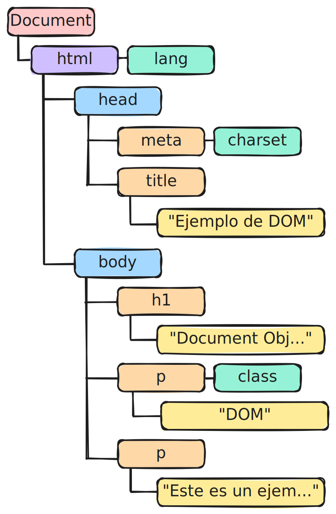

<!-- _class: centered -->
<!-- _paginate: false -->

# Unidad 3

# <!-- fit --> Programación del Lado del Cliente

## Programación Web


---

# Docente


Nombre
: Dr. Jaime Jesús Delgado Meraz

Correo
: <jesus.delgado@tecvalles.mx>
: <jaime.dm@cdvalles.tecnm.mx>

---

<!-- _class: cols-2 -->

# Asignatura

::: left

Nombre
: Programación Web

Carrera
: Ingeniería en Sistemas Computacionales
: Ingeniería en Tecnologías de la Información y Comunicaciones

:::
::: right

Clave
: AEB - 1055

SATCA
: 1 - 4 - 5

:::

---

<!-- _class: toc -->

# Contenidos

1. [JavaScript](#javascript)
2. [Modelo de objeto del documento (DOM)](#modelo-de-objeto-del-documento)
3. [Manipulación de objetos](#manipulación-de-objetos)
4. [AJAX](#ajax)
5. [Librerías y frameworks](#librerías-y-frameworks)

---

# Competencia específica de la unidad

> Conoce y aplica un lenguaje de programación del lado del cliente, para la construcción de aplicaciones web dinámicas, considerando frameworks ya existentes

---

<!-- _class: lead -->

# JavaScript

---

# JavaScript

## Introducción

- La programación del lado del cliente es una parte fundamental de la programación web, ya que es la encargada de darle interactividad a las páginas web.
- Los lenguajes de programación del lado del cliente son aquellos que se ejecutan en el navegador del usuario, es decir, en el cliente.
- Principalmente se utiliza JavaScript (JS), aunque también se pueden utilizar otros lenguajes como TypeScript, CoffeeScript, Dart, etc; sin embargo, todos estos lenguajes se compilan a JavaScript, ya que es el lenguaje que entiende el navegador.

---

# JavaScript

## Introducción

- **JavaScript** es un lenguaje de programación que se utiliza principalmente en el lado del cliente, fue creado por Netscape Communications Corporation en 1995 y es un lenguaje interpretado.
- Se caracteriza por ser un lenguaje orientado a objetos, basado en prototipos, débilmente tipado y dinámico.
- Es un lenguaje que se ejecuta principalmente en el navegador del cliente, por lo que es muy útil para la creación de aplicaciones web interactivas, como juegos, animaciones, formularios dinámicos, etc.


---

# JavaScript

## Introducción

- Pese al nombre, **JavaScript** no tiene nada que ver con el lenguaje de programación **Java**, al punto que algunos desarrolladores han bromeado con la siguiente frase:
  - _"Java is to JavaScript as Ham is to Hamster"_ 🐹
- Con lo anterior se quiere decir que JavaScript y Java son dos lenguajes completamente diferentes, con diferentes sintaxis, diferentes propósitos y diferentes aplicaciones.
- JavaScript complementa a HTML y CSS, creando una tríada de tecnologías que se utilizan en el desarrollo web.

---

# JavaScript

## Sintaxis básica

- **JavaScript** es un lenguaje de programación que se basa en la sintaxis de C, con algunas diferencias en cuanto al tipado.
- A continuación se muestra un ejemplo de un programa simple que muestra un mensaje en la consola del navegador:

```javascript
console.log("Hola, mundo!");
```

- Al ser un lenguaje interpretado, se puede ejecutar directamente en el navegador, sin necesidad de compilarlo, únicamente requiere ser incluido en el código HTML de la página.

---

# JavaScript

## Sintaxis básica

- Al igual que con el código CSS, es posible incluir código JS en una página HTML de tres formas:
  - **Incrustado**: Dentro de las etiquetas `<script>` en el `<head>` o `<body>` de la página.
  - **Enlazado**: En un archivo externo con extensión `.js` que se enlaza a la página, mediante una etiqueta `<script>` con el atributo `src`.
  - **Eventos**: A través de eventos que se disparan en la página o en algún elemento, como `onclick`, `onload`, `onsubmit`, etc.

::: info
Cuando se utiliza la forma incrustada o enlazada, es recomendable colocar el código al final del `<body>`, para que la página se cargue primero y después se ejecute el código.

De esta forma, se evita que el código JS bloquee la carga de la página.
:::

---

<!-- _class: cols-2 -->

# JavaScript

## Sintaxis básica

::: left

<!-- prettier-ignore-start -->
```html
<!DOCTYPE html>
<html lang="es">
  <head>
    <meta charset="UTF-8" />
    <title>Ejemplo de JavaScript</title>
  </head>
  <body>
    <h1 onhover="style.color='red'">
      Hola, mundo!
    </h1>
    <p>Este es un ejemplo de un programa 
      simple en JavaScript.</p>

    <script>
      console.log("Hola, mundo!");
    </script>
    <script src="js/script.js"></script>
  </body>
</html>
```
<!-- prettier-ignore-end -->

:::
::: right

```javascript
// js/script.js
console.log("Hola, mundo desde un archivo externo!");
```

- Para verificar el funcionamiento del código, se puede abrir la consola del navegador y se debe mostrar el mensaje `Hola, mundo!` y `Hola, mundo desde un archivo externo!`.
- De manera parecida con el CSS, la precedencia de la funcionalidad JS es importante, por lo que se debe tener cuidado con la sobrescritura de comportamientos.

:::

---

<!-- _class: split -->

# JavaScript

## Tipos de datos

::: top

- JavaScript es un lenguaje débilmente tipado, lo que significa que no es necesario declarar el tipo de dato de una variable al momento de crearla, ya que el lenguaje lo infiere automáticamente.
- Los tipos de datos en JavaScript se dividen en dos categorías:

:::

::: left

Primitivos
: Son aquellos datos que **no** son objetos y se almacenan directamente en la variable.

:::
::: right

No primitivos
: Son aquellos que son **objetos** y se almacenan por referencia.

:::

---

<!-- _class: split -->

# JavaScript

## Tipos de datos

### Primitivos

::: top

- Los tipos de datos primitivos en JavaScript son:

:::

::: left

| Tipo de dato | Descripción                                                             |
| :----------: | ----------------------------------------------------------------------- |
|   `string`   | Cadena de texto                                                         |
|   `number`   | Número, que puede ser entero o decimal                                  |
|  `boolean`   | Valor lógico                                                            |
|    `null`    | Valor nulo                                                              |
| `undefined`  | Valor indefinido, muy común cuando una variable no ha sido inicializada |
|   `Symbol`   | Valor único e inmutable, se utiliza para crear identificadores únicos   |

:::
::: right

```js
let cadena = "Hola, mundo!";
let numero = 42;
let logico = true;
let nulo = null;
let indefinido = undefined;
let simbolo = Symbol("foo");
```

- El `Symbol` se utiliza principalmente para crear propiedades de objetos que no se pueden sobrescribir.

```js
let objeto = {
  [simbolo]: "bar",
};
```

:::

---

<!-- _class: split -->

# JavaScript

## Tipos de datos

### No primitivos

::: top

- Los tipos de datos no primitivos en JavaScript son:

:::

::: left

| Tipo de dato | Descripción                                           |
| :----------: | ----------------------------------------------------- |
|   `object`   | Objeto, que puede ser cualquier tipo no primitivo     |
|   `Array`    | Arreglo                                               |
|  `function`  | Función                                               |
|    `Date`    | Fecha, que almacena una fecha y hora                  |
|   `regexp`   | Expresión regular                                     |
|   `Error`    | Error, que representa un error en tiempo de ejecución |

:::
::: right

```js
let objeto = { nombre: "Jaime", edad: 37 };
let arreglo = [1, 2, 3, 4, 5];

function suma(a, b) {
  return a + b;
}

let fecha = new Date();
let patron = /ab+c/;
let error = new Error("Error de prueba");
```

- La representación de un objeto en JavaScript es similar a un diccionario en Python, donde se tiene una clave y un valor.

:::

---

# JavaScript

## Variables

- Como ya se revisó previamente, la declaración de variables, combina la palabra reservada `let` con el nombre de la variable y opcionalmente con un valor inicial.
  - Sino se establece un valor inicial, la variable se inicializa con `undefined`.

```js
let variable = tipoDato;
```

- La palabra reservada `let` crea una variable local con ámbito de bloque, opcionalmente se puede utilizar `var` para crear una variable con ámbito de función<note>\*</note> o `const` para crear una constante.

```js
var variable = tipoDato;
const constante = tipoDato;
```

::: note
Aunque su utilización se encuentra en desuso debido a que puede llevar a errores difíciles de depurar.
:::

---

<!-- _class: split inverted pattern -->

# ¿Cuándo usar `var` y `let`?

::: top

- La principal diferencia entre `var` y `let` es el ámbito de la variable; mientras que `var` tiene un ámbito de función, `let` tiene un ámbito de bloque, es decir, que la variable declarada con `let` solo existe dentro del bloque en el que fue declarada.

:::
::: left

```js
if (true) {
  let x = 5;
}
console.log(x); // ReferenceError: x is not defined
```

:::
::: right

```js
if (true) {
  var y = 5;
}
console.log(y); // 5
```

:::
::: bottom

- Una razón de peso para elegir `let` por sobre `var` es por el _hoisting_, que hace que las variables declaradas con `var` sean movidas al inicio de la función o del script, lo que puede llevar a errores difíciles de depurar.

:::

---

# JavaScript

## Operadores

- Los operadores en JavaScript son similares a los de otros lenguajes de programación, se dividen en varios tipos:
  - **Aritméticos**: `+`, `-`, `*`, `/`, `%`, `++`, `--`.
  - **Asignación**: `=`, `+=`, `-=`, `*=`, `/=`, `%=`.
  - **Comparación**: `==`, `===`, `!=`, `!==`, `>`, `<`, `>=`, `<=`.
  - **Lógicos**: `&&`, `||`, `!`.
  - **Bitwise**: `&`, `|`, `^`, `~`, `<<`, `>>`, `>>>`.
  - **Condicional**: `? :` (Operador ternario).
  - **Concatenación**: `+` (Para cadenas de texto).

---

# JavaScript

## Operadores

```js
let a = 5;
let b = 3;

let resultado = ((a + b - 2) * 3) / 2;
console.log(resultado); // 9
resultado += 1;

console.log(a > b); // true
console.log(a === b); // false, se compara el valor y el tipo

console.log(resultado % 3 == 0 ? "👍" : "👎");

let cadena = "Hola, " + "mundo!";

console.log(cadena); // Hola, mundo!
```

---

# JavaScript

## Condicionales

- Los condicionales en JavaScript son similares a los de otros lenguajes de programación, se utilizan para tomar decisiones en el flujo del programa.

```js
let edad = 18;

if (edad >= 18) {
  console.info("Eres mayor de edad");
} else {
  console.warn("Eres menor de edad");
}
```

- También se pueden utilizar condicionales anidados o múltiples, así como el operador ternario.
- Otro tipo de condicional es el `switch`, que se utiliza para comparar una variable con múltiples valores.

---

<!-- _class: cols-2 -->

# JavaScript

## Condicionales

::: left

```js
let anio = prompt("En que año naciste?");
let anio_actual = new Date().getFullYear();
let edad = anio_actual - anio;

if (edad >= 18) {
  console.info("Eres mayor de edad");
} else if (edad >= 12 && edad < 18) {
  if (edad == 12) {
    console.log("Eres un preadolescente");
  } else {
    console.log("Eres un adolescente");
  }
} else {
  console.warn("Eres un niño");
}
```

:::
::: right

```js
let dia = prompt("Ingresa un número del 1 al 7");

switch (dia) {
  case 1:
    console.log("Lunes");
    break;
  case 2:
    console.log("Martes");
    break;
  case 3:
    console.log("Miércoles");
    break;
  default:
    console.error("Día no válido");
}
```

:::

---

<!-- _class: split -->

# JavaScript

## Ciclos

::: top

- Los ciclos, como en otros lenguajes de programación, se utilizan para repetir una serie de instrucciones un número determinado de veces o hasta que se cumpla una condición.

:::
::: left

```js
for (let i = 0; i < 5; i++) {
  console.log(i);
}

let j = 0;
while (j < 5) {
  console.log(j);
  j++;
}
```

:::
::: right

```js
let k = 0;
do {
  console.log(k);
  k++;
} while (k < 5);
```

:::
::: bottom

- En JavaScript también se pueden utilizar las palabras reservadas `break` y `continue` para salir de un ciclo o saltar a la siguiente iteración.

:::

---

<!-- _class: cols-2 -->

# JavaScript

## Funciones

::: left

- JS permite la declaración de **funciones nombradas**, que se definen con la palabra reservada `function`, seguida del nombre de la función y los parámetros que recibe entre paréntesis.

```js
function suma(a, b) {
  return a + b;
}

let resultado = suma(5, 3);
console.log(resultado); // 8
```

:::
::: right

- Una alternativa a la declaración de funciones es la **expresión de función**, que se asigna a una variable.
  - También conocidas como funciones anónimas o _lambda_.

```js
let resta = function (a, b) {
  return a - b;
};

console.log(resta(5, 3)); // 2
```

:::
::: info
La principal diferencia entre ambas es que las funciones nombradas se pueden llamar **antes** de su declaración, mientras que las expresiones de función **no**, esto derivado del _hoisting_.
:::

---

<!-- _class: cols-2 -->

# JavaScript

## Funciones

### Funciones flecha

::: left

- A partir de ECMAScript 6 (2015), se introdujeron las funciones flecha, que son una forma más concisa de escribir funciones anónimas.

```js
let multiplicacion = (a, b) => a * b;

console.log(multiplicacion(5, 3)); // 15
```

:::
::: right

- Las funciones flecha no tienen su propio `this`, por lo que heredan el `this` del contexto en el que se encuentran.

```js
let objeto = {
  nombre: "Jaime",
  saludar: function () {
    setTimeout(() => {
      console.log(`Hola, soy ${this.nombre}`);
    }, 1000);
  },
};

objeto.saludar();
```

:::
::: ok
Este tipo de función es útil cuando se requiere una función corta y concisa, como en el caso de funciones de _callback_.
:::

---

# JavaScript

## Arreglos

- Los arreglos en JavaScript son objetos que almacenan múltiples valores en una sola variable, se pueden declarar utilizando la expresión `new Array()` o mediante la notación de corchetes `[]`.

```js
let arreglo = new Array(1, 2, 3, 4, 5);
let colores = ["rojo", "verde", "azul"];
```

- En la práctica se recomienda utilizar la notación de corchetes, ya que es más sencilla y legible.
  - Utilizando la misma nomenclatura se pueden crear arreglos multidimensionales.
- Para acceder a los elementos de un arreglo se utiliza la notación de corchetes y el índice del elemento.

```js
console.log(colores[0]); // rojo
```

---

<!-- _class: split -->

# JavaScript

## Arreglos

::: top

- Los arreglos en JavaScript son objetos, por lo que tienen métodos y propiedades que se pueden utilizar para manipularlos.

:::
::: left

```js
let frutas = ["🍎", "🍐", "🍇", "🍓"];

frutas.push("🥭");
frutas.unshift("🍌");
frutas.pop();
console.log(frutas); // 🍌, 🍎, 🍐, 🍇

let frutas2 = frutas.slice(1, 3);
console.log(frutas2.join(" - ")); // 🍎 - 🍐
console.log(frutas.length); // 5
console.log(frutas.indexOf("🍇")); // 3

let frutas3 = frutas.map((fruta) => fruta + "🍉");
console.table(frutas3);
```

:::
::: right

- `push()`: Agrega un elemento al final.
- `unshift()`: Agrega un elemento al inicio.
- `pop()`: Elimina el último elemento.
- `slice()`: Extrae una porción del arreglo.
- `join()`: Une los elementos en una cadena.
- `length`: Devuelve la longitud del arreglo.
- `indexOf()`: Devuelve el índice del elemento.
- `map()`: Aplica una función y devuelve un nuevo arreglo.

:::

---

<!-- _class: lead -->

# Modelo de objeto del documento

---

# Modelo de objeto del documento (DOM)

- La programación web, suele iniciar por el aprendizaje y desarrollo mediante etiquetas HTML, que definen la **estructura** de la página, posteriormente, se integra el CSS, que da estilo a los elementos de la misma.
- Si únicamente se utiliza HTML yCSS, principalmente se crean páginas "estáticas", es decir, páginas que no pueden realizar tareas dinámicas y personalizadas dependiendo de acciones concretas del usuario o su entorno.
- Sin embargo, con la inclusión de JS, es posible crear páginas "dinámicas", y aprovechar la potencia y flexibilidad del lenguaje para crear aplicaciones web interactivas con una experiencia más completa.

---

# Modelo de objeto del documento (DOM)

## Introducción

> El **Document Object Model** (DOM) es una interfaz de programación para documentos HTML y XML.

- Proporciona una representación estructurada del documento y define cómo los programas pueden acceder, modificar y agregar elementos al documento.
- El DOM es una representación en forma de árbol de la estructura de un documento HTML, que se puede manipular mediante JavaScript para cambiar dinámicamente el contenido, la estructura y el estilo de la página.
- Es en esencia una API que permite a los programadores acceder y manipular el contenido de un documento HTML.

::: info
En adelante, se utilizará el término **DOM** para referirse al **Modelo de objeto del documento**.
:::

---

# DOM

## Estructura

- El DOM se organiza en una estructura de árbol, donde cada elemento del documento es un nodo del árbol.
- Los nodos del árbol se dividen en tres tipos:
  - **Nodos de elementos**: Representan elementos HTML, como `<p>`, `<div>`, `<h1>`, etc.
  - **Nodos de texto**: Representan texto dentro de un elemento, como el texto de un párrafo.
  - **Nodos de atributos**: Representan atributos de un elemento, como `id`, `class`, `src`, etc.
- Los nodos del árbol se pueden acceder y manipular mediante JavaScript, lo que permite modificar el contenido, la estructura y el estilo de la página.

---

# DOM

## Estructura

```html
<!DOCTYPE html>
<html lang="es">
  <head>
    <meta charset="UTF-8" />
    <title>Ejemplo de DOM</title>
  </head>
  <body>
    <h1>Document Object Model</h1>
    <p class="subtitulo">DOM.</p>
    <p>Este es un ejemplo de DOM.</p>
  </body>
</html>
```



---

# DOM

## Estructura

### Nodo raíz

- En el árbol del DOM, el nodo raíz es el nodo `document`, que representa todo el documento HTML, es decir, el árbol DOM de la página (pestaña) que se encuentra activa.
- En su interior pueden existir varios tipos de elementos, pero principalmente serán objetos de tipo `Element` y `Node`.
  - `Element`: Representa un elemento HTML, como un `<p>`, `<div>`, `<h1>`, etc.
  - `Node`: Representa cualquier tipo de nodo, como un nodo de texto, un nodo de atributo, un nodo de comentario, etc.
- La diferencia principal entre ambos es que `Element` es un tipo de `Node`, pero no todos los nodos son elementos.

---

# DOM

## Estructura

### `Node` y `Element`


- En la imagen se muestra un ejemplo de un árbol DOM, donde el nodo raíz es el nodo `document`, que contiene varios nodos de tipo `Element` y `Node`.
- Los nodos de tipo `Element` se identifican con los elementos HTML (<div class="dot" style="background-color: #d0bfff;"></div>, <div class="dot" style="background-color: #a5d8ff;"></div> y <div class="dot" style="background-color: #ffd8a8;"></div>).
- Mientras que los nodos de tipo `Node` incluyen a los nodos de texto y atributos (<div class="dot" style="background-color: #96f2d7;"></div> y <div class="dot" style="background-color: #ffec99;"></div>).

::: ok
Es importante recordar que **todos** los nodos de tipo `Element` son nodos de tipo `Node`, pero **no** todos los nodos de tipo `Node` son nodos de tipo `Element`.
:::

::: warning
El coloreado es únicamente para fines ilustrativos.
:::

---

<!-- _class: inverted pattern split -->

# DOM VS Virtual DOM

::: left

## DOM

- Es la representación en memoria de la estructura de un documento HTML.
- Cada vez que se modifica el DOM, el navegador debe recalcular el diseño de la página y repintarla, lo que puede ser costoso en términos de rendimiento.

:::
::: right

## Virtual DOM

- Es una copia ligera del DOM que se actualiza de forma eficiente.
- Se utiliza en bibliotecas y frameworks como React, Vue y Angular para mejorar el rendimiento de las aplicaciones web.

:::

::: warning
En la práctica, **no** se recomienda la manipulación directa del DOM, ya que puede ser ineficiente y lento, especialmente en aplicaciones web complejas.
:::

---

# DOM

## Selección de elementos

- Para seleccionar elementos del DOM, se pueden utilizar varios métodos, los más comunes son:

| Método                              | Descripción                                                      | Devuelve  |
| ----------------------------------- | ---------------------------------------------------------------- | --------- |
| `document.getElementById()`         | Selecciona un elemento por su `id`                               | Elemento  |
| `document.getElementsByClassName()` | Selecciona elementos por su `class`                              | Colección |
| `document.getElementsByName()`      | Selecciona elementos por su atributo `name`                      | Colección |
| `document.getElementsByTagName()`   | Selecciona elementos por su nombre de etiqueta                   | Colección |
| `document.querySelector()`          | Selecciona el primer elemento que coincida con un selector CSS   | Elemento  |
| `document.querySelectorAll()`       | Selecciona todos los elementos que coincidan con un selector CSS | Colección |

- Es importante notar que dependiendo del método utilizado, se obtendrá un solo elemento o una colección de elementos.

---

<!-- _class: cols-2 -->

# DOM

## Selección de elementos

::: left

```html
<!DOCTYPE html>
<html lang="es">
  <head>
    <meta charset="UTF-8" />
    <title>Selección de elementos</title>
  </head>
  <body>
    <h1 id="titulo">Título</h1>
    <p class="parrafo">Párrafo 1</p>
    <p class="parrafo">Párrafo 2</p>
    <p class="parrafo">Párrafo 3</p>
  </body>
</html>
```

:::
::: right

```js
let titulo = document.getElementById("titulo");
console.log(titulo.textContent);

let parrafos = document.getElementsByTagName("p");
console.table(parrafos);

let parrafos2 = document.getElementsByClassName("parrafo");
console.log(parrafos2[1].textContent);

let parrafo = document.querySelector(".parrafo");
console.log(parrafo.textContent);
```

:::

---

# DOM

## Modificación de elementos

- Una vez seleccionado un elemento del DOM, se pueden modificar sus propiedades, atributos, estilos, entre otros, siendo los más comúnes:
  - `innerHTML`: Contenido HTML del elemento.
  - `innerText`: Contenido de texto del elemento.
  - `style`: Estilos CSS del elemento.
  - `className`: Clases CSS del elemento.
  - `src`: Ruta de la imagen.
  - `href`: URL del enlace.
  - `value`: Valor del elemento.

---

<!-- _class: cols-2 -->

# DOM

## Modificación de elementos

::: left

```html
<!DOCTYPE html>
<html lang="es">
  <head>
    <meta charset="UTF-8" />
    <title>Selección de elementos</title>
    <link rel="stylesheet" href="app.css" />
  </head>
  <body>
    <h1 id="titulo">Título</h1>
    <p class="parrafo">Párrafo 1</p>
    <p class="parrafo">Párrafo 2</p>
    <p class="parrafo">Párrafo 3</p>
  </body>
</html>
```

```css
.nuevo-parrafo {
  color: blue;
}
```

:::
::: right

```js
let titulo = document.getElementById("titulo");
titulo.style.color = "red";

let parrafos = document.getElementsByTagName("p");
Array.from(parrafos).forEach((element, index) => {
  element.innerText = "Nuevo párrafo " + (index + 1);
});

let parrafos2 = document.getElementsByClassName("parrafo");
parrafos2[1].style.backgroundColor = "greenyellow";
parrafos2[1].innerHTML = "<strong>Nuevo párrafo</strong>";

let parrafo = document.querySelector(".parrafo");
parrafo.className = "nuevo-parrafo";
```

:::

---

<!-- _class: inverted pattern -->

# `HTMLCollection` y `Array`

- Al trabajar con el DOM, es común obtener una colección de elementos, ya sea mediante `getElementsByTagName()`, `getElementsByClassName()` o `querySelectorAll()`
- Estas colecciones no son arreglos, sino objetos de tipo `HTMLCollection`, que no tienen los métodos y propiedades de un arreglo.
- Para convertir una colección en un arreglo, se puede utilizar el método `Array.from()` o el operador de propagación `...`, que convierte la colección en un arreglo.

```js
let parrafos = document.getElementsByClassName("parrafo");
let parrafosArray = Array.from(parrafos);
let parrafosArray2 = [...parrafos];
```

- Es importante conocer esta diferencia, porque al manipular un `HTMLCollection`, se esta trabajando con el DOM _vivo_, por lo que cualquier cambio en la colección se reflejará en el DOM, además de que no se pueden utilizar métodos de arreglos.

---

# DOM

## Creación y eliminación de elementos

- Para crear un nuevo elemento en el DOM, se utiliza el método `document.createElement()`, que recibe como parámetro el nombre del elemento a crear.

```js
let parrafo = document.createElement("p");
parrafo.innerText = "Nuevo párrafo";
document.body.appendChild(parrafo);
```

- Si se tiene la referencia de un elemento, se pueden insertar elementos antes o después de él, utilizando los métodos `insertBefore()` y `insertAfter()`.

```js
let h1 = document.querySelector("h1");
let hr = document.createElement("hr");
let nuevoParrafo = document.createElement("p");

document.body.insertBefore(nuevoParrafo, h1);
document.body.insertAfter(hr, nuevoParrafo);
```

---

# DOM

## Creación y eliminación de elementos

- Para eliminar un elemento del DOM, se utiliza el método `removeChild()`, que recibe como parámetro el elemento a eliminar.

```js
let parrafo = document.querySelector("p");
document.body.removeChild(parrafo); // Se elimina por referencia
```

- También se puede eliminar un elemento utilizando el método `remove()`, que se aplicará directamente sobre el elemento.

```js
let ultimo_parrafo = document.querySelector("p:last-child");

ultimo_parrafo.remove();
```

- Ambos métodos eliminan el elemento del DOM, pero `remove()` es más moderno y sencillo de utilizar, además de que no requiere un padre para eliminar el elemento.

---

# DOM

## Creación y eliminación de elementos

- Para eliminar todos los elementos de un nodo, se puede utilizar un bucle `while` para eliminar el primer hijo del nodo hasta que no queden más elementos.

```js
let nodo = document.body;

while (nodo.firstChild) {
  nodo.removeChild(nodo.firstChild);
}
```

- Otra forma de eliminar todos los elementos de un nodo es utilizando el método `innerHTML`, que establece o devuelve el contenido HTML de un elemento.

```js
document.body.innerHTML = "";
```

- Esta última forma es más sencilla y eficiente, pero elimina todo el contenido del nodo, incluyendo los nodos hijos.

---

# DOM

## Navegación de elementos

- La navegación entre los elementos del DOM es una funcionalidad muy importante, combinada con la creación, eliminación y edición de elementos.

```js
let parrafo = document.querySelector("p");
let padre_parrafo = parrafo.parentElement;
console.log(padre_parrafo); // body

let lista = document.createElement("ol");
for (let i = 1; i <= 5; i++) {
  let item = document.createElement("li");
  item.innerText = `Elemento ${i}`;
  lista.appendChild(item);
}

padre_parrafo.appendChild(lista);
```

---

# DOM

## Navegación de elementos

- Los métodos más comúnes para para navegar entre los elementos del DOM son:

| Descripción                    | Elemento                 | Nodo              | Devuelve  |
| ------------------------------ | ------------------------ | ----------------- | --------- |
| Hijos del elemento             | `children`               | `childNodes`      | Colección |
| Primer hijo del elemento       | `firstElementChild`      | `firstChild`      | Elemento  |
| Último hijo del elemento       | `lastElementChild`       | `lastChild`       | Elemento  |
| Siguiente hermano del elemento | `nextElementSibling`     | `nextSibling`     | Elemento  |
| Anterior hermano del elemento  | `previousElementSibling` | `previousSibling` | Elemento  |
| Padre del elemento             | `parentElement`          | `parentNode`      | Elemento  |

::: info
Aunque la navegación por nodos es más precisa, la navegación por elementos es más sencilla y comúnmente utilizada.
:::

<!-- https://lenguajejs.com/dom/buscar/navegar-elementos-dom/ -->

---

# DOM

## Navegación de elementos

- El método `matches()` se utiliza para comprobar si un elemento coincide con un selector CSS.

```js
let parrafos = document.body.getElementsByTagName("p");

let aleatorio = Math.floor(Math.random() * parrafos.length);
parrafos[aleatorio].classList.add("elegido");

if (parrafos[0].matches(".elegido")) {
  parrafos[0].textContent += "⭐";
}
```

---

# DOM

## Navegación de elementos

- El método `closest()` se utiliza para buscar el ancestro más cercano que coincida con un selector CSS.
- Es muy útil cuando se trabaja con el procesamiento y validación de formularios.

```html
<form id="mi_formulario">
  <input type="text" name="nombre" />
  <input type="email" name="correo" />
  <button type="submit">Enviar</button>
</form>
```

```js
let input = document.querySelector("input");

let formulario = input.closest("form");
console.log(formulario);
```

---

# DOM

## Atributos y propiedades

- Los elementos del DOM tienen atributos y propiedades que se pueden modificar y acceder mediante JavaScript.

```js
let enlace = document.querySelector("a");

console.log(enlace.href);
console.log(enlace.getAttribute("href"));

enlace.href = "https://www.google.com";
enlace.setAttribute("href", "https://www.google.com");
```

- Aunque un elemento no tenga un atributo explícito, puede tener una propiedad asociada que se asigna automáticamente.
- La diferencia entre atributos y propiedades es que los atributos son los valores que se encuentran en el HTML, mientras que las propiedades son los valores que se encuentran en el DOM.

---

<!-- _class: cols-2 -->

# DOM

## Atributos y propiedades

::: left

- Para acceder a los atributos de un elemento, se utilizan los métodos `getAttribute()` y `setAttribute()`.
- Para acceder a las propiedades de un elemento, se utilizan las propiedades del objeto.
- En los casos de los atributos `class` y `for`, se utilizan las propiedades `className` y `htmlFor`.

:::
::: right

- Tomando como referencia el elemento `a`, se tendría:

| Atributos | Propiedades |
| --------- | ----------- |
| `href`    | `href`      |
| `id`      | `id`        |
| `class`   | `className` |
| `src`     | `src`       |
| `title`   | `title`     |

:::
::: info
Si un atributo no fue definido en el HTML, su valor será `null`, mientras que si una propiedad no fue definida, su valor será `undefined`.
:::

---

# DOM

## Eventos

> Un evento es una acción que se produce principalmente, derivado de una interacción por parte del usuario.

- Los eventos en JavaScript son acciones que se pueden detectar y manejar, como hacer clic en un botón, mover el ratón, escribir en un campo de texto, etc.
- Para manejar eventos en JavaScript, se utilizan los _event listeners_, que son funciones que se ejecutan cuando ocurre un evento.
- Los _event listeners_ se pueden añadir a cualquier elemento del DOM, como un botón, un enlace, un campo de texto, etc.
  - Funcionan "publicando" un evento que se puede escuchar y manejar mediante una función _callback_.

---

# DOM

## Eventos

- Los eventos en JavaScript se dividen en varios tipos, los más comunes son:

  - **Eventos de ratón**: `click`, `dblclick`, `mouseover`, `mouseout`, `mousedown`, `mouseup`, `mousemove`, `wheel`, etc.
  - **Eventos de teclado**: `keydown`, `keyup`, `keypress`.
  - **Eventos de formulario**: `submit`, `reset`, `change`, `focus`, `blur`, `input`.
  - **Eventos de ventana**: `load`, `resize`, `scroll`, `unload`.
  - **Eventos de documento**: `DOMContentLoaded`, `readystatechange`.
  - **Eventos de arrastrar y soltar**: `drag`, `dragstart`, `dragend`, `dragenter`, `dragleave`, `dragover`, `drop`.

- Para una lista completa de eventos, se puede consultar la [documentación de MDN](https://developer.mozilla.org/en-US/docs/Web/Events).

---

# DOM

## Eventos

### Sintaxis básica

- La forma más sencilla de añadir eventos a un elemento es utilizando el atributo `on` del elemento, seguido del nombre del evento y la función _callback_.

```html
<button onclick="saludar()">Saludar</button>
```

- En este caso, al hacer clic en el botón, se ejecutará la función `saludar()`.

```js
function saludar() {
  console.log("Hola, mundo!");
}
```

- Aunque esta forma es sencilla, no es recomendable, ya que mezcla el HTML con el JavaScript, lo que puede llevar a problemas de mantenimiento y escalabilidad.

---

# DOM

## Eventos

### _Event Listener_

- Para añadir un _event listener_ a un elemento, se utiliza el método `addEventListener()`, que recibe como parámetros el nombre del evento y la función _callback_ que se ejecutará cuando ocurra el evento.

```js
let boton = document.querySelector("button");

boton.addEventListener("click", function () {
  console.log("Haz hecho clic en el botón");
});
```

- También se puede utilizar una función _callback_ externa, en lugar de una función anónima.

```js
function clicBoton() {
  console.log("Haz hecho clic en el botón");
}

boton.addEventListener("click", clicBoton);
```

---

# DOM

## Eventos

### Ratón

- Los eventos de ratón son aquellos que se producen cuando se interactúa con un elemento mediante el ratón.

```js
let boton = document.querySelector("button");

boton.addEventListener("click", function () {
  console.log("Haz hecho clic en el botón");
});

boton.addEventListener("mouseover", function () {
  console.log("El ratón está sobre el botón");
});

boton.addEventListener("mouseout", function () {
  console.log("El ratón ha salido del botón");
});
```

---

# DOM

## Eventos

### Teclado

- Los eventos de teclado son aquellos que se producen cuando se interactúa con un elemento mediante el teclado.

```js
let input = document.querySelector("input");

input.addEventListener("keydown", function (event) {
  console.log("Tecla presionada:", event.key);
});

input.addEventListener("keyup", function (event) {
  console.log("Tecla liberada:", event.key);
});

input.addEventListener("keypress", function (event) {
  console.log("Tecla presionada:", event.key);
});
```

---

# DOM

## Eventos

### Formulario

- Como es lógico, los eventos de formulario son aquellos que se producen cuando se interactúa con un formulario.

```js
let formulario = document.querySelector("form");

formulario.addEventListener("submit", function (event) {
  event.preventDefault();
  console.log("Formulario enviado");
});
```

- El método `preventDefault()` se utiliza para evitar que el formulario se envíe y la página se recargue, combinado con AJAX <note>\*</note> permite procesar el formulario sin recargar la página.

::: note
AJAX se revisará más adelante en la unidad.
:::

---

# DOM

## Eventos

### Ventana

- Este tipo de eventos puede ser múy útil para complementar la responsividad de las páginas web.

```js
let ventana = window;

ventana.addEventListener("resize", function () {
  console.log(
    "Las nuevas dimensiones de la ventana son:",
    ventana.innerWidth,
    ventana.innerHeight
  );
});

ventana.addEventListener("scroll", function () {
  console.log("La posición del scroll es:", ventana.scrollX, ventana.scrollY);
});
```

---

# DOM

## Eventos

### Documento

- Los eventos de documento son aquellos que se producen cuando se carga o modifica el documento.

```js
document.addEventListener("DOMContentLoaded", function () {
  console.log("El documento ha sido cargado");
});

document.addEventListener("readystatechange", function () {
  console.log("El estado del documento es:", document.readyState);
});
```

- Este último evento es útil para saber en qué estado se encuentra el documento, ya sea `loading`, `interactive` o `complete`.
- En este caso `complete` significa que el documento ha sido completamente cargado, incluyendo los estilos, imágenes y scripts.

---

<!-- _class: lead -->

# Manipulación de objetos

---

# Manipulación de objetos

- La manipulación de objetos en JS se refiere a la interacción con los objetos del navegador, como la ventana, el documento, la ubicación, el historial, el navegador, la pantalla, la fecha, entre otros.
- Estos objetos proporcionan información y funcionalidades que se pueden utilizar para interactuar con el navegador y el entorno del usuario.
- Al ser JS un lenguaje orientado a objetos, se pueden manipular estos objetos para obtener información, realizar acciones y personalizar la experiencia del usuario.
- Es claro que se pueden crear objetos personalizados, pero en este caso se abordarán los objetos predefinidos por el navegador.

---

<!-- _class: split -->

# Manipulación de objetos

## Window

::: top

- El objeto `window` representa la ventana del navegador y proporciona información y funcionalidades relacionadas con la ventana y el navegador, es global y se declara automáticamente.
- Incluye propiedades y métodos que se pueden utilizar para interactuar con la ventana, como `alert()`, `prompt()`, `confirm()`, `setTimeout()`, `setInterval()`, entre otros.

:::
::: left

```js
let nombre = prompt("Ingresa tu nombre:");

if (nombre) {
  alert(`Hola, ${nombre}`);
} else {
  console.warn("No ingresaste tu nombre");
}
```

:::
::: right

```js
let tiempo = setTimeout(() => {
  console.log("Han pasado 3 segundos");
}, 3000); // Se ejecuta después de 3 segundos

clearTimeout(tiempo);

let intervalo = setInterval(() => {
  console.log("Han pasado 1 segundo");
}, 5000); // Se ejecuta cada 5 segundos

clearInterval(intervalo);
```

:::

---

# Manipulación de objetos

## Document

- El objeto `document` representa el documento HTML y proporciona información y funcionalidades relacionadas con el documento, incluía la gestión de elementos, eventos, estilos, entre otros.

```js
let titulo = document.querySelector("h1");
titulo.style.color = "red";

let parrafos = document.getElementsByTagName("p");
Array.from(parrafos).forEach((element, index) => {
  element.innerText = "Nuevo párrafo " + (index + 1);
});
```

- El objeto `document` es el punto de entrada para interactuar con el DOM y se utiliza para acceder y manipular los elementos del documento.
- También es el objeto que se utiliza para añadir _event listeners_ y manejar eventos en la página.

---

# Manipulación de objetos

## Location

- El objeto `location` representa la ubicación del documento y proporciona información sobre la URL actual, como el protocolo, el host, el puerto, la ruta, los parámetros, entre otros.

```js
console.log(location.href);
console.log(location.protocol);
console.log(location.host);
console.log(location.pathname);
console.log(location.search);
console.log(location.hash);
```

- El objeto `location` es útil para obtener información sobre la URL actual y redirigir a otras páginas, ya sea en la misma ventana o en una nueva pestaña.

```js
location.href = "https://www.google.com";
location.reload();
```

---

# Manipulación de objetos

## History

- El objeto `history` representa el historial de navegación del navegador y proporciona información y funcionalidades relacionadas con el historial, como retroceder, avanzar, recargar, entre otros.

```js
history.back(); // Retrocede una página
history.forward(); // Avanza una página
history.go(-2); // Retrocede dos páginas
```

- Los métodos `back()`, `forward()` y `go()` se utilizan para navegar por el historial del navegador, retroceder, avanzar y saltar a una página específica, respectivamente, siempre y cuando existan páginas en el historial.

---

# Manipulación de objetos

## Navigator

- El objeto `navigator` representa el navegador del usuario y proporciona información y funcionalidades relacionadas con el navegador, como el nombre, la versión, el idioma, la plataforma, entre otros.

```js
console.log(navigator.userAgent);
console.log(navigator.appName);
console.log(navigator.appVersion);
console.log(navigator.language);
console.log(navigator.platform);
```

- Suele utilizarse para obtener información sobre el navegador del usuario y personalizar la experiencia del usuario, como mostrar contenido específico para un navegador o una plataforma.
- También se puede utilizar para detectar características del navegador, como la compatibilidad con ciertas tecnologías o APIs.

---

# Manipulación de objetos

## Date

- El objeto `Date` representa una fecha y hora en JavaScript, se basa en el tiempo universal coordinado (UTC) y proporciona funcionalidades para trabajar con fechas y horas.

```js
let fecha_actual = new Date();

console.log(fecha_actual.getFullYear());
console.log(fecha_actual.getMonth());
console.log(fecha_actual.getDate());
console.log(fecha_actual.getHours());
console.log(fecha_actual.getMinutes());
console.log(fecha_actual.getSeconds());

let navidad_2024 = new Date("2024-12-24 12:00:00");
let fin_2024 = new Date(2024, 11, 31, 23, 59, 59);
```

::: info
En el constructor multiparámetros, el atributo del mes es base 0, por lo que enero es 0 y diciembre es 11.
:::

---

# Manipulación de objetos

## Date

- Aunque el objeto `Date` proporciona funcionalidades para trabajar con fechas y horas, no es muy eficiente y puede ser complicado de utilizar en ciertos casos, especialmente para operaciones avanzadas.
- Algunas librerías como `DayJS` proporcionan una API más sencilla y eficiente para trabajar con fechas y horas en JavaScript.

```js
let fecha_actual = dayjs();
dayjs.locale("es");

console.log(fecha_actual);
console.log(fecha_actual.format("DD-MM-YYYY HH:mm:ss"));
console.log(fecha_actual.add(1, "day").format("DD-MM-YYYY"));

let navidad = dayjs(fecha_actual.year() + "-12-24");

alert("Faltan " + navidad.diff(fecha_actual, "days") + " días para Navidad");
```

---

# Manipulación de objetos

## Cookies 🍪

- Las cookies son pequeños fragmentos de información que se almacenan en el navegador del usuario y se envían al servidor con cada solicitud.

```js
document.cookie =
  "usuario=Jaime; expires=Fri, 31 Dec 2024 23:59:59 GMT; path=/";

let cookies = document.cookie.split("; ");
console.log(cookies);

let usuario = cookies.find((cookie) => cookie.startsWith("usuario="));
alert(`Hola, ${usuario.split("=")[1]}`);

// Elimina la cookie
// document.cookie = "usuario=; expires=Thu, 01 Jan 1970 00:00:00 GMT; path=/";
```

- Son muy útiles, pero un tanto complejas de manejar, ya que se deben codificar y decodificar, además de que están limitadas a almacenar un máximo de 4KB de información.

---

# Manipulación de objetos

## LocalStorage

- El `localStorage` es un objeto que proporciona un almacenamiento persistente en el navegador y se puede utilizar para almacenar información de forma local.

```js
localStorage.setItem("usuario", "Jaime");
localStorage.getItem("usuario"); // Sino existe, devuelve null

localStorage.removeItem("usuario");
localStorage.clear();
```

- A diferencia de las cookies, el `localStorage` permite almacenar información de forma más sencilla y eficiente, su alcance es el dominio y el protocolo, por lo que los datos se mantienen incluso después de cerrar el navegador.
- Desde julio de 2015 es compatible con todos los navegadores modernos, y permite almacenar hasta 5MB por dominio.

---

<!-- _class: inverted pattern -->

# Cookies y LocalStorage

- Las cookies y el `localStorage` son dos formas de almacenar información en el navegador, pero tienen diferencias significativas en cuanto a su uso y funcionalidad.
- Las primeras son más recomendadas por su amplia compatibilidad y retrocompatibilidad, pero son de tamaño reducido, además de que se envían con cada solicitud al servidor.
- El `localStorage` es más moderno y sencillo de utilizar, es más eficiente y permite almacenar más información, sin embargo, no es compatible con navegadores antiguos y no se envía al servidor.
- En general, se recomienda utilizar el `localStorage` para almacenar información local en el navegador, y las cookies para información que pueda ser compartida con el servidor.
- En ambos casos, es importante tener en cuenta la privacidad y la seguridad de los datos almacenados en el navegador.

---

<!-- _class: lead -->

# AJAX

---

# AJAX

---

# AJAX

## XMLHttpRequest

---

# AJAX

## GET

---

# AJAX

## POST

---

# AJAX

## JSON

---

# AJAX

## APIs

---

<!-- _class: lead -->

# Librerías y frameworks

---

# Librerías y frameworks

---

# Librerías y frameworks

## Vanilla JS

---

# Librerías y frameworks

## Librerías

---

# Librerías y frameworks

## Frameworks

---

<!-- _class: inverted centered pattern -->


<div class="text-center text-middle font-bold font-coding text-8xl mt-10">
  &lt;/Fin&gt;
</div>

<script src="https://unpkg.com/@phosphor-icons/web"></script>

---

<!-- paginate: skip -->
<!-- class: references -->

# Referencias I

- MDN Web Docs. (2024). _JavaScript_. <https://developer.mozilla.org/es/docs/Web/JavaScript>
- GeeksForGeeks. (2023). _Top 10 Javascript Alternatives For Front-End Developers_ . <https://www.geeksforgeeks.org/javascript-alternatives>
- Atuonwu Chima, S. (2020). _Var, Let, and Const – What's the Difference?_. <https://www.freecodecamp.org/news/var-let-and-const-whats-the-difference/>
- MDN Web Docs. (2024). _JavaScript data types and data structures_. <https://developer.mozilla.org/en-US/docs/Web/JavaScript/Data_structures>
- MDN Web Docs. (2024). _Window: prompt() method_. <https://developer.mozilla.org/en-US/docs/Web/API/Window/prompt>
- MDN Web Docs. (2024). _Console_. <https://developer.mozilla.org/en-US/docs/Web/API/console>

---

# Referencias II

- MDN Web Docs. (2024). _Window: setTimeout() method_. <https://developer.mozilla.org/en-US/docs/Web/API/Window/setTimeout>
- W3Schools. (2022). _JavaScript Arrays_. <https://www.w3schools.com/js/js_arrays.asp>
- _ManzDev_. (2024). _Lenguaje JS_. <https://lenguajejs.com/>
- _ManzDev_. (2024). _Lenguaje JS: DOM_. <https://lenguajejs.com/dom/>
- MDN Web Docs. (2024). _Document Object Model (DOM)_. <https://developer.mozilla.org/en-US/docs/Web/API/Document_Object_Model>
- Tristao, T. (2024). _JS Playground_. <https://jsplayground.dev/>
- _ManzDev_. (2024). _Atributos HTML de elementos_. <https://lenguajejs.com/dom/contenido/atributos-del-dom/>
- _ManzDev_. (2024). _¿Qué son los eventos?_. <https://lenguajejs.com/javascript/eventos/que-son-eventos/>

---

# Referencias III

- MDN Web Docs. (2024). _Introduction to events_. <https://developer.mozilla.org/en-US/docs/Learn/JavaScript/Building_blocks/Events>
- _IamKun_. (2024). _DayJS_. <https://day.js.org/es-ES/>
- _JavaScript.Info_. (2022). _Cookies, document.cookie_. <https://es.javascript.info/cookie>
- _JavaScript.Info_. (2024). _LocalStorage, SessionStorage_. <https://es.javascript.info/localstorage>
