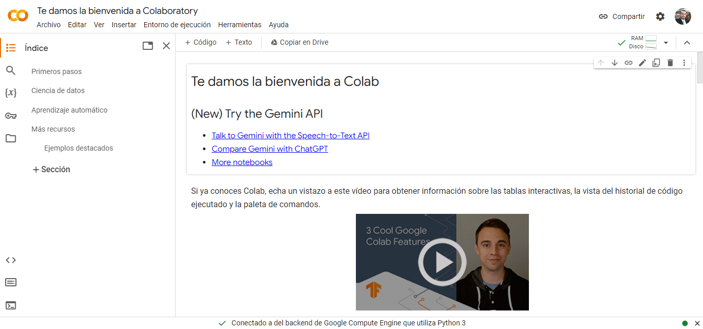

# Unidad 1 <br> Introducción a la Programación

## Programación

---

# Docente


Nombre
: MSC. Jaime Jesús Delgado Meraz

Correo
: <jesus.delgado@tecvalles.mx>

---

# Asignatura

:::: flex
::: col 1/2 px-2
Nombre
: Programación

Carrera
: Ingeniería en Industrias Alimentarias
:::
::: col 1/2
Clave
: ALA - 1020

SATCA
: 0 - 4 - 4
:::
::::

---
<!-- _class: toc -->
# Contenidos

1. [Modelado Matemático](#modelado-matemático)
2. [Métodos Numéricos](#métodos-numéricos)
3. [Lenguajes de Programación](#lenguajes-de-programación)
4. [Entorno de Desarrollo](#entorno-de-desarrollo)

---

<!-- _class: lead -->

# Introducción

---

# Introducción

## ¿Qué es la programación?

- La programación es el proceso de diseñar, codificar, depurar y mantener el **código fuente** de programas computacionales.
- El código fuente es escrito en un lenguaje de programación, tomando como base un **algoritmo** que describe la solución de un problema.
- El propósito de la programación es crear programas que exhiban un comportamiento deseado o solucionen un problema específico.

---

# Introducción

## ¿Qué es un algoritmo?

- Conjunto finito de instrucciones que se ejecutan en un orden determinado y para determinada situación inicial resuelve un problema en un tiempo finito.

## ¿Qué es un lenguaje de programación?

- Es un lenguaje formal que especifica una serie de instrucciones para que una computadora produzca diversas clases de datos.

## ¿Qué es un programa?

- Es un conjunto de instrucciones que una computadora ejecuta para resolver un problema.

---

# Introducción

La programación es un proceso que incluye varias actividades:

- **Análisis**: Definir el problema y desarrollar una solución.
- **Comprensión del problema**: Entender el problema que se va a resolver.
- **Diseño de la solución**: Desarrollar un algoritmo para resolver el problema.
- **Codificación**: Traducir el algoritmo a un lenguaje de programación.
- **Prueba**: Ejecutar el programa y corregir cualquier error.
- **Mantenimiento**: Actualizar el programa para que siga funcionando.

---

# Introducción

> La programación es una habilidad que se puede aprender y que es útil en muchas áreas de la vida.

- La programación es una habilidad muy útil para los estudiantes de ingeniería, sin importar su especialidad, ya que les permite automatizar tareas repetitivas y resolver problemas de manera más eficiente.
- Su uso es muy común en la industria, ya que permite automatizar procesos y mejorar la productividad, así también permite simplificar la resolución de problemas complejos, especialmente aquellos que involucran cálculos y/o tareas repetitivas.

---

<!-- _class: lead -->
# Modelado matemático

---


# ¿Qué es un problema?

> Un problema es una situación que se desea resolver, pero que no se sabe cómo o no se tiene la capacidad de resolver.

- Puede ser tan simple como encontrar la suma de dos números o tan complejo como predecir el clima para los próximos 10 años.
- Ya sea que sea resuelto por una persona o por un algoritmo, en ambos casos se requiere de un proceso para resolverlo.

---

# ¿Por qué modelar un problema?

> El modelado de problemas es un proceso que permite definir un problema y desarrollar una solución.

- Es importante modelar un problema para entenderlo y poder desarrollar una solución, ya que permite identificar las diferentes partes que lo componen y cómo se relacionan entre sí.
- El modelado de problemas es un proceso que se puede aplicar a cualquier problema, sin importar su complejidad, ya sea que se resuelva de manera manual o con un algoritmo.

---

# ¿Cómo modelar un problema?

El modelado de problemas es un proceso que se puede dividir en tres pasos:

1. **Definir el problema**: Identificar las características del problema.
2. **Desarrollar una solución**: Definir un algoritmo para resolver el problema.
3. **Probar la solución**: Ejecutar el algoritmo y corregir cualquier error.

---

# Definición del problema

## Características de un problema

De manera general, un problema se puede definir por medio de 3 características:

- **Entrada**: Datos o información que se tiene al inicio del problema, ya sea que se conozcan o se deban calcular.
- **Salida**: Datos que se desean obtener al final del problema.
- **Restricciones**: Limitaciones que se deben considerar al resolver el problema, como el tiempo, el espacio, precisión de los cálculos, etc.

---

# Desarrollo de la solución

## Algoritmo

> Un algoritmo es un conjunto finito de instrucciones que se ejecutan en un orden determinado y para determinada situación inicial resuelve un problema en un tiempo finito.

- Para resolver un problema, se debe definir un algoritmo que describa la solución del problema.
- El algoritmo debe ser lo suficientemente claro y preciso para que cualquier persona pueda entenderlo y ejecutarlo.
- Habitualmente, los algoritmos se escriben en forma de una lista de instrucciones (_pseudocódigo_), aunque también se pueden utilizar diagramas de flujo.

---

# Desarrollo de la solución

Los algoritmos se pueden clasificar de acuerdo con su complejidad:

- **Algoritmos simples**: Son algoritmos que se pueden resolver de manera manual, sin necesidad de utilizar una computadora.
- **Algoritmos complejos**: Son algoritmos que requieren de una computadora para ser resueltos, ya que involucran cálculos complejos o tareas repetitivas.

Un algoritmo complejo también se puede resolver de manera manual, pero es muy probable que se requiera de mucho tiempo y esfuerzo para resolverlo, así como de una gran cantidad de papel para realizar los cálculos.📝

---

# Prueba de la solución (Ejecución)

## Ejecución del algoritmo

Una vez que se tiene un algoritmo para resolver el problema, se debe ejecutar para obtener la solución.

- Si el algoritmo es simple, se puede ejecutar de manera manual, sin necesidad de utilizar una computadora, ya que involucra cálculos sencillos o tareas que se pueden realizar de manera manual o utilizando una calculadora.
- Si el algoritmo es complejo, se debe ejecutar utilizando una computadora, ya que involucra cálculos complejos o tareas repetitivas.

En ambos casos, se debe verificar que la solución cumpla con las restricciones del problema, a la vez que considere los datos de entrada especificados.

---

# Prueba de la solución (Corrección)

## Corrección del algoritmo

Una vez que se ejecuta el algoritmo, se debe verificar que la solución sea correcta.

- En caso de que la solución sea incorrecta, se debe corregir el algoritmo y volver a ejecutarlo, la ventaja de utilizar una computadora es que se puede corregir el algoritmo y volver a ejecutarlo de manera rápida y sencilla.
- Por lo general, se debe ejecutar el algoritmo varias veces hasta que se obtenga la solución correcta, esto se conoce como **depuración**.

---

# Algunos ejemplos de problemas

:::: flex
::: col 1/2 px-2
Los problemas que se pueden resolver con un algoritmo son muy variados:

- Calcular el área de una figura.
- Calcular el promedio de calificaciones de un grupo de alumnos.
- Calcular el factorial de un número.
- Calcular el número de Fibonacci.
- Calcular la tasa de interés de un crédito.
:::
::: col 1/2
También se pueden resolver problemas más complejos, como:

- Calcular la trayectoria de un proyectil.
- Calcular la resistencia de un material a diferentes temperaturas.
- Determinar la ruta más corta entre dos puntos.
- Calcular la probabilidad de que ocurra un evento.
:::
::::

---

# Modelado matemático

> El modelado matemático es un proceso que permite definir un problema y desarrollar una solución, utilizando conceptos y herramientas matemáticas.

- De acuerdo con su complejidad, algunos problemas requieren de herramientas matemáticas para ser resueltos.
- Para ello, no sólo se debe conocer el problema, sino también las herramientas matemáticas que se pueden utilizar para resolverlo.
- Estas herramientas pueden ser ecuaciones, fórmulas, funciones, etc.

---

# Modelado matemático

## Ejemplo 1

Supongamos que se desea calcular el área de un círculo, para ello se puede utilizar la siguiente fórmula:

$$
A = \pi r^2
$$

Donde:

- $A$ es el área del círculo.
- $r$ es el radio del círculo.
- $\pi$ es una constante que representa la relación entre la longitud de una circunferencia y su diámetro, cuyo valor es aproximadamente $3.14159$.

---

# Caracterización del problema y solución

En este caso, el problema se puede definir de la siguiente manera:

- **Entrada**: El radio del círculo.
- **Salida**: El área del círculo.
- **Restricciones**: El radio debe ser un número positivo.

El algoritmo para resolver el problema es el siguiente:

1. Leer el radio del círculo.
2. Calcular el área del círculo utilizando la fórmula $A = \pi r^2$.
3. Imprimir el área del círculo.

---

# Programación del algoritmo

:::: flex
::: col 1/2 px-2

## Pseudocódigo

```txt
LEER radio
VAR area = 3.14159 * (radio * radio)
IMPRIMIR area
```

:::

::: col 1/2 px-2

## Código fuente (Python)

```python
radio = float(input("Radio: "))
area = 3.14159 * (radio * radio)
print("Area: ", area)
```

:::
::::

::: info
👨🏻‍🏫 Para el desarrollo del curso se utilizará [Python](https://www.python.org/), por ser un lenguaje de programación sencillo y fácil de aprender, además de ser muy utilizado en la industria.
:::

---

## Nota

- El ejemplo anterior es un problema sencillo, ya que se puede resolver de manera manual, sin necesidad de realizar cálculos complejos o tareas repetitivas.
- Por lo tanto, aunque se puede utilizar una computadora para resolverlo, no es necesario, ya que se puede resolver de manera manual o utilizando una calculadora.

---

# Modelado matemático

## Ejemplo 2

Una cadena de supermercados tiene una red de tiendas que venden una variedad de productos alimenticios. La cadena quiere determinar la cantidad óptima de inventario de alimentos que debe mantener en cada tienda para reducir los costos de almacenamiento y evitar la escasez de alimentos.

---

# Caracterización del problema

El modelo matemático del problema puede incluir las siguientes variables:

- $x_{i,j}$: cantidad de inventario del producto $i$ en la tienda $j$
- $c_i$: costo de almacenamiento del producto $i$ por unidad de tiempo
- $d_{i,j}$: demanda del producto $i$ en la tienda $j$

---

Las restricciones del modelo matemático pueden incluir las siguientes:

- **Restricción de inventario**: la cantidad de inventario del producto $i$ en la tienda $j$ no debe exceder la capacidad de almacenamiento de la tienda.
$$x_{i,j} <= C_j$$
- **Restricción de demanda**: la cantidad de inventario del producto $i$ en la tienda $j$ debe ser suficiente para satisfacer la demanda.
$$x_{i,j} >= d_{i,j}$$
- **Restricción de continuidad**: la cantidad de inventario del producto $i$ en la tienda $j$ debe ser igual a la cantidad de inventario del producto $i$ en la tienda $j$ en el período anterior, más las entradas y menos las salidas.
$$x_{i,j} = x_{i,j-1} + I_{i,j} - O_{i,j}$$

---

# Solución del problema

El problema de optimización de la cadena de supermercados se puede modelar como un problema de programación lineal:

:::: flex
::: col 1/2

- Minimizar el costo total de almacenamiento.
$$L = \sum_{i=1}^{n} \sum_{j=1}^{m} c_i x_{i,j}$$

donde:

- $L$: función objetivo
- $n$: número de productos
- $m$: número de tiendas
:::

::: col 1/2

- Sujeto a las restricciones de inventario, demanda y continuidad.
$$\sum_{i=1}^{n} x_{i,j} <= C_j, \forall j$$
$$x_{i,j} >= d_{i,j}, \forall {i,j}$$
$$x_{i,j} = x_{i,j}-1 + I_{i,j} - O_{i,j}, \forall {i,j}$$
:::
::::

---

# Programación del algoritmo

:::: flex
::: col 1/2 px-1

```python
import pulp

n = 5  # Número de filas
m = 5  # Número de columnas
c_i = 1  # Costo por unidad
C_j = 10  # Capacidad máxima
d_i_j = 2  # Demanda mínima
I_i_j = 3  # Inventario inicial
O_i_j = 1  # Salida

# Declaramos las variables
x = pulp.LpVariable.dicts("x",
  [(i, j) for i in range(n) for j in range(m)],
  lowBound=0,
  cat=pulp.LpInteger)

# Declaramos la función objetivo
obj = pulp.LpProblem("Inventario", pulp.LpMinimize)
obj += pulp.lpSum([c_i * x[i, j] 
  for i in range(n) for j in range(m)])
```

:::
::: col 1/2 px-1

```python
# Declaramos las restricciones
for j in range(m):
  obj += pulp.lpSum([x[i, j] for i in range(n)]) <= C_j
  for i in range(n):
    obj += x[i, j] >= d_i_j
    if j > 0:
      obj += x[i, j] == x[i, j-1] + I_i_j - O_i_j

# Resolvemos el problema
obj.solve()

# Imprimimos la solución
print("La solución óptima es:")
for i in range(n):
  for j in range(m):
    print(f"{x[i, j].value():.0f}", end=" ")
  print()
```

:::
::::

---

# Programación del algoritmo

## Nota

- El ejemplo anterior es un problema que involucra cálculos complejos y tareas repetitivas, por lo que usar una computadora para resolverlo es una solución más eficiente.
- Una vez que se tiene el algoritmo, se puede ejecutar y corregir cualquier error de manera rápida y sencilla, lo cual es una gran ventaja para resolver problemas complejos.
- Además, si bien es un problema relativamente complejo, el lenguaje de programación ofrece una librería que permite resolverlo de manera relativamente sencilla.

---

<!-- _class: lead -->

# Métodos numéricos

---

# Métodos numéricos

> Los métodos numéricos son un conjunto de técnicas matemáticas que permiten resolver problemas matemáticos complejos, utilizando una computadora.

- Relacionan los conceptos de modelado matemático y programación, ya que se utilizan herramientas matemáticas para resolver problemas complejos, utilizando una computadora.
- Su programación es un tanto diferente a la programación de algoritmos, sin embargo, parten del mismo proceso, ya que se debe definir el problema, desarrollar una solución y probarla.

---

<!-- _class: inverted -->

# Modelado matemático o métodos numéricos

- El modelado matemático se enfoca en definir el problema y desarrollar una solución, mientras que los métodos numéricos se enfocan en resolver el problema utilizando herramientas matemáticas.
- Supongamos el caso de un ingeniero que esta diseñando un puente. 🌉
  - Primero debe crear un modelo matemático del puente, el cual podría incluir ecuaciones para describir la fuerza de la gravedad, la resistencia del material del puente y las fuerzas del viento.
  - Una vez que se tiene el modelo matemático, puede utilizar métodos numéricos para resolver las ecuaciones del modelo y determinar la fuerza necesaria para soportar el puente.

---

# Resolución de problemas por métodos numéricos

Algunos problemas que se pueden resolver con métodos numéricos son:

- **Problemas de optimización**: Determinar el valor óptimo de una función.
- **Problemas de interpolación**: Determinar el valor de una función en un punto intermedio.
- **Problemas de integración**: Determinar el área bajo la curva de una función.
- **Problemas de ecuaciones diferenciales**: Determinar la solución de una ecuación diferencial.
- **Problemas de ecuaciones no lineales**: Determinar la solución de una ecuación no lineal.

---

# Resolución de problemas por métodos numéricos

## Ejemplo

Supongamos que se quiere determinar la probabilidad de que un evento ocurra, para ello se puede utilizar la siguiente fórmula:

$$
P = \frac{N}{M}
$$

## Caracterización del problema

Donde:

- $P$ es la probabilidad de que ocurra el evento.
- $N$ es el número de veces que ocurre el evento.
- $M$ es el número de veces que se repite el experimento.

---

# Solución del problema

El problema se puede resolver utilizando diversos métodos numéricos:

- **Método de Monte Carlo**: Se utiliza para estimar la probabilidad de que ocurra un evento, realizando un experimento un número determinado de veces y contando el número de veces que ocurre el evento.
- **Método de integración numérica**: Se utiliza para calcular el área bajo la curva de una función, en este caso, se puede utilizar para calcular la probabilidad de que ocurra un evento, ya que la probabilidad es el área bajo la curva de una función de densidad de probabilidad.

---

# Solución del problema

Considerando la solución por el método de Monte Carlo tendríamos el siguiente algoritmo:

:::: flex
::: col 1/2 px-2

1. Repetir el experimento $M$ veces.
2. Contar el número de veces que ocurre el evento.
3. Calcular la probabilidad de que ocurra el evento.
:::

::: col 1/2 px-2

## Pseudocódigo

```txt
VAR N = 0
VAR M = 1000

REPETIR M VECES
    x = NUMERO ALEATORIO ENTRE 0 Y 1
    y = EXP(-x)
    SI y > 0.5
        N = N + 1
FIN REPETIR

VAR P = N / M
IMPRIMIR P
```

:::
::::

---

# Programación del algoritmo

```python
import random # Librería para generar números aleatorios
import math # Librería para funciones matemáticas

# Variables
N = 0 # Número de veces que ocurre el evento
M = 1000 # Número de veces que se repite el experimento

# Realizamos el experimento
for i in range(M):
    x = random.random() # Generamos un número aleatorio entre 0 y 1
    y = math.exp(-x) # Calculamos el valor de la función de densidad de probabilidad
    if y > 0.5: # Verificamos si el evento ocurre
        N += 1 # Incrementamos el número de veces que ocurre el evento

# Calculamos la probabilidad
P = N / M

# Imprimimos la solución
print("La probabilidad de que ocurra el evento es:", P)
```

---

## Nota

- Si bien el método utilizado previamente es relativamente sencillo, requiere de un gran número de repeticiones para obtener una buena aproximación de la probabilidad.
- Regularmente, estas repeticiones se harían de manera manual con la ayuda de una calculadora, pero definitivamente es más sencillo y rápido realizarlas utilizando una computadora.
- Ejecutar las 1,000 repeticiones manualmente puede ser un poco tedioso, pero es posible, sin embargo, si se requieren 1,000,000 repeticiones, o incluso más, sería prácticamente imposible realizarlas de manera manual.

---

<!-- _class: lead -->

# Lenguajes de programación

---

# Lenguajes de programación

> Un lenguaje de programación es un conjunto de símbolos y reglas sintácticas y semánticas que definen su estructura y el significado de sus elementos y expresiones.

Sintaxis
: Es la forma en que se escriben las instrucciones en un lenguaje de programación.

Semántica
: Es el significado de las instrucciones escritas en un lenguaje de programación.

Existen cientos de lenguajes de programación, cada uno con sus propias características, sin embargo, todos incluyen una sintaxis y semántica que permiten definir un algoritmo.

---

# Elementos de un lenguaje de programación

- Los elementos de los lenguajes de programación pueden ser pueden ser muy diferentes entre sí, sin embargo, todos tienen elementos básicos que permiten definir un algoritmo.
- Estos elementos básicos son:
  - Variables
  - Operadores
  - Entrada y salida
  - Estructuras de control y repetición
- Además, todos los lenguajes de programación tienen elementos adicionales que permiten realizar tareas más complejas, a los que se les denomina _librerías_.

---

# Estructura básica de un programa

- Sin importar el lenguaje de programación, todos los programas tienen una estructura básica que permite definir un algoritmo.
- Esta estructura se basa en una función o procedimiento que se ejecuta al iniciar el programa, el cual se conoce como función principal, también conocida como función ```main```.

```java
public static void main(String[] args) {
    // Instrucciones
}
```

```python
def main():
    # Instrucciones
```

---

# Estructura básica de un programa en Python

- Si bien se puede omitir la función ```main``` en Python, es una buena práctica incluirla, ya que permite definir un punto de inicio para el programa.

```python
def main():
    # Instrucciones

if __name__ == "__main__":
    main()
```

- Algo importante a considerar es que Python es un lenguaje de programación que utiliza la indentación para definir bloques de instrucciones, por lo que es necesario indentar correctamente el código.
- La indentación se refiere a la cantidad de espacios que se dejan al inicio de una línea de código, y que se utilizan para definir bloques de instrucciones.

---

# Variables

> Una variable es un espacio de memoria que se utiliza para almacenar un valor. 🧠

- Se utilizan para almacenar valores que se utilizan en un programa, como números, texto, etc. y su valor esta determinado por el tipo de variable.
- Las variables se pueden utilizar para realizar operaciones, generalmente aritméticas, a través del uso de **operadores**.
- Pesé a su nombre, si se requiere, una variable puede definirse como constante, para evitar que su valor cambie durante la ejecución del programa.

---

# Variables

- La definición de variables suele seguir la estructura básica siguiente:

```txt
VAR nombre = valor
```

- Dependiendo del lenguaje de programación pueden existir diferentes tipos de variables, como enteras, reales, booleanas, etc. y ser requerido especificar el tipo de variable al definirla.
- En algunos lenguajes como Python, no es necesario especificar el tipo de variable, ya que se infiere automáticamente e incluso puede cambiar durante la ejecución del programa.

---

# Variables

## Tipos de datos

| Tipo de dato | Descripción | Python | Java |
| :--- | :--- | :--- | :--- |
| Entero | Número entero (2024 / -42 ) | ```int``` | ```int``` |
| Real | Número real (3.14159)| ```float``` | ```float``` |
| Texto | Cadena de caracteres (```"Hola"```) | ```str``` | ```String``` |
| Booleano | Valor lógico (<true>True</true> / <False>False</False>) | ```bool``` | ```boolean``` |
| Caracter | Caracter | ```char``` | ```char``` |

::: info
👨🏻‍🏫 En el caso de Python, los tipos de datos son inferidos automáticamente, por lo que no es necesario especificarlos al definir una variable.
:::

---

# Variables

## Definición de variables en Java

```java
int edad = 20;
float peso = 70.5;
String nombre = "Jaime";
const float PI = 3.14159;
```

## Definición de variables en Python

```python
edad = 20
peso = 70.5
nombre = "Jaime"
PI = 3.14159
```

---
<!-- _class: inverted -->
# _Duck typing_ 🦆

> "Si camina como un pato y suena como un pato, entonces debe ser un pato."

- Cuando se dice que Python _infiere_ el tipo de una variable es porque se aplica un estilo de tipado conocido como [_duck typing_](https://es.wikipedia.org/wiki/Duck_typing).
- En palabras más simples, si se puede sumar, restar, multiplicar o dividir, entonces es un número, si se puede concatenar, entonces es una cadena de caracteres, etc.
- Haciendo alusión a un contexto más coloquial, _si huele a pollo, sabe a pollo, entonces es de pollo_ 🐥

---

# Operadores

> Un operador es un símbolo que representa una operación que se realiza sobre uno o más valores.

- En general, es posible distinguir entre los siguientes tipos de operadores:
  - Operadores aritméticos
  - Operadores lógicos
  - Operadores comparación

---

# Operadores aritméticos

|Operador|Significado|Ejemplo|
|:---:|---|:---:|
|+  |Suma | 3 + 2 = 5|
|-  |Resta| 3 - 2 = 1|
|*  |Multiplicación| 3 * 2 = 6|
|/  |División | 3 / 2 = 1.5|
|%  |Módulo   | 3 % 2 = 1|
|** |Potencia | 3 ** 2 = 9|

- Al igual que en las matemáticas, es posible utilizar paréntesis para agrupar operaciones y definir el orden en que se realizan.

---

# Operadores aritméticos

## Ejemplo en Python

```python
a = 10
b = 3
c = a + b # 13
d = a - b # 7
e = a * b # 30
f = a / b # 3.3333333333333335
g = a % b # 1
h = a ** b # 1000
```

- Si se requieren operaciones más complejas, es posible utilizar funciones matemáticas, como las que se encuentran en la librería ```math``` de Python o similares en otros lenguajes de programación.

---

# Operadores aritméticos

## Ejercicio

:::: flex
::: col 1/2 px-2

```python
a = 5
b = 7
c = 2
a = a + b + c
b = c / 2
a = a / b + a * c
c = a + (b - c) - b
```

:::
::: col 1/2 px-2

- ¿Qué valor tiene `a` al finalizar la línea 4?
- ¿Qué valor tiene `b` al finalizar la línea 5?
- ¿Qué valor tiene `a` al finalizar la línea 6?
- ¿Qué valor tiene `c` al finalizar la línea 7?
:::
::::

---

# Operadores lógicos

- Los operadores lógicos se utilizan para realizar operaciones lógicas entre valores booleanos, las cuales pueden ser conjunción, disyunción o negación y su resultado es un valor booleano.

|Operador|Significado| Ejemplo |
|:---:|---|:---:|
|and|Conjunción| True and False = False|
|or |Disyunción| True or False = True|
|not|Negación   | not True = False|

- En algunos lenguajes de programación, los operadores lógicos se representan con palabras en lugar de símbolos.

---

# Operadores lógicos

## Ejemplo en Python

```python
a = True
b = False
c = a and b # False
d = a or b # True
e = not a # False
```

---

# Operadores de comparación

- Como su nombre lo indica, los operadores de comparación se utilizan para comparar dos valores y su resultado es un valor booleano.

|Operador|Significado| Ejemplo |
|:---:|---|:---:|
|==|Igualdad| 3 == 2 = False|
|!=|Desigualdad| 3 != 2 = True|
|>|Mayor que| 3 > 2 = True|
|<|Menor que| 3 < 2 = False|
|>=|Mayor o igual que| 3 >= 2 = True|
|<=|Menor o igual que| 3 <= 2 = False|

---

# Operadores de comparación

## Ejemplo en Python

```python
a = 10
b = 3
c = a == b # False
d = a != b # True
e = a > b # True
f = a < b # False
g = a >= b # True
h = a <= b # False
```

- Los operadores de comparación se suelen usar en estructuras de control para evaluar condiciones y decidir si se ejecuta o no un bloque de instrucciones.

---

## Tabla de Verdad

- Para comprender mejor el funcionamiento de los operadores lógicos y de comparación, se puede utilizar una tabla de verdad, la cual muestra el resultado de aplicar un operador lógico a dos valores booleanos.

|A  |B  |AND|OR |NOT (A)|
|:---:|:---:|:---:|:---:|:---:|
|<true>true</true>  |<true>true</true>  |<true>true</true>  |<true>true</true>  |<false>false</false>  |
|<true>true</true>  |<false>false</false>  |<false>false</false>  |<true>true</true>  |<false>false</false>  |
|<false>false</false>  |<true>true</true>  |<false>false</false>  |<true>true</true>  |<true>true</true>  |
|<false>false</false>  |<false>false</false>  |<false>false</false>  |<false>false</false>  |<true>true</true>  |

---

# Entrada y salida

- La entrada y salida de datos es una parte fundamental de cualquier programa, ya que permite interactuar con el usuario y obtener los datos necesarios para resolver un problema.
- La entrada de datos se suele realizar a través de un teclado ⌨, mientras que la salida a la consola o pantalla.
- En algunos casos más complejos, la entrada y salida de datos se realiza a través de archivos.

---

# Entrada y salida

- Las instrucciones para entrada y salida de datos pueden variar dependiendo del lenguaje de programación, y se suelen representar de la siguiente manera:

```txt
LEER variable
IMPRIMIR variable
```

- Python utiliza las funciones ```input``` y ```print``` para entrada y salida de datos, respectivamente.

```python
variable = input()
print(variable)
```

- También es posible especificar un mensaje para la entrada y salida de datos.

```python
nombre = input("¿Cómo te llamas? ")
print("Hola", nombre)
```

---

# Entrada avanzada

- En algunos casos, se requiere leer datos de un tipo específico, como números enteros o reales, en lugar de cadenas de caracteres.
- Para ello, es necesario convertir el valor leído a un tipo de dato específico, lo cual se conoce como **casting**.
- En Python, se puede utilizar la función ```int``` para convertir un valor a entero y la función ```float``` para convertir un valor a real.

```python
edad = int(input("¿Cuál es tu edad? "))
peso = float(input("¿Cuál es tu peso? "))
```

- Por defecto, la función ```input``` lee cadenas de caracteres.

---

# Salida avanzada

- En algunos casos, se requiere imprimir un mensaje con un formato específico, por ejemplo, con un número determinado de decimales.
- Para ello, es necesario especificar el formato de salida, lo cual se puede realizar utilizando la función ```format``` de Python.

```python
print("Tu edad es: {}".format(edad))
print("Tu peso es: {:.2f}".format(peso))
```

- También se pueden formatear números enteros con una cierta estructura, separadores de miles, etc.

```python
print("El folio es: {:0000d}".format(123)) # 0123
print("El saldo es: ${:,.2f}".format(1234567.89)) # $1,234,567.89
```

---

# Estructuras de control

> Las estructuras de control son instrucciones que permiten modificar el flujo de ejecución de un programa.

- Estas instrucciones permiten decidir si se ejecuta o no un bloque de instrucciones.
- Se usan para que los programas "tomen decisiones" y realicen diferentes acciones dependiendo de las condiciones que se cumplan.
- Se suelen combinar con los operadores lógicos y de comparación para evaluar condiciones y decidir si se ejecuta o no un bloque de instrucciones.

::: warning
:warning: Las estructuras de control se revisarán con más detalle en la siguiente unidad temática.
:::

---

# Estructuras de control

## Ejemplo

Supongamos que se desea calcular el área de un círculo, pero sólo si el radio es mayor que cero.

```python
radio = float(input("Radio: "))
if radio > 0:
    area = 3.14159 * (radio * radio)
    print("Area: ", area)
else:
    print("El radio debe ser mayor que cero")
```

---

# Estructuras de repetición

> Las estructuras de repetición son instrucciones que permiten repetir un bloque de instrucciones un número determinado de veces.

- Estas estructuras sirven para repetir un bloque de instrucciones un número determinado de veces, o hasta que se cumpla una condición.
- Son muy útiles para realizar cálculos repetitivos, como sumas, multiplicaciones, etc.
- Se pueden combinar con estructuras de control para realizar cálculos más complejos, así como con variables para almacenar los resultados de los cálculos.

::: warning
:warning: Las estructuras de repetición se revisarán con más detalle en la siguiente unidad temática.
:::

---

# Estructuras de repetición

## Ejemplo

Supongamos que se desea calcular la suma de los primeros 10 números naturales.

```python
suma = 0
for i in range(1, 11):
    suma += i
print("El total es:", suma)
```

---

# Resumen

- Un lenguaje de programación es un conjunto de símbolos y reglas sintácticas y semánticas que definen su estructura y el significado de sus elementos y expresiones.
- Las variables se combinan con operadores para realizar operaciones de diversos tipos y pueden usarse para recibir o mostrar datos.
- La combinación de variables, operadores y estructuras de control y repetición permite definir un algoritmo.

---

<!-- _class: lead -->

# Entorno de desarrollo

---

# Entorno de desarrollo

- Hablar de un lenguaje de programación, siempre implica hablar de un entorno de desarrollo, ya que es el conjunto de herramientas que permiten desarrollar programas en un lenguaje de programación.
- Un entorno de desarrollo es una herramienta que permite escribir, ejecutar y depurar programas en un determinado lenguaje de programación.
- Dependiendo del lenguaje de programación, el entorno de desarrollo puede ser más o menos complejo, sin embargo, todos tienen las mismas características básicas.
- Igualmente, podrá ser que funcione en línea o que se instale en la computadora.

---

# Entorno de desarrollo

## Características básicas

Un entorno de desarrollo debe tener las siguientes características:

- **Editor de texto**: Permite escribir el código fuente del programa, usualmente con coloreado de sintaxis.
- **Compilador / Intérprete**: Permite "transformar" el código fuente del programa a un ejecutable.
- **Depurador**: Permite ejecutar el programa paso a paso y verificar el valor de las variables en cada paso.
- **Consola**: Permite ejecutar el programa y ver la salida en la consola.

---

## Definición de un entorno de desarrollo

::: ok
✅ Se utilizará **Python** para la asignatura, puesto que es un lenguaje de programación sencillo y fácil de aprender, además de contar con mucha documentación y librerías que facilitan el desarrollo de programas.
:::

- Se establecerán dos entornos de desarrollo, uno en línea y otro en la computadora para que los estudiantes puedan elegir el que más les convenga, según sus necesidades.
- Los entornos a utilizar serán:
  - **Thonny**: Entorno de escritorio, disponible en <https://thonny.org/>
  - **Google Colab**: Entorno en línea, disponible en <https://colab.research.google.com/>

---

# Thonny


> Thonny es un entorno de desarrollo integrado (IDE) para Python, que permite escribir, ejecutar y depurar programas.

- Conocido como el "IDE para principiantes", es muy sencillo de utilizar y cuenta con una interfaz gráfica muy intuitiva.
- Una de sus principales ventajas es que incluye una versión de Python, por lo que no es necesario instalarlo por separado.
- Es un entorno de desarrollo de escritorio, por lo que se debe instalar en la computadora.

---

<!-- _class: inverted -->

::: coding

```python
print("Hola mundo")
nombre = input("¿Cómo te llamas? ")
print("Hola", nombre)
print("Tu nombre tiene {} letras".format(len(nombre)))
```

:::

---

# Google Colab



> Google Colab es un entorno de desarrollo en línea para Python, que permite escribir, ejecutar y depurar programas.

- Es un entorno de desarrollo en línea, proporcionado por Google, que permite escribir, ejecutar y depurar programas, principalmente en Python.

---

# Google Colab

- A diferencia de los entornos clásicos para Python, Google Colab utiliza **Jupyter Notebook**, el cual es un formato especial de "documentos" para Python, que permite combinar texto, código y gráficos en un mismo documento, de esta manera, se puede explicar el código y mostrar los resultados en un mismo documento.
- Google Colab es muy útil durante el proceso de aprendizaje de Python, ya que permite iniciar con programas sencillos y poco a poco ir aumentando la complejidad, sin necesidad de instalar nada en la computadora.

---

<!-- _class: inverted -->

::::: coding
:::: flex
::: col 1/2 px-2

```markdown
# Hola mundo

Este es un programa sencillo que imprime un mensaje en pantalla.
```

```python
print("Hola mundo")
nombre = input("¿Cómo te llamas? ")
print("Hola", nombre)
```

:::
::: col 1/2 px-2

```python
import matplotlib.pyplot as plt

x = [1, 2, 3, 4, 5]
y = [1, 4, 9, 16, 25]

plt.plot(x, y)
plt.show()
```

:::
::::
:::::

---

<!-- _class: inverted -->


<div class="text-center text-middle font-bold font-coding text-8xl mt-10">
  &lt;/Fin&gt;
</div>
