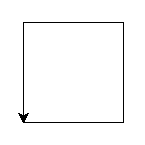
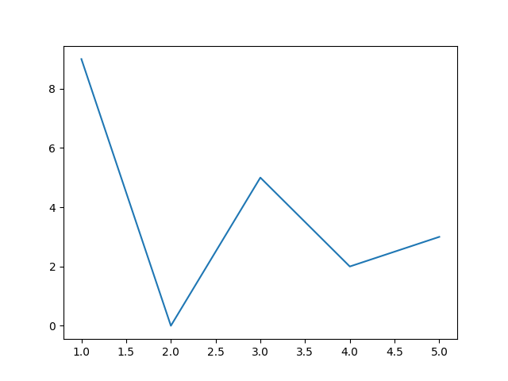
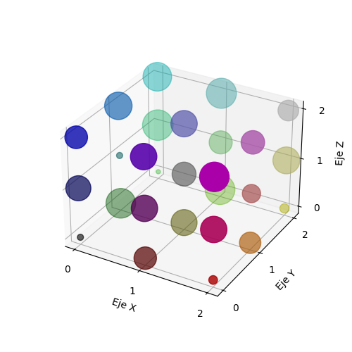

# Unidad 2 <br> Funciones, Estructuras de Control y Arreglos

## Programación

---

# Docente


Nombre
: MSC. Jaime Jesús Delgado Meraz

Correo
: <jesus.delgado@tecvalles.mx>

---

# Asignatura

:::: flex
::: col 1/2 px-2
Nombre
: Programación

Carrera
: Ingeniería en Industrias Alimentarias
:::
::: col 1/2
Clave
: ALA - 1020

SATCA
: 0 - 4 - 4
:::
::::

---
<!-- _class: toc -->
# Contenidos

1. [Estructuras de control](#estructuras-de-control)
2. [Estructuras de repetición](#estructuras-de-repetición)
3. [Funciones](#funciones)
4. [Arreglos](#arreglos)

---

<!-- _class: lead -->

# Estructuras de control

---

# Estructuras de control

> Las estructuras de control son instrucciones que permiten controlar el flujo de ejecución de un programa.

- En otras palabras, permiten decidir si se ejecuta o no un bloque de instrucciones, dependiendo de una condición, también se les conoce como estructuras de selección.
- Las estructuras de control más comunes son:
  - Selección simple (Si-Entonces)
  - Selección doble (Si-Sino)
  - Selección múltiple (Si-Sino Si-Sino)
  - Selección por casos (Según)

---

# Selección simple (Si-Entonces)

- Se identifica con la palabra reservada ```if``` y permite ejecutar un bloque de instrucciones si y solo si se cumple una condición.

:::: flex
::: col 1/2 px-2

```txt
SI condición ENTONCES
    Instrucciones
FIN SI
```

:::
::: col 1/2 px-2

```python
if condicion:
    # Instrucciones
```

:::
::::

- Si la condición no se cumple, el bloque de instrucciones no se ejecuta.

---

# Selección simple en Python (if)

```python
a = 10
b = 3
if a > b:
    print("a es mayor que b")
```

---

# Selección doble (Si-Sino)

- La estructura ```if-else``` permite ejecutar un bloque de instrucciones si se cumple una condición y otro bloque de instrucciones si no se cumple.

:::: flex
::: col 1/2 px-2

```txt
SI condición ENTONCES
    Instrucciones
SINO
    Instrucciones
FIN SI
```

:::
::: col 1/2 px-2

```python
if condicion:
    # Instrucciones
else:
    # Instrucciones
```

:::
::::

- A diferencia de la estructura ```if```, si la condición no se cumple, se ejecuta el bloque de instrucciones del ```else```.

---

# Selección doble en Python (if-else)

```python
a = 10
b = 3
if a > b:
    print("a es mayor que b")
else:
    print("a no es mayor que b")
```

---

# Selección múltiple (Si-Sino Si-Sino)

- Esta estructura es una extensión de la estructura ```if-else``` y permite evaluar múltiples condiciones, según el lenguaje de programación, también se puede conocer como ```if-elseif-else```.

:::: flex
::: col 1/2 px-2

```txt
SI condición ENTONCES
    Instrucciones
SINO SI condición ENTONCES
    Instrucciones
⋮
SINO SI condición ENTONCES
    Instrucciones
SINO
    Instrucciones
FIN SI
```

:::
::: col 1/2 px-2

```python
if condicion:
    # Instrucciones
elif condicion:
    # Instrucciones
⋮
elif condicion:
    # Instrucciones
else:
    # Instrucciones
```

:::
::::

---

# Selección múltiple en Python (if-elif-else)

```python
a = 10
b = 3
if a > b:
    print("a es mayor que b")
elif a < b:
    print("a es menor que b")
else:
    print("a es igual que b")
```

- Se pueden evaluar tantas condiciones como se requiera, sin embargo, si el orden de las condiciones no es correcto, se pueden obtener resultados inesperados.

---

# Selección por casos (Según)

- La estructura conocida generalmente como ```switch``` permite evaluar múltiples condiciones y ejecutar un bloque de instrucciones dependiendo de la condición (caso) que se cumpla.
- Esta estructura es muy similar a la estructura ```if-elif-else```, sin embargo, en lugar de evaluar una condición, evalúa una variable.
- Dependiendo del lenguaje de programación, esta estructura puede tener diferentes nombres, como ```switch```, ```case```, ```select```, ```match```, etc.

---

# Selección por casos (Según)

- La estructura ```switch``` se suele definir de la siguiente manera:

:::: flex
::: col 1/2 px-2

```txt
SEGÚN variable HACER
    CASO valor1:
        Instrucciones
    CASO valor2:
        Instrucciones
    ⋮
    CASO valorN:
        Instrucciones
    POR DEFECTO:
        Instrucciones
FIN SEGÚN
```

:::
::: col 1/2 px-2

```java
// Java
switch (variable) {
    case valor1:
        // Instrucciones
        break;
    case valor2:
        // Instrucciones
        break;
    ⋮
    case valorN:
        // Instrucciones
        break;
    default:
        // Instrucciones
}
```

:::
::::

---

# Selección por casos en Python

- La estructura _Según_ existe en Python apenas desde el 2020, en su versión 3.10, y se define usando la palabra reservada ```match```.

```python
color = "azul"
match color:
    case "azul":
        print("El color es azul 🔵")
    case "rojo":
        print("El color es rojo 🔴")
    case "verde":
        print("El color es verde 🟢")
    case _:
        print("No conozco ese color")
```

- Si se utiliza una versión anterior a Python 3.10, se debe utilizar la estructura ```if-elif-else```.

---

# Selección por casos en Python

- La principal diferencia entre el ```switch``` de Java y el ```match``` de Python es que en Python no es necesario utilizar la instrucción ```break``` para indicar el final de cada caso.
  - Este ```break``` tiene la función de indicar que no se deben ejecutar los casos siguientes, sin embargo, en Python esto se hace de manera automática.
- En Python, el ```match``` se puede utilizar con cualquier tipo de dato, no solo con números enteros o cadenas de texto.
- Adicionalmente los casos pueden ser expresiones, no solo valores.
  - _P.e._ un caso para números pares ```case x if x % 2 == 0```.

---

<!-- _class: inverted -->
# ¿Qué estructura de control utilizar?

- La estructura ```if``` se utiliza cuando se requiere ejecutar un bloque de instrucciones si y solo si se cumple una condición y no se requiere evaluar más condiciones.
- La estructura ```if-else``` se utiliza cuando se requiere ejecutar un bloque de instrucciones si se cumple una condición y otro bloque de instrucciones si no se cumple.
- La estructura ```if-elif-else``` se utiliza cuando se requiere evaluar múltiples condiciones y ejecutar un bloque de instrucciones dependiendo de la condición que se cumpla.
- La estructura ```match``` se utiliza cuando se requiere ejecutar un bloque de instrucciones dependiendo del valor de una variable.

---

<!-- _class: inverted -->

::: coding
:::

---

# Estructuras de repetición

> Las estructuras de repetición son instrucciones que permiten repetir un bloque de instrucciones un número determinado de veces.

- Estas estructuras se utilizan cuando se requiere ejecutar un bloque de instrucciones varias veces, sin tener que repetir el código.
- La cantidad de veces que se repite el bloque podría ser un número determinado o podría depender de una condición.
- En el ámbito de la programación, a estas estructuras también se les conoce como ciclos o bucles, y a cada repetición se le conoce como _iteración_.

---

# Estructuras de repetición

- Las estructuras de repetición se pueden clasificar en dos tipos, según el número de iteración:
  - Con número determinado de iteraciones
    - Abarcando un rango de valores (```for```)
    - Abarcando una lista de valores (```foreach```)
  - Con número indeterminado de iteraciones
    - Revisión de la condición previo a ejecutar (```while```)
    - Revisión de la condición posterior a ejecutar (```do-while```)

---

# Abarcando un rango de valores (for)

- La estructura ```for``` permite ejecutar un bloque de instrucciones un número determinado de veces, abarcando un rango de valores.
- Esta estructura se puede definir de la siguiente manera:

:::: flex
::: col 1/2 px-2

```txt
PARA variable DESDE valor-inicio HASTA valor-final HACER
    Instrucciones
FIN PARA
```

:::
::: col 1/2 px-2

```python
for variable in range(inicio, fin):
    # Instrucciones
```

:::
::::

- Si se requiere, también se puede especificar el incremento entre cada iteración, por defecto es 1 (```PARA variable DESDE inicio HASTA fin INCREMENTO incremento```).
- Esta estructura es muy útil cuando se requiere ejecutar un bloque de instrucciones un número determinado de veces.

---

# Abarcando un rango de valores (for)

- En Python, la función ```range()``` genera un rango de valores, el cual se puede utilizar en la estructura ```for```.

```python
for i in range(1, 11):
    print(i)
```

- En este caso, el rango de valores es de 1 a 10, ya que el valor final no se incluye, por lo que se debe especificar 11 para que se incluya el 10.
- Se puede cambiar el valor inicial, el valor final y el incremento, según sea necesario.

```python
range(inicio, fin, incremento)
```

---

# Abarcando una lista de valores (foreach)

- La estructura ```foreach``` permite ejecutar un bloque de instrucciones un número determinado de veces, abarcando una lista de valores.
- Esta estructura se puede definir de la siguiente manera:

:::: flex
::: col 1/2 px-2

```txt
lista = [valor1, valor2, ⋯, valorN]
PARA variable EN lista HACER
    Instrucciones
FIN PARA
```

:::
::: col 1/2 px-2

```python
lista = [valor1, valor2, ⋯, valorN]
for variable in lista:
    # Instrucciones
```

:::
::::

- La lista de valores puede ser una lista de números, cadenas de texto, valores booleanos, etc.

---

# Abarcando una lista de valores (foreach)

```python
numeros = [1, 2, 3, 4, 5]
for i in numeros:
    print(i * 2)

lista = ["Hola", "Mundo", "!"]
for i in lista:
    print(i)
```

- Esta estructura ejecuta el bloque de instrucciones una vez por cada elemento de la lista, por lo que no es necesario especificar el número de iteraciones.

---

# Revisión de la condición previo a ejecutar (while)

- La estructura ```while``` permite ejecutar un bloque de instrucciones un número indeterminado de veces, siempre y cuando se cumpla una condición inicial.

:::: flex
::: col 1/2 px-2

```txt
MIENTRAS condición HACER
    Instrucciones
    Cambio de condición
FIN MIENTRAS
```

:::
::: col 1/2 px-2

```python
while condicion:
    # Instrucciones
    # Cambio de condicion
```

:::
::::

- Para que la estructura ```while``` funcione correctamente, es necesario que la condición cambie en algún momento, de lo contrario, se ejecutará un ciclo infinito.

---

# Revisión de la condición previo a ejecutar (while)

:::: flex
::: col 1/2 px-2

```python
i = 1
while i <= 10:
    print(i)
    i += 1
```

```python
nombre = "Jaime Delgado"
i = 0

while nombre[i] != "o":
    print(nombre[i])
    i += 1
```

:::
::: col 1/2 px-2

- En estos casos, se requiere declarar una variable previamente, la cual se utiliza para evaluar la condición y cambiar su valor en cada iteración.
- Se debe cuidar que la condición cambie en algún momento, de lo contrario, se ejecutará un ciclo infinito.
:::
::::

---

# Revisión de la condición posterior a ejecutar (do-while)

- La estructura ```do-while``` permite ejecutar un bloque de instrucciones un número indeterminado de veces, siempre y cuando se cumpla una condición final.
- A diferencia de la estructura ```while```, la condición se evalúa al final de cada iteración, por lo que el bloque de instrucciones se ejecuta al menos una vez.
- Esta estructura se puede definir de la siguiente manera:

:::: flex
::: col 1/2 px-2

```txt
HACER
    Instrucciones
    Cambio de condición
MIENTRAS condición
```

:::
::: col 1/2 px-2

```python
while True:
    # Instrucciones
    # Cambio de condicion
    if condicion:
        break
```

:::
::::

---

# Revisión de la condición posterior a ejecutar (do-while)

:::: flex
::: col 1/2 px-2

- En este caso, se define un ciclo infinito, el cual se puede detener utilizando la instrucción ```break```.

```python
i = 1
while True:
    print(i)
    i += 1
    if i > 10:
        break
```

:::
::: col 1/2 px-2

- Se debe tener cuidado al utilizar esta estructura, ya que si la condición nunca se cumple, se ejecutará un ciclo infinito.

:::
::::

---

<!-- _class: inverted -->
::: coding
:::

---

<!-- _class: lead -->
# Funciones

---

# Funciones

> Una función es un bloque de código que se puede ejecutar cuando se requiera, sin tener que escribir nuevamente el código.

- Las funciones son muy útiles cuando se requiere ejecutar un bloque de código varias veces, los lenguajes de programación modernos soportan el uso y diseño de funciones.
- Para utilizar estas funciones, se escribe el nombre de la función y los parámetros que se necesiten para funcionar.
- Un **parámetro** es un valor que se le proporciona a una función para que pueda funcionar.

---

# Funciones

- Una función puede recibir cero o más parámetros, dependiendo de lo que se requiera, por lo que es importante conocer los parámetros que requiere cada función, para obtener el resultado esperado.
- Comúnmente, el resultado de las funciones se debe almacenar en una variable, pero también puede ser usado en una condición o impreso a pantalla.
- Las funciones pueden dividirse en dos tipos:
  - Funciones estándar
  - Funciones avanzadas
  - Funciones del usuario (personalizadas)

---

# Funciones estándar

- Las funciones estándar son aquellas que vienen incluidas en el núcleo del lenguaje de programación, por lo que no es necesario definirlas.
- Las funciones estándar de los lenguajes de programación suelen ser muy similares, incluyendo según el lenguaje:
  - Instrucciones de entrada y salida
  - Instrucciones de control de flujo y repetición
  - Operaciones matemáticas básicas
  - Operaciones con cadenas de texto

---

# Funciones estándar

## Instrucciones de entrada y salida

- Las funciones estándar de entrada y salida son aquellas que permiten obtener datos del usuario y mostrar datos en pantalla.

| Función | Descripción |Python| C++ | Java | JavaScript |
|---|---|---|---|---|---|
| IMPRIMIR | Muestra un mensaje en pantalla | ```print()``` | ```cout``` | ```System.out.println()``` | ```console.log()``` |
| LEER | Lee un valor desde el teclado | ```input()``` | ```cin``` | ```Scanner``` | ```prompt()``` |

---

# Funciones estándar

## Instrucciones de control de flujo y repetición

- Como ya se ha visto, las instrucciones de control de flujo y repetición son aquellas que permiten decidir si se ejecuta o no un bloque de instrucciones, o repetir un bloque de instrucciones un número determinado de veces.
- Estas instrucciones son muy similares en todos los lenguajes de programación, siendo en la mayoría de los casos homónimas._P.e._:
  - En C++ se utiliza ```if```, ```else```, ```else if```, ```switch```, ```for```, ```while```.
  - En Python se utiliza ```if```, ```else```, ```elif```, ```match```, ```for```, ```while```.
  - En Java se utiliza ```if```, ```else```, ```else if```, ```switch```, ```for```, ```while```.
- Aunque no lo parezca, estas instrucciones son funciones estándar del lenguaje.

---

# Funciones estándar

## Operaciones matemáticas básicas

- Las funciones estándar de operaciones matemáticas básicas son aquellas que permiten realizar operaciones aritméticas básicas, como suma, resta, multiplicación y división, y que a igual que otras funciones estándar, suelen venir incluidas en el núcleo del lenguaje de programación.
- Estas funciones se representan con los símbolos matemáticos correspondientes, como ```+```, ```-```, ```*``` y ```/```.

---

# Funciones estándar

## Operaciones con cadenas de texto

- Este tipo de funciones estándar son aquellas que permiten realizar operaciones con cadenas de texto, como concatenar cadenas de texto, obtener la longitud de una cadena, obtener una subcadena, etc.
- Dependiendo del lenguaje de programación, estas funciones pueden estar incluidas en el núcleo del lenguaje o pueden utilizadas como una **función avanzada**, disponible como parte de una librería o módulo.

---

## Operaciones con cadenas de texto

- Las funciones estándar para texto más comunes son:

| Función | Descripción | Python |
|---|---|:---:|
| LEN(s) | Longitud de la cadena `s` | ```len()``` |
| TRIM(s)| Elimina espacios alrededor de la cadena `s` | ```strip()``` |
| AT(s, x)| Devuelve el caracter ubicado en la posición `x` de `s` | ```s[x]``` |
| SUB(s, n)| Toma `n` caracteres de `s`, desde el inicio | ```s[:n]``` |
| CONCAT(s1, s2) | Une las cadenas `s1` y `s2` en una sola | ```s1 + s2``` |

- En el caso de Python, estas funciones ya se incluyen en el núcleo del lenguaje, por lo que no es necesario importar una librería o módulo.

---

# Funciones avanzadas

:::: flex
::: col 1/2 px-2

- Las funciones avanzadas son aquellas que no vienen incluidas en el núcleo del lenguaje de programación, pero que pueden utilizarse importando una librería o módulo.
- Dichas librerías pueden ser desarrolladas por el mismo equipo de desarrollo del lenguaje de programación o incluso por terceros.

:::

::: col 1/2 px-2

- Entre la librerías de funciones avanzadas más comunes se encuentran:
  - Funciones matemáticas y trigonométricas
  - Funciones con aleatorios
  - Funciones con fechas y horas
  - Funciones para manejo de archivos
  - Funciones para manejo de gráficos y gráficas
:::
::::

---

# Funciones avanzadas

## Funciones matemáticas

- Incluidas en el módulo ```math```

| Función | Descripción | Python |
|---|---|:---:|
| SQRT(x)| Raíz cuadrada de `x` | ```sqrt(x)``` |
| ABS(x) | Valor absoluto de `x`| ```abs(x)``` |
| MAX(x, y) | Valor máximo entre `x` y `y`| ```max(x, y)``` |
| MIN(x, y) | Valor mínimo entre `x` y `y`| ```min(x, y)``` |
| LOG(x) | Logaritmo natural de `x`| ```log(x)``` |
| POW(x, y) | `x` elevado a la potencia `y`| ```pow(x, y)``` |

---

# Funciones avanzadas

## Funciones matemáticas

- Incluidas en el módulo ```math```

| Función | Descripción | Python |
|---|---|:---:|
| ROUND(x) | Entero más cercano a `x`| ```round(x)``` |
| CEIL(x) | Entero superior más cercano a `x`| ```ceil(x)``` |
| FLOOR(x)| Entero inferior más cercano a `x`| ```floor(x)``` |
| TRUNC(x)| Entero más cercano a `x`, sin redondear| ```trunc(x)``` |
| FACT(x) | Factorial de `x`| ```factorial(x)``` |
| PI | Valor de PI| ```pi``` |

---

# Funciones avanzadas

## Funciones trigonométricas

- Incluidas en el módulo ```math```

| Función | Descripción | Python |
|---|---|:---:|
| SIN(x) | Seno de `x`| ```sin(x)``` |
| COS(x) | Coseno de `x`| ```cos(x)``` |
| TAN(x) | Tangente de `x`| ```tan(x)``` |
| CTG(x) | Cotangente de `x`| ```1 / tan(x)``` |
| SEC(x) | Secante de `x`| ```1 / cos(x)``` |
| CSC(x) | Cosecante de `x`| ```1 / sin(x)``` |

---

# Funciones avanzadas

## Funciones con aleatorios

- Incluidas en el módulo ```random```.

| Función | Descripción | Python |
|---|---|:---:|
| RAND() | Aleatorio entre `0.0` y `1.0`| ```random.random()``` |
| RAND(x) | Aleatorio entre `0` y `x`| ```random.random() * x``` |
| RAND(x, y) | Aleatorio entre `x` y `y`| ```random.random() * (y - x) + x``` |
| CHOICE(lista) | Aleatorio de la lista `lista`| ```random.choice(lista)``` |
| SHUFFLE(lista) | Mezcla la lista `lista`| ```random.shuffle(lista)``` |

---

# Funciones avanzadas

## Funciones con fechas y horas

:::: flex
::: col 1/2 px-2

- Incluidas en el módulo ```datetime```, se declara una variable de tipo ```datetime```.

```python
fecha1 = datetime.now()
fecha2 = datetime(2024, 01, 03)
```

:::
::: col 1/2 px-2

| Descripción | Python |
|---|:---:|
| Fecha y hora actual | ```datetime.now()``` |
| Año de la fecha | ```fecha.year``` |
| Mes de la fecha | ```fecha.month``` |
| Día de la fecha | ```fecha.day``` |
| Hora de la fecha | ```fecha.hour``` |
| Minuto de la fecha | ```fecha.minute``` |
| Segundo de la fecha | ```fecha.second``` |

:::
::::

---

# Funciones avanzadas

## Funciones con archivos

- Incluidas en el módulo ```os```, se declara una variable de tipo ```file```.

| Función | Descripción | Python |
|---|---|:---:|
| OPEN(nombre, modo) | Abre el archivo `nombre` en el modo `modo` | ```open(nombre, modo)``` |
| READ(archivo) | Lee el contenido del archivo `archivo` | ```archivo.read()``` |
| WRITE(archivo, texto) | Escribe el `texto` en el archivo `archivo` | ```archivo.write(texto)``` |
| CLOSE(archivo) | Cierra el archivo `archivo` | ```archivo.close()``` |

---

# Funciones avanzadas

## Funciones con archivos

- El modo de apertura de archivos puede ser:
  - ```r```: Lectura
  - ```w```: Escritura
  - ```a```: Agregar al final
  - ```r+```: Lectura y escritura
  - ```w+```: Lectura y escritura (sobreescribe el archivo)
  - ```a+```: Lectura y escritura (agrega al final)

---

# Funciones avanzadas

## Funciones con archivos

- La instrucción ```with``` permite abrir un archivo y utilizarlo dentro de un bloque de instrucciones, al finalizar el bloque, el archivo se cierra automáticamente.

```python
with open("archivo.txt", "r") as archivo:
    print(archivo.read())
```

```python
with open("archivo.txt", "w") as archivo:
    archivo.write("Hola mundo")
```

---

# Funciones avanzadas

## Funciones con gráficos



- Para utilizar funciones básicas con gráficos, es necesario importar el módulo ```turtle```, el cual permite dibujar gráficos de manera sencilla.

```python
import turtle

# Dibujar un cuadrado
turtle.forward(100)
turtle.left(90)
turtle.forward(100)
turtle.left(90)
turtle.forward(100)
turtle.left(90)
turtle.forward(100)
```

---

## Funciones con gráficos

- Algunas funciones dentro de la librería ```turtle``` 🐢 son:

| Python | Descripción |
|:---:|---|
| ```turtle.forward(x)``` y ```turtle.backward(x)``` | Avanza o retrocede `x` pasos |
| ```turtle.left(x)``` y ```turtle.right(x)``` | Gira `x` grados a la izquierda o derecha |
| ```turtle.circle(x)``` | Dibuja un círculo de radio `x` |
| ```turtle.penup()``` y ```turtle.pendown()``` | Levanta o baja la pluma |
| ```turtle.goto(x, y)``` | Mueve la pluma a la posición `(x, y)` |
| ```turtle.clear()``` | Borra el lienzo |
| ```turtle.color("color")``` | Cambia el color de la pluma |

---

# Turtle de Colores

- La librería ```turtle``` permite cambiar el color de la pluma y el fondo del lienzo.

```python
import turtle

turtle.color("red") # Cambia el color de la pluma
turtle.bgcolor("blue") # Cambia el color del fondo
```

- Los colores se pueden especificar por su nombre o por su código hexadecimal.

```python
turtle.color("#FF0000") # Cambia el color de la pluma a rojo
turtle.bgcolor("blue") # Cambia el color del fondo a azul
```

- La lista de colores por nombre se puede consultar en <https://trinket.io/docs/colors>

---

<!-- _class: inverted -->

# Turtle en Google Colab

- Para utilizar el módulo ```turtle``` en Google Colab, se debe utilizar el módulo ```ColabTurtle```.

```python
!pip install ColabTurtle
```

```python
import ColabTurtle.Turtle as turtle
initializeTurtle() # Inicializa el lienzo
```

- Es posible especificar la velocidad y tamaño del lienzo al inicializar.

```python
initializeTurtle(7, (800, 600))
```

---
<!-- _class: inverted -->

::: coding
:::

---

# Funciones avanzadas

## Funciones con gráficas



- Una de las librerías más utilizadas para generar gráficas en Python es ```matplotlib```, la cual permite generar gráficas de manera sencilla.

```python
import matplotlib.pyplot as plt
import random

x = [1, 2, 3, 4, 5]
y = [random.randint(0, 10) for i in range(5)]

plt.plot(x, y)
plt.show()
```

---

## Funciones con gráficas

- Algunas funciones dentro de la librería ```matplotlib``` son:
  - ```plt.plot(x, y)```: Grafica los puntos `(x, y)`
  - ```plt.show()```: Muestra la gráfica
  - ```plt.bar(x, y)```: Grafica barras de altura `y` en la posición `x`
  - ```plt.scatter(x, y)```: Grafica puntos `(x, y)`
  - ```plt.xlabel("texto")```: Etiqueta el eje `x` con `texto`
  - ```plt.ylabel("texto")```: Etiqueta el eje `y` con `texto`
  - ```plt.title("texto")```: Etiqueta la gráfica con `texto`
  - ```plt.grid()```: Muestra una cuadrícula en la gráfica
- Para más información, se puede consultar la [documentación](https://matplotlib.org/stable/api/_as_gen/matplotlib.pyplot.html) de la librería.

---
<!-- _class: inverted -->

::: coding
:::

---

# Funciones del usuario

- Prácticamente todos los lenguajes de programación modernos soportan la construcción de funciones por parte del usuario para resolver necesidades que no esten implementadas de manera inicial.
- A estas funciones también se les conoce como funciones _personalizadas_, el requisito principal es que estas funciones no tengan el mismo nombre que las funciones nativas del lenguaje.
- Pueden hacer uso de los operadores y funciones nativas del lenguaje e incluso usar otras funciones personalizadas.

---

# Funciones del usuario

- Las funciones de usuario tienen como principal propósito reutilizar código, ya que permiten ejecutar un bloque de instrucciones varias veces, sin tener que escribir nuevamente el código.
- Permiten dividir un programa en bloques de instrucciones más pequeños, lo que facilita la lectura y comprensión del código.
- Así como poder ejecutar la misma secuencia de instrucciones con diferentes valores de entrada.
- Las funciones de usuario pueden recibir cero o más parámetros, dependiendo de lo que se requiera.

---

# Funciones del usuario en Python

- En Python, las funciones de usuario se definen con la palabra reservada ```def```, seguida del nombre de la función y los parámetros que requiera, si la función devuelve un valor, se utiliza la palabra reservada ```return```.

:::: flex
::: col 1/2 px-2

#### Función sin parámetros

```python
def funcion():
    # Instrucciones
```

#### Función con parámetros

```python
def funcion(parametro1, parametro2):
    # Instrucciones
```

:::
::: col 1/2 px-2

#### Función que devuelve un valor

```python
def funcion():
    # Instrucciones
    return valor
```

#### Función con parámetros y devuelve un valor

```python
def funcion(parametro1, parametro2):
    # Instrucciones
    return valor
```

:::
::::

---

# Funciones del usuario en Python (Ejemplo)

:::: flex
::: col 1/2 px-2

```python
def saludar(nombre):
    print("Hola", nombre)

saludar("Jaime")
```

:::
::: col 1/2 px-2

```python
def saludar(nombre):
    return "Hola " + nombre

print(saludar("Jaime"))
```

:::
::::

```python
def saludar(nombre):
    print("Hola {}, ¿cómo estás?".format(nombre))
    letras = len(nombre)
    print("Tu nombre tiene {} letras.".format(letras))
    print("La primer letra de tu nombre es {}".format(nombre[0]))
    print("y una letra aleatoria del mismo es {}".format(nombre[random.randint(0, letras - 1)]))

saludar("Jaime")
```

---
<!-- _class: inverted -->

::: coding
:::

---

<!-- _class: lead -->

# Arreglos

---

# Arreglos

> Un arreglo es una colección de datos del mismo tipo, los cuales se almacenan en posiciones consecutivas de memoria.

- Dependiendo del lenguaje de programación, los arreglos pueden ser de un tipo de dato específico o pueden ser de cualquier tipo de dato.
- Los arreglos a su vez pueden ser de una dimensión o de múltiples dimensiones (matrices).
- Son muy útiles cuando se requiere almacenar una gran cantidad de datos del mismo tipo, ya que permiten acceder a cada dato de manera individual.

---

# Arreglos

- Dependiendo del lenguaje de programación, los arreglos también pueden recibir el nombre de listas o vectores.
- En Python, los arreglos se conocen como listas, pueden ser de cualquier tipo de dato y se definen de la siguiente manera:

```python
lista = [valor1, valor2, ⋯, valorN]
```

- Es posible que un arreglo contenga datos de diferentes tipos, sin embargo, no es recomendable, ya que puede generar errores inesperados.
- En general, los arreglos son de un tamaño fijo, sin embargo, en Python, los arreglos pueden crecer o disminuir de tamaño, según sea necesario.

---

# Operaciones con arreglos

- Los arreglos permiten realizar diferentes operaciones, como:
  - Acceder a un elemento ```lista[i]```
  - Modificar un elemento ```lista[i] = valor```
  - Agregar un elemento ```lista.append(valor)```
  - Eliminar un elemento ```lista.pop(i)```
  - Recorrer un arreglo ```for i in lista:```
  - Ordenar un arreglo ```lista.sort()```
  - Buscar un elemento ```lista.index(valor)```

::: info
ℹ Los arreglos son indexados, es decir, cada elemento tiene una posición, que van desde 0 hasta ```n - 1```, donde ```n``` es el número de elementos del arreglo.
:::

---

# Ejemplo de operaciones con arreglos

```python
lista = [1, 2, 3, 4, 5]
print(lista[0]) # 1
print(lista[2]) # 3
print(lista[-1]) # 5
print(lista[-2]) # 4
print(lista[1:3]) # [2, 3]

lista[0] = 10
print(lista) # [10, 2, 3, 4, 5]

lista.append(6)
print(lista) # [10, 2, 3, 4, 5, 6]
lista.sort()
print(lista) # [2, 3, 4, 5, 6, 10]

lista.pop(0)
print(lista) # [3, 4, 5, 6, 10]

print(lista.index(5)) # 2
```

---

# Arreglos bidimensionales

- Los arreglos bidimensionales son aquellos que permiten almacenar datos en dos dimensiones, es decir, en filas y columnas, comúnmente conocidos como matrices.
- En Python, los arreglos bidimensionales se definen de la siguiente manera:

```python
matriz = [
    [valor1, valor2, ⋯, valorN],
    [valor1, valor2, ⋯, valorN],
    ⋯,
    [valor1, valor2, ⋯, valorN]
]
```

- Para acceder a un elemento de la matriz, se debe especificar la fila y la columna, ```matriz[fila][columna]```.
- El número de filas y columnas puede ser diferente, dependiendo de la necesidad.

---

# Ejemplo de arreglos bidimensionales

```python
matriz = [
    [1, 2, 3],
    [4, 5, 6],
    [7, 8, 9]
]

print(matriz[0][0]) # 1
print(matriz[1][1]) # 5
print(matriz[2][2]) # 9
print(matriz[1][0]) # 4
print(matriz[0][2]) # 3

matriz[0][0] = 10
print(matriz) # [[10, 2, 3], [4, 5, 6], [7, 8, 9]]

matriz.append([10, 11, 12])
print(matriz) # [[10, 2, 3], [4, 5, 6], [7, 8, 9], [10, 11, 12]]

print(matriz[matriz.length - 1][matriz.length - 1]) # 12
```

---

# Arreglos n-dimensionales

- Los arreglos n-dimensionales son aquellos que permiten almacenar datos en ```n``` dimensiones, y se les conoce como _cubos_ (3D) o _hipercubos_ (nD).
- Se les conoce también como tensores porque son muy utilizados en el ámbito del _machine learning_ y _deep learning_.
- Comparten características con los arreglos bidimensionales, pero en lugar de filas y columnas, se utilizan dimensiones, por lo que se puede acceder a un elemento de la siguiente manera: ```tensor[dimension1][dimension2][⋯][dimensionN]```.
- Al igual que con los arreglos bidimensionales, el número de dimensiones puede ser diferente, dependiendo de la necesidad.

---

- En Python, los arreglos n-dimensionales se definen de la siguiente manera:

```python
tensor = [
    [
        [valor1, valor2, ⋯, valorN],
        [valor1, valor2, ⋯, valorN],
        ⋯,
        [valor1, valor2, ⋯, valorN]
    ],
    [
        [valor1, valor2, ⋯, valorN],
        [valor1, valor2, ⋯, valorN],
        ⋯,
        [valor1, valor2, ⋯, valorN]
    ],
    ⋯,
    [
        [valor1, valor2, ⋯, valorN],
        [valor1, valor2, ⋯, valorN],
        ⋯,
        [valor1, valor2, ⋯, valorN]
    ]
]
```

---

# Ejemplo de arreglos n-dimensionales

:::: flex
::: col 1/3 px-2

```python
tensor = [
    [
        [1, 2, 3],
        [4, 5, 6],
        [7, 8, 9]
    ],
    [
        [10, 11, 12],
        [13, 14, 15],
        [16, 17, 18]
    ],
    [
        [19, 20, 21],
        [22, 23, 24],
        [25, 26, 27]
    ]
]
```

:::
::: col 2/3 px-2

```python
print(tensor[0][0][0]) # 1
print(tensor[0][1][1]) # 5

tensor[0][0][0] = 99
print(tensor)
# [
#    [[99, 2, 3], [4, 5, 6], [7, 8, 9]],
#    [[10, 11, 12], [13, 14, 15], [16, 17, 18]], 
#    [[19, 20, 21], [22, 23, 24], [25, 26, 27]]
#]

tensor.append([[28, 29, 30], [31, 32, 33], [34, 35, 36]])
print(tensor)
# [
#    [[99, 2, 3], [4, 5, 6], [7, 8, 9]],
#    [[10, 11, 12], [13, 14, 15], [16, 17, 18]], 
#    [[19, 20, 21], [22, 23, 24], [25, 26, 27]]
#    [[28, 29, 30], [31, 32, 33], [34, 35, 36]]
#]
```

:::
::::

---

# Ejemplo de arreglos n-dimensionales

```python
size = tensor.length - 1
print(tensor[size][size][size]) # 36

def llenar(tensor):
    for i in range(len(tensor)):
        for j in range(len(tensor[i])):
            for k in range(len(tensor[i][j])):
                tensor[i][j][k] = random.randint(0, 100)
    return tensor

tensor = llenar(tensor)
print(tensor)
# [
#   [[25, 20, 29], [89, 79, 60], [51, 68, 2]],
#   [[0, 81, 0], [13, 42, 19], [82, 85, 35]],
#   [[43, 37, 3], [29, 98, 26], [31, 64, 48]]
# ]
```

---

<!-- _class: inverted -->

::: coding
:::

---

# Manejo de arreglos n-dimensionales con NumPy

- Conforme se incrementa el número de dimensiones, se incrementa la complejidad de los arreglos, por lo que es necesario utilizar una librería que permita trabajar con ellos de manera eficiente.
- NumPy es una librería de Python que permite trabajar con arreglos n-dimensionales de manera eficiente, además de incluir funciones matemáticas avanzadas.
- Para utilizarla, es necesario importarla con la instrucción ```import numpy as np```.
- Para más información, se puede consultar la [documentación](https://numpy.org/doc/stable/reference/) de la librería.

---

# Uso de Numpy

:::: flex
::: col 1/2 px-2

```python
import numpy as np

tensor = np.array([
    [
        [1, 2, 3],
        [4, 5, 6],
        [7, 8, 9]
    ],
    [
        [10, 11, 12],
        [13, 14, 15],
        [16, 17, 18]
    ],
    [
        [19, 20, 21],
        [22, 23, 24],
        [25, 26, 27]
    ]
])
```

:::
::: col 1/2 px-2

```python
print(tensor[0][0][0]) # 1
print(tensor[0][1][1]) # 5

tensor[0][0][0] = 99
print(tensor)
# [
#    [[99, 2, 3], [4, 5, 6], [7, 8, 9]],
#    [[10, 11, 12], [13, 14, 15], [16, 17, 18]],
#    [[19, 20, 21], [22, 23, 24], [25, 26, 27]]
#]

tensor = np.append(tensor,
    [[[28, 29, 30], [31, 32, 33], [34, 35, 36]]],
     axis=0)
print(tensor)
# [
#    [[99, 2, 3], [4, 5, 6], [7, 8, 9]],
#    [[10, 11, 12], [13, 14, 15], [16, 17, 18]],
#    [[19, 20, 21], [22, 23, 24], [25, 26, 27]],
#    [[28, 29, 30], [31, 32, 33], [34, 35, 36]]
#]
```

:::
::::

---

# Uso de Numpy

```python
size = tensor.shape[0] - 1
print(tensor[size][size][size]) # 36

tensor = np.random.randint(0, 100, (3, 3, 3))
print(tensor)

tensor.sort()
print(tensor)

# Elimina la primera dimensión
tensor = np.delete(tensor, 0, axis=0)
print(tensor)

# Información del tensor
print(tensor.shape) # (3, 3, 3)
print(tensor.ndim) # 3
print(tensor.size) # 27
print(tensor.dtype) # int64
```

---

# NumPy y Matplotlib

- Dos librerías de Python muy utilizadas en conjunto son NumPy y Matplotlib, ya que permiten trabajar con arreglos n-dimensionales y generar gráficas de manera sencilla.
- Para utilizarlas, es necesario importarlas con las instrucciones:

```python
import numpy as np
import matplotlib.pyplot as plt
```

---

# Uso de NumPy y Matplotlib

```python
import numpy as np
import matplotlib.pyplot as plt
import random

# Genera el eje X representando la edad de estudiantes de universidad
x = np.arange(18, 31)
# Genera el eje Y representando el número de estudiantes
y = np.random.randint(0, 100, len(x))
# Se generan colores aleatorios para cada barra
colors = ["#"+''.join([random.choice('0123456789ABCDEF') for j in range(6)])
          for i in range(len(x))]

plt.bar(x, y, color=colors)
plt.xlabel("Edad")
plt.ylabel("Número de estudiantes")
plt.title("Edad de estudiantes de universidad")
plt.legend(["Edad"])
plt.show()
```

---

# Uso de NumPy y Matplotlib



```python
import numpy as np
import matplotlib.pyplot as plt
from itertools import product

tensor = np.random.randint(0,100,(3,3,3))

rows, cols, layers = tensor.shape
fig = plt.figure(figsize=(6,6))
ax = fig.add_subplot(projection="3d")
space = np.array([*product(range(rows),
 range(cols), range(layers))])

ax.set_xticks(range(rows))
ax.set_yticks(range(cols))
ax.set_zticks(range(layers))

ax.set_xlabel("Eje X")
ax.set_ylabel("Eje Y")
ax.set_zlabel("Eje Z")

ax.scatter(space[:,0], space[:,1], space[:,2],
 c=space/tensor.ndim, s=tensor.flatten()*10)
plt.show()
```

---

<!-- _class: inverted -->

::: coding
:::

---

# Pandas 🐼 y dataframes

- Pandas es una librería de Python que permite trabajar con datos de manera eficiente, ya que permite leer, escribir, manipular y analizar datos de manera sencilla.
- Una de las estructuras de datos más utilizadas en Pandas son los dataframes, los cuales son muy similares a las tablas de una base de datos, ya que permiten almacenar datos en filas y columnas.
- Para utilizarla, es necesario importarla con la instrucción ```import pandas as pd```.
- Para más información, se puede consultar la [documentación](https://pandas.pydata.org/pandas-docs/stable/reference/index.html) de la librería.

---

# Uso de Pandas

```python
import pandas as pd

# Crear un dataframe
df = pd.DataFrame({
    "Nombre": ["Jaime", "Ana", "Pedro", "María"],
    "Edad": [37, 30, 28, 22],
    "Sexo": ["M", "F", "M", "F"]
})

# Mostrar el dataframe
print(df)
```

---

# Operaciones con dataframes

- Los dataframes permiten realizar diferentes operaciones, como:
  - Acceder a un elemento ```df["columna"][fila]```
  - Modificar un elemento ```df["columna"][fila] = valor```
  - Agregar una columna ```df["nueva_columna"] = valor```
  - Eliminar una columna ```df.drop("columna", axis=1)```
  - Recorrer un dataframe ```for index, row in df.iterrows():```
  - Ordenar un dataframe ```df.sort_values("columna")```
  - Buscar un elemento ```df.loc[df["columna"] == valor]```
- Su uso es muy similar a los arreglos n-dimensionales de NumPy, pero con la ventaja de poder almacenar diferentes tipos de datos en cada columna.

---

```python
# Acceder a un elemento
print(df["Nombre"][0]) # Jaime

# Modificar un elemento
df["Nombre"][1] = "Sandra"

# Agregar una columna
df["Ciudad"] = ["CDMX", "GDL", "MTY", "SLP"]

# Eliminar una columna 
df = df.drop("Sexo", axis=1)

# Recorrer un dataframe
for index, row in df.iterrows():
    print(row["Nombre"], row["Edad"], row["Ciudad"])

# Ordenar un dataframe
df = df.sort_values("Edad")

# Buscar un elemento
print(df.loc[df["Nombre"] == "Jaime"])
```

---

# Filtrado de Pandas

- Una de las operaciones más comunes con los dataframes de Pandas es el filtrado, ya que permite seleccionar un subconjunto de datos que cumplan con una condición específica.

```python
# Filtrar por edad
print(df.loc[df["Edad"] > 30])

# Filtrar por ciudad
print(df.loc[df["Ciudad"] == "CDMX"])

# Hombres mayores de 30 años
print(df.loc[(df["Sexo"] == "M") & (df["Edad"] > 30)]) # Jaime
```

---

<!-- _class: inverted -->

::: coding
:::

---

<!-- _class: inverted -->


<div class="text-center text-middle font-bold font-coding text-8xl mt-10">
  &lt;/Fin&gt;
</div>
