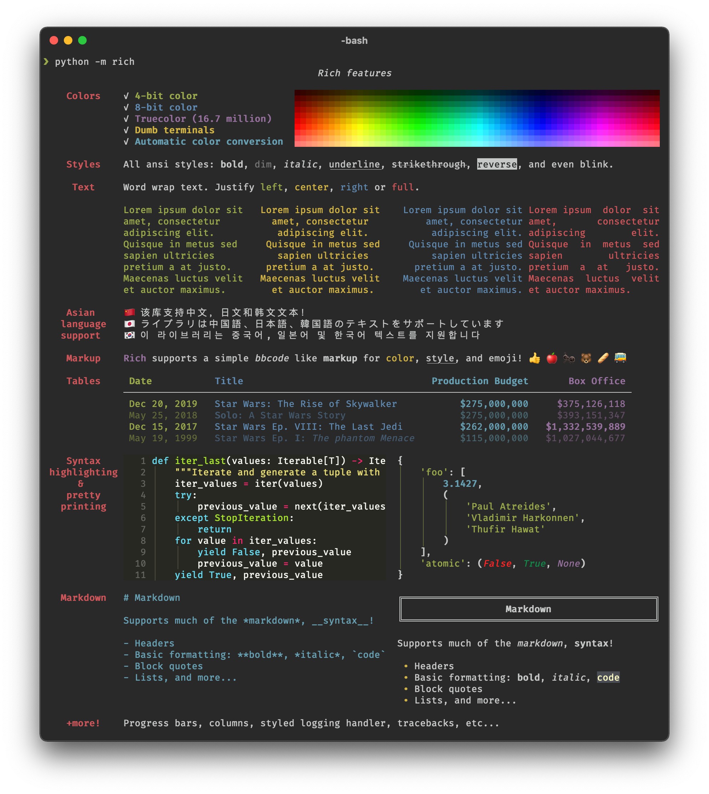
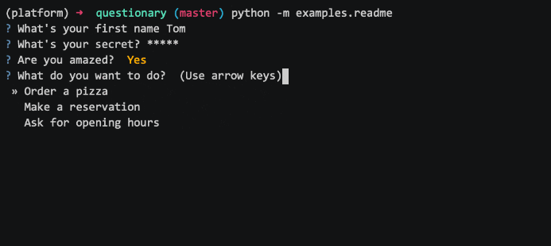

<!-- _header: '' -->
<!-- _transition: fade -->
<!-- _paginate: false -->

# Python TUIs

## Librerías Rich y Questionary



---

# Ponente


Nombre
: MSC. Jaime Jesús Delgado Meraz

Correo
: <jesus.delgado@tecvalles.mx>

---

# Objetivo

Presentar las librerías Rich y Questionary para la creación de interfaces de usuario basadas en texto con Python.

---
<!-- _class: toc -->
# Contenidos

1. [Introducción](#introducción)
2. [TUIs](#tuis)
3. [Rich](#rich)
4. [Questionary](#questionary)
5. [Conclusión](#conclusión)

---
<!-- _class: lead -->

# Introducción

---

# Introducción

- Al trabajar con Python, es común la necesidad de crear interfaces de usuario basadas en texto, ya sea para aplicaciones de consola o para scripts interactivos.
- Si bien Python cuenta con librerías estándar para manejar la entrada y salida de texto, existen otras librerías que facilitan la creación de interfaces de usuario basadas en texto, que son más atractivas y fáciles de usar.

---

<!-- _class: lead -->

# TUIs

---

# TUIs

> Las interfaces de usuario basadas en texto (TUIs) son interfaces de usuario que utilizan texto en lugar de gráficos.

- Estas interfaces son comunes en sistemas operativos tipo Unix, donde se utilizan para aplicaciones de consola, aunque también son muy útiles en ambientes de administración de sistemas y en aplicaciones de línea de comandos.
- Las TUIs son una forma de interactuar con un programa a través de comandos y menús, y son una alternativa a las interfaces gráficas de usuario (GUIs).
- Son muy útiles para aplicaciones que se ejecutan en servidores o en sistemas embebidos, donde no se cuenta con una interfaz gráfica.

---

# TUIs

- Algunos ejemplos de aplicaciones que utilizan TUIs son:
  - Editores de texto como Nano, Vim y Emacs.
  - Navegadores web como Lynx y Links.
  - Administradores de paquetes como Aptitude y Yum.
  - Herramientas de administración de sistemas como htop y mc.
  - Herramientas de desarrollo como compiladores, intérpretes y control de versiones.
  - Aplicaciones de línea de comandos como Git, Docker y Kubernetes.

---
<!-- _class: lead -->

# Rich

---

# Rich

- Rich es una librería de Python que permite crear interfaces de usuario basadas en texto con formato y estilos.
- Se puede instalar con pip:

```bash
pip install rich
```

- Es muy versátil y permite crear interfaces de usuario con texto enriquecido, que incluye colores, estilos, tablas, gráficos y más.
- Su documentación está disponible en [rich.readthedocs.io](https://rich.readthedocs.io).

---

# Rich


---

# Rich

- Algunos ejemplos de lo que se puede hacer con Rich son:
  - Colorear texto.
  - Mostrar tablas.
  - Mostrar paneles con texto enriquecido.
  - Mostrar barras de progreso.
  - Mostrar mensajes de error, advertencia e información.
  - Mostrar listas y árboles.
  - Mostrar código fuente con resaltado de sintaxis.

---

# Rich

## Colorear texto

```python
from rich import print # Sobreescribe la función print

print("Hola, [bold magenta]Mundo[/bold magenta]!", ":vampire:")
```

Lo anterior nos daría como resultado el texto "Hello, " y la palabra "World!" en negritas y de color magenta, seguido de un emoji de vampiro 🦇.

- La sintaxis básica para dar formato al texto es `[estilo]texto[/estilo]`.
- Los estilos básicos incluyen: bold, italic y underline.
- También se pueden utilizar colores y emojis.

::: warning
:warning: Para que los estilos y colores se muestren correctamente, es necesario ejecutar el código en una terminal que soporte texto enriquecido.
:::

---

# Rich

## Colorear texto

- Los colores de las letras se especifican con el nombre del color o con su código hexadecimal, incluyendo los colores básicos como red, green, blue, yellow, magenta, cyan, white y black.
- Los emojis se especifican con su nombre entre dos puntos, como `:vampire:`, `:smiley:`, `:heart:`, etc.
- Si se quiere cambiar el color de fondo, se puede utilizar el estilo `on color`, por ejemplo `[on red]texto[/on red]`, aunque al hacer esto se sobreescribe el color de las letras.

---

# Rich

## Mostrar tablas

```python
from rich.console import Console
from rich.table import Table

console = Console()

table = Table(title="Películas de Star Wars")
table.add_column("Episodio", style="cyan", no_wrap=True)
table.add_column("Título", style="magenta")
table.add_column("Director", style="green")

table.add_row("IV", "A New Hope", "George Lucas")
table.add_row("V", "The Empire Strikes Back", "Irvin Kershner")
table.add_row("VI", "Return of the Jedi", "Richard Marquand")

console.print(table)
```

---

# Rich

## Mostrar tablas

- El código anterior nos daría una tabla parecida a la siguiente (con los colores indicados):

### Películas de Star Wars

| Episodio| Título                   | Director        |
| ------- | ------------------------ | --------------- |
| IV      | A New Hope               | George Lucas    |
| V       | The Empire Strikes Back  | Irvin Kershner  |
| VI      | Return of the Jedi       | Richard Marquand|

- Se pueden personalizar los estilos de las columnas y de las celdas, y se pueden agregar títulos y encabezados.

---

# Rich

## Mostrar tablas

- La clase `Table` permite crear tablas con títulos, encabezados y columnas.
- Primero se crea una instancia de la clase `Table` con el título de la tabla.
- Luego se agregan columnas con el método `add_column`, especificando el nombre de la columna y su estilo.
- Después se agregan filas con el método `add_row`, especificando los valores de las celdas.
- Finalmente se imprime la tabla con el método `print` de la clase `Console`.

---

# Rich

## Mostrar paneles con texto enriquecido

```python
from rich.console import Console
from rich.panel import Panel

console = Console()

panel = Panel.fit("Hola, [bold magenta]Mundo[/bold magenta]!", title="Saludos")

console.print(panel)
```

- El código anterior nos daría un panel con el texto "Hola, " y la palabra "Mundo" en negritas y de color magenta, con el encabezado "Saludos".
- Para ajustar el tamaño del panel al texto, se utiliza el método `fit` de la clase `Panel`.

---

# Rich

## Mostrar paneles con texto enriquecido

- Los paneles son útiles para mostrar mensajes de error, advertencia e información.
- Los paneles también se pueden personalizar con colores y estilos.
- Pueden crearse como paneles de ancho fijo (`Panel`) o de ancho ajustable (`Panel.fit`).
- Además del mensaje, se puede especificar un título y un subtítulo.

---

# Rich

## Mostrar barras de progreso

```python
from rich.progress import Progress

with Progress() as progreso:
    tarea = progreso.add_task("[red]Descargando...", total=100)
    while not progreso.finished:
        progreso.update(tarea, advance=0.5)
```

- El código anterior nos daría una barra de progreso de color rojo con el mensaje "Descargando..." la cual se va llenando hasta llegar al 100%.
- Pueden ser útiles para mostrar el progreso de tareas como descargas, instalaciones y procesamientos.

---

# Rich

## Mostrar barras de progreso

- Las barras de progreso se crean con la clase `Progress` y se agregan tareas con el método `add_task`.
- Se actualiza el progreso de las tareas con el método `update` el cual recibe el identificador de la tarea y el avance.
- Se puede especificar el color de la barra de progreso con el estilo `[color]`.
- Si se requiere se puede cambiar a una barra de progreso indeterminada pasando los atributos `start=False` y `total=None` al método `add_task`.

```python
tarea = progress.add_task("[green]Procesando...", start=False, total=None)
```

---

# Rich

## Mostrar mensajes de error, advertencia e información

- Es posible mostrar mensajes de error, advertencia e información con colores y estilos, ajustando el texto y el color a la situación.

```python
from rich import print

print("[bold red]Error:[/bold red] Ocurrió un error inesperado!")

print("[bold yellow]Advertencia:[/bold yellow] Con cuidado!")

print("[bold blue]Info:[/bold blue] Este es un mensaje informativo.")
```

---

# Rich

## Mostrar mensajes de error, advertencia e información

::: error
**Error:** Ocurrió un error inesperado!
:::

::: warning
**Advertencia:** Con cuidado!
:::

::: info
**Info:** Este es un mensaje informativo.
:::

---

# Rich

## Mostrar listas y árboles

```python
from rich import print
from rich.tree import Tree

tree = Tree("Raíz")
tree.add("Hijo 1")
tree.add("Hijo 2")
branch = tree.add("Hijo 3")
branch.add("Nieto 1")
branch.add("Nieto 2")

print(tree)
```

---

# Rich

## Mostrar listas y árboles

- El código anterior generaría una lista con un árbol de nodos, parecido a lo siguiente:

```bash
Raíz
├── Hijo 1
├── Hijo 2
└── Hijo 3
    ├── Nieto 1
    └── Nieto 2
```

- Los árboles son útiles para mostrar listas jerárquicas de elementos, como directorios y archivos.
- Aunque también se pueden utilizar para mostrar estructuras de datos complejas.

---

# Rich

## Mostrar código fuente con resaltado de sintaxis

```python
from rich import print

code = """
def hello(name: str) -> str:
    return f"Hello, {name}!"
"""

print(code, "python")
```

---

# Rich

## Mostrar código fuente con resaltado de sintaxis

- El código anterior nos daría un bloque de código con resaltado de sintaxis, parecido a lo siguiente:

```python
def hello(name: str) -> str:
    return f"Hello, {name}!"
```

- Aunque puede no ser tan común el resaltar código en una aplicación de terminal, es útil para mostrar ejemplos de código y mensajes de error.

---

<!-- _class: lead -->

# Questionary

---



---

# Questionary

- Questionary es una librería de Python que permite crear interfaces de usuario interactivas con preguntas y respuestas.
- A diferencia de Rich, Questionary se enfoca en la interacción con el usuario, permitiendo crear interfaces de usuario con listas, opciones, confirmaciones y más.
- Se puede instalar con pip:

```bash
pip install questionary
```

- Su documentación está disponible en [questionary.readthedocs.io](https://questionary.readthedocs.io).

---

# Questionary

- Algunos ejemplos de lo que se puede hacer con Questionary son:
  - Hacer preguntas con entradas de texto.
  - Hacer preguntas con opciones.
  - Hacer preguntas con confirmaciones.
  - Hacer preguntas con selección múltiple.
  - Hacer preguntas con selección de archivos y directorios.

---

# Questionary

## Hacer preguntas con entradas de texto

- Se puede hacer preguntas con entradas de texto de la siguiente manera:

```python
import questionary

nombre = questionary.text("¿Cuál es tu nombre?").ask()

print(f"Hola, {nombre}!")
```

- Al igual que con el comando `input` los datos leídos son de tipo `str` y se pueden convertir a otros tipos si es necesario.

```python
edad = questionary.text("¿Cuántos años tienes?").ask()
edad = int(edad)
```

---

# Questionary

## Hacer preguntas con entradas de texto

- Se pueden hacer preguntas con entradas de texto enriquecido.

```python
respuesta = questionary.text("¿Cuál es tu respuesta?",
  style="bold blue").ask()
```

- Si se requiere se pueden especificar valores por defecto y validaciones.

```python
nombre = questionary.text("¿Cuál es tu nombre?",
  default="Anónimo",
  validate=lambda x: len(x) > 0).ask()
```

---

# Questionary

## Hacer preguntas con entradas de texto

- Un caso común es pedir contraseñas, las cuales se pueden ocultar con asteriscos.

```python
contrasena = questionary.password("¿Cuál es tu contraseña?").ask()
```

- En este caso, la contraseña se oculta con asteriscos y no se muestra en la pantalla, pero el valor se recibe normalmente.

---

# Questionary

## Hacer preguntas con opciones

- Se puede hacer preguntas con opciones de la siguiente manera:

```python
opcion = questionary.select("¿Cuál es tu opción?",
  choices=["Opción 1", "Opción 2", "Opción 3"]
).ask()

print(f"Seleccionaste la opción {opcion}!")
```

- Las opciones pueden ser dinámicas y provenir de una lista, un diccionario, un generador o una función.

```python
# Lista de nombres proveniente de una base de datos o de un archivo
nombres = [...] 

opciones = questionary.select("¿A quién eliges?", choices=nombres).ask()
```

---

# Questionary

## Hacer preguntas con confirmaciones

- Se puede hacer preguntas con confirmaciones de la siguiente manera:

```python
confirmado = questionary.confirm("¿Estás seguro?").ask()

if confirmado:
  print("¡Confirmado!")
else:
  print("¡Cancelado!")
```

- Las confirmaciones son útiles para preguntar al usuario si está seguro de realizar una acción, devolviendo un valor booleano.

---

# Questionary

## Hacer preguntas con selección múltiple

- Se puede hacer preguntas con selección múltiple de la siguiente manera:

```python
opciones = questionary.checkbox("¿Cuáles son tus opciones?",
  choices=["Opción 1", "Opción 2", "Opción 3"]
).ask()

print(f"Seleccionaste las opciones {opciones}!")
```

- Las opciones se devuelven como una lista de valores seleccionados.
- Se muestran como una lista de opciones con casillas de verificación ✅.

---

# Questionary

## Hacer preguntas con selección de archivos y directorios

- En algunos casos se puede requerir que el usuario seleccione un archivo o un directorio.

```python
archivo = questionary.path("¿Cuál es tu archivo?").ask()

print(f"Seleccionaste el archivo {archivo}!")
```

- Si solo se requiere seleccionar un directorio, se puede incluir el argumento `only_directories=True`.

```python
directorio = questionary.path("¿Cuál es tu directorio?", only_directories=True).ask()

print(f"Seleccionaste el directorio {directorio}!")
```

---

# Questionary

- Questionary permite combinar varias preguntas para crear un flujo de trabajo interactivo.

```python
import questionary

respuestas = questionary.form(
  nombre = questionary.text("¿Cuál es tu nombre?"),
  opcion = questionary.select("¿Cuál es tu opción?",
    choices=["Opción 1", "Opción 2", "Opción 3"]),
  confirmado = questionary.confirm("¿Estás seguro?")
).ask()
```

---

# Questionary

- El código anterior nos daría un diccionario con las respuestas a las preguntas.

```python
{
  "nombre": "Jaime", "opcion": "Opción 2","confirmado": True
}
```

- Estas respuestas se pueden utilizar para realizar acciones o tomar decisiones en el programa.

```python
if respuestas["confirmado"]:
  print(f"Hola, {respuestas['nombre']}!")
else:
  print("¡Cancelado!")
```

---

<!-- _class: lead -->

# Conclusión

---

# Conclusión

- Las librerías Rich y Questionary son muy útiles para crear interfaces de usuario basadas en texto con Python.
- Rich permite crear interfaces de usuario con texto enriquecido, que incluye colores, estilos, tablas, gráficos y más.
- Questionary permite crear interfaces de usuario interactivas con preguntas y respuestas, que incluye listas, opciones, confirmaciones y más.
- Ambas librerías son muy versátiles y fáciles de usar, y son una alternativa a las librerías estándar de Python para manejar la entrada y salida de texto.

---

# Referencias

- Python Rich <https://rich.readthedocs.io>
- Python Questionary <https://questionary.readthedocs.io>

---

<!-- _class: inverted -->


<div class="text-center text-middle font-bold font-coding text-8xl mt-10">
  &lt;/Fin&gt;
</div>
