# Introducción a la Robótica Educativa

<br>

Instructores
: ME. Horacio García Aldape
: MSC. Jaime Jesús Delgado Meraz

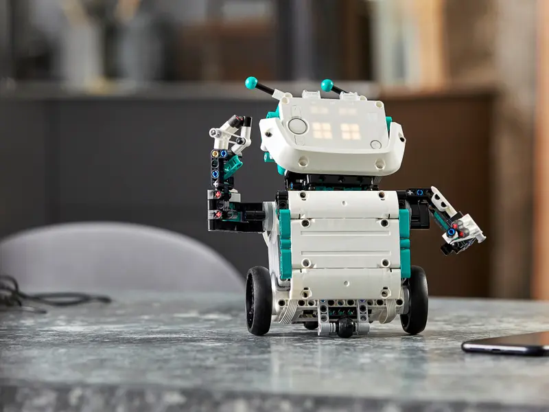

---

# Objetivo

Integrar el uso de la robótica educativa en la enseñanza y práctica de las competencias de programación.

- Conocer el concepto de programación educativa y robótica educativa.
- Conocer el kit de robótica educativa Lego Mindstorms.
- Adquirir habilidades básicas de programación de los robots Lego Mindstorms.

---
<!-- _class: toc -->
# Contenidos

1. [Introducción](#introducción)
2. [Programación Educativa](#programación-educativa)
3. [Robótica Educativa](#robótica-educativa)
4. [Lego Mindstorms](#lego-mindstorms)
5. [Entornos de Desarrollo](#entornos-de-desarrollo)
6. [Resumen](#resumen)

---
<!-- _class: lead -->
# Introducción

---

# Introducción

- La programación es una herramienta que permite a las personas resolver problemas de manera creativa y eficiente mediante el uso de computadoras.
- La enseñanza de la programación es un tema que ha cobrado relevancia en los últimos años, debido a la importancia que tiene en el desarrollo de habilidades y competencias para la vida.
- Actualmente, la enseñanza de la programación ya no se limita a las carreras relacionadas a las TICs, sino que se ha extendido a otras áreas del conocimiento.

---

# Introducción

- Durante la pandemia, la demanda de cursos de programación en línea se incrementó significativamente, ante la necesidad de las personas de adquirir nuevas habilidades para poder trabajar desde casa.
- Dicho incremento en la demanda de cursos de programación, también se vio reflejado en el ámbito educativo, donde se ha buscado implementar estrategias para enseñar programación a los estudiantes.
- Se estima que para el año 2025, la demanda de profesionales de desarrollo de software aumentará 1.2 millones, tan solo en Latinoamérica.
- Según la firma de consultoría IDC, adicional a esa demanda, existe un déficit del 38% de profesionales de desarrollo de software en Latinoamérica.

---

# Introducción

- De acuerdo con el informe de la firma de consultoría IDC, el déficit de profesionales de desarrollo de software en Latinoamérica, se debe a la falta de habilidades y competencias en programación.
- Si bien, con el auge de la Inteligencia Artificial como servicio, aparentemente se ha reducido la necesidad de programadores, la demanda de profesionales de desarrollo de software sigue siendo alta ya que se requieren profesionales que puedan desarrollar soluciones personalizadas para las empresas.
- Adicionalmente, existen nichos de oportunidad para los profesionales del desarrollo de software, más allá del desarrollo de soluciones empresariales, como el análisis de datos, la ciberseguridad, la realidad aumentada, la realidad virtual, la robótica, etc. donde se requieren profesionales con conocimientos de programación.

---

<!-- _class: lead -->

# Programación Educativa

---

# Un poco de historia

- En 1967, Seymour Papert, un matemático sudafricano, desarrolló el lenguaje de programación Logo, con el objetivo de enseñar a los niños a programar.
- Se utilizó por primera vez en el año 1969, en una escuela de primaria en Cambridge, Massachusetts, Estados Unidos y fue utilizado por más de 100 escuelas en Estados Unidos y Europa.
- Logo fue el primer lenguaje de programación diseñado específicamente para niños, utilizado para enseñar programación y matemáticas, por lo que se le considera como el padre de la programación educativa.

---

# Un poco de historia

- El lenguaje de programación Logo, se basa en el concepto de la tortuga 🐢, que es un "robot" que se puede mover en la pantalla, mediante el uso de comandos.
- El objetivo de Logo, era enseñar a los niños a programar, mediante el uso de comandos para mover la tortuga en la pantalla, para dibujar figuras geométricas.
- De esta manera, los niños aprendían a programar, mientras que al mismo tiempo, aprendían conceptos de matemáticas, como ángulos, coordenadas, etc.

---

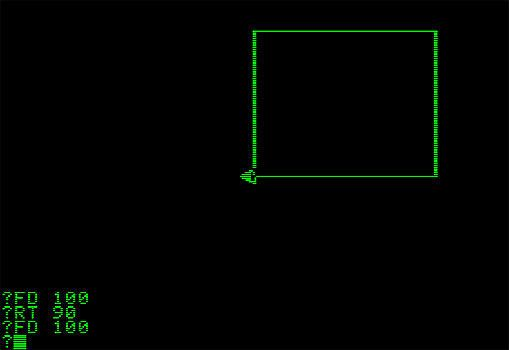

# Un poco de historia

## Logo

```txt
to square
  repeat 4 [forward 100 turnright 90]
end

to triangle
  repeat 3 [forward 100 turnright 120]
end

to circle
  repeat 360 [forward 1 turnright 1]
end
```

---

# La tortuga 🐢

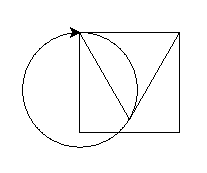

```python
import turtle

t = turtle.Turtle()

for i in range(4):
  t.forward(100)
  t.right(90)

for i in range(3):
  t.forward(100)
  t.right(120)

for i in range(360):
  t.forward(1)
  t.right(1)

turtle.done()
```

---

# De Logo a Scratch

- El lenguaje Logo sirvió de inspiración para lenguajes de programación y entornos como:
  - RoboMind
  - El módulo Turtle de Python
  - Scratch
- Este último, desarrollado por el MIT, siendo un lenguaje de programación visual, que permite a los niños y jóvenes aprender a programar, mediante el uso de bloques que se pueden arrastrar y soltar.

---

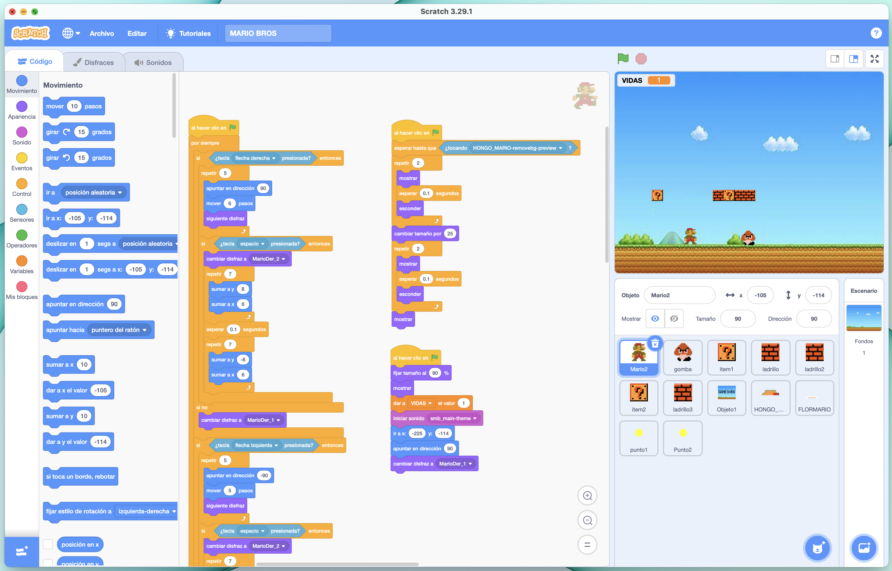

---

# Programación Educativa

::: primary
Es una estrategia que busca enseñar a programar a niños y jóvenes, mediante el uso de herramientas que les permitan desarrollar proyectos de manera sencilla y divertida.
:::

- Se basa en el aprendizaje por proyectos, mediante la resolución de problemáticas del entorno / aula, también conocido como _Project Based Learning_.
- Permite a los estudiantes desarrollar habilidades y competencias como el pensamiento computacional, la creatividad, la resolución de problemas y el trabajo en equipo.

---

# Programación Educativa

- La programación educativa se puede implementar en diferentes niveles educativos, desde preescolar hasta universidad, siendo muy popular en los niveles de primaria y secundaria.
- Sin embargo, no significa que no se pueda implementar en otros niveles educativos, de hecho, puede ser una estrategia muy útil para enseñar programación a estudiantes de nivel superior, especialmente en carreras que no están relacionadas con las TICs, o que no tienen antecedentes de programación.
- La programación educativa se puede implementar en diferentes áreas del conocimiento, como matemáticas, ciencias, artes, etc. combinando el aprendizaje de programación con el aprendizaje de otras materias.

---

# Herramientas de Programación Educativa

- En la actualidad, existen diferentes herramientas, tanto de hardware como de software, que permiten implementar la programación educativa, como Scratch, Arduino, Raspberry Pi, Lego Mindstorms, etc.
- Estas herramientas pueden ser tanto de hardware como de software, o una combinación de ambas.

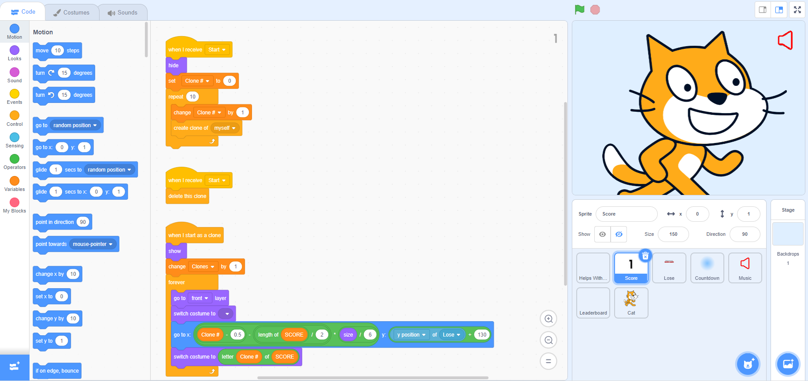
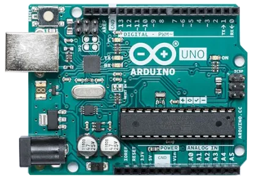


---

<!-- _class: lead -->

# Robótica Educativa

---

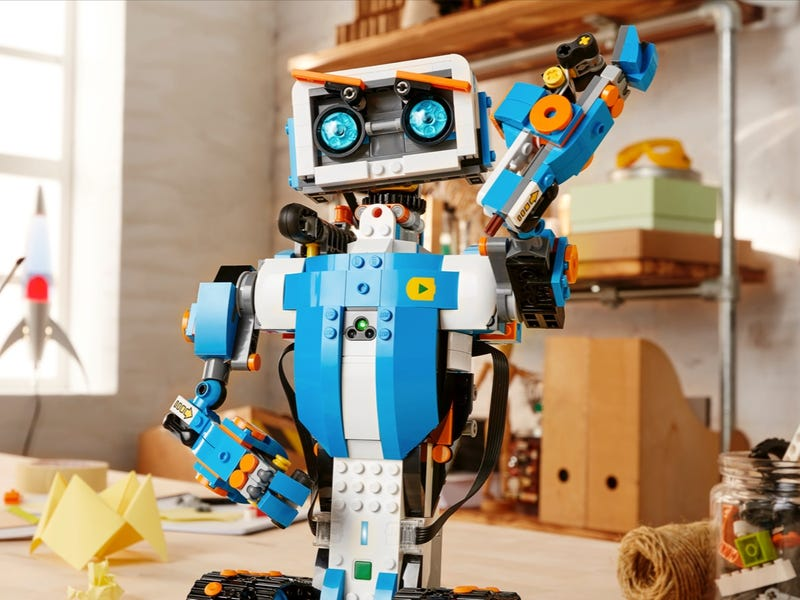

# Robótica Educativa

- El uso de la robótica en conjunto con la programación, es una estrategia que permite a los estudiantes desarrollar habilidades y competencias de manera integral.
- Permite aplicar conocimientos de programación, electrónica y mecánica.
- Es una estrategia ideal para enseñar las bases de la programación, ya que permite aplicar los conocimientos de programación en un ambiente físico, lo que hace que sea más fácil de entender y más divertido.

---

# Robótica Educativa

## Herramientas

- Las herramientas de robótica educativa pueden ser muy variadas, dependendiendo de cada contexto, pero en general se pueden utilizar:
  - Ambientes de robótica simulada, como RoboMind, Webots, CoppeliaSim, etc.
  - Microcontroladores, como Arduino, Raspberry Pi, Micro:bit, etc.
  - Kits de robótica educativa, como Lego Mindstorms, Vex Robotics, Elegoo Smart Robot Car Kit, Makeblock mBot, etc.

---

# Kits de Robótica Educativa

- Los kits de robótica educativa, generalmente incluyen una tarjeta de control, motores, sensores y actuadores, así como un software para programar la tarjeta de control.
- Los kits de robótica educativa más populares son:
  - Lego Mindstorms
  - Vex Robotics
  - Elegoo Smart Robot Car Kit
  - Makeblock mBot

---

<!-- _class: lead -->

# Lego Mindstorms

---

# Lego Mindstorms

- Lego Mindstorms es un kit de robótica educativa, que permite a los estudiantes construir y programar robots, combinando piezas de Lego con una tarjeta de control, motores, sensores y actuadores.
- Inicialmente fue desarrollado por el MIT hasta el año 2000, cuando Lego adquirió la licencia para desarrollar el kit.
- Cuenta con diferentes versiones, siendo la más reciente la versión 51515, que fue lanzada en el año 2020, también conocida como Robot Inventor.

---

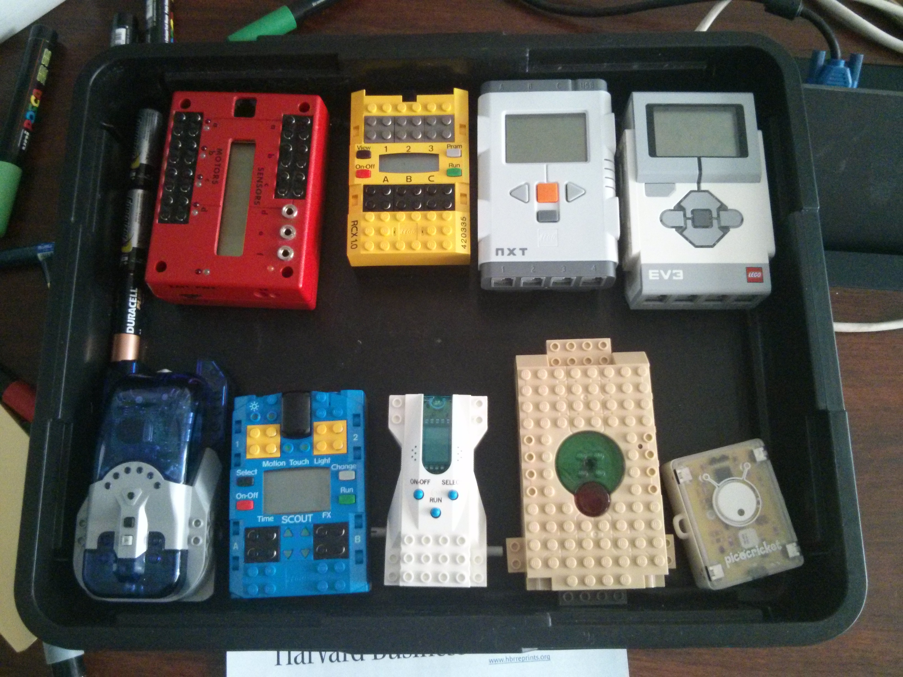

---

# Lego Mindstorms

## Robot Inventor 51515

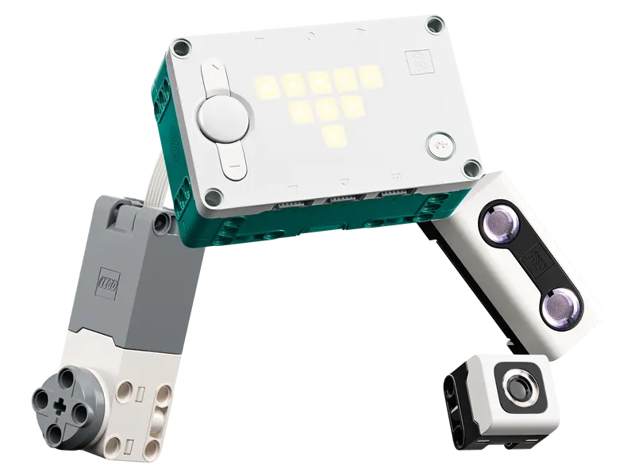

- Cuenta con 949 piezas, 6 motores, 4 sensores y un concentrador inteligente.
- Incluye sensores de color, luminosidad, distancia, giroscopio.
- Permite construir 5 robots diferentes, que se pueden programar mediante la aplicación Lego Mindstorms Robot Inventor.

---

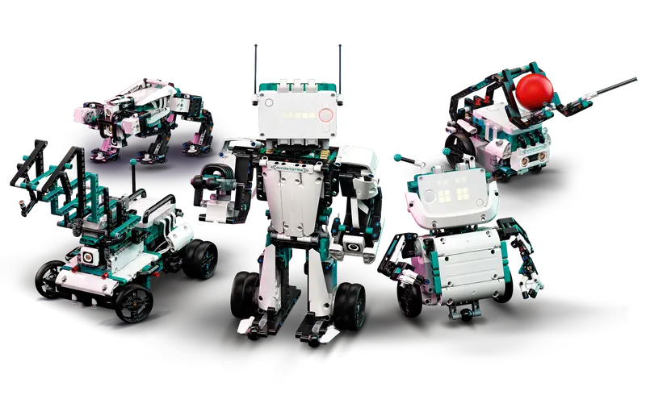

---

<!-- _class: lead -->

# Entornos de Desarrollo

---

# Entornos de Desarrollo

- Los entornos de desarrollo, son herramientas que permiten a los programadores escribir, compilar y ejecutar código.
- Queda claro que cada tecnología tiene su propio entorno de desarrollo y lenguaje.
- En el caso de Lego Mindstorms, existen diferentes entornos de desarrollo, que permiten programar los robots, mediante el uso de bloques o código.
  - Lego Mindstorms Robot Inventor
  - Thonny (EV3)
  - Visual Studio Code

---

# Programación con Bloques

- La programación con bloques de Lego Mindstorms, se realiza mediante la aplicación Lego Mindstorms Robot Inventor, que se puede instalar en una computadora o dispositivo móvil.
- Se basa en el lenguaje de programación Scratch, que permite programar mediante el uso de bloques que se pueden arrastrar y soltar.

---

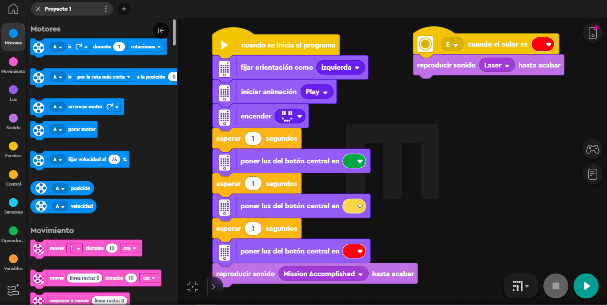

---

<!--<div class="text-center text-middle font-bold font-mono text-8xl mt-10 p-4">
  &lt;Coding Time /&gt;
</div>

<div class="text-center text-middle text-6xl mt-6 text-primary">
  Programación con Bloques
</div>

---
-->

# Programación con Código

- La programación con código, se puede realizar mediante la aplicación Lego Mindstorms Robot Inventor o algún IDE como Thonny o Visual Studio Code.
- Se basa en el lenguaje de programación Python, que es un lenguaje de programación de alto nivel, orientado a objetos y de propósito general.
- Particularmente se utiliza MicroPython, que esta diseñada para ser utilizada en microcontroladores.

---

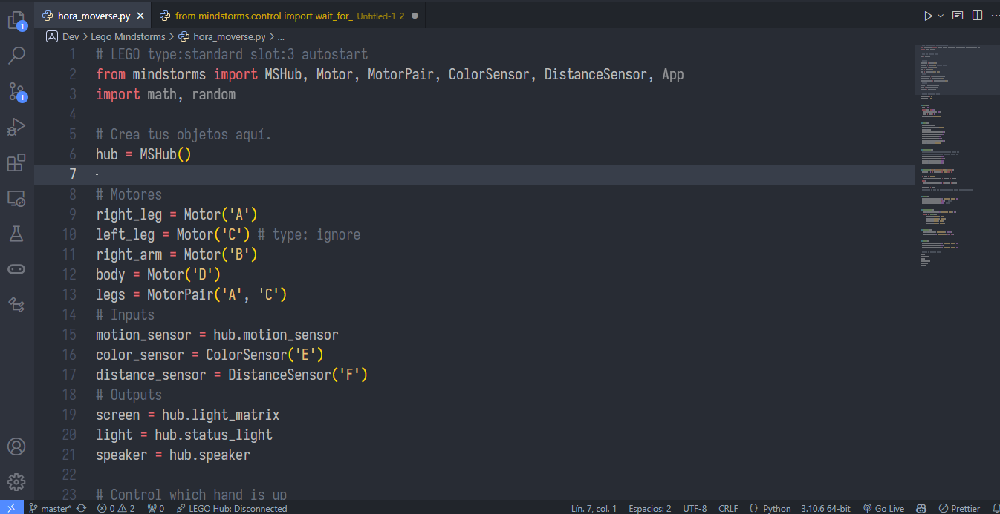

---

<!--<div class="text-center text-middle font-bold font-mono text-8xl mt-10 p-4">
  &lt;Coding Time /&gt;
</div>

<div class="text-center text-middle text-6xl mt-6 text-primary">
  Programación con Código
</div>

---
-->

<!-- _class: lead -->

# Resumen

---

# Resumen

- La programación educativa es una estrategia que permite a los estudiantes desarrollar habilidades y competencias de manera integral.
- Si bien existen diferentes herramientas para implementar la programación, la robótica educativa es una de las más populares, debido a que permite aplicar en un mismo ambiente, conocimientos de programación, electrónica y mecánica.
- Los kits especializados agilizan el proceso de aprendizaje, ya que permiten a los estudiantes construir y programar robots de manera sencilla, sin necesidad de tener conocimientos previos.

---

# Referencias

- _Tiffin University_, ¿Por qué ha aumentado la demanda de profesionales de desarrollo de software? <https://global.tiffin.edu/noticias/aumento-en-la-demanda-de-profesionales-de-desarrollo-de-software>
- _IDC_, IDC FutureScape: Worldwide IT Industry 2021 Predictions <https://www.idc.com/getdoc.jsp?containerId=US46942020>
- _IDC Online_, No cambies de trabajo, cambia de carrera, <https://idconline.mx/laboral/2023/01/26/no-cambies-de-trabajo-cambia-de-carrera>
- _Educación 3.0_, Los mejores kits de robótica para el próximo curso <https://www.educaciontrespuntocero.com/noticias/kits-robotica-aula/>
- _MIT_, Scratch <https://scratch.mit.edu/>
- _Lego_, Robot Inventor <https://www.lego.com/es-mx/product/robot-inventor-51515>

---

<!-- _class: inverted -->
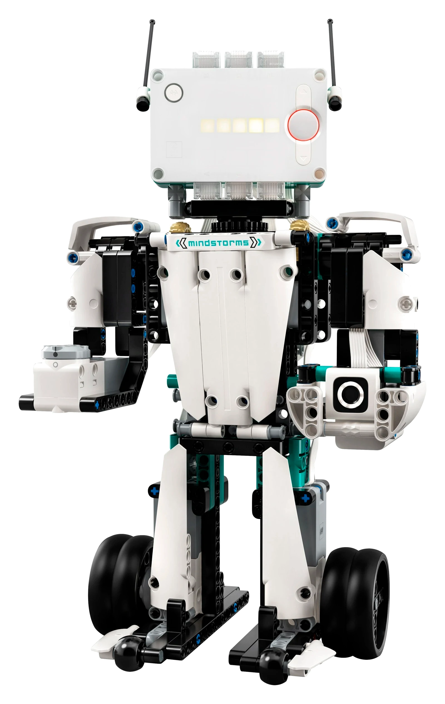

<div class="text-center text-middle font-bold font-coding text-8xl mt-10">
  &lt;/Fin&gt;
</div>
