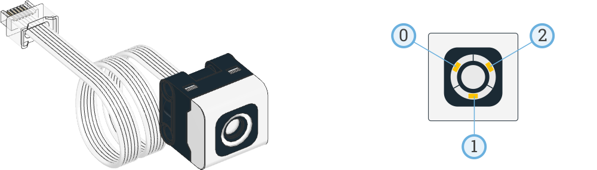
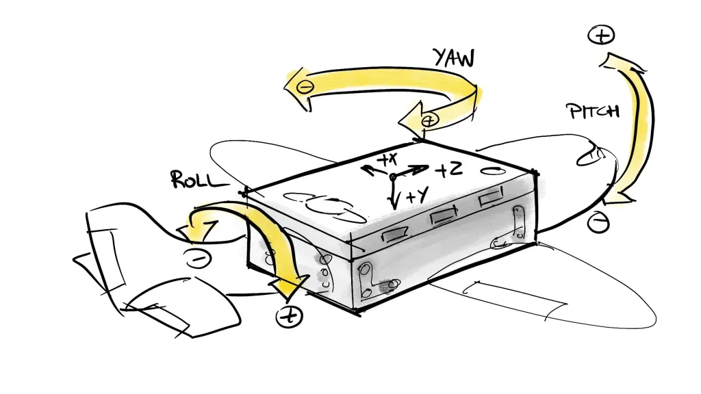

# Lego Mindstorms 51515

 

Instructores
: ME. Horacio García Aldape
: MSC. Jaime Jesús Delgado Meraz

---

# Objetivo

Integrar el uso de la robótica educativa en la enseñanza y práctica de las competencias de programación.

- Conocer el concepto de programación educativa y robótica educativa.
- Conocer el kit de robótica educativa Lego Mindstorms.
- Adquirir habilidades básicas de programación de los robots Lego Mindstorms.

---
<!-- _class: toc -->
# Contenidos

1. [Kit 51515](#kit-51515)
2. [HUB](#hub)
3. [Sensores](#sensores)
4. [Motores](#motores)

---
<!-- _class: lead -->
# Kit 51515

---

# Kit 51515

- El kit Lego 51515, es la versión más reciente de Lego Mindstorms, lanzada en el año 2020, también conocida como Lego Mindstorms Robot Inventor.
- Cuenta con 949 piezas, 6 motores, 4 sensores y un concentrador inteligente.

---

---

<!-- _class: lead -->

# HUB

---

# HUB

- El concentrador inteligente, también conocido como el HUB, es el cerebro del robot, cuenta con 6 puertos de E/S integrados con una interfaz de conexión estándar para los motores y sensores del kit.
- Los puertos están identificados con letras de la A a la F, ubicados en grupos de 3 en las laterales del HUB (A, C, E y B, D, F).
- Cuenta con conexión Bluetooth, para poder programar y controlar el robot desde un dispositivo móvil.
- Incluye una bocina, para reproducir sonidos y música.

---

# HUB

- Cuenta con una pantalla LED de 5x5, para mostrar información del estado del robot o texto.
- Cuenta con 3 botones, para interactuar con el robot:
  - Botón central: encender/apagar el HUB, que también funciona como botón de selección e incluye un LED de estado.
  - Botón superior: botón para incrementar el valor de la selección.
  - Botón inferior: botón para decrementar el valor de la selección.
- El HUB cuenta con una batería recargable, que se puede cargar mediante un cable USB.

---

# HUB

Peso y dimensiones
: - 26 g (sin batería)
: - L 56 x W 40 x H 32 mm

Sistema
: - Procesador ARM Cortex M4 100MHz
: - 320 KB RAM 1M FLASH
: - Almacenamiento de 32 MB para los programas y contenidos
: - Soporte para MicroPython

---

---

---

---

# HUB

## Matriz LED

- La matriz LED, es una pantalla de 5x5, que se puede usar para mostrar texto, "imágenes" y animaciones.
- Cada LED puede iluminarse en una escala de 0 a 9 y se referencian por un sistema de coordenadas, iniciando en la esquina superior izquierda ubicada al lado del puerto A.

---

<!-- _class: lead -->

# Sensores

---

# Sensores

- El kit 51515 incluye 4 sensores:
  - Sensor de color y luminosidad (2 en 1)
  - Sensor de distancia (ultrasonido)
  - Sensor giroscopio (3 ejes, incluido en el HUB)
- También se puede usar un sensor de contacto (no incluído), que se conecta a un puerto de entrada.

---

# Sensores

## Sensor de color y luminosidad

- El sensor de color, es un sensor RGB, que puede detectar colores y luz ambiente y reflejada.
- Cuenta con 2 modos de operación:
  - Modo de color: detecta colores, en una escala de 0 a 7.
  - Modo de luz: detecta la intensidad de la luz, en una escala de 0 a 100.
- Solo puede funcionar en un modo a la vez.

---

---

# Sensores

## Sensor de distancia

- El sensor de distancia funciona por ultrasonido, puede detectar objetos en un rango de 1 a 200 cm.
- Funciona con un haz de ultrasonido, que se emite y se recibe, para determinar la distancia de los objetos.
- Incluye 4 leds en sus "ojos", que se pueden usar para mostrar expresiones.

---

---

# Sensores

## Sensor giroscopio

- El HUB incluye un giroscopio de 6 ejes:
  - 3 ejes de aceleración
  - 3 ejes de rotación
- Soporta la detección de "gestos" como _tap_, sacudida y caída.
- Se auto-calibra al encender el HUB, por lo que es necesario mantener el HUB quieto durante el encendido.

---

---

<!-- _class: lead -->

# Motores

---

# Motores

- El kit 51515 incluye 4 motores medianos.
- Cada motor cuenta con un sensor de rotación, que permite controlar la velocidad y posición del motor.
- Es compatible con otros motores disponibles para Lego Mindstorms.
- Cada motor cuenta con un conector de 6 pines, que se conecta a un puerto de salida.

---

---

# Motores

## Comparación de motores

| Motor | Torque Máximo | Velocidad Máxima |
| :---: | :---: | :---: |
| Motor pequeño | 1.8 Ncm | 85 RPM |
| Motor mediano | 3.5 Ncm | 135 RPM |
| Motor grande | 8 Ncm | 135 RPM |

- El torque se mide en Newton-centímetros (Ncm), representando la fuerza que puede ejercer el motor.
- La velocidad se mide en revoluciones por minuto (RPM), sin carga, para facilitar la comparación.

---

# Referencias

- **Lego Mindstorms 51515** <https://www.lego.com/es-mx/product/robot-inventor-51515>
- **Advanced undocumented Python in LEGO SPIKE Prime and MINDSTORMS hubs** <https://www.antonsmindstorms.com/2021/01/14/advanced-undocumented-python-in-spike-prime-and-mindstorms-hubs/>
- **Lego HUB API** <https://lego.github.io/MINDSTORMS-Robot-Inventor-hub-API/index.html>
- **PyBricks Documentation** <https://docs.pybricks.com/en/latest/>
- **LEGO Mindstorms Robot Inventor 51515 FAQ** <https://github.com/maarten-pennings/Lego-Mindstorms/blob/main/ms4/faq.md>

---

<!-- _class: inverted -->

  &lt;/Fin&gt;

