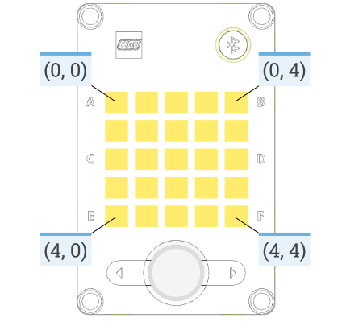
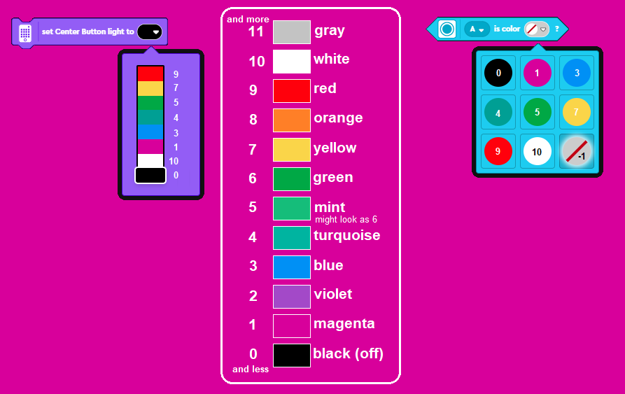
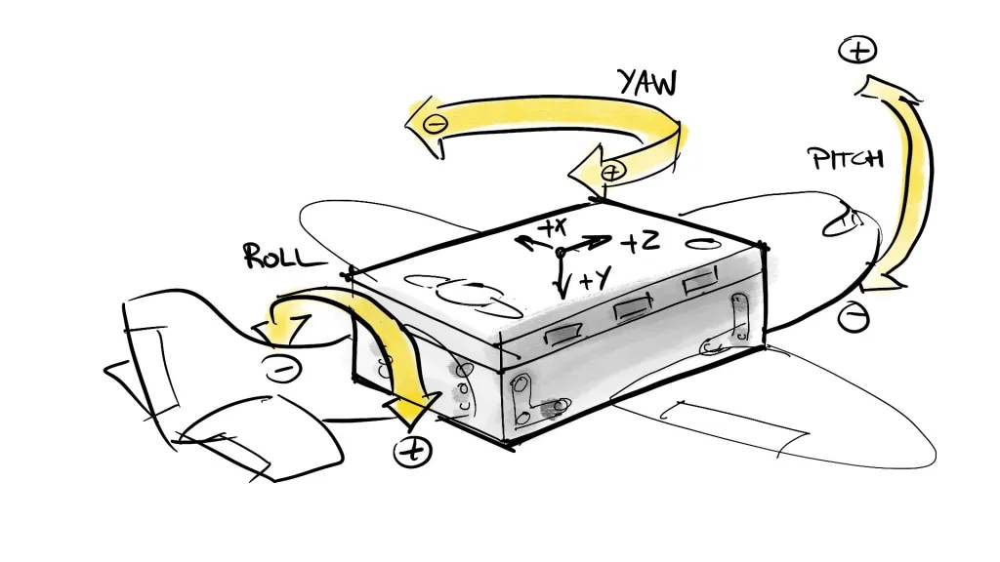

# Lego Mindstorms y Python

<br>

Instructores
: ME. Horacio García Aldape
: MSC. Jaime Jesús Delgado Meraz


---

# Objetivo

Integrar el uso de la robótica educativa en la enseñanza y práctica de las competencias de programación.

- Conocer el concepto de programación educativa y robótica educativa.
- Conocer el kit de robótica educativa Lego Mindstorms.
- Adquirir habilidades básicas de programación de los robots Lego Mindstorms.

---
<!-- _class: toc -->
# Contenidos

1. [Introducción](#introducción)
2. [Repaso de Python](#repaso-de-python)
3. [Estructura básica](#estructura-básica)
4. [Matriz de LEDs](#matriz-de-leds)
5. [Salidas](#salidas)
6. [Sensores](#sensores)
7. [Motores](#motores)
8. [Referencias](#referencias)

---
<!-- _class: lead -->
# Introducción

---

# Introducción

- Lego Mindstorms es una plataforma de robótica educativa que permite a los estudiantes construir y programar robots.
- Una de las características principales de Lego Mindstorms es que permite programar los robots utilizando la programación por bloques, lo cual es muy útil para usuarios principantes o que quieran hacer un proyecto corto.
- Adicionalmente, para los usuarios más avanzados, permite programar los robots utilizando MicroPython.

---

# Introducción

- Lego Mindstorms Robot Inventor cuenta con su propia librería de Python que permite controlar los sensores y motores del robot de forma sencilla.
- La librería se denomina `mindstorms` e incluye clases para controlar los sensores y motores del robot.
- Adicionalmente, la comunidad open source ha desarrollado una librería llamada `pybricks` que permite controlar los sensores y motores del robot de forma más avanzada, pero que requiere sobrescribir el firmware del concentrador inteligente.

---

<!-- _class: lead -->
# Repaso de Python

---

# Repaso de Python

- Hemos dejado claro que es posible utilizar Python para programar los robots Lego Mindstorms, como una alternativa a la programación por bloques.
- Por lo tanto, es necesario repasar los conceptos básicos de Python para poder programar los robots Lego Mindstorms, tales como:
  - Variables
  - Estructuras de control
  - Estructuras de repetición
  - Funciones
  - Listas

---

# Python

## Variables

- En Python, las variables se declaran de forma implícita, es decir, no es necesario declarar el tipo de dato que almacenará la variable.

```python
mensaje = "Hola Mindstorms"
velocidad = 50
es_valido = True
```

- Como se puede observar, no es necesario especificar el tipo de dato, ya que Python lo infiere automáticamente.

---

# Python

## Estructuras de control

- Las estructuras de control en Python son similares a las de otros lenguajes de programación, como C++ o Java.

:::: flex
::: col 1/2 px-2

```python
if condicion:
    # código
else:
    # código
```

:::

::: col 1/2 px-2

```python
if condicion:
    # código
elif condicion:
    # código
else:
    # código
```

:::
::::

- Se puede observar que la diferencia principal reside en la palabra reservada `elif`, que es una abreviación de `else if`.

---

# Python

## Estructuras de control

- Python utiliza la palabra reservada `match` para realizar comparaciones múltiples.
- El caso `_` es el caso por defecto, que se ejecuta cuando no se cumple ninguna de las condiciones anteriores, adicionalmente, se puede utilizar `|` para agrupar casos.

:::: flex

::: col 1/2 px-2

```python
match valor:
    case 1:
        # código
    case 2:
        # código
    case 3:
        # código
    case _:
        # código
```

:::
::: col 1/2 px-2

```python
match valor:
    case 1 | 2:
        # código
    case 3:
        # código
    case _:
        # código
```

:::
::::

---

# Python

## Estructuras de repetición

- Las estructuras de repetición en Python incluyen `while` y `for`.

:::: flex
::: col 1/2 px-2

```python
while condicion:
    # código
```

```python
salir = False

while not salir:
    # código
    # código que cambia el valor de salir
```

```python
while True:
    # código
    # código que cambia el valor de salir
    if salir:
      break
```

:::
::: col 1/2 px-2

```python
for i in range(10):
    # código
```

```python
for i in range(10, 20):
    # código
```

```python
lista = ["uno", "dos", "tres"]

for elemento in lista:
    # código
```

:::
::::

---

# Python

## Funciones

- Las funciones en Python se declaran utilizando la palabra reservada `def`.

```python
def funcion(parametro1, parametro2):
    # código
```

- Pueden tener parámetros opcionales, que se declaran con un valor por defecto.

```python
def funcion(parametro1, parametro2 = 10):
    # código
```

- Pueden regresar un valor utilizando la palabra reservada `return`.

```python
def funcion(parametro1, parametro2):
    # código
    return resultado
```

---

# Python

## Listas

- Las listas en Python son similares a los arreglos en otros lenguajes de programación, como C++ o Java, con la diferencia de que no es necesario especificar el tamaño de la lista.

```python
numeros = [1, 2, 3, 4, 5]
nombres = ["uno", "dos", "tres"]
```

:::: flex
::: col 1/2 px-2

- Se puede acceder a los elementos de la lista utilizando el índice del elemento, iniciando en 0.

```python
print(numeros[0]) # 1
print(numeros[1]) # 2
```

:::
::: col 1/2 px-2

- Se puede cambiar el valor de un elemento de la lista utilizando el índice del elemento.

```python
numeros[0] = 10
print(numeros[0]) # 10
```

:::
::::

---

# Python

## Listas

:::: flex
::: col 1/2 px-2

- La función `len` permite obtener el tamaño de una lista.

```python
numeros = [1, 2, 3, 4, 5]
print(len(numeros)) # 5
```

- Se puede agregar un elemento al final de la lista utilizando la función `append`.

```python
numeros.append(6)
print(numeros) # [1, 2, 3, 4, 5, 6]
```

:::
::: col 1/2 px-2

- Se puede eliminar un elemento de la lista utilizando la función `pop`.

```python
numeros.pop(0)
print(numeros) # [2, 3, 4, 5, 6]
```

- Se puede eliminar un elemento de la lista utilizando la función `remove`.

```python
numeros.remove(4)
print(numeros) # [2, 3, 5, 6]
```

:::
::::

---

# Python

## Matrices

- Las matrices se declaran de manera similar a las listas, con la diferencia de que cada elemento de la lista es una lista.

```python
matriz = [
  [1, 2, 3],
  [4, 5, 6],
  [7, 8, 9]
]

print(matriz[0][0]) # 1
print(matriz[1][1]) # 5
```

- Básicamente, se pueden utilizar las mismas funciones que con las listas, agregando un índice adicional.

---

<!-- _class: inverted -->

::: coding
:::

---

<!-- _class: lead -->
# Estructura básica

---

# Estructura básica

- Para facilitar la programación de los Lego Mindstorms, el entorno de desarrollo nos facilita una estructura básica para programar los robots.
- Esta estructura incluye:
  - Importación de la librería base `mindstorms` para el hub, los motores y sensores
  - Importación del módulo `mindstorms.control` para las funciones de espera y _timers_
  - Importación del módulo `mindstorms.operator` para las funciones de comparación basadas en nombres.
  - Importación de la librería `math` para las funciones matemáticas
- Adicionalmente instancia un objeto de la clase Hub y lo utiliza.

---

# Estructura básica

```python
from mindstorms import MSHub, Motor, MotorPair, ColorSensor, DistanceSensor, App
from mindstorms.control import wait_for_seconds, wait_until, Timer
from mindstorms.operator import greater_than, greater_than_or_equal_to, less_than, 
less_than_or_equal_to, equal_to, not_equal_to
import math

# Crea tus objetos aquí.
hub = MSHub()

# Escribe tu programa aquí.
hub.speaker.beep()
```

- Para crear un objeto de la clase Hub, se utiliza la siguiente instrucción:

```python
hub = MSHub() # Sólo se debe crear un objeto de la clase Hub
```

---

# Estructura básica

- Tomando como referencia la estructura básica, se sugiere que los programas se dividan en funciones, para facilitar su comprensión y reutilización.
- Por lo tanto, se sugiere que la estructura básica se modifique de la siguiente manera:

```python
# 1. Importaciones
# 2. Inicialización
hub = MSHub()
# 2.1 Configuración de los sensores y motores
# 3. Funciones (si es necesario)

# 4. Loop principal
while True:
    # Código
```

---

<!-- _class: lead -->
# Matriz de LEDs

---

# Matriz de LEDs



- La matriz de LEDs es una de las características más llamativas de los robots Lego Mindstorms ya que permite mostrar información de forma visual.
- La matriz de LEDs se puede utilizar para mostrar texto, imágenes o animaciones.

---

# Matriz de LEDs

- La matriz de LEDs esta disponible a través de la propiedad `hub.light_matrix`.

```python
hub.light_matrix.write("Hola Mindstorms")
```

- Entre las funciones disponibles para la matriz de LEDs se encuentran:
  - `write()` para mostrar texto
  - `show()` muestra una imagen en el formato de cadena de texto
  - `show_image()` para mostrar una imagen predefinida
  - `set_pixel(x, y, brillo)` para activar el LED en una posición específica
  - `set_orientation()` para cambiar la orientación de la matriz de LEDs
  - `off()` para apagar la matriz de LEDs

---

# Matriz de LEDs

## Imágenes

- Las imágenes se pueden mostrar utilizando la función `show_image()`.

```python
hub.light_matrix.show_image("HAPPY")
```

- Existen 62 imágenes predefinidas, que se dividen en 4 categorías:
  - Caras
  - Animales
  - Objetos
  - Símbolos

---

### Caras

ANGRY, ASLEEP, CONFUSED, CRYING, DEAD, FABULOUS, HAPPY, MEH, SAD, SILLY, SKULL, SURPRISED

### Animales

BUTTERFLY, COW, DUCK, GIRAFFE, RABBIT, SNAKE, TORTOISE

### Objetos

DIAMOND, DIAMOND_SMALL, GHOST, HEART, HEART_SMALL, HOUSE, PACMAN, PITCHFORK, ROLLERSKATE, SWORD, TARGET, TSHIRT, UMBRELLA, XMAS

### Símbolos

ARROW_[N, S, E, W, NE, NW, SE, SW], CHESSBOARD, CLOCK[1-12], GO_[RIGHT, LEFT, UP, DOWN], MUSIC_[CROTCHET, QUAVER, QUAVERS], NO, SMILE, SQUARE, SQUARE_SMALL, STICKFIGURE, TRIANGLE, TRIANGLE_LEFT, YES

---

# Matriz de LEDs

## Imágenes

:::: flex
::: col 1/2 px-2

- Es posible crear imágenes personalizadas utilizando una matriz de 5x5, donde cada elemento es un número entre 0 y 9 que representa el brillo del LED.

```python
imagen = [
  [0, 0, 0, 0, 0],
  [0, 9, 9, 9, 0],
  [0, 9, 0, 9, 0],
  [0, 9, 9, 9, 0],
  [0, 0, 0, 0, 0]
]

hub.light_matrix.show_image(imagen)
```

:::
::: col 1/2 px-2

- Tambien se pueden crear imágenes personalizadas utilizando una cadena de texto, donde cada caracter representa el brillo del LED.

```python
imagen = "00000:09990:09090:09990:00000"
```

:::
::::

---

# Matriz de LEDs

## Animaciones

- Las animaciones se pueden mostrar utilizando la función `play_animation()`.

```python
hub.light_matrix.play_animation(lista_de_imagenes, velocidad, efecto)
```

- La función `play_animation()` recibe tres parámetros:
  - `lista_de_imagenes` es una lista de imágenes que se mostrarán en la animación
  - `velocidad` representa la velocidad de la animación, donde 20 es la velocidad más rápida y 1 la más lenta
  - `efecto` es el efecto que se aplicará a la animación (_direct_, _fade out_, _fade in_, _overlay_, _slide left_, _slide right_)
- Una alternativa a la función `play_animation()` es la función `start_animation()`, que inicia la animación en un hilo separado.

---

```python
# Importaciones default
import random

hub = MSHub()

hub.light_matrix.set_orientation("left")

hub.light_matrix.write("Hola Mindstorms")
wait_for_seconds(2)
hub.light_matrix.show_image("HAPPY")
wait_for_seconds(2)

images = []
for i in range(10):
    frame = ""
    for j in range(5):
        for k in range(5):
            frame += str(random.randint(0, 9))
        frame += ":"
    images.append(frame[:-1])

hub.light_matrix.play_animation(images, 2.5, "direct", True)
```

---

<!-- _class: lead -->
# Salidas

---

# Salidas

- El hub de Lego Mindstorms, además de poder utilizar la matriz de leds como dispositivo de salida, también puede interactuar con el usuario a través del uso de led de estatus y la bocina integrada.
- El led de estatus se ubica debajo del botón central y puede cambiar de color si se requiere.
- Por otro lado, con la bocina integrada se pueden emitir algunos tonos básicos, melodías sencillas y con un poco de ✨ _magia_ ✨ hacer que el robot "hable".

---



# Colores

- Lego Mindstorms, permite trabajar con colores de manera sencilla usando identificadores.
- Estos identificadores se utilizan para comparar, como parámetros y como resultados de funciones.
- Cuando se ocupa el color "transparente", es posible referenciarlo con la palabra `None`, que también es el resultado cuando el sensor de color no detecta colores.
- Dependiendo de la iluminación, algunos colores similares pueden ser detectados como el mismo color.

---

# Salidas

## Led de Status

- El hub utiliza el led de estatus para mostrar que esta encendido o cuando sucede algún evento de error. 🚨
- Si se necesita, es posible referenciarlo para cambiar su color:

```python
led = hub.status_light

led.on('blue')
# Se puede utilizar directamente
hub.status_light.on('green')

led.off()
```

---

# Salidas

## Bocina integrada

- Al igual que el led de estatus, es posible referenciar la bocina del hub.

```python
bocina = hub.speaker

bocina.beep() # Emite un beep básico
# Se puede utilizar directamente
hub.speaker.beep()
```

- La función `beep()` también puede cambiar su tono y tempo, pasandose como párametros `beep(60, 0.2)`, el tono trabaja en una escala de 44-123, donde 60 representa la nota C (Do).

---

## Bocina integrada

- Para las notas, podemos tomar como referencia la siguiente tabla en 4a octava.

| Letra | C | D | E | F | G | A | B |
| :--- | :-: | :-: | :-: | :-: | :-: | :-: | :-: |
| Nota | Do | Re | Mi | Fa | Sol | La | Si |
| Tono | 60 | 62 | 64 | 65 | 67 | 69 | 71

- Para mayor referencia podemos revisar la tabla disponible en: <https://music-and-programation-course.readthedocs.io/es/latest/chuck/basic/octavesAndMIDINumbers.html>

---

# Bocina integrada

## Melodías

- Una vez que se tienen establecidas las notas a reproducir, se puede construir una melodía:

```python
for i in range(2):
    hub.speaker.beep(67) # Sol
    hub.speaker.beep(69) # La
    hub.speaker.beep(71) # Si
    hub.speaker.beep(67) # Sol

for i in range(2):
    hub.speaker.beep(71) # Si
    hub.speaker.beep(97) # Do#
    hub.speaker.beep(99) # Re#
```

---

<!-- _class: lead -->
# Sensores

---

# Sensores

- La librería `mindstorms` incluye clases para controlar los sensores del robot.
- Los sensores disponibles son:
  - Sensor de color (ColorSensor)
  - Sensor de distancia (DistanceSensor)
  - Sensor de movimiento (MotionSensor)
- Los primeros se incluyen en la librería `mindstorms`, mientras que el último se instancia como una propiedad del hub.

---

# Sensores

## Sensor de color

- El sensor de color es un sensor que permite detectar colores, así como la intensidad de la luz.
- El sensor de color se instancia utilizando la clase `ColorSensor`.

```python
sensor_de_color = ColorSensor("E") # Es necesario especificar el puerto
```

- Es muy útil para definir interacciones basadas en colores, como por ejemplo, un semáforo, o acciones como seguir una línea.

---

# Sensor de color

## Mediciones

- Entre las mediciones disponibles para el sensor de color se encuentran:
  - `get_color()` para obtener el color detectado como una cadena de texto
  - `get_reflected_light()` para obtener la intensidad de la luz reflejada (0-100)
  - `get_ambient_light()` para obtener la intensidad de la luz ambiental (0-100)
  - `get_red()`, `get_green()` y `get_blue()` para obtener los componentes RGB del color detectado (0-1024)

---

# Sensor de color

## Eventos

- El sensor de color se asocia a dos eventos:
  - `wait_until_color(color)` se ejecuta cuando se detecta el color especificado
  - `wait_for_new_color()` se ejecuta cuando se detecta un color nuevo
- La principal diferencia entre ambos eventos es que `wait_until_color(color)` se ejecuta cuando se detecta el color especificado, mientras que `wait_for_new_color()` se ejecuta cuando se detecta un color nuevo, es decir, cuando se detecta un color diferente al anterior.

---

# Sensor de color

```python
# Importaciones base
hub.light_matrix.set_orientation('left')

sensor_color = ColorSensor('E')

color = sensor_color.get_color()
hub.light_matrix.write(color)

if color == 'red':
    hub.status_light.on('red')

while True:
    color = sensor_color.wait_for_new_color()

    if color == 'black':
        hub.light_matrix.show_image('GO_LEFT')
    elif color == 'white':
        hub.light_matrix.show_image('GO_RIGHT')
```

---

# Sensor de distancia

- El sensor de distancia se instancia como un objeto de la clase `DistanceSensor`, al igual que con el sensor de color, se debe especificar el puerto.

```python
sensor_distancia = DistanceSensor('F')
```

- Es posible obtener la distancia en centímetros, pulgadas y de manera porcentual.
- En el caso de la distancia porcentual, se utiliza la distancia máxima como referencia, es decir, 0% es la distancia mínima y 100% representa 200 cm o más.

---

# Sensor de distancia

## Mediciones

- `get_distance_cm()` que devuelve un valor entre 0 y 200.
- `get_distance_inches()` que devuelve un valor entre 0 y 79.
- `get_distance_percentage()` que devuelve un valor entre 0 y 100.

## Eventos

- `wait_for_distance_farther_than()` que se activa cuando la distancia es mayor al valor especificado
- `wait_for_distance_closer_than()` al contrario de la función anterior, espera una distancia menor al valor especificado.

Ambas funciones trabajan en centímetros por default, pero se puede cambiar con el parámetro `unit`.

---

# Sensor de distancia

```python
# Importaciones base

sensor_distancia = DistanceSensor('F')

while True:
    # Código

    sensor_distancia.wait_for_distance_farther_than(20, 'cm')
    hub.status_light.on("green")

    sensor_distancia.wait_for_distance_closer_than(20, 'cm')
    hub.status_light.on("red")
```

- Estas funciones tienen un efecto colateral, que hace que todo el código que se encuentre después de la función se ejecute hasta que se cumpla la condición o encuentre otra función de espera.

---

# Sensor de movimiento

- El sensor de movimiento se instancia como una propiedad del hub.

```python
sensor_movimiento = hub.motion_sensor
```

- El sensor de movimiento es un sensor que permite detectar movimiento, así como la orientación del robot.
- Se puede utilizar para definir interacciones basadas en movimiento, como ajustar la velocidad de un motor dependiendo de la inclinación del robot o mostrar una animación cuando el robot se mueve.
- Como se mencionó previamente, detecta 3 ejes de aceleración y 3 ejes de rotación.

---

# Sensor de movimiento

- Entre las funciones disponibles para el sensor de movimiento se encuentran:
  - `get_orientation()` para obtener la orientación del robot en forma de texto. _P.e._ `up`, `down`, `leftside`, `rightside`, `front`, `back`
  - `get_roll_angle()` , `get_pitch_angle()` y `get_yaw_angle()` para obtener los ángulos de inclinación del robot en grados.
  - `get_gesture()` para obtener el último gesto detectado como texto. _P.e._ `shaken`, `tapped`, `doubletapped`, `falling`
  - `wait_for_new_gesture()` para esperar a que se detecte un nuevo gesto.
- Se puede utilizar la función `reset_yaw_angle()` para reiniciar el ángulo de inclinación del robot.

---



---

# Sensor de movimiento

```python
# Importaciones base
sensor_movimiento = hub.motion_sensor

while True:
    # Código
    hub.light_matrix.show_image('HAPPY')
    gesto = sensor_movimiento.wait_for_new_gesture()

    if gesto == 'shaken':
        hub.light_matrix.show_image('CONFUSED')
        hub.speaker.play_sound('Scared')
        gesto = None
```

- Una alternativa es utilizar la función `was_gesture(gesto)` que devuelve `True` si se detectó el gesto especificado.

---

<!-- _class: lead -->
# Motores

---

# Motores

- La librería `mindstorms` incluye clases para controlar los motores del robot.
- Los motores disponibles son:
  - Motor (Motor) para controlar un motor
  - MotorPair (MotorPair) para controlar un par de motores al mismo tiempo, también conocido como _tank drive_
- Los motores se instancian utilizando la clase `Motor` o `MotorPair`, según sea el caso.

---

# Motores

## Motor

- El motor se instancia utilizando la clase `Motor`, se debe especificar el puerto.

```python
motor = Motor('A')
```

- Una vez que se tiene un objeto de la clase `Motor`, se pueden utilizar funciones para mover el motor:
  - Por grados
  - Por rotaciones
  - Por tiempo

---

# Motor

## Por grados

- `run_to_position(grados)` para girar el motor a la posición especificada, 0 es la posición inicial (marcador)
- `run_for_degrees_counted(grados)` para girar el motor la cantidad de grados especificada en "saltos"
- `run_for_degress(grados)` gira el motor los `grados` especificados (positivos o negativos)

---

# Motor

## Por rotaciones

- `run_for_rotations(float)` para girar el motor la cantidad de rotaciones especificada

## Por tiempo

- `run_for_seconds(segundos)` para girar el motor la cantidad de segundos especificada

Todas las funciones anteriores tienen un parámetro opcional `speed` que permite especificar la velocidad del motor, por default es 100.

---

# Motor

- Cuando se requiere, se puede activar el motor con el método `start()`, que inicia el motor en un hilo separado, que a diferencia de las funciones anteriores, no bloquea la ejecución del programa.
- Y cuando se requiere detener el motor, se utiliza el método `stop()`, que detiene el motor.

```python
sensor_distancia = DistanceSensor('F')
motor = Motor('A')

motor.start() # Inicia el motor en un hilo separado

while True:
    # Código
    sensor_distancia.wait_for_distance_closer_than(5, 'cm')
    motor.stop()
```

---

# Motor Pair

- El motor pair se instancia utilizando la clase `MotorPair`, se debe especificar el puerto de cada motor.

```python
llantas = MotorPair('C', 'A')
```

- Se especifica el puerto del motor izquierdo y el puerto del motor derecho, en ese orden.
- Es importante tomar en cuenta el orden anterior, ya que si se invierte el orden, el robot se moverá en dirección contraria o no tendrá el comportamiento esperado.

---

# Motor Pair

Las funciones disponibles para el _motor pair_ incluyen:

- `move(cantidad, unit='cm', steering=0, speed=None)` que avanza ambos motores la cantidad especificada.
- `move_tank(cantidad, unit='cm', left_speed=None, right_speed=None)` que activa el motor en modo diferencial, avanzando ambos motores de manera independiente.
- `start_tank(velocidad_izq, velocidad_der)` que inicia los motores en modo diferencial en un hilo separado.
- `start()` que inicia los motores en un hilo separado.
- `stop()` que detiene los motores.

---

# Motor Pair

```python
# Importaciones base
llantas = MotorPair('C', 'A')
sensor_distancia = DistanceSensor('F')
sensor_color = ColorSensor('E')

alto = 0

while True:
    hub.light_matrix.write(alto)
    wait_for_seconds(1)

    if alto > 4:
        hub.status_light.on('red')
        hub.speaker.play_sound('Power Down')
        break

    llantas.start()

    sensor_distancia.wait_for_distance_closer_than(5, 'cm')
    llantas.stop()
    alto += 1
    llantas.move(-2, unit='rotations') # Reversa
    llantas.move(1, unit="rotations", steering=100) # Giro
```

---

# Resumen

- Aunque de primera instancia, la programación por bloques es más sencilla al ser _drag-drop_, la programación con Python suele ser más rápida y eficiente, especialmente para usuarios avanzados.
- El uso de Python con los Lego Mindstorms, nos habilita para usar funciones y lógicas más complejas, de manera relativamente sencilla.
- Nos permite utilizar las bondades de Python, como la programación orientada a objetos, funciones, listas, matrices, etc.
- La principal desventaja de utilizar Python es que sino se tiene un conocimiento previo de programación, la curva de aprendizaje puede ser un poco más pronunciada.

---

# Referencias

- **(Unofficial) Documentation for LEGO Mindstorms Python API**, Laid Back Koala, <https://onedrive.live.com/?authkey=%21AJZ35NPPkkN0Wfw&id=CD7CB52696D0FB0B%2150790&cid=CD7CB52696D0FB0B>
- **Advanced undocumented Python in LEGO SPIKE Prime and MINDSTORMS hubs** <https://www.antonsmindstorms.com/2021/01/14/advanced-undocumented-python-in-spike-prime-and-mindstorms-hubs/>
- **Lego HUB API** <https://lego.github.io/MINDSTORMS-Robot-Inventor-hub-API/index.html>
- **PyBricks Documentation** <https://docs.pybricks.com/en/latest/>
- **LEGO Mindstorms Robot Inventor 51515 FAQ** <https://github.com/maarten-pennings/Lego-Mindstorms/blob/main/ms4/faq.md>

---

<!-- _class: inverted -->


<div class="text-center text-middle font-bold font-coding text-8xl mt-10">
  &lt;/Fin&gt;
</div>
